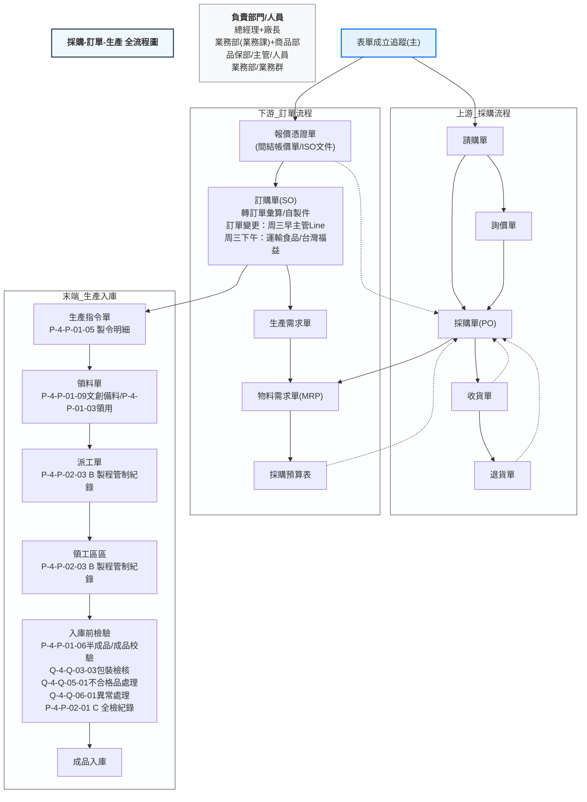

# 📊 採購-訂單-生產全流程圖詳解

這是一張**製造業/貿易業從表單成立到入庫的端到端業務流程圖**，完整覆蓋了上游採購、下游銷售/訂單、生產需求三大模塊，以及最終的生產與入庫閉環，同時標註了負責部門、表單屬性、特殊節點與異常處理。

---

## 一、流程總體架構

整個流程以「表單成立追蹤（主）」為起點，分為三大核心區塊，最終匯入生產與入庫閉環：

1. **上游流程（藍框左側）**：採購端的請購、報價、採購單、收貨、退貨全流程
2. **下游流程（藍框右側）**：銷售/訂單端的報價、訂單、自製件、轉採購單流程
3. **生產需求流程（藍框中下）**：由訂單驅動的物料需求、採購申請流程
4. **末端閉環（流程最下方）**：生產指令發放、領料、加工、品檢、入庫全流程
5. **頂部說明區**：標註了全流程的負責部門與人員

---

## 二、頂部說明與流程起點

### 1. 負責部門/人員說明（右上角）

- **總經理+廠長**：最高決策層
- **業務部（業務課）+商品部**：銷售/訂單端主責部門
- **品保部、主管、人員**：品質把關與執行層
- **業務部**：重複標註，強化銷售端主責
- **業務群**：業務團隊統稱

### 2. 流程起點：表單成立追蹤（主）

這是整個流程的**總控節點**，所有下游表單的成立都從此節點發起，用於追蹤全鏈路表單狀態。

---

## 三、上游流程（採購端）詳解

### 1. 上游流程節點順序（從左到右）

| 節點編號 | 表單名稱     | 核心內容/作用                              | 流向說明                                                                                                                                                                                                        |
| -------- | ------------ | ------------------------------------------ | --------------------------------------------------------------------------------------------------------------------------------------------------------------------------------------------------------------- |
| 上游-1   | 請購單       | 採購需求的起點，由需求部門發起採購申請     | 向下游-3「採購單」流動，同時可觸發上游-2「詢價單」                                                                                                                                                              |
| 上游-2   | 詢價單       | 向供應商詢價、比價的表單                   | 流回上游-3「採購單」，用於確定採購價格與供應商                                                                                                                                                                  |
| 上游-3   | 採購單（PO） | 正式發給供應商的採購合同，是採購流程的核心 | 1. 向下游-4「收貨單」流動，用於供應商交貨驗收 ` `2. 向下游-3a「物料需求單」流動，用於生產物料規劃 ` `3. 接收下游-1「報價憑證單」的反向流動（間結帳價單）` `4. 接收下游-4「收貨單」的退貨反向流動 |
| 上游-4   | 收貨單       | 供應商交貨時的驗收單，確認數量、品質、規格 | 1. 正常：完成採購入庫，閉環採購流程 ` `2. 異常：向下游-5「退貨單」流動，執行退貨 ` `3. 反向流回上游-3「採購單」，更新採購執行狀態                                                                     |
| 上游-5   | 退貨單       | 針對不合格/多送貨物的退貨申請與執行單      | 流回上游-3「採購單」，沖減採購數量，完成退貨閉環                                                                                                                                                                |

### 2. 上游流程核心邏輯

- **閉環機制**：從「請購→詢價→採購→收貨/退貨」形成完整採購閉環，所有異常（退貨）都會反向更新採購單狀態
- **跨模塊聯動**：採購單同時驅動下游生產需求流程，實現「採購-生產」的數據打通
- **間結帳對接**：接收下游「間結帳價單」，實現採購價格的事後調整與結帳

---

## 四、下游流程（銷售/訂單端）詳解

### 1. 下游流程節點順序（從左到右）

| 節點編號 | 表單名稱             | 核心內容/作用                                    | 特殊標註                                                                | 流向說明                                                                                                                                                                |
| -------- | -------------------- | ------------------------------------------------ | ----------------------------------------------------------------------- | ----------------------------------------------------------------------------------------------------------------------------------------------------------------------- |
| 下游-1   | 報價憑證單           | 給客戶的報價單，確認產品報價、交期等             | 標註「間結帳價單」，說明是事後結帳/臨時報價屬性                         | 1. 向下游-2「訂購單」流動，用於客戶下單 ` `2. 反向流回上游-3「採購單」，更新採購間結帳價格                                                                         |
| 下游-2   | 訂購單（銷售訂單SO） | 客戶正式下單的銷售合同，是銷售流程核心           | 標註「轉訂單彙算」「自製件」，說明包含自製/外購兩類產品，需彙算訂單需求 | 1. 向下游-3「生產需求單」流動，驅動生產排程 ` `2. 標註訂單變更節點：` `• 星期三早上：主管（廠務）Line訂單 ` `• 星期三下午：運輸食品、台灣福益 訂單變更 |
| 下游-3   | 生產需求單           | 由銷售訂單拆解出的生產需求，明確產品、數量、交期 | 無                                                                      | 向下游-3a「物料需求單」流動，拆解生產所需物料                                                                                                                           |
| 下游-3a  | 物料需求單（MRP）    | 由生產需求拆解出的物料清單，明確採購/領料需求    | 無                                                                      | 向下游-3b「採購預算表」流動，用於採購申請與預算控制                                                                                                                     |
| 下游-3b  | 採購預算表           | 物料需求對應的採購預算與申請表                   | 無                                                                      | 反向流回上游-3「採購單」，用於生成正式採購單                                                                                                                            |

### 2. 下游流程核心邏輯

- **訂單驅動**：從「報價→訂單→生產需求→物料需求→採購預算」，實現「銷售-生產-採購」的全鏈路驅動
- **自製/外購分離**：訂購單標註「自製件」，說明部分產品自產、部分外購，需分開處理
- **訂單變更機制**：明確了訂單變更的時間、負責人與渠道，規範異常處理流程
- **間結帳機制**：報價憑證單作為間結帳價單，實現銷售價格與採購價格的事後對賬

---

## 五、末端生產與入庫閉環詳解

這是整個流程的執行落地環節，從生產指令發放到入庫完成，實現全流程閉環。

### 1. 生產指令與領料階段

| 節點名稱   | 核心內容/編號                                   | 作用                                                        |
| ---------- | ----------------------------------------------- | ----------------------------------------------------------- |
| 生產指令單 | P-4-P-01-05製令明細單                           | 正式下發的生產製令，明確生產產品、數量、工單號              |
| 領料單     | P-4-P-01-09文創備料單 ` `P-4-P-01-03領用單 | 從倉庫領取生產所需物料的申請單，對應不同產品線（文創/通用） |

### 2. 生產加工階段

| 節點名稱 | 核心內容/編號                | 作用                                               |
| -------- | ---------------------------- | -------------------------------------------------- |
| 派工單   | P-4-P-02-03 B-製程管制紀錄表 | 生產排程與製程管控單，跟蹤每道工序的進度與品質     |
| 領工區區 | P-4-P-02-03 B-製程管制記錄表 | 生產現場的工序執行與記錄節點，重複標註強化製程管控 |

### 3. 品檢與入庫階段

| 節點名稱         | 核心內容/編號                                                                                                                                                                   | 作用                                                                                                                                                                   |
| ---------------- | ------------------------------------------------------------------------------------------------------------------------------------------------------------------------------- | ---------------------------------------------------------------------------------------------------------------------------------------------------------------------- |
| 生產指令單→入庫 | P-4-P-01-06最終半成品/成品印校錶 ` `Q-4-Q-03-03產品包裝檢核書 ` `Q-4-Q-05-01不合格品處理表 ` `Q-4-Q-06-01異常狀況處理表 ` `P-4-P-02-01 C-產品全檢檢測紀錄表 | 入庫前的全流程品檢與驗收，包含：` `• 成品/半成品校驗 ` `• 包裝檢核 ` `• 不合格品/異常處理 ` `• 全檢紀錄 ` `最終完成入庫，閉環整個業務流程 |

### 4. 末端流程核心邏輯

- **全鏈路追溯**：從製令→領料→派工→製程→品檢→入庫，每個節點都有對應表單編號，實現產品全生命週期追溯
- **品質把關**：多個品檢節點（包裝檢核、全檢、不合格品處理），確保產品品質
- **異常處理**：專門的不合格品/異常狀況處理表，規範生產異常的閉環流程

---

## 六、關鍵細節與特殊標註（無遺漏覆蓋）

1. **虛線實線區分**：
   - 虛線：流程邊界、跨模塊反向流動（如退貨單流回採購單）
   - 實線：正向業務流程（如請購單→採購單→收貨單）
2. **彩色區塊**：每個表單內的彩色分區，代表表單內的不同欄位/部門負責區塊（如業務、採購、財務、倉庫等）
3. **轉採購單（採購件）標註**：訂購單標註「轉採購單(採購件)」，說明外購產品直接轉採購流程，無需生產
4. **(列)ISO文件標註**：報價憑證單標註「(列)ISO文件」，說明該表單符合ISO體系要求，用於體系審核
5. **自製件標註**：訂購單標註「自製件」，區分外購與自製產品，對應不同流程（自製走生產，外購走採購）
6. **訂單變更時間節點**：明確「星期三早上/下午」的訂單變更規則，規範業務操作
7. **表單編號體系**：末端流程的表單都有統一編號（P-開頭生產類、Q-開頭品質類），便於管理與追溯

---

## 七、流程價值與總結

這張圖完整實現了**「銷售訂單驅動生產，生產驅動採購」的拉式生產模式**，核心價值在於：

1. **全鏈路打通**：從客戶下單到產品入庫，所有業務節點、表單、部門、人員全部明確，無信息孤島
2. **異常閉環**：退貨、訂單變更、不合格品等異常場景，都有明確的處理流程與反向更新機制
3. **可追溯性**：每個節點都有對應表單與編號，實現產品從訂單到入庫的全生命週期追溯
4. **部門協同**：明確了業務、採購、生產、品保、倉庫等部門的職責與流程接口，避免推诿

---

如果你需要，我可以幫你把這張流程圖**轉換為標準化的SOP操作手冊**，或是**梳理每個表單的必填欄位與審核節點**，方便團隊落地執行。
