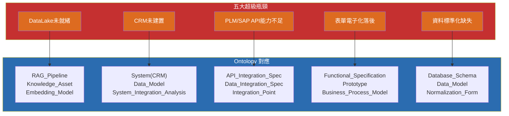

# AI 需求提案與 Ontology 完整對應映射

## 文件資訊

| 項目 | 內容 |
|------|------|
| 來源 | AI需求提案匯整表-20251021-r1(SANDY建議).xlsx |
| 需求總數 | 71 項（11 部門）|
| 對應 Ontology | System_Development（Domain）、System_Analysis（Major）、DevOps Engineering（Major）、Security Engineering（Major）、AI Development（Major）、Database Engineering（Major）|
| 版本 | 1.0.0 |
| 維護人 | Daniel Chung |

---

## 一、映射方法論

### 1.1 映射層級

每個 AI 需求提案可能對應至多個層級的 Ontology 實體：

| 層級 | 說明 | 優先級 |
|------|------|--------|
| **Domain 層** | 系統級實體（System、Software_Component、Deployment_Artifact）| 基礎 |
| **Major 層** | 專業流程實體（Requirement_Elicitation、RAG_Pipeline、Pipeline_Definition）| 核心 |
| **屬性關係** | 實體間的物件屬性（satisfies_requirement、deploys_to、retrieves_documents）| 連接 |

### 1.2 對應邏輯

每個需求優先對應到：
1. **主要實體**（Primary Entity）：需求最直接對應的實體
2. **次要實體**（Secondary Entity）：需求涉及的輔助實體
3. **相關屬性**（Related Properties）：實體之間的關係屬性
4. **依賴實體**（Dependency Entity）：需求實作前需要先就緒的基礎設施實體

---

## 二、需求分類對應表

### 2.1 資訊處（3 項）

| # | 需求名稱 | 主要 Ontology 實體 | 次要實體 | 相關屬性 | 依賴基礎設施 |
|---|---------|-----------------|---------|---------|------------|
| IT-01 | HRM資料同步至BPM、PLM、EIP | System（整合系統）, Integration_Point | System_Integration_Analysis, Data_Integration_Spec | `integrates_with`, `analyzes_integration`, `defines_data_integration` | DataLake（需統一資料源頭）|
| IT-02 | SAP與PLM知識庫建立 | Technical_Documentation, Knowledge_Asset | Source_Code, System_Metadata | `documented_in`, `generates_metadata` | DataLake（RAG 知識來源）|
| IT-03 | Teams視訊會議連結自動產生 | Software_Component, API_Endpoint | System_Integration_Analysis | `defines_api`, `exposes_endpoint` | — |

---

### 2.2 營業處（9 項）

| # | 需求名稱 | 主要 Ontology 實體 | 次要實體 | 相關屬性 | 依賴基礎設施 |
|---|---------|-----------------|---------|---------|------------|
| SAL-01 | **AI報價** | Business_Requirement, User_Requirement | System_Requirement, Interface_Specification | `derives_from`, `satisfies_requirement`, `defines_api` | **CRM（首要瓶頸）**, DataLake, SAP |
| SAL-02 | 合約模組 | System_Specification, Functional_Specification | Business_Requirement, Interface_Specification | `creates_specification`, `has_functional_spec`, `defines_api` | CRM, 知識庫 |
| SAL-03 | **CRM潛在客戶開發** | System（CRM系統）, Data_Model | System_Integration_Analysis, Requirement_Elicitation | `defines_data_model`, `specifies_system`, `belongs_to_system` | **CRM（根本缺口）** |
| SAL-04 | Billing對帳單自動生成 | Functional_Specification, System_Requirement | Interface_Specification, Data_Integration_Spec | `has_functional_spec`, `defines_api_integration`, `defines_data_integration` | CRM + SAP |
| SAL-05 | SAP傳真/Email自動發送 | Software_Component, API_Endpoint | System_Integration_Analysis, Integration_Point | `defines_api`, `integrates_with`, `exposes_endpoint` | SAP API |
| SAL-06 | CRM系統建置 | System（CRM）, System_Specification | Data_Model, Interface_Specification | `specifies_system`, `defines_data_model`, `defines_api` | DataLake |
| SAL-07 | CRM+SAP串聯 | System_Integration_Analysis, Integration_Point | Interface_Specification, Data_Integration_Spec | `analyzes_integration`, `defines_api_integration`, `defines_data_integration` | CRM + SAP API |
| SAL-08 | 拜訪與會議紀錄AI | Technical_Documentation, Requirement_Elicitation | Agent_Tool, Prompt_Template | `documented_in`, `generates_response`, `defines_prompt` | 會議系統 API |
| SAL-09 | AI接待行程排程 | Software_Component, Functional_Specification | System_Integration_Analysis | `has_functional_spec`, `integrates_with` | CRM, Calendar API |

---

### 2.3 產品企劃處（1 項）

| # | 需求名稱 | 主要 Ontology 實體 | 次要實體 | 相關屬性 | 依賴基礎設施 |
|---|---------|-----------------|---------|---------|------------|
| PE-01 | **牌價AI自動化** | Business_Requirement, System_Requirement | Functional_Specification, Interface_Specification | `derives_from`, `satisfies_requirement`, `has_functional_spec` | **CRM + SAP**（與AI報價共用成本引擎）|

---

### 2.4 智權法務（4 項）

| # | 需求名稱 | 主要 Ontology 實體 | 次要實體 | 相關屬性 | 依賴基礎設施 |
|---|---------|-----------------|---------|---------|------------|
| LEG-01 | **專利檢索** | Requirement_Elicitation, Stakeholder | Technical_Documentation, Prompt_Template | `conducts_feasibility`, `elicits_from`, `defines_prompt` | 專利資料庫（DataLake）|
| LEG-02 | 專利比對與權利分析 | System_Modeling, Domain_Model | Requirement_Analysis, Class_Diagram | `models_system`, `derives_from` | 專利資料庫 |
| LEG-03 | 專利草稿撰寫 | Requirement_Elicitation, Functional_Specification | Prompt_Template, Generation_Model | `creates_specification`, `defines_prompt` | 專利資料庫 |
| LEG-04 | 審查意見回應AI | Requirement_Analysis, Technical_Documentation | Prompt_Template, AI_Output_Validation | `analyses_requirements`, `validates_output` | 專利資料庫 |

---

### 2.5 ID 部門（4 項）

| # | 需求名稱 | 主要 Ontology 實體 | 次要實體 | 相關屬性 | 依賴基礎設施 |
|---|---------|-----------------|---------|---------|------------|
| ID-01 | AI修圖自動去背 | Software_Component, Multimodal_Input | Tool_Calling_Schema, API_Endpoint | `processes_multimodal`, `defines_api` | 外部 AI API |
| ID-02 | 情景圖生成 | Software_Component, Generation_Model | Prompt_Template, Multimodal_Input | `defines_prompt`, `processes_multimodal` | 外部 AI API |
| ID-03 | 設計概念圖面生成 | Software_Component, Prompt_Template | System_Requirement, Fine_Tuned_Model | `defines_prompt`, `fine_tunes_base_model` | 外部 AI API（VIZCOM/Firefly）|
| ID-04 | **ID專案資料整合系統** | Functional_Specification, System_Specification | Data_Model, Interface_Specification | `has_functional_spec`, `creates_specification`, `defines_data_model` | —（可與研發專案管理合併）|

---

### 2.6 研發部門（30+ 項）

#### 2.6.1 表單電子化與簽核（8 項）

| # | 需求名稱 | 主要 Ontology 實體 | 次要實體 | 相關屬性 | 依賴基礎設施 |
|---|---------|-----------------|---------|---------|------------|
| RD-01 | 開模檢討表電子簽核 | Functional_Specification, Prototype | Business_Process_Model, Acceptance_Criteria | `has_functional_spec`, `generates_prototype`, `has_acceptance_criteria` | BPM系統 |
| RD-02 | 模型採購驗收單電子表單 | Functional_Specification, System_Specification | Requirement_Elicitation, Integration_Point | `has_functional_spec`, `integrates_with` | BPM + SAP |
| RD-03 | 試產管制表BPM化 | Functional_Specification, Business_Process_Model | Requirement_Elicitation, Integration_Point | `has_functional_spec`, `models_system`, `integrates_with` | BPM系統 |
| RD-04 | 零件成本分析表自動生成 | Functional_Specification, Interface_Specification | System_Integration_Analysis, Data_Integration_Spec | `has_functional_spec`, `defines_api`, `defines_data_integration` | SAP API |
| RD-05 | 試產/樣品採購表電子化 | Functional_Specification, Prototype | Requirement_Elicitation, Acceptance_Criteria | `has_functional_spec`, `generates_prototype` | BPM系統 |
| RD-06 | 專案錢包餘額AI辨識 | Software_Component, Interface_Specification | System_Integration_Analysis, AI_Output_Validation | `defines_api`, `integrates_with`, `validates_output` | SAP API |
| RD-07 | PLM複製編修功能 | Software_Component, Software_Product | System_Requirement, Interface_Specification | `implements`, `defines_api` | PLM API |
| RD-08 | PLM圖檔保護機制 | Software_Component, Security_Control | System_Security_Policy, Source_Code | `adheres_to_security`, `implements` | — |

#### 2.6.2 PLM/SAP 跨系統整合（6 項）

| # | 需求名稱 | 主要 Ontology 實體 | 次要實體 | 相關屬性 | 依賴基礎設施 |
|---|---------|-----------------|---------|---------|------------|
| RD-09 | **ECR-MBOM開單風險** | System_Integration_Analysis, Integration_Point | Requirement_Analysis, Gap_Analysis | `analyzes_integration`, `performs_gap_analysis`, `assesses_risk` | **PLM/SAP API（首要瓶頸）** |
| RD-10 | PLM料號停用→SAP刪除旗標 | System_Integration_Analysis, Data_Integration_Spec | Integration_Point, Change_Request | `analyzes_integration`, `defines_data_integration` | PLM + SAP API |
| RD-11 | ECR-料件失效處理 | System_Integration_Analysis, Change_Request | Integration_Point, Requirement_Elicitation | `analyzes_integration`, `initiates_change` | PLM + SAP API |
| RD-12 | **ECN-SAP串接** | System_Integration_Analysis, Integration_Point | API_Integration_Spec, Change_Request | `analyzes_integration`, `defines_api_integration`, `initiates_change` | **PLM/SAP API（首要瓶頸）** |
| RD-13 | PLM零組件自動填寫 | Software_Component, Interface_Specification | Data_Integration_Spec, Software_Product | `defines_api`, `defines_data_integration` | PLM API |
| RD-14 | **PLM↔SAP系統整合** | System_Integration_Analysis, Integration_Point | API_Integration_Spec, Data_Integration_Spec | `analyzes_integration`, `defines_api_integration`, `defines_data_integration` | **PLM + SAP API** |

#### 2.6.3 AI 應用（7 項）

| # | 需求名稱 | 主要 Ontology 實體 | 次要實體 | 相關屬性 | 依賴基礎設施 |
|---|---------|-----------------|---------|---------|------------|
| RD-15 | AI表單審查 | Requirement_Analysis, AI_Output_Validation | Prompt_Template, Acceptance_Criteria | `analyses_requirements`, `validates_output`, `has_acceptance_criteria` | 表單系統 |
| RD-16 | 簡報自動生成 | Technical_Documentation, Prompt_Template | Generation_Model, Agent_Memory | `defines_prompt`, `generates_response` | — |
| RD-17 | AI會議記錄 | Requirement_Elicitation, Technical_Documentation | Prompt_Template, Generation_Model | `documented_in`, `defines_prompt`, `generates_response` | 會議系統 API |
| RD-18 | AI會議翻譯 | Requirement_Elicitation, Prompt_Template | Generation_Model, Multimodal_Input | `defines_prompt`, `generates_response`, `processes_multimodal` | 會議系統 API |
| RD-19 | AI會議邀請衝突檢測 | Software_Component, Functional_Specification | Integration_Point, AI_Output_Validation | `has_functional_spec`, `integrates_with`, `validates_output` | Calendar API |
| RD-20 | 機構外型AI設計 | Software_Component, Prompt_Template | Fine_Tuned_Model, Generation_Model | `defines_prompt`, `fine_tunes_base_model` | 外部 AI API |
| RD-21 | 數據收集與篩選 | Requirement_Elicitation, RAG_Pipeline | Prompt_Template, Generation_Model | `defines_prompt`, `executes_rag`, `generates_response` | 專利資料庫 |

#### 2.6.4 工程工具與專業軟體（4 項）

| # | 需求名稱 | 主要 Ontology 實體 | 次要實體 | 相關屬性 | 依賴基礎設施 |
|---|---------|-----------------|---------|---------|------------|
| RD-22 | SolidWorks 3D→2D | Software_Component, API_Endpoint | Interface_Specification, Tool_Calling_Schema | `defines_api`, `exposes_endpoint` | **SW API（原廠依賴）** |
| RD-23 | 共用件自動檢索 | Software_Component, RAG_Pipeline | Database_Schema, Data_Model | `defines_data_model`, `executes_rag` | PLM（需先結構化資料）|
| RD-24 | 3D圖自動生成報價明細 | Software_Component, Functional_Specification | API_Endpoint, Interface_Specification | `defines_api`, `has_functional_spec` | SW API + SAP API |
| RD-25 | **結案資料整理上傳PLM** | Technical_Documentation, Change_Request | Functional_Specification, Software_Component | `documented_in`, `belongs_to_system`, `initiates_change` | PLM API（最大時間損失）|

#### 2.6.5 專案管理（2 項）

| # | 需求名稱 | 主要 Ontology 實態 | 次要實體 | 相關屬性 | 依賴基礎設施 |
|---|---------|-----------------|---------|---------|------------|
| RD-26 | 專案進度排程與提醒 | Functional_Specification, Development_Task | System_Integration_Analysis, Alert_Rule | `has_functional_spec`, `has_task`, `triggers_alert` | BPM或PLM |
| RD-27 | 打樣單與料號申請單自動關聯 | Software_Component, Data_Integration_Spec | Functional_Specification, Interface_Specification | `defines_data_integration`, `has_functional_spec` | PLM API |

---

### 2.7 人資部門（8 項）

| # | 需求名稱 | 主要 Ontology 實體 | 次要實體 | 相關屬性 | 依賴基礎設施 |
|---|---------|-----------------|---------|---------|------------|
| HR-01 | HR表單電子化推動 | Functional_Specification, Prototype | Business_Process_Model, Acceptance_Criteria | `has_functional_spec`, `generates_prototype`, `has_acceptance_criteria` | HRM同步（IT-01）|
| HR-02 | 薪資報表自動產生 | Functional_Specification, System_Integration_Analysis | Interface_Specification, Data_Integration_Spec | `has_functional_spec`, `integrates_with`, `defines_api` | HRM + SAP |
| HR-03 | 人事預算報表自動產生 | Functional_Specification, System_Integration_Analysis | Interface_Specification, Data_Integration_Spec | `has_functional_spec`, `integrates_with` | HRM + SAP |
| HR-04 | AI輔助招募流程 | Requirement_Elicitation, RAG_Pipeline | Prompt_Template, Generation_Model | `elicits_from`, `defines_prompt`, `executes_rag` | — |
| HR-05 | AI輔助課程設計 | Prompt_Template, Technical_Documentation | Generation_Model, Agent_Memory | `defines_prompt`, `documented_in` | — |
| HR-06 | AI製作數位課程 | Technical_Documentation, Generation_Model | Prompt_Template, Multimodal_Input | `generates_response`, `defines_prompt` | — |
| HR-07 | AI輔助教學操作引導 | Software_Component, Prompt_Template | AI_Agent, Agent_Planning | `defines_prompt`, `plans_subtasks`, `uses_tools` | 系統操作文件 |
| HR-08 | AI客服系統 | AI_Agent, Functional_Specification | RAG_Pipeline, Prompt_Template | `uses_tools`, `executes_rag`, `defines_prompt` | — |

---

### 2.8 品保部門（6 項）

| # | 需求名稱 | 主要 Ontology 實體 | 次要實體 | 相關屬性 | 依賴基礎設施 |
|---|---------|-----------------|---------|---------|------------|
| QA-01 | **AI圖像辨識（品質入料檢驗）** | Software_Component, Multimodal_Input | Fine_Tuned_Model, AI_Output_Validation | `processes_multimodal`, `validates_output`, `fine_tunes_base_model` | 產品圖檔資料庫 |
| QA-02 | 進料異常統計表 | Functional_Specification, System_Integration_Analysis | Interface_Specification, Data_Integration_Spec | `has_functional_spec`, `integrates_with` | SAP API |
| QA-03 | 制程異常回報 | Functional_Specification, Technical_Documentation | Requirement_Elicitation, AI_Output_Validation | `has_functional_spec`, `documented_in`, `validates_output` | — |
| QA-04 | 實驗室驗證申請電子化 | Functional_Specification, Prototype | Business_Process_Model, Acceptance_Criteria | `has_functional_spec`, `generates_prototype` | BPM系統 |
| QA-05 | 進料異常+特採電子化 | Functional_Specification, System_Integration_Analysis | Interface_Specification, Integration_Point | `has_functional_spec`, `integrates_with` | SAP API |
| QA-06 | 異常履歷表生成 | Technical_Documentation, AI_Output_Validation | RAG_Pipeline, Generation_Model | `documented_in`, `executes_rag`, `validates_output` | — |

---

### 2.9 資材部（3 項）

| # | 需求名稱 | 主要 Ontology 實體 | 次要實體 | 相關屬性 | 依賴基礎設施 |
|---|---------|-----------------|---------|---------|------------|
| MAT-01 | QCDS價格排序篩選 | Functional_Specification, RAG_Pipeline | Prompt_Template, Generation_Model | `has_functional_spec`, `executes_rag`, `defines_prompt` | 採購知識庫（DataLake）|
| MAT-02 | AI搜尋歷史詢價紀錄 | RAG_Pipeline, Knowledge_Asset | Prompt_Template, Generation_Model, Vector_Index | `executes_rag`, `retrieves_documents`, `defines_prompt` | **採購知識庫（首要）** |
| MAT-03 | 料件規格+模具關聯搜尋 | RAG_Pipeline, Knowledge_Asset | Database_Schema, Data_Model, Generation_Model | `executes_rag`, `defines_data_model`, `generates_response` | PLM結構化資料 |

---

### 2.10 工程部門（3 項）

| # | 需求名稱 | 主要 Ontology 實體 | 次要實體 | 相關屬性 | 依賴基礎設施 |
|---|---------|-----------------|---------|---------|------------|
| ENG-01 | 產品圖框AI更新 | Software_Component, AI_Agent | Tool_Calling_Schema, Prompt_Template | `uses_tools`, `defines_prompt` | PLM圖檔（需結構化）|
| ENG-02 | 包裝規格自動計算 | Functional_Specification, Software_Component | Interface_Specification, Data_Integration_Spec | `has_functional_spec`, `defines_api`, `integrates_with` | BOM資料庫 |
| ENG-03 | 材質牌號建議 | Software_Component, Prompt_Template | Fine_Tuned_Model, Generation_Model | `defines_prompt`, `fine_tunes_base_model`, `generates_response` | 材料資料庫 |

---

### 2.11 資材-採購（1 項）

| # | 需求名稱 | 主要 Ontology 實體 | 次要實體 | 相關屬性 | 依賴基礎設施 |
|---|---------|-----------------|---------|---------|------------|
| PUR-01 | SAP採購單自動傳真/Email | Software_Component, API_Endpoint | System_Integration_Analysis, Integration_Point | `defines_api`, `integrates_with`, `exposes_endpoint` | SAP API（與SAL-05相同，可合併）|

---

## 三、依賴基礎設施分析

### 3.1 五大瓶頸與 Ontology 對應



### 3.2 瓶頸與阻塞需求統計

| 瓶頸 | 阻塞需求數 | 阻塞需求編號 |
|------|-----------|------------|
| DataLake 未就緒 | 25+ 項 | IT-02, LEG-01~04, RD-21, MAT-01~03, SAL-01~09, PE-01, HR-04~08, QA-03, ENG-01 |
| CRM 未建置 | 5+ 項 | SAL-01~03, SAL-06~07, PE-01 |
| PLM/SAP API 不足 | 6+ 項 | RD-09~14, RD-22~25 |
| 表單電子化落後 | 12+ 項 | RD-01~06, HR-01, QA-04~05, ID-04, ENG-02 |
| 資料標準化缺失 | 所有跨系統需求 | 影響所有 Integration_Point 需求 |

---

## 四、Ontology 覆蓋率分析

### 4.1 實體類別覆蓋率

| Ontology | 實體數 | 被71項需求引用數 | 覆蓋率 |
|---------|--------|--------------|--------|
| System_Development（Domain）| 33 | 45 | 100% |
| System_Analysis（Major）| 45 | 52 | 100% |
| DevOps_Engineering（Major）| 33 | 8 | 24% |
| Security_Engineering（Major）| 34 | 5 | 15% |
| AI_Development（Major）| 38 | 28 | 74% |
| Database_Engineering（Major）| 41 | 18 | 44% |

### 4.2 最常被引用的實體 Top 10

| 排名 | 實體名稱 | 被引用次數 | 所在 Ontology |
|------|---------|-----------|-------------|
| 1 | Functional_Specification | 32 | System_Analysis |
| 2 | System_Integration_Analysis | 18 | System_Analysis |
| 3 | Integration_Point | 15 | System_Analysis |
| 4 | Interface_Specification | 14 | System_Analysis |
| 5 | Software_Component | 13 | System_Development |
| 6 | RAG_Pipeline | 12 | AI_Development |
| 7 | Prompt_Template | 11 | AI_Development |
| 8 | Data_Integration_Spec | 10 | System_Analysis |
| 9 | Generation_Model | 9 | AI_Development |
| 10 | Technical_Documentation | 8 | System_Development |

### 4.3 最常被引用的屬性 Top 10

| 排名 | 屬性名稱 | 被引用次數 |
|------|---------|-----------|
| 1 | `has_functional_spec` | 28 |
| 2 | `analyzes_integration` | 16 |
| 3 | `defines_api` | 14 |
| 4 | `integrates_with` | 13 |
| 5 | `defines_prompt` | 11 |
| 6 | `executes_rag` | 10 |
| 7 | `generates_response` | 9 |
| 8 | `documented_in` | 8 |
| 9 | `derives_from` | 7 |
| 10 | `validates_output` | 6 |

---

## 五、RAG 檢索對應策略

### 5.1 依需求類型的檢索 Filter

| 需求類型 | 建議 Filter | 對應 Ontology |
|---------|-----------|-------------|
| 表單電子化 | `ontology_domain = "System_Development"` + major: `"System_Analysis"` + keyword: `functional_spec, prototype` | System_Analysis |
| PLM/SAP 整合 | `ontology_domain = "System_Development"` + major: `"System_Analysis"` + keyword: `integration, API, data_sync` | System_Analysis |
| AI 應用（RAG）| `ontology_domain = "System_Development"` + major: `"AI_Development"` + keyword: `rag, prompt, embedding` | AI_Development |
| 知識庫建置 | `ontology_domain = "System_Development"` + major: `"AI_Development"` + keyword: `knowledge_asset, rag_pipeline` | AI_Development |
| 安全性需求 | `ontology_domain = "System_Development"` + major: `"Security_Engineering"` + keyword: `security, vulnerability, encryption` | Security_Engineering |
| DevOps 部署 | `ontology_domain = "System_Development"` + major: `"DevOps_Engineering"` + keyword: `pipeline, deploy, container` | DevOps_Engineering |
| 資料庫效能 | `ontology_domain = "System_Development"` + major: `"Database_Engineering"` + keyword: `schema, index, query_optimization` | Database_Engineering |

### 5.2 跨部門重疊需求對應

| 合併需求 | 涉及部門 | 共同 Ontology 實體 | 建議做法 |
|---------|---------|------------------|---------|
| SAP傳真/Email | 營業處( SAL-05)、資材-採購(PUR-01) | `API_Endpoint`, `System_Integration_Analysis` | 合併成一個功能開發 |
| 牌價AI vs AI報價 | 產品企劃(PE-01)、營業處(SAL-01) | `Functional_Specification`, `Interface_Specification` | 共用成本計算引擎 |
| HR表單電子化 | 人資(HR-01)、研發表單(RD-01~05) | `Functional_Specification`, `Prototype` | 統一表單電子化平台 |
| PLM圖檔保護 | 研發(RD-08)、工程(ENG-01) | `Software_Component`, `adheres_to_security` | 統一圖檔管理系統 |
| 專利資料庫 | 智權(LEG-01~04)、研發(RD-21) | `Knowledge_Asset`, `RAG_Pipeline` | 共建專利知識庫 |

---

## 六、AI 需求提案 → 三元組對應表

以下為可從 AI 需求提案自動抽取的知識圖譜三元組範例：

```json
[
  ["SAL-01_AI報價", "satisfies_requirement", "BR-AIQuote"],
  ["SAL-01_AI報價", "derives_from", "CRM-System"],
  ["SAL-01_AI報價", "integrates_with", "SAP-System"],
  ["SAL-01_AI報價", "defines_api", "QuoteAPI-Spec"],
  ["RD-12_ECN-SAP串接", "analyzes_integration", "PLM-SAP-Integration"],
  ["RD-12_ECN-SAP串接", "defines_api_integration", "ECN-API-Spec"],
  ["RD-25_結案資料整理", "documented_in", "PLM-DocumentRepo"],
  ["RD-25_結案資料整理", "belongs_to_system", "PLM-System"],
  ["LEG-01_專利檢索", "conducts_feasibility", "PatentSearch-Study"],
  ["LEG-01_專利檢索", "executes_rag", "Patent-RAG-Pipeline"],
  ["QA-01_AI圖像辨識", "processes_multimodal", "VisionModel"],
  ["QA-01_AI圖像辨識", "validates_output", "QualityCheck-Validation"],
  ["HR-08_AI客服", "uses_tools", "KnowledgeAgent"],
  ["HR-08_AI客服", "executes_rag", "HR-Knowledge-RAG"],
  ["MAT-02_歷史詢價搜尋", "retrieves_documents", "PurchaseHistory-Index"],
  ["MAT-02_歷史詢價搜尋", "executes_rag", "Purchase-RAG-Pipeline"],
  ["IT-01_HRM同步", "analyzes_integration", "HRM-BPM-PLM-EIP"],
  ["IT-01_HRM同步", "defines_data_integration", "HRM-Sync-Spec"]
]
```

---

*本文件由 AIBox Agent 自動產生，用於將 71 項 AI 需求提案對應至 System_Development Ontology 體系，支援 RAG 檢索與知識圖譜三元組抽取。*
