# 系統開發知識領域本體論

## 文件資訊

| 項目 | 內容 |
|------|------|
| Domain Ontology | `sd-domain.json`（System_Development_Domain_Ontology）|
| Major Ontology | `sa-major.json`（System_Analysis_Major_Ontology）|
| DevOps Major | `de-devops-major.json`（DevOps_Engineering_Major_Ontology）|
| Security Major | `se-devops-major.json`（Security_Engineering_Major_Ontology）|
| AI Major | `ai-devops-major.json`（AI_Development_Major_Ontology）|
| Database Major | `db-devops-major.json`（Database_Engineering_Major_Ontology）|
| 位置 | `.docs/Spec/知識庫管理/` |
| 版本 | 1.4.0（Domain 重構、OntologyAware Extraction、圖譜視圖，支援 Mermaid 11.x）|
| 維護人 | Daniel Chung |

---

## 一、Ontology 架構總覽

### 1.1 層級結構

本體論遵循 **Base → Domain → Major** 三層級知識組織架構：

```mermaid
flowchart TB
    subgraph BASE["Base Layer（5W1H 通用本體）"]
        B1["5W1H_Base_Ontology_OWL"]
    end

    subgraph DOMAIN["Domain Layer（領域層）"]
        D1["System_Development_Domain_Ontology"]
        D1A["System（軟體系統）"]
        D1B["Software_Component（軟體元件）"]
        D1C["Source_Code（原始碼）"]
        D1D["Requirement（需求）"]
        D1E["Test_Case（測試個案）"]
        D1F["Deployment_Artifact（部署產出物）"]
    end

    subgraph MAJOR["Major Layer（專業層）"]
        M1["System_Analysis_Major_Ontology"]
        M1A["Feasibility_Study（可行性研究）"]
        M1B["Requirement_Elicitation（需求獲取）"]
        M1C["Requirement_Analysis（需求分析）"]
        M1D["System_Modeling（系統建模）"]
        M1E["Risk_Assessment（風險評估）"]
        M1F["Integration_Point（整合點）"]
    end

    B1 --> D1
    B1 --> M1
    D1 --> M1
    D1A --> M1A
    D1A --> M1B
    D1A --> M1C
    D1A --> M1D
    D1A --> M1E
    D1A --> M1F

    style BASE fill:#276749,color:#fff,stroke:#1a5632,stroke-width:3px
    style DOMAIN fill:#2b6cb0,color:#fff,stroke:#1a4a8a,stroke-width:3px
    style MAJOR fill:#702459,color:#fff,stroke:#4a1a3a,stroke-width:3px
    style B1 fill:#48bb78,color:#fff,stroke:#276749,stroke-width:2px
    style D1 fill:#4299e1,color:#fff,stroke:#2b6cb0,stroke-width:2px
    style M1 fill:#ed64a6,color:#fff,stroke:#702459,stroke-width:2px
    style D1A fill:#63b3ed,color:#000,stroke:#2b6cb0,stroke-width:1px
    style D1B fill:#90cdf4,color:#000,stroke:#2b6cb0,stroke-width:1px
    style D1C fill:#90cdf4,color:#000,stroke:#2b6cb0,stroke-width:1px
    style D1D fill:#90cdf4,color:#000,stroke:#2b6cb0,stroke-width:1px
    style D1E fill:#90cdf4,color:#000,stroke:#2b6cb0,stroke-width:1px
    style D1F fill:#90cdf4,color:#000,stroke:#2b6cb0,stroke-width:1px
    style M1A fill:#f687b3,color:#000,stroke:#702459,stroke-width:1px
    style M1B fill:#f687b3,color:#000,stroke:#702459,stroke-width:1px
    style M1C fill:#f687b3,color:#000,stroke:#702459,stroke-width:1px
    style M1D fill:#f687b3,color:#000,stroke:#702459,stroke-width:1px
    style M1E fill:#f687b3,color:#000,stroke:#702459,stroke-width:1px
    style M1F fill:#f687b3,color:#000,stroke:#702459,stroke-width:1px
```

### 1.2 繼承關係圖

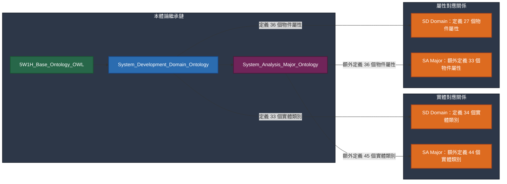

---

## 二、System_Development Domain Ontology 詳細規格

### 2.1 實體類別總覽

Domain Ontology 定義了 **34 個實體類別**，按類型分為以下七群：

```mermaid
flowchart TB
    subgraph CORE["CORE 核心實體群"]
        C1["System（系統）"]
        C2["Software_Product（軟體產品）"]
    end

    subgraph COMP["COMP 元件實體群"]
        CP1["Software_Component"]
        CP2["Module"]
        CP3["API_Endpoint"]
        CP4["Dependency_Graph"]
    end

    subgraph CODE["CODE 程式碼實體群"]
        CD1["Source_Code"]
        CD2["Code_Standard"]
        CD3["Technical_Debt"]
    end

    subgraph DESIGN["DESIGN 設計實體群"]
        D1["System_Architecture"]
        D2["Architecture_Pattern"]
        D3["Design_Document"]
        D4["Data_Model"]
        D5["Database_Schema"]
        D6["Interface_Specification"]
    end

    subgraph REQ["REQ 需求實體群"]
        R1["Requirement"]
        R2["Functional_Requirement"]
        R3["Non_Functional_Requirement"]
    end

    subgraph TEST["TEST 測試實體群"]
        T1["Test_Case"]
        T2["Test_Suite"]
        T3["Test_Report"]
        T4["Bug_Report"]
    end

    subgraph DEPLOY["DEPLOY 部署實體群"]
        DP1["Deployment_Configuration"]
        DP2["Deployment_Artifact"]
        DP3["Infrastructure_Resource"]
        DP4["Release_Version"]
        DP5["Development_Environment"]
    end

    subgraph META["META 元實體群"]
        M1["Change_Request"]
        M2["Development_Task"]
        M3["Technical_Documentation"]
        M4["System_Metadata"]
        M5["System_Security_Policy"]
    end

    C1 --> CP1
    CP1 --> CP2
    CP1 --> CP3
    CP1 --> CD1
    CD1 --> CD2
    CD1 --> CD3
    C1 --> D1
    C1 --> R1
    C1 --> T1
    C1 --> DP1
    C1 --> M1
    D1 --> D2
    D1 --> D3
    D3 --> D4
    D3 --> D5
    D3 --> D6
    R1 --> R2
    R1 --> R3
    T1 --> T2
    T1 --> T4
    T2 --> T3

    style CORE fill:#c53030,color:#fff,stroke:#9b2c2c,stroke-width:3px
    style COMP fill:#dd6b20,color:#fff,stroke:#9c4221,stroke-width:2px
    style CODE fill:#d69e2e,color:#000,stroke:#b7791f,stroke-width:2px
    style DESIGN fill:#2b6cb0,color:#fff,stroke:#1a4a8a,stroke-width:2px
    style REQ fill:#276749,color:#fff,stroke:#1a5632,stroke-width:2px
    style TEST fill:#702459,color:#fff,stroke:#4a1a3a,stroke-width:2px
    style DEPLOY fill:#234e52,color:#fff,stroke:#1a3636,stroke-width:2px
    style META fill:#553c9a,color:#fff,stroke:#3b2d7a,stroke-width:2px
    style C1 fill:#fc8181,color:#000,stroke:#c53030,stroke-width:2px
    style C2 fill:#feb2b2,color:#000,stroke:#c53030,stroke-width:1px
```

### 2.2 核心物件屬性（精選）

| 屬性名稱 | Domain | Range | 說明 |
|---------|--------|-------|------|
| `belongs_to_system` | Software_Component, Requirement, Source_Code... | System | 元件所屬系統 |
| `decomposes_into` | System, Software_Component | Software_Component | 系統元件分解 |
| `implements` | Software_Component, Source_Code, Module | Requirement, Interface_Specification | 元件實作需求 |
| `satisfies_requirement` | Software_Component, Source_Code, Module | Requirement | 滿足需求 |
| `specifies_architecture` | System | System_Architecture | 系統架構描述 |
| `conforms_to_pattern` | System, Software_Component | Architecture_Pattern | 採用架構模式 |
| `defines_api` | Software_Component, System | API_Endpoint, Interface_Specification | 定義 API |
| `has_schema` | System, Software_Component | Database_Schema | 具有資料庫結構 |
| `depends_on` | Software_Component, Module, Source_Code | Software_Component, Module, Source_Code | 依賴關係 |
| `has_test_case` | Software_Component, Requirement, Module | Test_Case | 有對應測試個案 |
| `deployed_to` | Software_Component, System, Deployment_Artifact | Infrastructure_Resource | 部署至環境 |
| `configured_by` | System, Software_Component | Deployment_Configuration | 由設定檔控制 |
| `has_release_version` | System | Release_Version | 具有發布版本 |
| `initiates_change` | Change_Request | Source_Code, Design_Document | 變更請求引發修改 |
| `has_technical_debt` | Software_Component, Source_Code, System | Technical_Debt | 存在技術債 |
| `adheres_to_security` | System, Software_Component, Source_Code | System_Security_Policy | 遵守安全策略 |
| `conforms_to_standard` | Source_Code, Module | Code_Standard | 遵守程式碼標準 |

### 2.3 實體關係圖（ER Model）

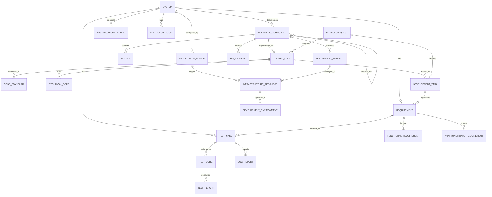

### 2.4 與 AI 需求提案的對應關係

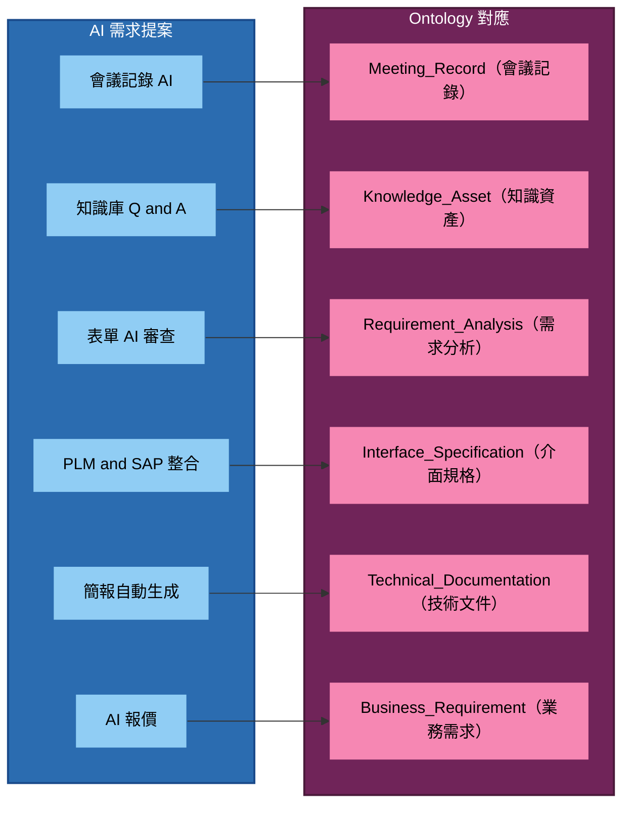

---

## 三、System_Analysis Major Ontology 詳細規格

### 3.1 實體類別總覽

Major Ontology 在 Domain 的基礎上，額外定義了 **44 個專業實體類別**，按專業流程分為以下八群：

```mermaid
flowchart TB
    subgraph FEASIBILITY["FEASIBILITY 可行性研究"]
        F1["Feasibility_Study"]
        F2["Technical_Feasibility"]
        F3["Economic_Feasibility"]
        F4["Operational_Feasibility"]
        F5["Legal_Feasibility"]
        F6["Solution_Option"]
        F7["Solution_Evaluation"]
    end

    subgraph REQUIREMENT["REQUIREMENT 需求工程"]
        R1["Requirement_Elicitation"]
        R2["Stakeholder"]
        R3["Stakeholder_Map"]
        R4["Requirement_Analysis"]
        R5["Business_Requirement"]
        R6["User_Requirement"]
        R7["System_Requirement"]
        R8["Requirement_Priority"]
        R9["Requirement_Conflict"]
    end

    subgraph QUALITY["QUALITY 品質與約束"]
        Q1["Quality_Attribute"]
        Q2["Constraint"]
        Q3["Acceptance_Criteria"]
    end

    subgraph MODELING["MODELING 系統建模"]
        M1["System_Modeling"]
        M2["Business_Process_Model"]
        M3["Domain_Model"]
        M4["Use_Case_Diagram"]
        M5["Sequence_Diagram"]
        M6["Class_Diagram"]
        M7["State_Machine_Diagram"]
    end

    subgraph SPEC["SPEC 規格文件"]
        S1["System_Specification"]
        S2["Functional_Specification"]
        S3["Interface_Specification"]
        S4["Prototype"]
        S5["Requirement_Traceability_Matrix"]
    end

    subgraph INTEGRATION["INTEGRATION 整合與風險"]
        I1["System_Integration_Analysis"]
        I2["Integration_Point"]
        I3["Data_Integration_Spec"]
        I4["API_Integration_Spec"]
        I5["Gap_Analysis"]
        I6["Risk_Assessment"]
        I7["Risk_Item"]
    end

    subgraph CURRENTBE["CURRENTBE 現況與未來"]
        C1["Current_State_Analysis"]
        C2["To_Be_State_Analysis"]
    end

    F1 --> F2
    F1 --> F3
    F1 --> F4
    F1 --> F5
    F1 --> F6
    F6 --> F7
    R1 --> R2
    R1 --> R3
    R1 --> R5
    R1 --> R6
    R4 --> R7
    R4 --> R8
    R5 --> M1
    R6 --> M1
    M1 --> M2
    M1 --> M3
    M1 --> M4
    M1 --> M5
    M1 --> M6
    M1 --> M7
    M1 --> S1
    S1 --> S2
    S1 --> S3
    S1 --> S5
    R1 --> S4
    I1 --> I2
    I2 --> I3
    I2 --> I4
    I5 --> S1
    I6 --> I7

    style FEASIBILITY fill:#c53030,color:#fff,stroke:#9b2c2c,stroke-width:3px
    style REQUIREMENT fill:#dd6b20,color:#fff,stroke:#9c4221,stroke-width:3px
    style QUALITY fill:#d69e2e,color:#000,stroke:#b7791f,stroke-width:2px
    style MODELING fill:#2b6cb0,color:#fff,stroke:#1a4a8a,stroke-width:3px
    style SPEC fill:#276749,color:#fff,stroke:#1a5632,stroke-width:3px
    style INTEGRATION fill:#702459,color:#fff,stroke:#4a1a3a,stroke-width:3px
    style CURRENTBE fill:#234e52,color:#fff,stroke:#1a3636,stroke-width:2px
    style F1 fill:#fc8181,color:#000,stroke:#c53030,stroke-width:2px
    style R1 fill:#fbd38d,color:#000,stroke:#dd6b20,stroke-width:2px
    style R4 fill:#fbd38d,color:#000,stroke:#dd6b20,stroke-width:2px
    style M1 fill:#90cdf4,color:#000,stroke:#2b6cb0,stroke-width:2px
    style S1 fill:#68d391,color:#000,stroke:#276749,stroke-width:2px
    style I1 fill:#f687b3,color:#000,stroke:#702459,stroke-width:2px
    style I6 fill:#f687b3,color:#000,stroke:#702459,stroke-width:2px
```

### 3.2 系統分析流程與實體對應

```mermaid
flowchart TB
    subgraph PHASE1["Phase 1：可行性研究"]
        P1F1["Feasibility_Study"]
        P1F2["Technical_Feasibility"]
        P1F3["Economic_Feasibility"]
        P1F4["Operational_Feasibility"]
        P1F5["Legal_Feasibility"]
        P1F6["Solution_Option"]
        P1F7["Solution_Evaluation"]
    end

    subgraph PHASE2["Phase 2：需求工程"]
        P2R1["Requirement_Elicitation"]
        P2R2["Stakeholder_Map"]
        P2R3["Stakeholder"]
        P2R4["Requirement_Analysis"]
        P2R5["Business_Requirement"]
        P2R6["User_Requirement"]
        P2R7["System_Requirement"]
        P2R8["Requirement_Priority"]
    end

    subgraph PHASE3["Phase 3：系統建模"]
        P3M1["System_Modeling"]
        P3M2["Business_Process_Model"]
        P3M3["Domain_Model"]
        P3M4["Use_Case_Diagram"]
        P3M5["Sequence_Diagram"]
        P3M6["Class_Diagram"]
        P3M7["State_Machine_Diagram"]
    end

    subgraph PHASE4["Phase 4：規格文件"]
        P4S1["System_Specification"]
        P4S2["Functional_Specification"]
        P4S3["Interface_Specification"]
        P4S4["Requirement_Traceability_Matrix"]
        P4S5["Prototype"]
    end

    subgraph PHASE5["Phase 5：整合與風險"]
        P5I1["System_Integration_Analysis"]
        P5I2["Integration_Point"]
        P5I3["Data_Integration_Spec"]
        P5I4["API_Integration_Spec"]
        P5I5["Gap_Analysis"]
        P5I6["Risk_Assessment"]
        P5I7["Risk_Item"]
    end

    P1F1 --> P1F2
    P1F1 --> P1F3
    P1F1 --> P1F4
    P1F1 --> P1F5
    P1F1 --> P1F6
    P1F6 --> P1F7
    P2R1 --> P2R2
    P2R2 --> P2R3
    P2R1 --> P2R5
    P2R1 --> P2R6
    P2R4 --> P2R7
    P2R4 --> P2R8
    P2R5 --> P3M1
    P2R6 --> P3M1
    P3M1 --> P3M2
    P3M1 --> P3M3
    P3M1 --> P3M4
    P3M1 --> P3M5
    P3M1 --> P3M6
    P3M1 --> P3M7
    P3M1 --> P4S1
    P4S1 --> P4S2
    P4S1 --> P4S3
    P4S1 --> P4S4
    P2R1 --> P4S5
    P5I1 --> P5I2
    P5I2 --> P5I3
    P5I2 --> P5I4
    P5I5 --> P4S1
    P5I6 --> P5I7

    style PHASE1 fill:#c53030,color:#fff,stroke:#9b2c2c,stroke-width:3px
    style PHASE2 fill:#dd6b20,color:#fff,stroke:#9c4221,stroke-width:3px
    style PHASE3 fill:#2b6cb0,color:#fff,stroke:#1a4a8a,stroke-width:3px
    style PHASE4 fill:#276749,color:#fff,stroke:#1a5632,stroke-width:3px
    style PHASE5 fill:#702459,color:#fff,stroke:#4a1a3a,stroke-width:3px
    style P1F1 fill:#fc8181,color:#000,stroke:#c53030,stroke-width:2px
    style P2R1 fill:#fbd38d,color:#000,stroke:#dd6b20,stroke-width:2px
    style P2R4 fill:#fbd38d,color:#000,stroke:#dd6b20,stroke-width:2px
    style P3M1 fill:#90cdf4,color:#000,stroke:#2b6cb0,stroke-width:2px
    style P4S1 fill:#68d391,color:#000,stroke:#276749,stroke-width:2px
    style P5I1 fill:#f687b3,color:#000,stroke:#702459,stroke-width:2px
    style P5I6 fill:#f687b3,color:#000,stroke:#702459,stroke-width:2px
```

### 3.3 核心物件屬性（精選）

| 屬性名稱 | Domain | Range | 說明 |
|---------|--------|-------|------|
| `conducts_feasibility` | Feasibility_Study | Technical/Economic/Operational/Legal_Feasibility | 評估特定可行性維度 |
| `derives_from` | System_Requirement | User_Requirement, Business_Requirement | 系統需求由上層需求推导 |
| `prioritizes` | Requirement_Analysis | Requirement_Priority | 設定需求優先級 |
| `conflicts_with` | Requirement | Requirement | 需求之間存在衝突 |
| `traces_requirement` | Requirement_Traceability_Matrix | BR/UR/SR/Test_Case/Source_Code | 需求完整生命週期追溯 |
| `models_system` | System_Modeling | BPM/Domain_Model/Use_Case/各UML圖 | 系統建模產生模型 |
| `evaluates_solution` | Solution_Evaluation | Solution_Option | 方案評估比較 |
| `analyzes_integration` | System_Integration_Analysis | Integration_Point | 識別整合點 |
| `performs_gap_analysis` | Gap_Analysis | Current_State_Analysis, To_Be_State_Analysis | 執行缺口分析 |
| `assesses_risk` | Risk_Assessment | Risk_Item | 識別並記錄風險 |
| `recommends_option` | Feasibility_Study | Solution_Option | 推薦最終方案 |
| `creates_specification` | Requirement_Analysis, System_Modeling | System_Specification... | 產出系統規格書 |
| `belongs_to_system` | System_Specification, Use_Case... | System | 分析物件屬於目標系統 |

---

## 四、需求溯源與知識圖譜結構

### 4.1 需求溯源矩陣（RTM）對應

Ontology 完整支援需求溯源矩陣（Requirement Traceability Matrix）的知識圖譜建構：

```mermaid
flowchart LR
    BR["Business_Requirement<br>業務需求<br>（來自營業處 / 管理層）"]
    UR["User_Requirement<br>用戶需求<br>（來自各部門使用者）"]
    SR["System_Requirement<br>系統需求<br>（系統分析師產生）"]
    SD["System_Design<br>系統設計<br>（Component + Data_Model）"]
    SC["Source_Code<br>原始碼<br>（Module + API_Endpoint）"]
    TC["Test_Case<br>測試個案<br>（Test_Suite + Test_Report）"]
    RR["Release_Version<br>發布版本"]
    AIN["AI 需求提案對應"]

    BR -->|"derive 推导"| UR
    UR -->|"derive 推导"| SR
    SR -->|"trace 追溯"| SD
    SD -->|"implement 實作"| SC
    SC -->|"test 測試"| TC
    TC -->|"verify 驗證"| RR
    BR -.->|"AI需求提案對應"| AIN

    style BR fill:#c53030,color:#fff,stroke:#9b2c2c,stroke-width:3px
    style UR fill:#dd6b20,color:#fff,stroke:#9c4221,stroke-width:2px
    style SR fill:#d69e2e,color:#000,stroke:#b7791f,stroke-width:2px
    style SD fill:#2b6cb0,color:#fff,stroke:#1a4a8a,stroke-width:2px
    style SC fill:#276749,color:#fff,stroke:#1a5632,stroke-width:2px
    style TC fill:#702459,color:#fff,stroke:#4a1a3a,stroke-width:2px
    style RR fill:#234e52,color:#fff,stroke:#1a3636,stroke-width:2px
    style AIN fill:#553c9a,color:#fff,stroke:#3b2d7a,stroke-width:2px
```

### 4.2 與 AI 需求提案的具體對應表

| AI 需求提案項目 | 對應 Ontology 實體 | 對應 Ontology 屬性 |
|---------------|-------------------|-------------------|
| **AI報價** | Business_Requirement, User_Requirement | `derives_from`, `has_priority` |
| **合約模組** | System_Requirement, Interface_Specification | `defines_api`, `satisfies_requirement` |
| **CRM潛在客戶** | System_Requirement, Data_Model | `defines_data_model` |
| **會議記錄AI** | Technical_Documentation, Requirement_Elicitation | `documented_in`, `elicits_from` |
| **表單AI審查** | Requirement_Analysis, Acceptance_Criteria | `analyses_requirements`, `has_acceptance_criteria` |
| **PLM and SAP 整合** | System_Integration_Analysis, Integration_Point | `analyzes_integration`, `defines_api_integration` |
| **ECR-MBOM/ECN-SAP** | System_Requirement, Interface_Specification | `satisfies_requirement`, `has_schema` |
| **開模檢討表電子簽核** | System_Specification, Functional_Specification | `creates_specification`, `has_functional_spec` |
| **SolidWorks 3D to 2D** | Software_Component, Module | `decomposes_into`, `implements` |
| **專利檢索** | Requirement_Elicitation, Stakeholder | `conducts_feasibility`, `identifies_stakeholder` |
| **結案資料整理** | Source_Code, Technical_Documentation | `documented_in`, `belongs_to_system` |
| **DataLake建置** | System_Integration_Analysis, Infrastructure_Resource | `analyzes_integration`, `deployed_to` |

---

## 五、UML 建模支援

### 5.1 支援的模型類型

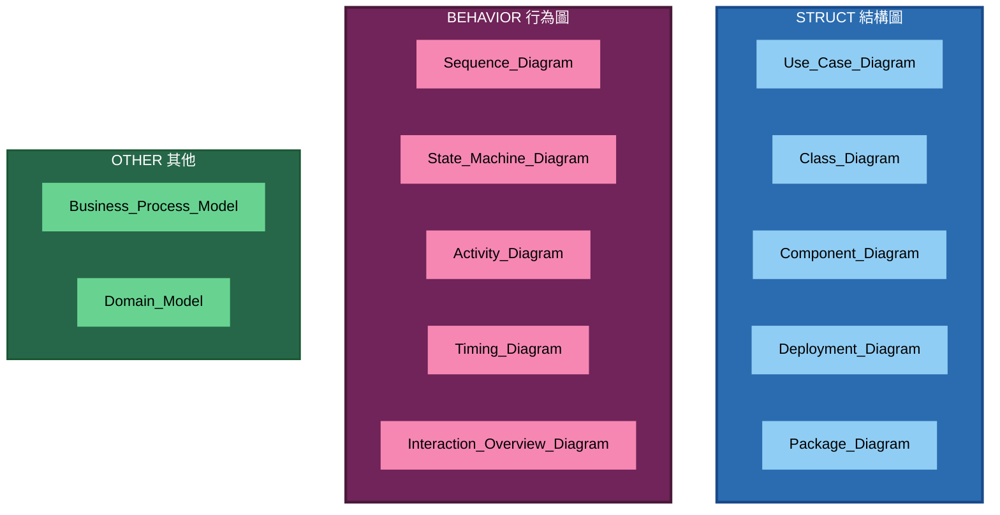

### 5.2 模型之間的關係

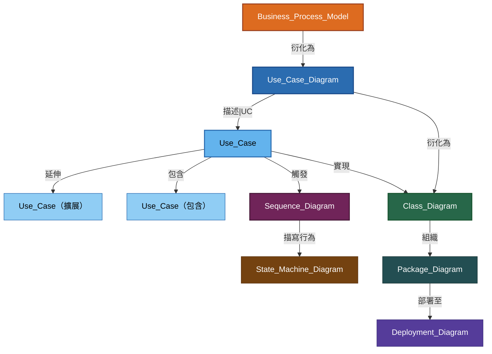

---

## 六、知識圖譜三元組範例

以下為從 Ontology 自動抽取的知識圖譜三元組範例：

### 6.1 系統組成三元組

```json
[
  ["AIQuoteSystem", "belongs_to_system", "SalesSystem"],
  ["AIQuoteSystem", "decomposes_into", "PricingEngine"],
  ["AIQuoteSystem", "decomposes_into", "CustomerDataModule"],
  ["AIQuoteSystem", "decomposes_into", "SAPIntegrationAdapter"],
  ["AIQuoteSystem", "specifies_architecture", "AIQuoteArchitecture"],
  ["AIQuoteSystem", "has_release_version", "v1.0.0"],
  ["AIQuoteSystem", "adheres_to_security", "SecurityPolicy2026"],
  ["PricingEngine", "implements", "PR-001"],
  ["PricingEngine", "implements", "PR-002"],
  ["PricingEngine", "has_test_case", "TC-Pricing-001"],
  ["PricingEngine", "deployed_to", "ProductionKubernetes"],
  ["SAPIntegrationAdapter", "defines_api", "SAPOrderAPI"],
  ["SAPIntegrationAdapter", "depends_on", "SAPConnector"],
  ["SAPOrderAPI", "exposes_endpoint", "/api/v1/orders"]
]
```

### 6.2 需求溯源三元組

```json
[
  ["BR-001", "derives_from", "UR-001"],
  ["BR-001", "has_priority", "MoSCoW-Must"],
  ["UR-001", "derives_from", "SR-001"],
  ["UR-001", "derives_from", "SR-002"],
  ["UR-001", "has_userstory", "身為業務，我想要即時取得報價，以便在客戶詢價時立即回覆"],
  ["UR-001", "has_acceptance_criteria", "報價回覆時間不超過5分鐘"],
  ["SR-001", "satisfies_requirement", "PR-NF-001"],
  ["SR-001", "implements", "PricingEngine"],
  ["SR-002", "implements", "CustomerDataModule"],
  ["SR-001", "has_requirement_conflict", "RC-001"],
  ["PricingEngine", "satisfies_requirement", "SR-001"],
  ["PricingEngine", "has_test_case", "TC-Pricing-001"],
  ["TC-Pricing-001", "belongs_to_suite", "UnitTestSuite"],
  ["UnitTestSuite", "generates_report", "TestReport-v1.0.0"],
  ["v1.0.0", "version_includes", "PricingEngine"],
  ["v1.0.0", "version_includes", "CustomerDataModule"]
]
```

### 6.3 系統整合三元組

```json
[
  ["PLMSystem", "integrates_with", "SAPSystem"],
  ["PLMSystem", "analyzes_integration", "PLM-SAP-Integration"],
  ["SAPSystem", "integrates_with", "CRMSystem"],
  ["PLM-SAP-Integration", "defines_api_integration", "MaterialSyncAPI"],
  ["PLM-SAP-Integration", "defines_data_integration", "MaterialDataSync"],
  ["MaterialSyncAPI", "has_endpoint", "POST /api/v1/materials/sync"],
  ["MaterialSyncAPI", "has_endpoint", "GET /api/v1/materials/{id}"],
  ["MaterialSyncAPI", "has_error_handling", "RetryPolicy-3times"],
  ["MaterialDataSync", "has_frequency", "Real-time"],
  ["MaterialDataSync", "has_validation", "SchemaValidation"]
]
```

---

## 七、與其他 Domain 的整合

### 7.1 跨 Domain 整合關係

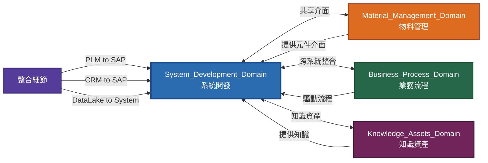

### 7.2 整合點對應表

| 整合場景 | 來自 Domain | 對應實體 | 屬性關係 |
|---------|-----------|---------|---------|
| **PLM to SAP** | Material_Management | Integration_Point, Interface_Specification | `analyzes_integration`, `defines_api` |
| **CRM to SAP** | Material_Management | System_Integration_Analysis, Data_Integration_Spec | `analyzes_integration`, `defines_data_integration` |
| **DataLake to 系統** | System_Development | Infrastructure_Resource, Deployment_Configuration | `deployed_to`, `configured_by` |
| **HRM to 各系統** | System_Development | Software_Component, Development_Task | `belongs_to_system`, `has_task` |
| **知識庫 to 系統** | Knowledge_Assets | Technical_Documentation, Source_Code | `documented_in` |

---

## 八、檔案清單

| 檔案 | 類型 | 說明 |
|------|------|------|
| `sd-domain.json` | Domain Ontology | System_Development 領域本體論（JSON Schema）|
| `sa-major.json` | Major Ontology | System_Analysis 專業本體論（JSON Schema）|
| `sd-sa-ontology-spec.md` | 本文件 | 完整規格文件（含 Mermaid 圖，v11.x 兼容）|

---

## 九、使用指引

### 9.1 上架文件時的 Ontology 綁定

在 Knowledge Base 中上架系統開發相關文件時，應依文件類型綁定對應的 `ontology_domain` 與 `ontology_major`：

| 文件類型 | ontology_domain | ontology_major | 範例檔案 |
|---------|--------------|--------------|---------|
| 系統規格書 | `System_Development` | `System_Analysis` | `AI報價系統規格書_v1.docx` |
| 架構設計文件 | `System_Development` | `System_Analysis` | `微服務架構設計.md` |
| 介面規格書 | `System_Development` | `System_Analysis` | `PLM-SAP-API規格.yaml` |
| 原始碼文件 | `System_Development` | （空或不綁定 Major）| `pricing_engine.py` |
| 測試文件 | `System_Development` | （空或不綁定 Major）| `test_pricing.py` |
| 部署設定 | `System_Development` | （空或不綁定 Major）| `deployment.yaml` |
| 會議記錄 | `System_Development` | `System_Analysis` | `需求訪談紀錄_20260301.md` |
| 需求表單 | `System_Development` | `System_Analysis` | `ECR-2026-001_表單.md` |

### 9.2 RAG 檢索策略

當 Agent 進行 RAG 檢索時，可依據使用者的提問類型自動過濾對應的 Ontology 範圍：

| 提問類型 | 檢索 Filter | 說明 |
|---------|-----------|------|
| 詢問系統架構 | `ontology_domain = "System_Development"` | 返回所有系統架構相關文件 |
| 詢問特定需求 | `ontology_domain = "System_Development"`<br>`ontology_major = "System_Analysis"` | 返回需求規格文件 |
| 詢問 API 介面 | `ontology_domain = "System_Development"` + keyword `api` / `interface` | 返回介面規格文件 |
| 詢問部署方式 | `ontology_domain = "System_Development"` + keyword `deploy` / `kubernetes` | 返回部署相關文件 |

---

## 十、Phase 2-5 Major Ontology（已實作）

### 10.1 DevOps Engineering Major（已實作 v1.0）

| 項目 | 內容 |
|------|------|
| 檔案 | `de-devops-major.json` |
| 實體數 | 33 個 |
| 屬性數 | 30 個 |
| 核心實體 | Pipeline_Definition, Build_Stage, Deploy_Stage, Container_Image, Dockerfile, Kubernetes_Manifest, Helm_Chart, Infrastructure_As_Code, Environment, Deployment_Strategy, Rollback_Procedure, Feature_Flag, Monitoring_Metric, Alert_Rule, Log_Aggregation, Distributed_Trace, SLO, SLI, Error_Budget, Incident_Record, Change_Record, Deployment_History, Secret_Management, CI_Runner, GitOps_Repository, Platform_Service, FinOps_Report |
| 適用場景 | CI/CD Pipeline 管理、RAG 輔助部署故障診斷、AI 輔助部署決策、SLO/SLI 追蹤、IaC 規範一致性檢查 |

### 10.2 Security Engineering Major（已實作 v1.0）

| 項目 | 內容 |
|------|------|
| 檔案 | `se-devops-major.json` |
| 實體數 | 34 個 |
| 屬性數 | 31 個 |
| 核心實體 | Threat_Model, Attack_Surface, Security_Requirement, Security_Control, Secure_Design_Review, Security_Architecture, Zero_Trust_Model, Security_Code_Review, SAST_Tool, DAST_Tool, SCA_Tool, Vulnerability_Record, CVSS_Score, Penetration_Test, Security_Test_Case, Security_Scan_Pipeline, Security_Compliance_Framework, Compliance_Audit_Report, Encryption_Standard, Key_Management_System, Security_Incident, Incident_Response_Playbook, Root_Cause_Analysis, Security_Awareness_Training, Third_Party_Security_Assessment, Bug_Bounty_Program, IAM |
| 適用場景 | 威脅建模與風險評估、RAG 輔助安全政策檢索、AI 輔助漏洞優先級排序、AI 輔助滲透測試報告生成、合規審查自動化 |

### 10.3 AI Development Major（已實作 v1.0）

| 項目 | 內容 |
|------|------|
| 檔案 | `ai-devops-major.json` |
| 實體數 | 38 個 |
| 屬性數 | 33 個 |
| 核心實體 | Training_Dataset, Model_Training_Job, Hyperparameter, Model_Checkpoint, Base_Model, Fine_Tuned_Model, LoRA_Config, Prompt_Template, System_Prompt, Few_Shot_Example, Chain_Of_Thought, Prompt_Version, RAG_Pipeline, Document_Chunking, Embedding_Model, Vector_Index, Retrieval_Strategy, Generation_Model, Context_Window, Token_Budget, AI_Agent, Agent_Tool, Tool_Calling_Schema, Agent_Memory, Agent_Planning, Multi_Agent_Orchestration, Model_Evaluation_Metric, Hallucination_Detection, AI_Output_Validation, Model_Monitoring, Model_Drift, AI_Safety_Filter, Multimodal_Input |
| 適用場景 | AI 模型選型決策、RAG Pipeline 設計、AI Agent 流程建模、Prompt 版本管理、模型效能監控 |

### 10.4 Database Engineering Major（已實作 v1.0）

| 項目 | 內容 |
|------|------|
| 檔案 | `db-devops-major.json` |
| 實體數 | 41 個 |
| 屬性數 | 39 個 |
| 核心實體 | Schema_Design, ER_Diagram, Normalization_Form, Index_Strategy, Composite_Index, Query_Execution_Plan, Query_Pattern, Transaction, Isolation_Level, Deadlock, Lock_Management, Connection_Pool, Database_User, Role_Based_Access, Column_Level_Security, Data_Encryption_At_Rest, Audit_Log_Database, Backup_Policy, Full_Backup, Incremental_Backup, Point_In_Time_Recovery, Database_Replica, Streaming_Replication, Failover_Mechanism, High_Availability_Cluster, Load_Balancer, Database_Sharding, Shard_Key, Sharding_Strategy, Cross_Shard_Query, Database_Migration, Schema_Migration_Script, Data_Migration_Plan, Zero_Downtime_Migration, Query_Cache, Partitioning, Connection_Proxy |
| 適用場景 | Schema 設計審查、SQL 效能調優、備份還原計畫、高可用性架構設計、AI 輔助資料庫遷移規劃 |

### 10.5 擴展路線圖（更新）

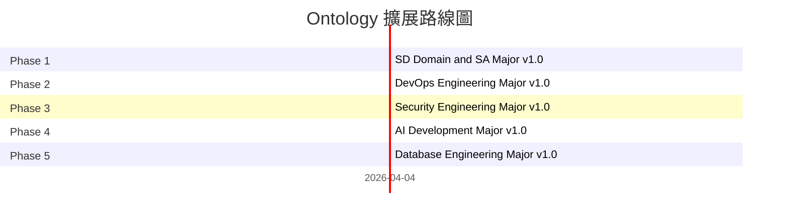

| 階段 | Major Ontology 名稱 | 狀態 | 實體數 | 屬性數 |
|------|------------------|------|--------|--------|
| Phase 1 | System_Development Domain | ✅ 已實作 | 34 | 27 |
| Phase 1 | System_Analysis Major | ✅ 已實作 | 44 | 33 |
| Phase 2 | DevOps Engineering Major | ✅ 已實作 | 33 | 30 |
| Phase 3 | Security Engineering Major | ✅ 已實作 | 34 | 31 |
| Phase 4 | AI Development Major | ✅ 已實作 | 38 | 33 |
| Phase 5 | Database Engineering Major | ✅ 已實作 | 41 | 39 |
| **合計** | | | **224** | **205** |

---

## 附錄：Mermaid 語法相容性說明

本專案使用 **Mermaid v11.13.0**（2025 年最新版本），本文件的 Mermaid 語法相容於 v11.x 系列。

### Mermaid 版本差異

| 語法類型 | 使用方式 | 說明 |
|---------|---------|------|
| 節點標籤 | `ID["label text"]` | v11 標準語法 |
| 子圖（Subgraph）| `subgraph NAME["label"]` | v11 支援巢狀子圖 |
| ER Diagram | 標準語法 | v11 完整支援 |
| Mindmap | `mindmap` + `root((text))` | v11 新支援 |
| QuadrantChart | `quadrantChart` | v11 新支援（x/y 軸範圍 0-1）|
| Pie Chart | `pie "label": value` | v11 標準語法 |
| Gantt | `gantt` + section | v11 標準語法 |
| Sequence | `sequenceDiagram` | v11 標準語法 |
| State | `stateDiagram-v2` | v11 標準語法 |

### 渲染測試

驗證頁面位於 `/app/mermaid-verification`（`src/pages/MermaidVerification.tsx`），收錄 10 個關鍵圖表語法測試用例。

### 重要語法提醒

- **QuadrantChart**：點座標格式為 `[label] [x] [y]`，其中 x/y 為 0-1 的數值
- **Mindmap**：根節點使用雙括號 `root((text))`，子節點縮進
- **Flowchart**：避免 `<br>` 換行，改用純文字標籤
- **節點 ID**：使用純英文/數字/底線，避免中文 ID

---

*本文件由 AIBox Agent 自動產生，請以實際使用結果為準。*
