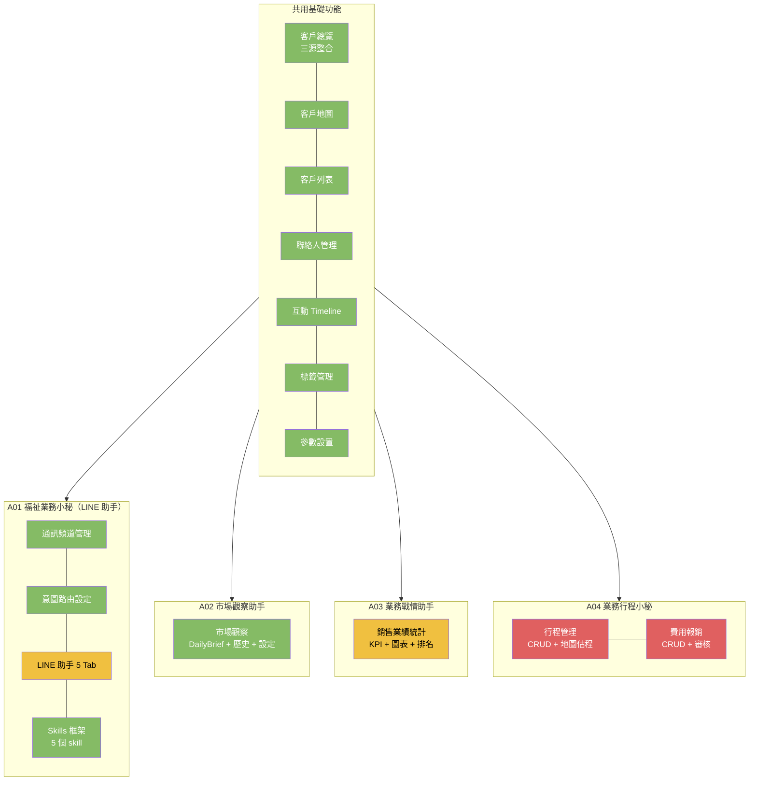

# CRM 功能總覽 — 依現有實作狀態分類



## 功能清單總覽

| 功能 | 對應 Agent | 前/後端狀態 | API 狀態 | 資料源 |
|------|:----------:|:----------:|:--------:|--------|
| 客戶總覽（三源整合） | — | ✅ 實作 | ✅ 實作 | ArangoDB crm_customers + Ragic |
| 客戶地圖 | — | ✅ 實作 | ✅ 實作 | ArangoDB + Geo |
| 聯絡人管理 | A01 LINE 助手 | ✅ 實作 | ✅ 實作 | ArangoDB crm_contacts |
| 互動 Timeline | A01 LINE 助手 | ⏳ mock | ✅ 實作 | ArangoDB customer_timelines |
| 客戶列表（含 ERP 標籤） | — | ✅ 實作 | ✅ 實作 | ArangoDB + Ragic |
| 標籤管理 | — | ✅ 實作 | — | ArangoDB |
| 參數設置 | — | ✅ 實作 | ✅ 實作 | ArangoDB system_params |
| 通訊頻道管理 | A01 LINE 助手 | ✅ 實作 | ✅ 實作 | ArangoDB channels |
| LINE 助手 5 Tab | A01 LINE 助手 | ⏳ mock | ❌ 無 | 全部 mock data |
| 市場觀察（Market Intel） | A02 市場觀察助手 | ✅ 實作 | ✅ 實作 | DuckDuckGo + LLM |
| 銷售業績統計 | A03 業務戰情助手 | ⏳ mock | ❌ 無 | 全部 mock data |
| 業務行程管理 | A04 業務行程小秘 | ⏳ mock | ❌ 無 | 全部 mock data |
| 費用報銷 CRUD | A04 業務行程小秘 | ❌ 無 | ❌ 無 | 需新建 |
| CRM 權限設定 | — | ✅ 實作 | ✅ 實作 | ArangoDB |
| 意圖路由設定 | A01 LINE 助手 | ✅ 實作 | ✅ 實作 | ArangoDB system_params |

---

## A01 福祉業務小秘（LINE 助手）

### 現有功能

| 功能 | 前端 | 後端 API | 狀態 |
|------|:----:|:--------:|:----:|
| 通訊頻道管理（ChannelAdminPage） | ✅ ChannelAdminPage.tsx | ✅ channels.rs（5 endpoints） | ✅ 完整 |
| 意圖路由表（IntentRoutingEditor） | ✅ IntentRoutingEditor.tsx | ✅ system_params | ✅ 完整 |
| Skills 框架（5 個 skill） | — | ✅ skills.json + skill.py | ✅ 完整 |
| LINE 助手 6 Tab（LineAssistantPage） | ⏳ 全部 mock | ❌ 無 | ⏳ mock |
| PlatformAdapter 抽象層 | — | ❌ 無 | ❌ 未實作 |
| LINE Messaging API 整合 | — | ❌ 無 | ❌ 未實作 |

### LineAssistantPage 各 Tab 狀態

| Tab | 元件 | 狀態 | 備註 |
|-----|------|:----:|------|
| 頻道設定 | — | ❌ | 已移至獨立頁面 ChannelAdminPage |
| 對話查詢 | ConversationView | ⏳ mock | mock conversations |
| 問候與排程 | GreetingScheduler | ⏳ mock | mock tasks |
| 客戶 Timeline | TimelineView | ⏳ mock | mock events |
| 名片待確認 | PendingContacts | ⏳ mock | mock pending |
| 行程看板 | VisitBoard | ⏳ mock | mock visits |

---

## A02 市場觀察助手（Market Intel）

### 現有功能

| 功能 | 前端 | 後端 API | 狀態 |
|------|:----:|:--------:|:----:|
| 今日快報（DailyBrief） | ✅ MarketIntelPage.tsx | ✅ /latest | ✅ 完整 |
| 執行記錄（HistoryTab） | ✅ MarketIntelPage.tsx | ✅ /history | ✅ 完整 |
| 操作設置（SettingsTab） | ✅ MarketIntelPage.tsx | ✅ system_params | ✅ 完整 |
| 權限管理 | ✅ MarketIntelPage.tsx | ✅ market_intel.permissions | ✅ 完整 |
| 搜尋+批次刪除 | ✅ MarketIntelPage.tsx | ✅ /delete-reports | ✅ 完整 |
| 保留天數設定 | ✅ MarketIntelPage.tsx | ✅ market_intel.retention_days | ✅ 完整 |
| 主管快報合併 [管] 標籤 | ✅ MarketIntelPage.tsx | ✅ created_by 過濾 | ✅ 完整 |
| Celery 背景執行 | — | ✅ Celery task | ✅ 完整 |
| DuckDuckGo 搜尋 | — | ✅ scraper.py | ✅ 完整 |
| LLM 摘要+分析 | — | ✅ summarizer.py | ✅ 完整 |

### 端點一覽

| 方法 | 路徑 | 說明 |
|:----:|------|------|
| GET | /api/v1/market-intel/latest | 最新快報（可指定 user_key） |
| GET | /api/v1/market-intel/history | 歷史記錄（可指定 user_key） |
| GET | /api/v1/market-intel/report-by-key/{key} | 特定版本快報 |
| POST | /api/v1/market-intel/refresh-celery | 觸發 Celery 背景執行 |
| POST | /api/v1/market-intel/delete-reports | 批次刪除記錄 |
| POST | /api/v1/market-intel/cleanup | 清理過期記錄（依 retention_days） |

---

## A03 業務戰情助手（Sales Intel）

### 現有功能

| 功能 | 前端 | 後端 API | 狀態 |
|------|:----:|:--------:|:----:|
| KPI 儀表板 | ✅ SalesDashboardPage.tsx | ❌ 無 | ⏳ 全部 mock |
| 區域/產品分析（圓餅圖） | ✅ recharts PieChart | ❌ 無 | ⏳ 全部 mock |
| 業務員排名（長條圖） | ✅ recharts BarChart | ❌ 無 | ⏳ 全部 mock |
| 12 月趨勢圖（長條+折線） | ✅ recharts ComposedChart | ❌ 無 | ⏳ 全部 mock |

### 可重用的既有基礎建設

| 資源 | 路徑 | 用途 |
|------|------|------|
| Ragic API Client | ai-services/data_agent/ragic/client.py | 讀取 Ragic ERP 訂單/銷貨/報價資料 |
| Ragic Data Agent | ai-services/data_agent/ragic/router.py | NL 查詢 Ragic 資料 |
| Ragic config_loader | ai-services/data_agent/ragic/config_loader.py | 多租戶 Ragic 連線 |
| batch_fields_config | ai-services/data_agent/trace_engine/batch_fields_config.json | 28 張 Ragic ERP 表結構（含訂購單、銷貨單、報價單） |
| CRM customers API | api/src/api/crm.rs | 客戶資料查詢 |
| Data Agent schema API | api/src/api/da.rs | Schema 與欄位查詢 |
| recharts 圖表庫 | package.json | PieChart, BarChart, ComposedChart, 趨勢線 |

### 需要新建的端點

| 方法 | 路徑 | 說明 |
|:----:|------|------|
| GET | /api/v1/sales/kpi | 營收/成長率/達標率/活躍客戶數（彙總 Ragic 訂購單+銷貨單） |
| GET | /api/v1/sales/regional | 區域別銷售額（Ragic 訂購單依客戶區域分群) |
| GET | /api/v1/sales/product | 產品別銷售分析（Ragic 訂購單依產品分類） |
| GET | /api/v1/sales/ranking | 業務員業績排名（Ragic 訂購單依業務員彙總） |
| GET | /api/v1/sales/trend | 每月趨勢圖（Ragic 銷貨單依月份彙總） |

---

## A04 業務行程小秘（Visit & Expense）

### 現有功能

| 功能 | 前端 | 後端 API | 狀態 |
|------|:----:|:--------:|:----:|
| 行程看板（VisitBoard） | ✅ LineAssistantPage.tsx | ❌ 無 | ⏳ mock |
| 行程 intent（schedule_visit） | ✅ IntentRoutingEditor.tsx | — | ✅ 已註冊 |
| 客戶地圖行程按鈕 | ✅ CustomerMap.tsx | — | ✅ 已有按鈕（custom event） |
| 系統參數 crm.visit.reminder.days | ✅ ParamsPage.tsx | ✅ system_params | ✅ 已註冊 |
| Timeline visit_completed 事件 | — | ✅ timeline_engine skill | ✅ 支援 |
| 費用報銷 CRUD | ❌ 無 | ❌ 無 | ❌ 未實作 |

### 需要新建的端點與集合

#### visit_plans collection

```json
{
  "_key": "uuid",
  "customer_id": "crm_contact_key",
  "customer_name": "陳先生",
  "visit_date": "2026-06-20",
  "visit_time": "10:00",
  "location": "台北市大安區...",
  "lat_lng": [25.034, 121.564],
  "estimated_travel_min": 25,
  "status": "planned | done | cancelled",
  "notes": "",
  "reminder_sent": false,
  "created_by": "user_key",
  "created_at": "ISO datetime"
}
```

| 方法 | 路徑 | 說明 |
|:----:|------|------|
| GET | /api/v1/visits | 行程列表（日期範圍/狀態/業務員） |
| POST | /api/v1/visits | 新增行程 |
| PUT | /api/v1/visits/{key} | 修改行程 |
| DELETE | /api/v1/visits/{key} | 刪除行程 |
| GET | /api/v1/visits/calendar | 行事曆視圖（月/週/日） |

#### expense_reports collection

```json
{
  "_key": "uuid",
  "business_user_key": "user_key",
  "visit_id": "visit_key (optional)",
  "expense_date": "2026-06-18",
  "category": "交通 | 餐飲 | 住宿 | 其他",
  "amount": 1500,
  "description": "拜訪客戶計程車費",
  "receipt_url": "SeaweedFS URL",
  "status": "draft | submitted | approved | rejected | paid",
  "reviewer_key": "supervisor_key",
  "reviewed_at": "ISO datetime",
  "review_note": "",
  "created_at": "ISO datetime"
}
```

| 方法 | 路徑 | 說明 |
|:----:|------|------|
| GET | /api/v1/expenses | 報銷清單（狀態/日期/業務員） |
| POST | /api/v1/expenses | 新增報銷（含憑證上傳） |
| PUT | /api/v1/expenses/{key} | 修改報銷 |
| DELETE | /api/v1/expenses/{key} | 刪除報銷 |
| PUT | /api/v1/expenses/{key}/approve | 主管審核（核准/駁回） |

---

## 功能狀態分布統計

| 狀態 | 數量 | 說明 |
|:----:|:----:|------|
| ✅ 完整實作 | 28 | 前後端 API 全部完成 |
| ⏳ mock | 12 | 前端畫面有但全為假資料 |
| ❌ 未實作 | 8 | 前後端皆不存在 |

## 相關檔案索引

| 檔案 | 說明 |
|------|------|
| .docs/Spec/crm/CRM Agent 規劃.csv | 4 個 Agent 完整意圖對照表 |
| .docs/Spec/crm/客戶總覽-資料來源規格.md | 三源資料整合（衛福部+業務王+Ragic） |
| .docs/Spec/crm/eea-crm-contacts-spec.md | 聯絡人管理規格 |
| .docs/Spec/crm/客戶列表.md | 客戶列表規格 |
| .docs/Spec/智能體/福祉業務小秘/福祉業務小秘Agent.md | LINE 助手完整規格 v3.0 |
| .docs/Spec/系統開發/05-客戶timeline-活動整理.md | Timeline Engine + Ragic 6 表輪巡 |
