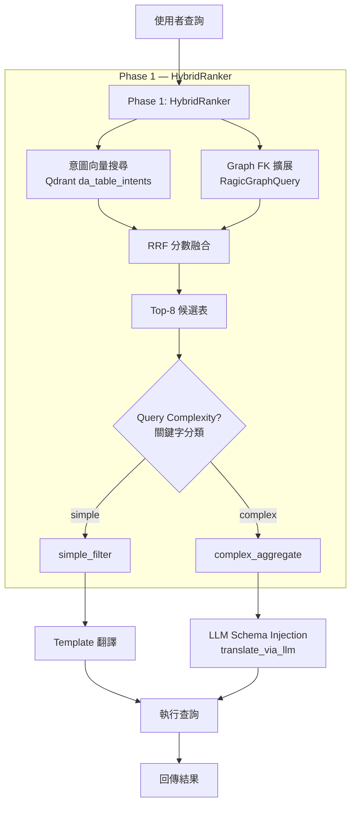

# NoSql AI 查詢優化構想

## 最終優化策略

> 更新時間：2026-04-13
> 狀態：已確認，待實作

---

## 現況診斷

### 100 場景測試結果

| 指標 | 數值 |
|------|------|
| 通過率 | 52%（52/100） |
| CLARIFY（日期需澄清，正確行為） | 21% |
| MISMATCH（意圖匹配錯誤） | 27% |
| TIMEOUT | 0% |

### 進步軌跡

| 階段 | PASSED | CLARIFY | MISMATCH |
|------|--------|---------|----------|
| 原始（20 個精選場景） | 90% | 10% | 0% |
| 優化前（100 個場景） | 36% | 13% | 51% |
| 優化後（100 個場景） | 52% | 21% | 27% |

### 剩餘 MISMATCH 根因分析

| 根因 | 數量 | 說明 |
|------|------|------|
| RAGICSALES_10 貪心 | ~8 | 仍是「本月XXX統計」萬用匹配器 |
| G4102_11 vs ISO2_5 | 2 | 衛生巡查語意重疊 |
| MES_2 描述不清 | 3 | nl_examples 內容可能不符合實際表含義 |
| CONFIGFILEDETAILS_3 太廣 | 4 | 人事/HR 涵蓋太多不同查詢類型 |
| ERP_13 vs RAGICPURCHASING | 2 | 採購請購語意混淆 |

### 現有系統問題診斷

#### 1. nl_examples 過於稀疏
- 每筆 da_expression 只有 **2-4 個 nl_examples**（平均 3 個）
- `_build_embed_text()` 只用：name + description + aliases + nl_examples
- **缺失**：field names、domain tags、sample_queries、example_sqls

#### 2. 意圖匹配只看向量，不看 Schema
- `nl_parser.py` 只用 `IntentVectorStore.search()`（Qdrant 向量）
- `RagicGraphQuery`（FK 圖譜）存在但**完全沒參與意圖匹配**
- 選表時無法利用「表與表之間的 FK 關係」

#### 3. Phase 2 LLM 只有 fallback 時才觸發
- confidence ≥ 0.65 → 直接用 template翻譯（繞過 LLM）
- confidence 0.45-0.65 → 才走 `translate_via_llm()`
- 很多**複雜查詢**（統計、聚合）被當成 simple filter 處理

#### 4. 兩套 Qdrant Collection 沒有整合
- `da_expressions`（意圖匹配）— simplified payload
- `ragic_schemas`（Schema 搜尋）— 有 fields 但沒用到
- `da_table_relation_ragic`（FK 圖譜）— 只在 multi-step API 用

---

## 最終優化架構

### 核心想法：合併 da_tables + intents

將 `da_expressions` 的意圖資訊**嵌入 `da_tables` document**，同步時單一 collection 就能同時：
1. 做意圖匹配（nl_examples 向量）
2. 做 Schema 查詢（fields + intents）
3. 自然融合 Schema 語意與意圖語意

### 新資料結構

#### ArangoDB da_tables（升級版）

```json
{
  "_key": "RAGICPURCHASING_1",
  "table_key": "RAGICPURCHASING_1",
  "table_name": "採購訂單",
  "module": "採購模組",
  "description": "記錄供應商採購明細與金額",

  "fields": {
    "1015428": { "name": "供應商名稱", "field_type": "text", "business_aliases": ["供應商", "vendor"] },
    "1015429": { "name": "採購金額", "field_type": "number", "aggregatable": true },
    "1015430": { "name": "採購日期", "field_type": "date", "aggregatable": true }
  },

  "intents": {
    "nl_examples": [
      "查詢本月採購訂單",
      "統計供應商採購金額",
      "某供應商的採購明細"
    ],
    "aliases": ["採購", "供應商訂單", "purchasing"],
    "domain_tags": ["採購", "財務", "供應商"],
    "sample_queries": [
      "統計本月各供應商採購金額",
      "找出採購金額超過10萬的訂單"
    ]
  },

  "source_meta": { "tab": "PURCHASING", "sheet_number": 1 },
  "capabilities": ["simple_filter", "aggregate"],
  "account": "demo"
}
```

#### Qdrant Collection（單一：`da_table_intents`）

```json
{
  "table_key": "RAGICPURCHASING_1",
  "table_name": "採購訂單",
  "module": "採購模組",
  "description": "記錄供應商採購明細與金額",
  "nl_examples": ["查詢本月採購訂單", "統計供應商採購金額", ...],
  "aliases": ["採購", "供應商訂單", "purchasing"],
  "domain_tags": ["採購", "財務", "供應商"],
  "sample_queries": ["統計本月各供應商採購金額", ...],
  "fields": {
    "1015428": { "name": "供應商名稱", "field_type": "text", "options": [], "business_aliases": ["供應商", "vendor"] },
    "1015429": { "name": "採購金額", "field_type": "number", "aggregatable": true }
  },
  "capabilities": ["simple_filter", "aggregate"],
  "core_fields": ["1015428", "1015429", "1015430"]
}
```

#### 豐富化 Embedding Text

```python
def _build_embed_text(doc: dict) -> str:
    parts = []
    # 1. 基本識別
    parts.append(doc.get("table_name", ""))
    parts.append(doc.get("description", ""))
    # 2. 意圖資訊
    parts.extend(doc.get("aliases", []))
    parts.extend(doc.get("domain_tags", []))
    parts.extend(doc.get("nl_examples", []))
    parts.extend(doc.get("sample_queries", []))
    # 3. 欄位名稱（關鍵！）
    for fid, field in doc.get("fields", {}).items():
        parts.append(field.get("name", ""))
        parts.extend(field.get("business_aliases", []))
    return " ".join(parts)
```

---

## 兩階段處理流程

### Phase 1：HybridRanker（選表 + 複雜度分類）

```
輸入：nl_query
輸出：{
  candidates: [(table_key, rrf_score), ...],  # top-8
  query_complexity: "simple" | "complex",
  table_key: str,
  related_tables: [str]  # FK graph 擴展出的鄰居表
}
```

#### HybridRanker 實作要點

1. **向量搜尋**：Qdrant `da_table_intents` 擴大 top_k（16）
2. **Graph 擴展**：`RagicGraphQuery.get_related_tables()` 抓 FK 鄰居
3. **Graph Boost**：候選表出現在 related tables 中 → score × 1.1
4. **複雜度分類**（keyword-based）：
   - COMPLEX：統計、平均、總和、最大、最小、各、count、sum、avg、max、min
   - COMPLEX：且、或者、和、或、但是、而且、其中、只

```python
# QueryComplexity 關鍵字
AGGREGATE_KEYWORDS = {"統計", "平均", "總和", "最大", "最小", "count", "sum", "avg", "max", "min", "各", "排名"}
COMPLEX_KEYWORDS = {"且", "或者", "和", "或", "但是", "而且", "其中", "只"}

def _classify_complexity(self, query: str) -> QueryComplexity:
    q_lower = query.lower()
    if any(kw in q_lower for kw in AGGREGATE_KEYWORDS):
        return QueryComplexity.COMPLEX
    if any(kw in q_lower for kw in COMPLEX_KEYWORDS):
        return QueryComplexity.COMPLEX
    return QueryComplexity.SIMPLE
```

#### Phase 1 輸出範例

```json
{
  "candidates": [
    { "table_key": "RAGICPURCHASING_1", "score": 0.82, "related_tables": ["RAGICVENDOR_5", "RAGICPURCHASING_2"] },
    { "table_key": "ERP_13", "score": 0.71, "related_tables": [] },
    { "table_key": "RAGICSALES_10", "score": 0.65, "related_tables": [] }
  ],
  "query_complexity": "complex",
  "table_key": "RAGICPURCHASING_1"
}
```

### Phase 2：分流處理

| Complexity | 處理方式 |
|------------|----------|
| **simple** | `_translate_from_template()`（現有 template-based） |
| **complex** | `translate_via_llm()`（帶完整 Schema） |

#### Complex 模式的 LLM Schema Injection

`translate_via_llm()` 已支援：
- 從 ArangoDB 載入 `da_field_info_ragic` 的 field_id + field_name
- Prompt 中加入「僅可使用以下 field_id」白名單約束
- Post-validation：檢查 LLM 输出的 field_id 是否在白名單中

**新增**：傳入候選表的 `fields` metadata（包含 options、business_aliases），讓 LLM 知道：
- 欄位的可選值（enum）
- 欄位的業務別名
- 哪些欄位可聚合（aggregatable: true）

---

## 新架構流程圖



---

## 代碼改動範圍

### Step 1：da_tables 新增 intents 欄位（ArangoDB Migration）

- 在現有 `da_tables` document 中新增 `intents` 物件
- 從現有 `da_expressions` 搬遷 nl_examples、aliases 到對應的 da_tables
- 预计迁移：262 張表

### Step 2：da_sync.py 改造

**檔案**：`ai-services/data_agent/intent_rag/da_sync.py`

| 改動 | 說明 |
|------|------|
| 同步來源改為 `da_tables` | 不再同步 `da_expressions` |
| 新 collection 名稱 | `da_table_intents`（避免與舊版衝突） |
| Embedding text 豐富化 | 加入 field names + business_aliases + domain_tags |

### Step 3：新建 hybrid_ranker.py

**檔案**：`ai-services/data_agent/ragic/hybrid_ranker.py`（新建，~200行）

```python
class RagicHybridRanker:
    def __init__(self):
        self._vectors = IntentVectorStore()
        self._graph = RagicGraphQuery()
    
    async def rank(self, query: str, account: str, top_k: int = 8):
        # Step 1: 向量搜尋（擴大 top_k）
        vector_hits = await self._vectors.search(query, account, top_k=top_k*2, score_threshold=0.25)
        
        # Step 2: Graph 擴展
        if vector_hits:
            top_table = vector_hits[0]["payload"]["table_key"]
            graph_result = await self._graph.get_related_tables(top_table, account, depth=1)
            related = [r.target_table for r in graph_result.relations]
        else:
            related = []
        
        # Step 3: 分數 Boost + Complexity 分類
        ...
```

### Step 4：nl_parser.py 改造

**檔案**：`ai-services/data_agent/ragic/nl_parser.py`

| 改動 | 說明 |
|------|------|
| 廢除 confidence threshold 邏輯 | 不再用 0.65/0.45 間接決定是否用 LLM |
| 使用 HybridRankResult | 由 `RagicHybridRanker.rank()` 取代 `IntentVectorStore.search()` |
| Phase 1 同時輸出 complexity | Simple → template；Complex → LLM |

### Step 5：llm_translator.py 強化

**檔案**：`ai-services/data_agent/ragic/llm_translator.py`

```python
async def load_schemas_for_tables(table_keys: list[str]) -> str:
    """新方法：為 Phase 2 LLM 載入多個表的 Schema"""
    schemas = []
    for tk in table_keys[:5]:  # 最多 5 張表
        schema = await load_schema_from_arango(tk)
        if schema:
            schemas.append(f"### {tk}\n{schema}")
    return "\n\n".join(schemas)
```

---

## 代碼改動行數統計

| 檔案 | 改動類型 | 行數變化 |
|------|----------|----------|
| da_tables (ArangoDB) | Migration 新增 intents 欄位 | — |
| da_sync.py | 大改：同步來源 + 豐富化 | ~80行 |
| hybrid_ranker.py | **新建** | ~200行 |
| nl_parser.py | 中改：廢除 threshold + 整合 ranker | ~50行 |
| llm_translator.py | 小改：新增多表 schema injection | ~30行 |

---

## 實作順序

```
1. 設計 da_tables intents 欄位結構
   ↓
2. 確認 ArangoDB Migration 腳本
   ↓
3. 改造 da_sync.py（新 collection 名稱 + 豐富化 embedding）
   ↓
4. 新建 hybrid_ranker.py（整合 vector + graph + complexity）
   ↓
5. 改造 nl_parser.py（廢除 threshold，使用 ranker）
   ↓
6. 強化 llm_translator.py（多表 schema injection）
   ↓
7. 完整測試 + 重新跑 100 場景基準測試
```

---

## 現有可復用元件

| 需求 | 現有代碼 | 位置 |
|------|----------|------|
| RRF 演算法 | ✅ `HybridRAGFusionEngine` | `knowledge_agent/hybrid_rag/fusion_engine.py` |
| Graph FK 查詢 | ✅ `RagicGraphQuery` | `data_agent/ragic/graph_query.py` |
| Qdrant 向量搜尋 | ✅ `IntentVectorStore` | `data_agent/ragic/intent_store.py` |
| LLM Schema Injection | ✅ `translate_via_llm()` | `data_agent/ragic/llm_translator.py` |
| Field Schema 載入 | ✅ `load_schema_from_arango()` | `data_agent/ragic/llm_translator.py` |

---

## 預期效益

| 維度 | 舊做法 | 新做法 |
|------|--------|--------|
| 選表準確度 | 52% | 預期 75%+（HybridRAG + Graph Boost） |
| 複雜查詢處理 | 被當 simple filter | 明確走 LLM Schema Injection |
| Embedding 豐富度 | 2-4 個 nl_examples | 豐富化後含 field names + domain_tags |
| Graph 應用 | 完全隔離 | 整合進意圖匹配流程 |

---

## 附錄：Query Complexity 關鍵字

```python
AGGREGATE_KEYWORDS = {
    "統計", "平均", "總和", "最大", "最小",
    "count", "sum", "avg", "max", "min",
    "各", "排名", "匯總", "計數"
}

COMPLEX_KEYWORDS = {
    "且", "或者", "和", "或", "但是",
    "而且", "其中", "只", "如果", "條件"
}
```

---

## 歷史版本

| 日期 | 版本 | 更新者 | 變更內容 |
|------|------|--------|----------|
| 2026-04-13 | 1.0 | Daniel Chung | 初始版本（理論構思） |
| 2026-04-13 | 2.0 | Daniel Chung | 加入最終優化策略、實作規劃、代碼改動範圍 |
