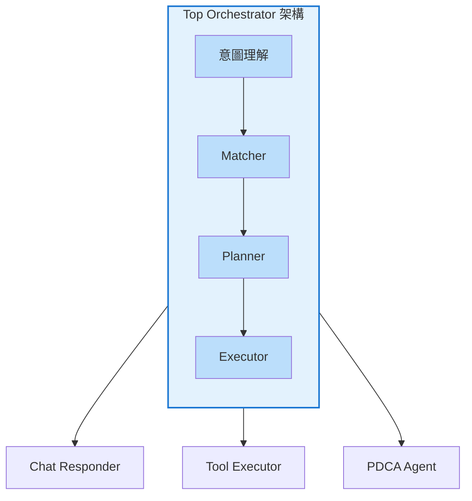
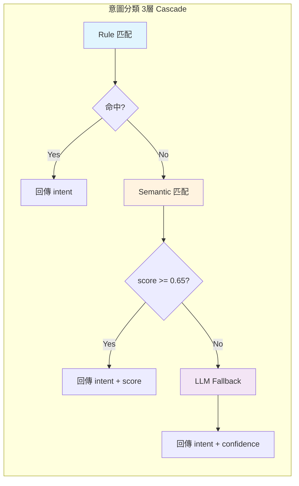
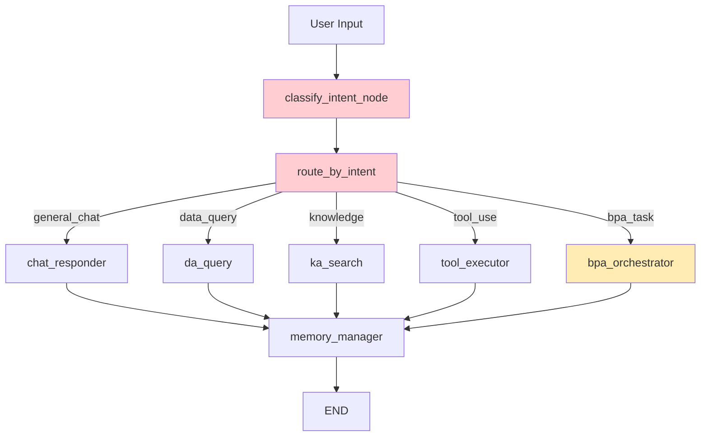
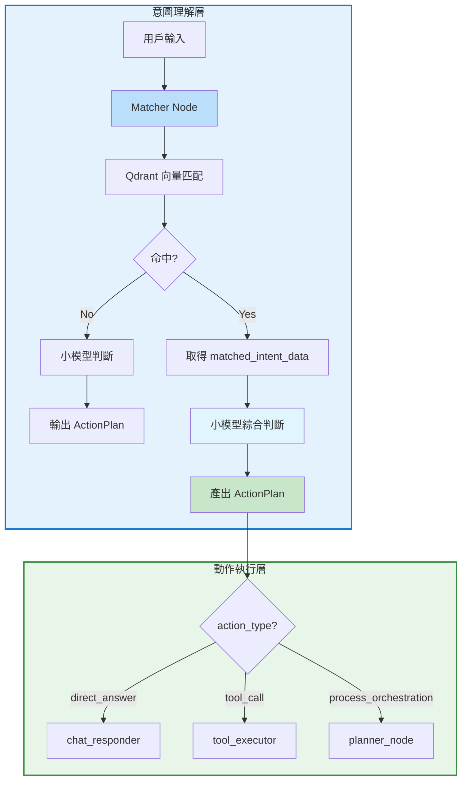
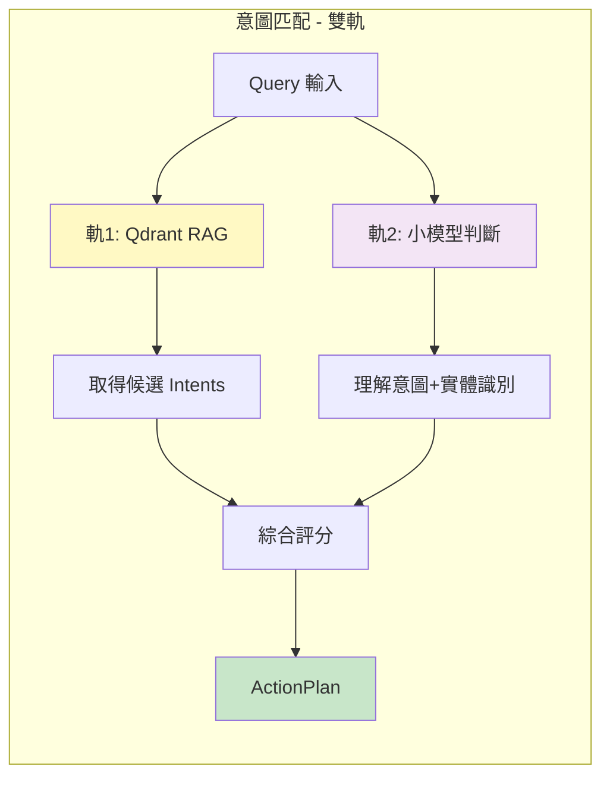
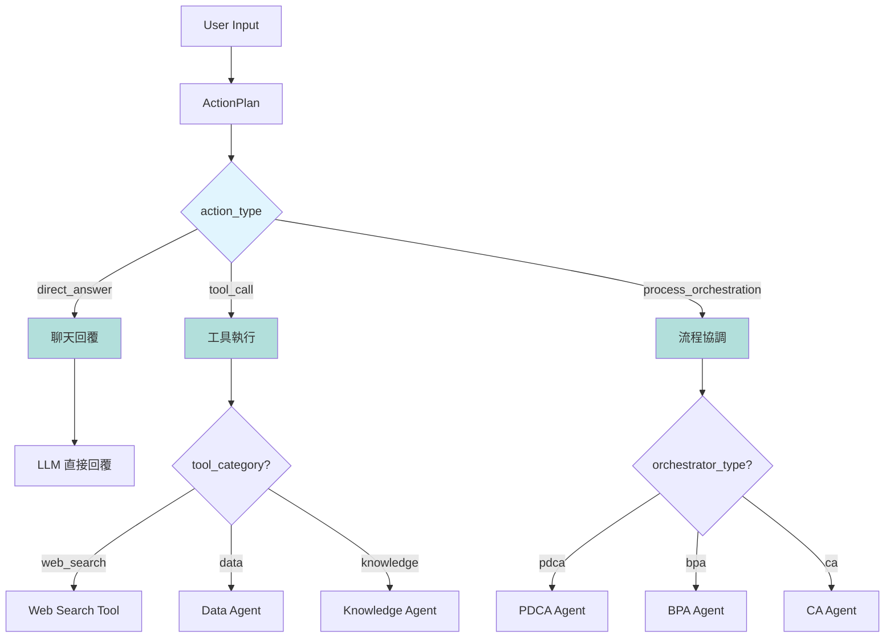
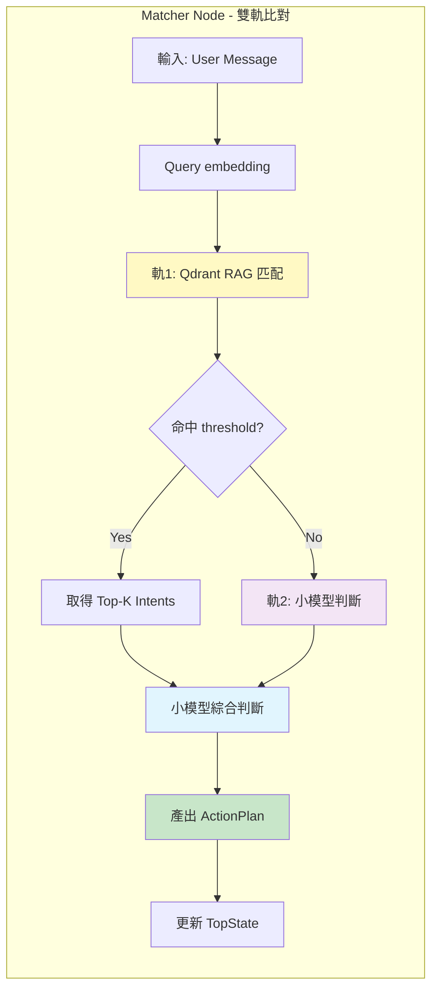
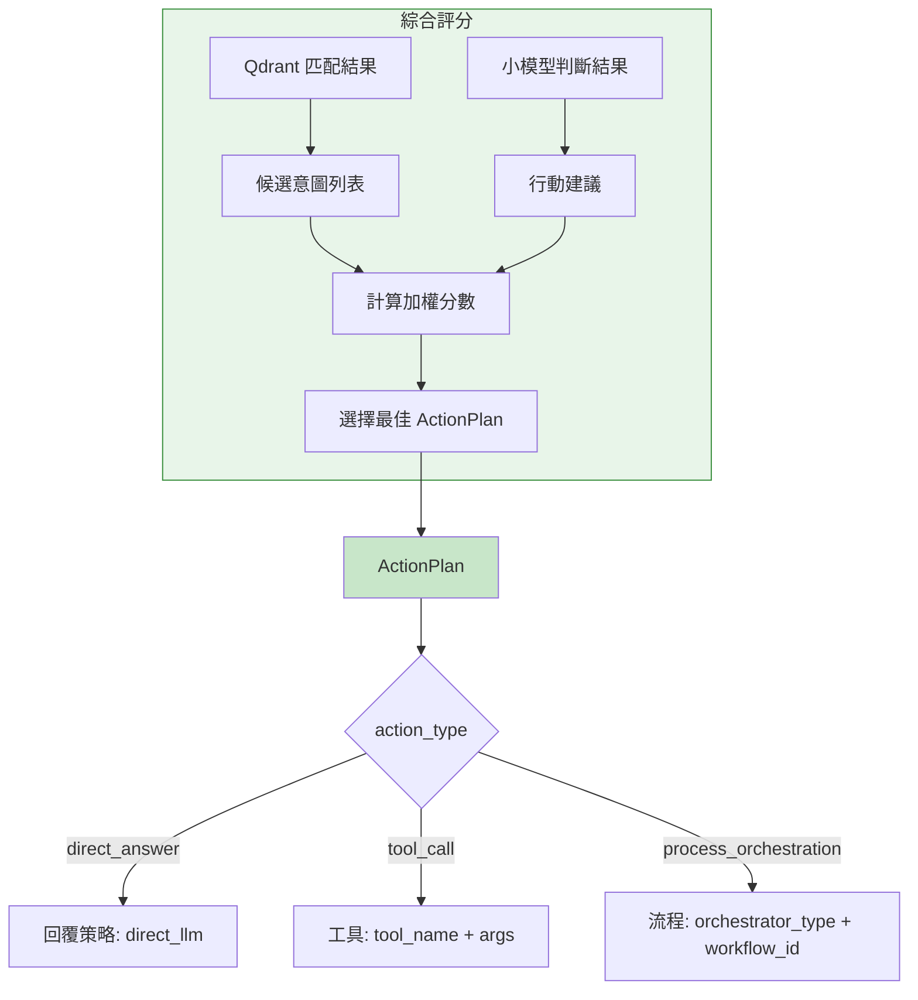
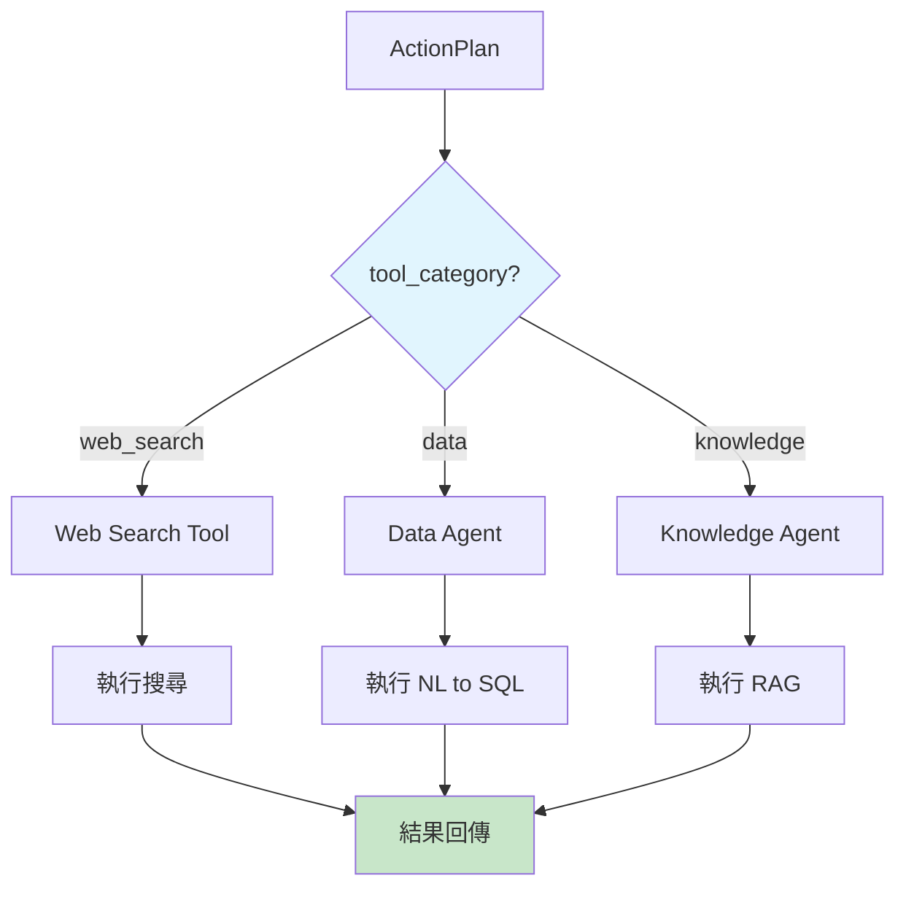
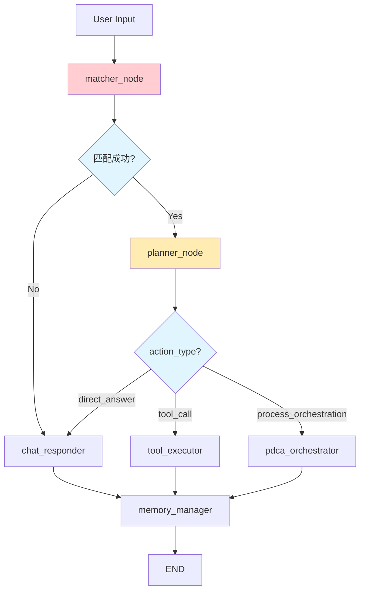

# Top Orchestrator 意圖規格書

---
lastUpdate: 2026-04-14
author: AI Agent (根據代碼分析與 EEA AIBOX 執行架構規劃)
version: 1.0.0
---

## 目錄

1. [系統定位](#1-系統定位)
2. [現有架構分析](#2-現有架構分析)
3. [目標架構設計](#3-目標架構設計)
4. [資料結構](#4-資料結構)
5. [意圖匹配流程](#5-意圖匹配流程)
6. [ActionPlan 機制](#6-actionplan-機制)
7. [Graph 節點改造](#7-graph-節點改造)
8. [API 設計](#8-api-設計)
9. [新增 Scope](#9-新增-scope)
10. [實作規劃](#10-實作規劃)
11. [遷移策略](#11-遷移策略)

---

## 1. 系統定位

### 1.1 在 EEA AIBOX 中的角色



### 1.2 核心職責

| 職責 | 說明 |
|------|------|
| **意圖理解** | 理解用戶自然語言輸入的真正意圖 |
| **動作分類** | 判斷是需要直接回答、工具呼叫、還是流程執行 |
| **目標路由** | 根據意圖將任務路由到正確的 Agent 或執行節點 |
| **執行協調** | 協調下層 Agent 完成複雜任務 |

### 1.3 與其他 Agent 的邊界

| 邊界 | 上游 | 下游 |
|------|------|------|
| **Top Orchestrator** | 用戶輸入 | Chat / Tool / PDCA |
| **Data Agent** | Top Orchestrator 路由 | 資料庫、API |
| **Knowledge Agent** | Top Orchestrator 路由 | 知識庫 |
| **BPA Agent** | Top Orchestrator 路由 | 業務系統 |
| **CA Agent** | Top Orchestrator 路由 | 多元資料源 |

---

## 2. 現有架構分析

### 2.1 現有程式碼位置

```
ai-services/aitask/graph/
├── nodes/
│   ├── intent_classifier.py    # 3層意圖分類（rule → semantic → LLM）
│   ├── chat_responder.py     # 聊天回覆
│   ├── tool_executor.py       # 工具執行
│   ├── bpa_orchestrator.py    # BPA 入口（目前 stub）
│   ├── da_query.py            # Data Agent 查詢
│   ├── ka_search.py           # Knowledge Agent 搜尋
│   └── memory_manager.py      # 記憶管理
├── builder.py                 # LangGraph 建構與路由
└── state.py                 # TopState 定義
```

### 2.2 現有志圖分類流程



### 2.3 現有 Graph 路由



### 2.4 現有 Hardcoded Regex

```python
# intent_classifier.py 第 18-35 行
RULE_PATTERNS = {
    "data_query": re.compile(
        r"(查詢|查看|報表|統計|列出|顯示|多少|數據|訂單|採購|庫存|銷售)",
        re.IGNORECASE,
    ),
    "knowledge": re.compile(
        r"(知識|文件|文檔|搜尋知識|查找資料|根據文件|參考資料)",
        re.IGNORECASE,
    ),
    "tool_use": re.compile(
        r"(執行|運行|啟動|工具|MCP|plugin|外掛)",
        re.IGNORECASE,
    ),
    "bpa_task": re.compile(
        r"(流程|審批|簽核|BPA|物料|請購|採購單|工作流)",
        re.IGNORECASE,
    ),
}
```

### 2.5 現有 Orchestrator Intents（7 筆）

| intent_id | name | domain | response_strategy |
|-----------|------|--------|------------------|
| `orch_chat` | 一般問答/閒聊 | general | direct_llm |
| `orch_data_query` | 資料查詢 | data_query | handoff_bpa |
| `orch_order_query` | 訂單查詢 | order | handoff_bpa |
| `orch_order_action` | 訂單操作 | order | confirm_then_execute |
| `orch_material_mgmt` | 物料管理 | material | confirm_then_execute |
| `orch_finance_query` | 財務查詢 | finance | handoff_bpa |
| `orch_report` | 跨模組報表 | data_query | confirm_then_execute |

---

## 3. 目標架構設計

### 3.1 新的意圖理解流程



### 3.2 雙軌比對機制



### 3.3 三類 Action 分流



---

## 4. 資料結構

### 4.1 現有 Orchestrator Intent Schema

```json
{
  "_key": "orchestrator 意圖 ID",
  "intent_id": "orchestrator 意圖 ID",
  "agent_scope": "orchestrator",
  "name": "意圖名稱",
  "description": "意圖描述",
  "intent_type": "chat | task",
  "domain": "general | order | material | finance | data_query",
  "bpa_id": "BPA 流程 ID",
  "capabilities": ["所需能力列表"],
  "nl_examples": ["自然語言範例"],
  "nl_patterns": ["正則表達式模式"],
  "confidence_threshold": 0.7,
  "priority": 10,
  "task_type": "query | action | workflow",
  "response_strategy": "direct_llm | handoff_bpa | confirm_then_execute | clarify_first",
  "status": "enabled",
  "created_at": "ISO 8601",
  "updated_at": "ISO 8601"
}
```

### 4.2 建議新增欄位

```json
{
  "_key": "orchestrator 意圖 ID",
  "intent_id": "orchestrator 意圖 ID",
  "agent_scope": "orchestrator",
  "name": "意圖名稱",
  "description": "意圖描述",
  "intent_type": "chat | task",
  
  "domain": "general | order | material | finance | data_query | web_search | pdca",
  "task_type": "query | action | workflow",
  
  "bpa_id": "BPA 流程 ID",
  "pdca_id": "PDCA 模板 ID",
  "ca_id": "CA 場景 ID",
  
  "capabilities": ["所需能力列表"],
  "nl_examples": ["自然語言範例"],
  "nl_patterns": ["正則表達式模式"],
  
  "confidence_threshold": 0.7,
  "priority": 10,
  "status": "enabled",
  
  "response_strategy": "direct_llm | handoff_bpa | confirm_then_execute | clarify_first",
  
  "action_type": "direct_answer | tool_call | process_orchestration",
  "target_agent": "chat | tool | pdca | bpa | ca",
  "tool_category": "web_search | data | knowledge",
  
  "requires_approval": true,
  "estimated_complexity": "low | medium | high",
  
  "created_at": "ISO 8601",
  "updated_at": "ISO 8601"
}
```

### 4.3 ActionPlan Schema

```python
class ActionType(Enum):
    DIRECT_ANSWER = "direct_answer"
    TOOL_CALL = "tool_call"
    PROCESS_ORCHESTRATION = "process_orchestration"

class ActionPlan(BaseModel):
    action_type: ActionType
    confidence: float
    matched_intent_id: Optional[str]
    matched_intent_data: Optional[dict]
    
    # for direct_answer
    response_strategy: Optional[str]
    
    # for tool_call
    tool_name: Optional[str]
    tool_category: Optional[str]
    tool_args: Optional[dict]
    
    # for process_orchestration
    orchestrator_type: Optional[str]  # "pdca" | "bpa" | "ca"
    workflow_id: Optional[str]
    requires_approval: bool
    estimated_complexity: Optional[str]
    
    # for web_search
    search_query: Optional[str]
    search_scope: Optional[str]
```

### 4.4 TopState 擴展

```python
class TopState(TypedDict):
    # 現有欄位
    session_id: str
    user_id: str
    mode: str
    messages: list[BaseMessage]
    current_intent: str
    intent_confidence: float
    intent_method: str
    
    # 新增欄位
    matched_intent_id: Optional[str]      # 新增
    matched_intent_data: Optional[dict]    # 新增
    action_plan: Optional[ActionPlan]      # 新增
    pending_tool_calls: Optional[list]    # 新增
```

---

## 5. 意圖匹配流程

### 5.1 Matcher Node 流程



### 5.2 匹配流程步驟

```python
async def matcher_node(state: TopState) -> dict[str, object]:
    """Matcher Node - 雙軌比對 + 小模型綜合判斷"""
    
    user_message = _message_text(state)
    
    # 軌 1: Qdrant RAG 匹配
    qdrant_results = await _qdrant_match(
        query=user_message,
        scope="orchestrator",
        top_k=5
    )
    
    # 軌 2: 小模型判斷 (使用 qwen2.5:1.5b)
    llm_judgment = await _small_llm_judge(
        query=user_message,
        qdrant_candidates=qdrant_results,
        available_tools=["web_search", "data_query", "knowledge"],
        available_workflows=["pdca", "bpa", "ca"]
    )
    
    # 綜合評分
    action_plan = _synthesize_action_plan(
        qdrant_results=qdrant_results,
        llm_judgment=llm_judgment,
        user_message=user_message
    )
    
    return {
        "current_intent": action_plan.action_type,
        "intent_confidence": action_plan.confidence,
        "intent_method": "hybrid",
        "matched_intent_id": action_plan.matched_intent_id,
        "matched_intent_data": action_plan.matched_intent_data,
        "action_plan": action_plan,
    }
```

### 5.3 小模型 Prompt 設計

```python
SMALL_LLM_JUDGE_PROMPT = """你是一個意圖分析專家。根據用戶訊息和候選意圖，判斷最佳行動方案。

## 用戶訊息
{user_message}

## 候選意圖 (從向量資料庫匹配)
{candidates}

## 可用行動類型
- direct_answer: 直接由 LLM 回覆（一般問答、閒聊）
- tool_call: 需要呼叫工具（網路搜尋、資料查詢、知識庫查詢）
- process_orchestration: 需要協調複雜流程（PDCA、BPA、CA）

## 可用工具
- web_search: 網路搜尋
- data_query: 資料庫查詢
- knowledge: 知識庫搜尋

## 可用流程
- pdca: Plan-Do-Check-Act 閉環管理
- bpa: 業務流程自動化
- ca: 顧問諮詢

請輸出 JSON：
{{
  "action_type": "direct_answer | tool_call | process_orchestration",
  "confidence": 0.0-1.0,
  "matched_intent_id": "匹配的意圖 ID，若無則 null",
  "reasoning": "判斷理由",
  "tool_name": "若 action_type=tool_call，指定工具名稱",
  "orchestrator_type": "若 action_type=process_orchestration，指定流程類型"
}}
"""
```

---

## 6. ActionPlan 機制

### 6.1 ActionPlan 產出流程



### 6.2 ActionPlan 路由映射

| action_type | target_node | 說明 |
|-------------|--------------|------|
| `direct_answer` | `chat_responder` | LLM 直接回覆 |
| `tool_call` | `tool_executor` | 執行工具 |
| `process_orchestration` | `planner_node` | 進入 PDCA/BPA/CA 流程 |

### 6.3 Tool Call 詳細流程



---

## 7. Graph 節點改造

### 7.1 新 Graph 結構



### 7.2 節點職責

| 節點 | 輸入 | 輸出 | 職責 |
|------|------|------|------|
| `matcher_node` | User Message | `action_plan`, `matched_intent_data` | 雙軌比對意圖理解 |
| `planner_node` | `action_plan` | 執行計劃 | 根據 ActionPlan 準備執行 |
| `pdca_orchestrator` | PDCA Plan | PDCA Run 狀態 | 執行 PDCA 流程 |
| `chat_responder` | User Message | AI 回覆 | 直接回答 |
| `tool_executor` | Tool Call | Tool Result | 執行工具 |

### 7.3 路由函數改造

```python
# builder.py

def route_by_action_plan(state: TopState) -> str:
    """根據 ActionPlan 的 action_type 路由"""
    action_plan = state.get("action_plan")
    
    if action_plan is None:
        return "chat_responder"
    
    action_type = action_plan.action_type
    
    if action_type == "direct_answer":
        return "chat_responder"
    elif action_type == "tool_call":
        return "tool_executor"
    elif action_type == "process_orchestration":
        return "pdca_orchestrator"
    else:
        return "chat_responder"
```

---

## 8. API 設計

### 8.1 現有 API

| 方法 | 端點 | 說明 |
|------|------|------|
| POST | `/intent-rag/{scope}/intent/match` | 意圖匹配（Qdrant） |
| POST | `/intent-rag/{scope}/embed-sync` | 同步到 Qdrant |

### 8.2 建議新增 API

| 方法 | 端點 | 說明 |
|------|------|------|
| POST | `/intent-rag/{scope}/intent/match-plus` | 匹配 + ActionPlan（新增） |
| GET | `/intent-rag/{scope}/action-plans` | 列出所有 ActionPlan 範本（新增） |
| POST | `/intent-rag/{scope}/intent/judge` | 小模型判斷（新增） |

### 8.3 Match-Plus Request/Response

```python
# Request
class MatchPlusRequest(BaseModel):
    query: str
    scope: str = "orchestrator"
    top_k: int = 5
    include_action_plans: bool = True

# Response
class MatchPlusResponse(BaseModel):
    query: str
    matched_intents: list[IntentMatchResult]
    best_match: Optional[IntentMatchResult]
    action_plan: Optional[ActionPlan]
    reasoning: str
```

### 8.4 與現有 Data Agent API 的整合

```python
# 復用現有 API，擴展回傳格式
@router.post("/{scope}/intent/match")
async def match_intent(
    request: IntentMatchRequest,
    scope: str = Path(...),
) -> IntentMatchResponse:
    # 現有邏輯...
    
    # 新增：如果需要 ActionPlan，調用小模型判斷
    if request.include_action_plans:
        action_plan = await _small_llm_judge(
            query=request.query,
            matched_intents=matches
        )
        return MatchPlusResponse(
            matches=matches,
            best_match=best,
            action_plan=action_plan
        )
```

---

## 9. 新增 Scope

### 9.1 需要新增的 Scope

| Scope | 用途 | Qdrant Collection |
|-------|------|-------------------|
| `web_search` | 網路搜尋意圖 | `web_search_intents` |
| `pdca` | PDCA 複雜任務 | `pdca_intents` |
| `ca` | Consultant Agent | `ca_intents` |

### 9.2 Web Search Intent 範例

```json
{
  "_key": "ws_query_latest",
  "intent_id": "ws_query_latest",
  "agent_scope": "web_search",
  "name": "最新資訊查詢",
  "description": "查詢最新資訊、最新消息、當前狀態等",
  "intent_type": "task",
  "action_type": "tool_call",
  "tool_category": "web_search",
  "tool_name": "web_search",
  "nl_examples": [
    "現在最新的消息是什麼",
    "查一下最新的股價",
    "今天有什麼新聞",
    "最新的技術趨勢"
  ],
  "nl_patterns": [
    "最新.*",
    "現在.*",
    "今日.*"
  ],
  "confidence_threshold": 0.65,
  "priority": 10,
  "status": "enabled"
}
```

### 9.3 PDCA Intent 範例

```json
{
  "_key": "pdca_complex_task",
  "intent_id": "pdca_complex_task",
  "agent_scope": "pdca",
  "name": "複雜任務執行",
  "description": "需要多步驟協調和長期追蹤的複雜任務",
  "intent_type": "task",
  "action_type": "process_orchestration",
  "orchestrator_type": "pdca",
  "task_type": "workflow",
  "nl_examples": [
    "幫我建立一個採購流程",
    "執行這個專案並追蹤進度",
    "監控這個任務的執行情況"
  ],
  "nl_patterns": [
    "建立.*流程",
    "執行.*並追蹤",
    "監控.*進度"
  ],
  "requires_approval": true,
  "estimated_complexity": "high",
  "confidence_threshold": 0.75,
  "priority": 5,
  "status": "enabled"
}
```

### 9.4 CA Intent 範例

```json
{
  "_key": "ca_consult",
  "intent_id": "ca_consult",
  "agent_scope": "ca",
  "name": "顧問諮詢",
  "description": "針對臨時主題提供顧問建議和分析",
  "intent_type": "task",
  "action_type": "process_orchestration",
  "orchestrator_type": "ca",
  "task_type": "workflow",
  "nl_examples": [
    "這個問題你怎麼看",
    "給我一些建議",
    "分析一下這個情況"
  ],
  "nl_patterns": [
    "你怎麼看",
    "建議",
    "分析"
  ],
  "requires_approval": false,
  "estimated_complexity": "medium",
  "confidence_threshold": 0.7,
  "priority": 3,
  "status": "enabled"
}
```

---

## 10. 實作規劃

### 10.1 Phase 1: 基礎設施改造

| Step | 檔案 | 改動 | 優先級 |
|------|------|------|--------|
| 1.1 | `state.py` | 新增 `action_plan`, `matched_intent_data` 欄位 | P0 |
| 1.2 | `data_agent/intent_rag/router.py` | 擴展 match API 回傳完整 payload | P0 |
| 1.3 | `builder.py` | 改造 `route_by_action_plan` | P0 |

### 10.2 Phase 2: Matcher Node 實作

| Step | 檔案 | 改動 | 優先級 |
|------|------|------|--------|
| 2.1 | `matcher_node.py` | 新增 matcher_node | P0 |
| 2.2 | `action_plan.py` | 新增 ActionPlan Schema | P0 |
| 2.3 | `small_llm_judge.py` | 新增小模型判斷函數 | P1 |

### 10.3 Phase 3: Planner Node 實作

| Step | 檔案 | 改動 | 優先級 |
|------|------|------|--------|
| 3.1 | `planner_node.py` | 新增 planner_node | P1 |
| 3.2 | `pdca_orchestrator.py` | 實作 PDCA/BPA/CA 路由 | P2 |

### 10.4 Phase 4: Scope 擴展

| Step | 檔案 | 改動 | 優先級 |
|------|------|------|--------|
| 4.1 | `seed_intent_catalog_shared.py` | 新增 `make_orch_doc` 欄位 | P1 |
| 4.2 | `router.py` | 新增 SCOPE_QDRANT_MAP 映射 | P1 |
| 4.3 | seed scripts | 新增 web_search/pdca/ca intents | P2 |

---

## 11. 遷移策略

### 11.1 向後相容

```python
# 確保現有功能不受影響

# 現有調用方式
result = await classify_intent_node(state)
current_intent = result["current_intent"]

# 新增調用方式
result = await matcher_node(state)
action_plan = result["action_plan"]
```

### 11.2 漸進式遷移

```
階段 1: 保持現有 classify_intent_node
        新增 matcher_node (並行運行)

階段 2: 切換到 matcher_node
        廢除 hardcoded regex

階段 3: 新增 ActionPlan 路由
        新增 planner_node

階段 4: 擴展 Scope
        新增 web_search/pdca/ca intents
```

### 11.3 回滾策略

```python
# 如果 matcher_node 出現問題，可切換回舊邏輯

async def classify_intent_node(state: TopState) -> dict:
    if settings.use_new_matcher:
        return await matcher_node(state)
    else:
        # 舊有邏輯
        return await _legacy_classify_intent(state)
```

---

## 修改歷程

| 日期 | 版本 | 更新者 | 變更內容 |
|------|------|--------|----------|
| 2026-04-14 | 1.0.0 | AI Agent | 初始版本：Top Orchestrator 意圖規格書，含現有架構分析、目標架構設計、ActionPlan 機制、Graph 改造、API 設計、Scope 擴展、實作規劃 |
