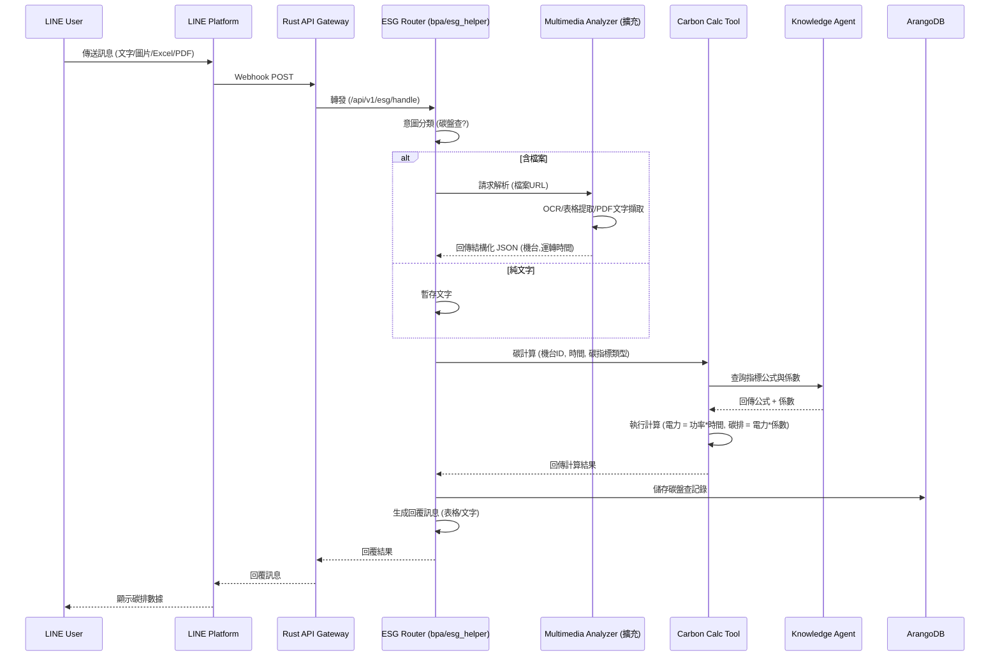

# 開發規格書：ESG小幫手

| 項目     | 內容                  |
| -------- | --------------------- |
| Agent    | ESG小幫手             |
| 版本     | v1.0                  |
| 提交者   | admin                 |
| 提交時間 | 2026/5/16 上午8:54:35 |

## 需求目標

協助使用者，使用者用LINE等通信軟件，以文字、圖片、excel、pdf 呈報資料。並且解析這些資料成一份碳盤查資料，形成可申報的碳指標申報數據（IFAS）

## 預期效果

按不同的碳指標，計算不同的碳指標

## 問題描述

前端各單位，呈報機台運轉時間，需要計算電力使用或碳碳排數據

## AI 審查

- **評分**：85 分
- **信心度**：high
- **預估總工時**：40h
- **工時明細**：
  - 顧問訪談：5h
  - 核心開發：20h
  - 測試品保：10h
  - 審查上線：5h
- **摘要**：建立AI Agent自動解析企業呈報資料並計算碳指標，生成IFAS申報數據。

## 開發建議

> 建立「ESG小幫手」AI Agent，整合LINE通訊平台，讓前端單位透過LINE上傳機台運轉時間、圖片、Excel或PDF文件，系統自動解析擷取數據，依不同碳指標（如電力使用、碳排放）計算出符合IFAS申報格式的碳盤查資料，並將結果持久化以供後續查詢與申報。

### 建議技術棧

- Rust API Gateway (port 6500) — 認證與路由
- Python FastAPI (unified_agents) — ESG小幫手服務
- LINE Messaging API (已有 LINE 平台整合) — 接收用戶訊息
- tools/multimedia_analyzer (需擴充 Excel/PDF 解析) — 多媒體與文件解析
- ai-services/shared/tools/ (ToolRegistry) — 註冊碳計算工具
- ai-services/shared/orchestration/ (LangGraph) — 任務編排
- ai-services/shared/conversation/ — 多輪對話歷史持久化
- ai-services/knowledge_agent/ (HybridRAG) — 碳指標定義與公式檢索
- ai-services/memory_agent/ — 工作記憶暫存
- ArangoDB (集合: esg_carbon_records, esg_emission_factors, esg_indicator_definitions) — 碳排紀錄、排放係數、指標定義
- Qdrant — 碳指標語意檢索 (與 Knowledge Agent 共用)
- Python: pandas, PyMuPDF, openpyxl — 文件解析

### 碳排指標定義（範疇一／二／三）

依據 ISO 14064-1 及 GHG Protocol 標準，系統支援以下三大範疇的碳排放計算：

#### 範疇二（Scope 2）— 間接能源排放（本系統核心）

| 指標 | 單位 | 說明 | 參考係數（台灣） |
|------|------|------|-----------------|
| ⚡ **用電** | kg CO₂e/kWh | 台電購入電力，依時段/季節係數不同 | ~0.495 (2023 台電公告) |
| 🔥 **熱能源** | kg CO₂e/MJ | 購買蒸汽、熱水或區域供熱 | 依能源種類而異 |
| 💧 **用水** | kg CO₂e/m³ | 自來水供應 + 污水處理 | ~0.195 (台水+污水) |

#### 範疇一（Scope 1）— 直接排放（可擴充）

| 指標 | 單位 | 說明 |
|------|------|------|
| 🛢️ **燃油** | kg CO₂e/公升 | 柴油、汽油（機台/車輛/發電機） |
| 🔥 **天然氣** | kg CO₂e/m³ | 鍋爐、燃燒設備 |
| ❄️ **冷媒逸散** | kg CO₂e/kg | 空調/冰水機冷媒洩漏（GWP 極高） |

#### 範疇三（Scope 3）— 其他間接排放（可擴充）

| 指標 | 單位 | 說明 |
|------|------|------|
| 🗑️ **廢棄物** | kg CO₂e/噸 | 一般廢棄物、事業廢棄物處理 |
| ✈️ **商務旅行** | kg CO₂e/km | 員工差旅（高鐵、飛機） |
| 🚌 **員工通勤** | kg CO₂e/人公里 | 員工上下班交通 |

### 排放係數換算表（ArangoDB: esg_emission_factors）

系統核心的換算基準表，由管理員在「ISO/IFAS 標準對照管理」頁面維護：

```
esg_emission_factors 集合結構:
├── _key: "tw_electricity_2023"
├── source_type: "electricity" | "heat" | "water" | "fuel_diesel" | "fuel_gasoline" | "natural_gas" | "refrigerant" | "waste" | "transport_air" | "transport_rail"
├── source_name: "台電2023全國電力排放係數"
├── category: "scope1" | "scope2" | "scope3"
├── unit: "kWh" | "MJ" | "m³" | "liter" | "kg" | "ton" | "km"
├── co2_factor: 0.495          (kg CO₂/單位)
├── ch4_factor: 0.00002        (kg CH₄/單位，部分標準要求拆開)
├── n2o_factor: 0.00001        (kg N₂O/單位)
├── gwp_total: 0.495           (kg CO₂e/單位，含 GWP 加權)
├── standard_ref: "IPCC 2021" | "台灣環境部2023" | "ISO 14064"
├── region: "TW" | "JP" | "GLOBAL"
├── valid_from: "2024-01-01"
├── valid_until: null          (null = 目前仍有效)
├── notes: "2023年台電公告係數"
└── status: "active" | "deprecated"
```

計算公式範例：
```
碳排量 (kg CO₂e) = 活動數據 × 排放係數 (gwp_total)

範例：用電 1000 kWh × 0.495 kg CO₂e/kWh = 495 kg CO₂e
範例：用水 50 m³ × 0.195 kg CO₂e/m³ = 9.75 kg CO₂e
```

### ISO/IFAS 標準對照表

| 標準 | 全名 | 用途 | 適用於 ESG 小幫手 |
|------|------|------|------------------|
| **ISO 14064-1** | 組織層級溫室氣體盤查 | 公司整體碳排計算與報告 | ✅ 主要遵循標準 |
| **ISO 14064-2** | 專案層級減量 | 特定減碳專案的碳權計算 | ⏳ 未來擴充 |
| **ISO 14067** | 產品碳足跡 | 單一產品的碳排放 | ⏳ 未來擴充 |
| **GHG Protocol** | 溫室氣體盤查議定書 | WRI/WBCSD 發布，國際最通用 | ✅ 範疇分類依據 |
| **ISO 14069** | 組織碳足跡計算方法 | ISO 14064-1 的實施指南 | ✅ 輔助參考 |
| **IFAS** | 產業碳足跡資訊系統 | 台灣環境部申報平台 | ✅ 最終申報目標 |
| **環保署/環境部** | 溫室氣體排放係數 | 台灣官方排放係數資料库 | ✅ 係數主要來源 |

### 收集記錄（ArangoDB: esg_carbon_records）

使用者每筆呈報產生的碳排記錄：

```
esg_carbon_records 集合結構:
├── _key: auto-generated
├── submitted_by: "user_line_id"
├── submitted_at: "2026-05-16T10:00:00Z"
├── source_type: "electricity" | "heat" | "water" | "fuel" | ...
├── source_description: "3號機台 5月用電"
├── raw_data: { 原始呈報資料（文字/檔案解析結果） }
├── activity_value: 1000        (活動數據數值)
├── activity_unit: "kWh"        (活動數據單位)
├── emission_factor_ref: "tw_electricity_2023"  (對應的係數_key)
├── co2_kg: 495.0
├── ch4_kg: 0.02
├── n2o_kg: 0.01
├── total_co2e_kg: 495.0        (CO₂e 合計)
├── scope: "scope2"
├── status: "draft" | "confirmed" | "submitted_ifas"
├── ifas_submission_id: null    (IFAS 申報編號，提交後填入)
├── attachments: ["file_key_1", "file_key_2"]
└── notes: "user 補充說明"
```

### 模組規劃

| 模組                                               | 說明                                                                                                                                                                                                                                                                                    | 優先級 |
| -------------------------------------------------- | --------------------------------------------------------------------------------------------------------------------------------------------------------------------------------------------------------------------------------------------------------------------------------------- | ------ |
| ESG小幫手 Agent (bpa/esg_helper/)                  | 核心服務，包含 router.py (LINE webhook 路由、意圖分類、LLM 呼叫)、agent.py (碳計算與工作流程)、config.py (環境變數與 System Prompt)、main.py (獨立入口掛載到 unified_agents)、graph/ (LangGraph 節點，選用)。接收 LINE 訊息，判斷是否為碳盤查相關，調用文件解析與碳計算邏輯，回覆結果。 | high   |
| 碳計算工具模組 (shared/tools/carbon_calc/)         | 基於 ToolRegistry 框架，提供統一的碳指標計算接口。支援依機台類型、運轉時間、功率等參數計算電力消耗與碳排放量，並可透過 Knowledge Agent 動態載入最新計算公式與排放係數。                                                                                                                 | high   |
| 文件解析擴充 (tools/multimedia_analyzer/excel_pdf) | 擴展現有多媒體解析器，加入 Excel (.xlsx) 與 PDF 文件解析能力。輸出結構化 JSON (欄位: 機台ID, 運轉時間, 日期, 備註等)，供 ESG 小幫手後續碳計算使用。                                                                                                                                     | medium |
| 排放係數管理後台 (ESGStandards page)                | 管理 `esg_emission_factors` 集合，管理員可 CRUD 各類排放係數，對照 ISO/IFAS 標準，設定有效期間。                                                                                                                                                                                        | high   |
| 碳排收集記錄後台 (ESGRecords page)                  | 瀏覽、查詢、匯出 `esg_carbon_records` 集合，支援 IFAS 申報格式匯出。                                                                                                                                                                                                                    | high   |
| 碳盤查記錄資料模型 (ArangoDB 集合設計)             | 定義 esg_carbon_records (用戶提交原始資料、解析結果、計算結果、碳指標類型、狀態)、esg_emission_factors (排放係數換算表)與 esg_indicator_definitions (碳指標名稱、計算公式、排放係數、適用範圍) 三個集合，並透過 system_params 管理預設係數。                                              | medium |
| 碳指標知識庫匯入                                   | 將 IFAS 碳指標定義、計算公式、排放係數等知識匯入 Knowledge Agent 的向量與圖譜，供小幫手在推理時即時檢索。                                                                                                                                                                               | low    |

### 資料來源

- ArangoDB: esg_carbon_records (碳排申報記錄)
- ArangoDB: esg_emission_factors (排放係數換算表)
- ArangoDB: esg_indicator_definitions (碳指標與計算公式)
- ArangoDB: system_params (排放係數、預設功率等全域參數)
- Knowledge Agent HybridRAG 索引 (碳指標領域知識)
- LINE API (用戶上傳的圖片、Excel、PDF 原始檔案)

### 整合點

- Rust API Gateway (路由 `/api/v1/esg/` 至 ESG 小幫手服務)
- LINE 平台整合 (webhook 轉發至 ESG 小幫手 router)
- multimedia_analyzer (PPT/Excel/PDF 解析，透過 MCP 或 HTTP 呼叫)
- Knowledge Agent (via `/ka/hybrid/search` 取得碳指標計算公式)
- Memory Agent (保存當前工作上下文與會話狀態)
- Shared Conversation (bot_chat_sessions 多輪對話持久化)

### 工時評估

| 階段                  | 工時          |
| --------------------- | ------------- |
| 🔍 顧問訪談與需求釐清 | 5h            |
| 💻 核心開發與整合     | 10h           |
| 🧪 測試與品質保證     | 5h            |
| ✅ 審查與上線準備     | 3h            |
| **合計**        | **23h** |

## 系統架構圖

```mermaid
graph TB
    subgraph "LINE 用戶"
        LINE[LINE Client]
    end
    subgraph "AIBox 系統 [已有]"
        GW[Rust API Gateway :6500]
        LINE_Platform[LINE Platform Integration]
        MM[Multimedia Analyzer]
        KA[Knowledge Agent (HybridRAG)]
        MA[Memory Agent]
        SC[Shared Conversation]
        AR[ArangoDB]
        QD[Qdrant]
    end
    subgraph "[新增] ESG 小幫手模組"
        ESG_Router["bpa/esg_helper/router.py"]
        ESG_Agent["agent.py (碳計算流程)"]
        ESG_Graph["graph/ (LangGraph 節點)"]
        CC_Tool["shared/tools/carbon_calc/"]
    end
    subgraph "[新增] 文件解析擴充"
        EXCEL_PDF["multimedia_analyzer/excel_pdf 擴充"]
    end
    subgraph "[新增] ESG 管理後台"
        EF_MGMT["排放係數管理 (ESGStandards)"]
        CR_MGMT["收集記錄管理 (ESGRecords)"]
    end
    LINE -- LINE Bot webhook --> LINE_Platform
    LINE_Platform -- HTTP POST --> ESG_Router
    ESG_Router -- 呼叫解決方案 --> ESG_Agent
    ESG_Agent -- 調用文件解析 --> MM
    MM -. 擴充能力 .-> EXCEL_PDF
    ESG_Agent -- 碳計算 --> CC_Tool
    CC_Tool -- 查詢公式 --> KA
    CC_Tool -- 讀取係數 --> AR
    ESG_Agent -- 持久化對話 --> SC
    ESG_Agent -- 讀寫工作記憶 --> MA
    ESG_Router -- 回覆訊息 --> LINE_Platform
    ESG_Agent -- 記錄碳排資料 --> AR
    KA -- 語意檢索 --> QD
    GW -- 驗證/路由 --> ESG_Router
    EF_MGMT -- CRUD 排放係數 --> AR
    CR_MGMT -- 讀取碳排記錄 --> AR
```

## 資料流程圖



### 潛在風險

- ⚠️ Excel/PDF 解析擴充需自行開發，目前 Multimedia Analyzer 僅支援圖片/影片/音訊，需新增對應的文件 parser，且可能遇到格式相容性問題（如加密PDF、合併儲存格等）
- ⚠️ 碳指標計算公式與排放係數需領域專家提供，若無標準化規則，可能導致計算結果不準確，需納入顧問驗證
- ⚠️ LINE 檔案大小限制 (10MB) 可能影響大型 Excel/PDF 上傳，需考慮分片或提示用戶壓縮
- ⚠️ 若用戶同時上傳多個檔案，需設計任務佇列避免阻塞
- ⚠️ 排放係數會隨年份/政策更新，需建立係數版本管理機制

### 開發建議

- 💡 Phase 1 僅實作 LINE 整合，未來可透過工具市集擴展 WhatsApp、Dingtalk 等其他通訊平台
- 💡 排放係數管理後台應支援 CSV 匯入（例如從環境部網站下載的係數表可直接匯入）
- 💡 碳排記錄後台應支援 IFAS 格式匯出（CSV/JSON/PDF）
- 💡 建議開發一組碳計算測試用例（含邊界條件），確保計算邏輯正確性
- 💡 碳排記錄可設計為唯讀申報資料，後續可串接外部申報系統或報表匯出功能
- 💡 可考慮在 LLM 對話中加入「碳盤查進度查詢」與「歷史記錄回顧」功能，提升使用者體驗
