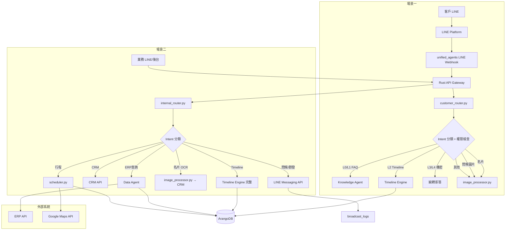
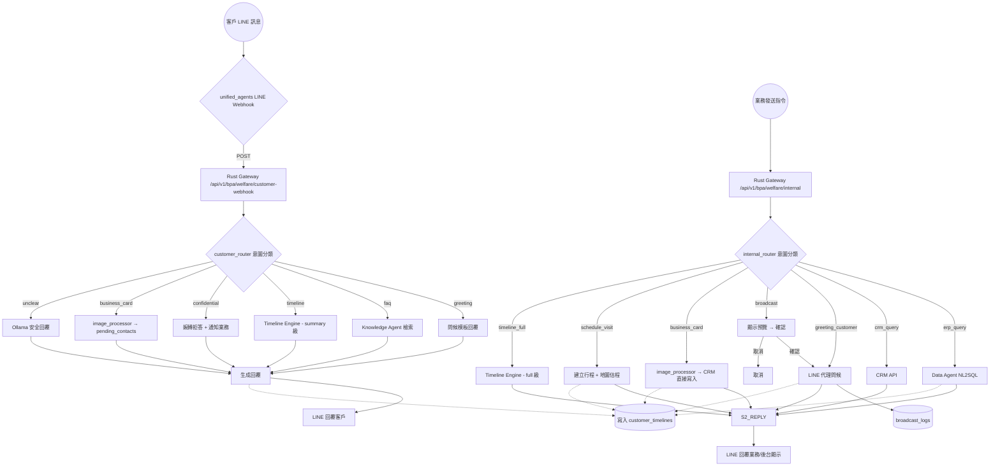

# 開發規格書：福祉業務小秘

| 項目     | 內容                  |
| -------- | --------------------- |
| Agent    | 福祉業務小秘          |
| 版本     | v2.0                  |
| 提交者   | system                |
| 提交時間 | 2026/6/14 下午2:05:16 |

---

## 一、概述

福祉業務小秘是一個雙場景 BPA Agent，同時服務**外部客戶**與**內部業務人員**，透過 LINE 平台提供業務溝通與日常工作協助。

### 雙場景定義

| | 場景一：客戶端 LINE Bot | 場景二：內部工作助理 |
|---|---|---|
| **使用者** | 客戶（外部） | 業務人員（內部） |
| **互動管道** | 客戶個人 LINE ←→ 福祉業務小秘官方 LINE 帳號 | 業務個人 LINE/網頁後台 ←→ 福祉業務小秘 |
| **加入方式** | 業務分享官方 LINE 給客戶加入好友 | 業務直接開啟聊天/後台 |
| **資訊權限** | ⛔ 不可接觸 ERP 明細（金額、數量、成本） | ✅ 可查詢 ERP/CRM 完整資料 |
| **互動發起** | 客戶主動發訊 | 業務主動發訊或系統排程觸發 |
| **自主性** | 有限度：僅回覆授權範圍，機密婉轉拒答 | 較高：可執行業務操作 |

---

## 二、場景一：客戶端 LINE Bot 功能規格

### 2.1 功能列表

| 功能 | 說明 | 資料需求 | 權限限制 |
|------|------|---------|---------|
| **日常問候回應** | 自動回覆早安、節日祝賀、天氣提醒等 | 無 | 無 |
| **業務問題應答** | 回答產品/服務一般性問題（FAQ 級別） | Knowledge Agent（FAQ） | 僅回覆知識庫內容，不涉及客戶特定資料 |
| **Timeline 查詢** | 客戶查詢自己與福祉的互動歷史摘要 | Timeline Store（限該客戶） | 僅回傳摘要（時間、事件類型），不含金額/數量等明細 |
| **機密資訊拒答** | 當客戶詢問報價金額、訂單成本、合約細節等 | — | 婉轉告知「已轉達業務，將由業務直接回覆」 |
| **名片收藏** | 客戶傳送名片圖片 → OCR 掃描 → 暫存待業務確認 | `pending_contacts` 集合 | 僅儲存，不回傳給客戶 |

### 2.2 Intent 分類表（場景一）

```
客戶訊息 → intent_classifier（customer_router.py）
  │
  ├── greeting        → CustomerGreetingSkill（模板 + LLM 個人化）
  ├── greeting_image  → image_processor.handle_greeting()
  ├── faq_question    → Knowledge Agent FAQ 檢索
  ├── timeline_query  → Timeline Engine（summary 級）
  ├── confidential_q  → 婉轉拒答模板 → BusinessNotificationSkill（通知業務）
  ├── business_card   → image_processor.handle_business_card()
  └── unclear         → CustomerSafeReplySkill（LLM + L0-L4 攔截）
```

| Intent | 對應 Skill / Action | 負責模組 | 實作方式 |
|:------:|---------------------|----------|---------|
| `greeting` | **CustomerGreetingSkill** | customer_router.py | 查詢 CRM 客戶職稱 → 決定尊稱 → LLM 生成個人化問候（model: qwen3, temp:0.7, max_tokens:256） |
| `greeting_image` | **image_processor.handle_greeting** | image_processor.py | qwen3-vl 分析圖片 → LLM 生成問候回覆 |
| `faq_question` | **KnowledgeAgentSkill** | Knowledge Agent（既有） | 向量檢索 FAQ → 回覆 |
| `timeline_query` | **TimelineQuerySkill（summary）** | timeline.py | 查詢 customer_timelines → 僅回傳摘要 |
| `confidential_q` | **SafeRejectSkill** → **BusinessNotificationSkill** | customer_router.py | rule-based 攔截 → 婉轉拒答模板 → 非同步通知業務 LINE |
| `business_card` | **image_processor.handle_business_card** | image_processor.py | qwen3-vl OCR → JSON 驗證 → pending_contacts |
| `unclear` | **CustomerSafeReplySkill** | customer_router.py | LLM 生成回覆（system prompt 嵌入 L0-L4 規則，model: qwen3, temp:0.3） |

### 2.3 資訊分級與安全規則

| 分級 | 定義 | 範例 | 可否回覆 |
|:----:|------|------|:--------:|
| L0 | 公開資訊 | 產品介紹、服務項目、營業時間 | ✅ 可直接回覆 |
| L1 | FAQ | 常見問題、使用說明 | ✅ Knowledge Agent |
| L2 | 互動摘要 | Timeline 時間/類型/摘要 | ✅ 僅摘要，無明細 |
| L3 | 機密明細 | 報價金額、訂單成本、合約條款 | ❌ 婉轉拒答 |
| L4 | 內部操作 | 下單、改單、取消訂單 | ❌ 婉轉拒答 |

**實作方式**：System prompt 中嵌入分級規則 + intent_classifier 在 L3/L4 觸發時直接攔截（rule-based，不經 LLM，避免 jailbreak）。

---

## 三、場景二：內部工作助理 功能規格

### 3.1 功能列表

| 功能 | 說明 | 資料需求 | 觸發方式 | 對應 Skill / Action | 負責模組 |
|------|------|---------|---------|---------------------|----------|
| **代理客戶問候** | 代替業務傳送問候/節日祝福給客戶 | 客戶清單 + 問候模板 | 業務手動發起 or 排程自動 | **ManualGreetingSkill**（手動）/ **ScheduledGreetingSkill**（排程） | internal_router.py / scheduler.py |
| **群發訊息** | 文字公告、產品宣傳（含圖片/連結） | 客戶分群清單 + 素材庫 | 業務手動發起（需確認） | **BroadcastSkill** | push_engine.py |
| **ERP 查詢** | 查詢報價、訂單、出貨狀態 | Data Agent（NL2SQL） | 業務提問 | **ErpQuerySkill** | Data Agent（既有） |
| **CRM 查詢** | 查詢客戶詳情、聯絡人資訊 | `crm_customers` + `crm_contacts` | 業務提問 | **CrmQuerySkill**（直接查詢 ArangoDB） | internal_router.py（CRUD API） |
| **名片掃描** | 業務收到名片 → OCR → CRM 寫入 | `crm_contacts` | 業務傳送圖片 | **image_processor.handle_business_card**（場景二模式） | image_processor.py |
| **行程安排** | 記錄拜訪日期/地點/客戶 → 估程 → 提醒 | 客戶地址 + 地圖 API | 業務輸入 | **VisitPlanSkill** | scheduler.py |
| **Timeline 整理** | 自動彙整 ERP + LINE 互動記錄 | Timeline Engine（完整權限） | 每次互動自動更新 | **TimelineWriteSkill**（寫入）/ **TimelineQuerySkill（full）** | timeline.py |

### 3.2 功能細項說明

#### 3.2.1 代理客戶問候

```
業務指令：「幫我發早安問候給所有客戶」
  → 讀取 active_customers 清單
  → 逐一生成個人化問候（含客戶名稱）
  → 透過 LINE Messaging API 傳送
  → 記錄至 timeline（event_type: greeting_sent）
```

- 支援**定期排程**（每天早上 8:00 自動問候活躍客戶）
- 支援**不定期手動**（節日、促銷、特定事件）
- 問候模板從 `system_params` 讀取，可後台編輯

#### 3.2.2 群發訊息

```
業務指令：「群發下週促銷活動給 VIP 客戶」
  → 讀取 VIP 客戶分群
  → 附加圖文宣傳素材
  → 顯示預覽 + 確認 → 發送
  → 記錄至 timeline + broadcast_logs
```

- 發送前需**業務確認預覽**（不可直接廣播）
- 附帶頻率限制（同一客戶 24h 內最多 1 則）
- 記錄每筆發送狀態（成功/失敗/已讀）

#### 3.2.3 行程安排

```
業務輸入：「下週三下午拜訪台北客戶陳先生」
  → 查詢客戶地址
  → 地圖 API 估算路程與時間
  → 建立 visit_plan 記錄
  → 設定行程提醒（當天早上 LINE 通知）
```

- `visit_plans` 集合：`{ customer_id, visit_date, location, estimated_travel_min, status, notes, reminder_sent }`
- 支援檢視：日曆視圖、客戶地圖、待辦列表

---

## 四、Intent 分類引擎與 Skills 對照

### 4.1 Intent 分類機制

兩個場景共用分類模式，但分類邏輯與權限不同：

```
統一入口 router.py
  │
  ├── 請求來源 = LINE Webhook → customer_router.py
  │     └── intent_classifier (rule-based 關鍵字 + LLM 補償)
  │          使用 intent_catalog + NL 比對
  │
  └── 請求來源 = 內部 API Token → internal_router.py
        └── intent_classifier (LLM 為主 + 關鍵字輔助)
             使用 intent_catalog + NL 比對（無權限限制）
```

| 項目 | customer_router.py | internal_router.py |
|------|-------------------|-------------------|
| **分類方式** | rule-based 關鍵字優先 → LLM 補償（低溫 0.1） | LLM 全分類（temp 0.3） |
| **比對來源** | `intent_catalog` collection + 敏感性關鍵字黑名單 | `intent_catalog` collection |
| **L3/L4 攔截** | rule-based（不經 LLM，防 jailbreak） | 無需攔截 |
| **fallback** | CustomerSafeReplySkill（LLM + 權限限制） | 回傳「無法處理，請稍後再試」 |

### 4.2 Skills / Actions 完整對照表

#### 場景一 Skills

| Skill 名稱 | Intent 觸發 | 模組/函式 | 實作摘要 |
|-----------|------------|----------|---------|
| **CustomerGreetingSkill** | `greeting` | customer_router.py 內置 | 查詢 CRM 客戶職稱 → 決定尊稱 → LLM 生成個人化問候（qwen3, temp:0.7, max_tokens:256） |
| **ImageGreetingSkill** | `greeting_image` | image_processor.handle_greeting() | qwen3-vl 分析 → LLM 生成問候 |
| **KnowledgeAgentSkill** | `faq_question` | Knowledge Agent（既有） | 向量檢索 FAQ |
| **TimelineQuerySkill(summary)** | `timeline_query` | timeline.py | customer_timelines 查詢 → 摘要回傳 |
| **SafeRejectSkill** | `confidential_q` | customer_router.py 內置 | 關鍵字黑名單攔截 → 婉轉拒答模板 |
| **BusinessNotificationSkill** | SafeRejectSkill 觸發 | customer_router.py → LINE Messaging API | **非同步 LINE 通知業務**：「客户xxx 詢問了報價金額，已依權限婉轉回覆」 |
| **CardReceiveSkill** | `business_card` | image_processor.handle_business_card() | qwen3-vl OCR → JSON → pending_contacts |
| **CustomerSafeReplySkill** | `unclear` | customer_router.py 內置 | LLM 生成（system prompt 含 L0-L4 規則, qwen3, temp:0.3） |

#### 場景二 Skills

| Skill 名稱 | Intent 觸發 | 模組/函式 | 實作摘要 |
|-----------|------------|----------|---------|
| **ManualGreetingSkill** | 業務手動指令 | internal_router.py → scheduler.py | 即時讀取客戶清單 → 逐一 push |
| **ScheduledGreetingSkill** | 排程觸發 | scheduler.py（排程引擎） | Cron 觸發 → 讀取 greeting_templates → 建立 broadcast_task |
| **BroadcastSkill** | 業務群發指令 | push_engine.py | 預覽 → 確認 → 逐筆 push → broadcast_recipients |
| **ErpQuerySkill** | `erp_query` | Data Agent（NL2SQL） | 既有服務 |
| **CrmQuerySkill** | `crm_query` | internal_router.py 直接查 | 直接呼叫 ArangoDB `crm_customers` + `crm_contacts` CRUD API |
| **CardSaveSkill** | `business_card` | image_processor.handle_business_card()（場景二模式） | qwen3-vl OCR → JSON → crm_contacts 直接寫入 |
| **VisitPlanSkill** | `schedule_visit` | scheduler.py | 地圖估程 → visit_plans → 提醒設定 |
| **RagicPollSkill** | 排程觸發 | ragic_poller.py | 輪巡 6 張 Ragic 表 → 比對客戶 → 寫入 customer_timelines（ref_key 去重） |
| **RagicManualSyncSkill** | 業務手動 | ragic_poller.py | 即時同步單一客戶/表單 |
| **TimelineWriteSkill** | 各功能觸發 | timeline.py | events 寫入 customer_timelines |
| **TimelineQuerySkill(full)** | `timeline_full` | timeline.py | 完整 events 回傳 |

### 4.3 BusinessNotificationSkill — 機密拒答通知業務

當場景一攔截到 L3/L4 機密問題時，婉轉回覆客戶後，需要非同步通知對應業務人員：

```
SafeRejectSkill 觸發
    │
    ▼
查詢該客戶對應的業務 LINE ID（from crm_customers.business_line_id）
    │
    ▼
透過 LINE Messaging API push 訊息給業務：
  「[福祉業務小秘通知] 客戶 陳先生 剛剛詢問了『報價金額』，
   已依權限設定婉轉回覆。如需跟進請與客戶聯繫。」
    │
    ▼
寫入 customer_timelines（event_type: confidential_blocked）
```

- 優先使用 LINE push 通知（業務有加福祉 Bot 好友）
- 若業務無 LINE ID，暫存待後台查閱
- 通知模板從 `system_params` 讀取

### 4.4 CustomerGreetingSkill — 個人化問候尊稱邏輯

問候客戶時，根據 CRM 中的客戶職稱決定對應的尊稱，若無職稱則使用通用尊稱。

```
客戶發送問候（早安/節日快樂）
    │
    ▼
CustomerGreetingSkill 執行：
    │
    ├── 1. 查詢客戶資料（from crm_contacts）
    │     SELECT title, name FROM crm_contacts WHERE line_user_id = @id
    │
    ├── 2. 依據職稱決定尊稱：
    │
    │     ┌────────────┬──────────────────┐
    │     │ CRM title  │ 尊稱             │
    │     ├────────────┼──────────────────┤
    │     │ 董事長      │ 董事長           │
    │     │ 總經理      │ 總經理           │
    │     │ 經理        │ 經理             │
    │     │ 副理        │ 副理             │
    │     │ 主任        │ 主任             │
    │     │ 組長        │ 組長             │
    │     │ 教授/博士   │ 教授/博士        │
    │     │ 先生        │ 先生             │
    │     │ 小姐        │ 小姐             │
    │     │ 女士        │ 女士             │
    │     │ null / 空白 │ 尊敬的客戶       │
    │     └────────────┴──────────────────┘
    │
    ├── 3. 生成個人化問候
    │     模板：「{{尊稱}} {{name}}，早安！{{LLM 生成後續問候}}」
    │     例如：「陳董事長，早安！祝您今天事業順利，心想事成。」
    │     例如：「尊敬的客戶，早安！祝您有美好的一天。」
    │
    └── 4. 寫入 timeline（event_type: greeting_sent）
          { customer_id, summary: "早安問候 - 陳董事長" }
```

**尊稱對應表**儲存在 `system_params`（key: `greeting.honorific_map`），可後台編輯擴充。預設提供以上 10 種常見職稱對應。

## 五、Timeline Engine（跨場景核心）

### 5.1 說明

Timeline Engine 是兩個場景共用的核心模組，負責彙整客戶與福祉的所有互動記錄，提供統一的查詢介面。

### 5.2 資料來源

| 來源 | 內容 | 更新時機 |
|------|------|---------|
| **Ragic ERP（6 張表）** | 報價、訂單、銷貨、退貨、折讓 | **定時輪巡（每 15 分鐘，由 ragic_poller.py 執行）** |
| LINE Bot（場景一） | 客戶問候、FAQ 查詢、名片提交 | 即時寫入 |
| 內部助理（場景二） | 代理問候、群發、行程拜訪 | 即時寫入 |
| CRM | 聯絡人建立/更新 | 即時寫入 |

### 5.3 Timeline Store 資料結構（ArangoDB 新集合：`customer_timelines`）

```json
{
  "_key": "uuid",
  "customer_id": "crm_contact_key",
  "customer_name": "陳先生",
  "events": [
    {
      "event_id": "uuid",
      "event_type": "quote_analysis | inquiry_sent | order_placed | shipment_delivered | return_processed | credit_note_issued | greeting_sent | faq_answered | visit_completed | broadcast_sent | business_card_received | confidential_blocked | image_shared",
      "summary": "2026/06/10 報價#Q-2026-0089 輪椅輔具一批",
      "timestamp": "2026-06-10T14:30:00Z",
      "source": "erp | line_bot | internal_assistant | crm",
      "detail_level": "summary | full",
      "ref_key": "單據號碼 or LINE_msg_key",
      "metadata": {}
    }
  ],
  "last_updated": "2026-06-14T10:00:00Z"
}
```

### 5.4 Timeline Query API

```
GET /api/v1/customer/{customer_id}/timeline?level=summary|full&from=&to=&limit=50

→ 場景一（客戶端）: level=summary 強制，不過濾明細
→ 場景二（內部）: level=full，回傳完整 events
```

權限控制由 Rust Gateway middleware 實作：根據請求來源（LINE Webhook vs 內部 API Token）決定回傳 level。

### 5.5 RagicERP Poller Skill — ERP 活動輪巡與 Timeline 寫入

RagicERP Poller 是一個排程技能，定期輪巡 Ragic 的 6 張業務表單，將客戶活動摘要寫入 `customer_timelines`。

**完整規格參照**：`.docs/Spec/系統開發/05-客戶timeline-活動整理.md`

#### 輪巡表單與摘要規則

| # | Ragic 表 | event_type | 客戶比對 | 摘要模板 |
|:-:|:---------|:----------:|:--------:|---------|
| 1 | 報價分析 `order-operation/11` | `quote_analysis` | 客戶全稱 | `報價#{訂購單編號} {客戶全稱} — {狀態}` |
| 5 | 訂購憑單 `order-operation/4` | `order_placed` | 客戶全稱 | `訂單#{單據號碼} {客戶全稱} — {業務人員} ${未稅合計}` |
| 6 | 銷貨憑單 `inventory-management/2` | `shipment_delivered` | 客戶全稱 | `銷貨#{單據號碼} {客戶全稱} — {車牌號碼}` |
| 7 | 銷貨退回 `inventory-management/4` | `return_processed` | (客戶全稱) | `退貨#{單據號碼} {客戶全稱} ${未稅合計} — {備註}` |
| 8 | 銷項折讓 `inventory-management/6` | `credit_note_issued` | (客戶全稱) | `折讓#{單據號碼} {客戶全稱} — 原銷貨#{原銷貨單}` |
| 4 | 詢價憑單 `order-operation/32` | `inquiry_sent` | ❌ 無客戶欄位 | 暫跳過 |

#### Skills 對照

| Skill 名稱 | Intent 觸發 | 模組/函式 | 實作摘要 |
|-----------|------------|----------|---------|
| **RagicPollSkill** | 排程觸發（每 N 分鐘） | ragic_poller.py | 輪巡 6 張 Ragic 表，比對客戶，寫入 customer_timelines |
| **RagicManualSyncSkill** | 業務手動觸發 | ragic_poller.py | 立即同步單一客戶或單一表單 |

#### 模組位置

```
ai-services/bpa/welfare_secretary/
└── ragic_poller.py    ← 新增
    ├── poll_all()        排程進入點
    ├── poll_table()      單表查詢 + 比對 + 寫入
    ├── _match_customer() 客戶名稱模糊比對
    ├── _build_summary()  依 event_type 產生摘要
    └── _write_timeline() 寫入 customer_timelines（含 ref_key 去重）
```

#### 增量輪巡邏輯

```
每張表輪巡時：
  1. 查詢最近 N 天的記錄（以日期欄位過濾）
  2. 每筆記錄：
     a. 取出客戶名稱 → 比對 crm_contacts
     b. 取出單據號碼 → 檢查 customer_timelines 是否已有此 ref_key
     c. 無重複 → 建立 timeline event
  3. 記錄 last_polled_at（per table）
```

#### 與 scheduler.py 的關係

```
scheduler.py（每 30 秒輪詢）
  └── 檢查 ragic_poller 排程（例如：每 15 分鐘執行一次）
       └── ragic_poller.poll_all()
            ├── order-operation/11 → 比對客戶 → 寫入 timeline
            ├── order-operation/4  → 比對客戶 → 寫入 timeline
            ├── inventory-management/2 → 比對客戶 → 寫入 timeline
            ├── inventory-management/4 → 比對客戶 → 寫入 timeline
            └── inventory-management/6 → 比對客戶 → 寫入 timeline
```

---

## 六、資料架構（完整集合清單）

### 6.1 既有集合（直接使用）

| 集合 | 用途 | 歸屬 |
|------|------|------|
| `agents` | Agent 定義與配置 | 原有 |
| `system_params` | LLM 配置、LINE Channel 設定、ERP 連線資訊 | 原有 |
| `crm_contacts` | 客戶聯絡人（與福祉 CRM 共用） | 原有 |
| `crm_customers` | 客戶基本資料 | 原有 |
| `chat_sessions` | Shared Conversation 對話歷史 | 原有 |
| `knowledge_roots/files` | FAQ / 產品知識庫 | 原有 |
| `todo_logs` | Timeline 可參照的任務記錄（選用） | 原有 |

### 6.2 新增集合

| 集合 | 用途 | 結構重點 |
|------|------|---------|
| **`customer_timelines`** | Timeline Engine 主儲存 | `{ _key, customer_id, events[], last_updated }` — 索引 `customer_id` |
| **`visit_plans`** | 行程安排 | `{ _key, customer_id, visit_date, location, estimated_travel_min, status (planned/done/cancelled), notes, reminder_sent, created_by, created_at }` — 索引 `customer_id+visit_date` |
| **`broadcast_logs`** | 群發記錄 | `{ _key, broadcast_id, template_id, target_count, success_count, fail_count, sent_at, created_by }` — 索引 `sent_at` |
| **`broadcast_recipients`** | 群發個別送達狀態 | `{ _key, broadcast_log_key, customer_id, status (sent/failed/read), error_msg }` — 索引 `broadcast_log_key` |
| **`pending_contacts`** | 場景一名片暫存（待業務確認） | `{ _key, customer_line_id, name, phone, company, photo_url, ocr_raw, status (pending/confirmed/rejected), confirmed_by, created_at }` — 索引 `status` |
| **`greeting_templates`** | 問候模板 | `{ _key, name, title, body_text, image_url, event_type (daily/holiday/promo), schedule_cron, enabled }` |

### 6.3 索引規劃

```rust
// db/mod.rs ensure_indexes 新增：
("customer_timelines", &["customer_id"]),
("visit_plans", &["customer_id", "visit_date"]),
("broadcast_logs", &["sent_at"]),
("broadcast_recipients", &["broadcast_log_key"]),
("pending_contacts", &["status"]),
```

---

## 七、影像處理管道（Image Processing Pipeline）

### 7.1 概述

影像處理管道負責處理兩個場景中所有圖片訊息（LINE 傳送的圖片），根據圖片類型分流至不同處理邏輯。底層重用 `shared/multimedia.py` 的 `analyze_image()` 與 `qwen3-vl:latest` 多模態模型。

### 7.2 流程

```
客戶/業務傳送圖片（LINE）
    │
    ▼
LINE Webhook → router.py 分流
    │
    ▼
image_processor.py
    │
    ├── 1. classify(image)
    │    │  prompt: "這張圖片是「問候」、「名片」還是「其他」？只回傳一個詞。"
    │    │  用 qwen3-vl 快速分類
    │    │
    │    ├── "greeting" ──→ handle_greeting()
    │    │
    │    ├── "business_card" ──→ handle_business_card()
    │    │
    │    └── "other" ──→ handle_other()
    │
    ├── 2. 所有路徑共用：
    │    ├── SeaweedFS 備份（重用 shared/multimedia.upload_to_seaweedfs）
    │    └── 寫入 customer_timelines
    │
    └── 3. 回傳結果給 router → LINE 回覆
```

### 7.3 三種處理邏輯

#### 7.3.1 handle_greeting — 問候圖片處理

```
輸入：客戶傳送的問候圖片（節日賀卡、早安圖等）
流程：
  1. analyze_image(content, prompt="請描述這張問候圖片的風格與氛圍")
  2. 將描述餵給 LLM（同一個 qwen3-vl）：
     prompt="根據以上描述，以{{客戶名稱}}的名義，生成一個溫暖禮貌的問候回覆"
  3. 回覆給客戶
  4. 寫入 timeline：event_type="greeting_received"
```

**回應規則**：LLM 生成的回覆需包含圖片中提到的節日/主題，語氣謙遜有禮。不涉及任何業務資訊。

#### 7.3.2 handle_business_card — 名片處理（核心）

```
輸入：客戶或業務傳送的名片圖片
流程：
  1. analyze_image(content, prompt="""請從這張名片中提取以下資訊，嚴格以 JSON 格式回傳：
     {
       "name": "姓名",
       "company": "公司名稱",
       "title": "職稱",
       "phone": "電話號碼",
       "email": "電子郵件",
       "address": "地址"
     }
     無法辨識的欄位設為 null。只回傳 JSON，不要其他文字。""")

  2. 後處理驗證：
     - json.loads() 解析
     - 檢查 name、phone、company 至少有一項不為 null
     - 若全部為 null → 回傳錯誤，請客戶重新拍攝

  3. 分流（根據來源）：
     ┌─ 場景一（客戶端）：
     │  寫入 pending_contacts（status: pending）
     │  寫入 customer_timelines（event_type: business_card_received）
     │  回覆客戶：「已收到您的名片資料，將轉交業務同仁確認後建檔」
     │
     └─ 場景二（業務端）：
        直接寫入 crm_contacts（status: active）
        寫入 customer_timelines（event_type: business_card_added）
        回覆業務：「名片已建檔完成」

  4. OCR 準確率補償：
     - qwen3-vl 可能誤讀中英混合文字
     - 場景二業務可直接在後台編輯修改
     - 場景一 pending_contacts 由業務確認後才正式建檔
```

#### 7.3.3 handle_other — 其他圖片摘要

```
輸入：非問候非名片的圖片（產品照片、文件翻拍、場景照等）
流程：
  1. analyze_image(content, default prompt)
  2. 生成圖片摘要
  3. 回覆摘要給發送者
  4. 寫入 timeline：event_type="image_shared"
```

### 7.4 既有資源 reuse

| 既有元件 | 位置 | 用途 |
|---------|------|------|
| `shared/multimedia.analyze_image()` | `ai-services/shared/multimedia.py` | 所有 Ollama vision 呼叫 |
| `shared/multimedia.upload_to_seaweedfs()` | 同上 | 圖片備份 |
| `MultimediaAnalyzerTool` | `ai-services/tools/multimedia_analyzer/` | 備用：可透過 ToolRegistry 呼叫 |
| `系統參數 VISION_MODEL` | env / system_params | 預設 `qwen3-vl:latest` |

### 7.5 模組位置

```
ai-services/bpa/welfare_secretary/
└── image_processor.py    ← 全部邏輯在此一個檔案
    ├── classify()
    ├── handle_greeting()
    ├── handle_business_card()
    ├── handle_other()
    └── _extract_card_json()  (共用函式)
```

| 模組 | 說明 | 優先級 | 場景 |
|------|------|:------:|:----:|
| `bpa/welfare_secretary/router.py` | 統一入口：根據請求來源（LINE Webhook / 內部 API）分流至對應 router | high | 共同 |
| `bpa/welfare_secretary/customer_router.py` | 場景一 Intent 分類 + 權限檢查 + 回覆生成 | high | S1 |
| `bpa/welfare_secretary/internal_router.py` | 場景二 Intent 分類 + 功能路由 | high | S2 |
| `bpa/welfare_secretary/timeline.py` | Timeline Engine：寫入 + 查詢（含 level 過濾） | high | 共同 |
| `bpa/welfare_secretary/image_processor.py` | **影像處理管道**：分類 + 問候回覆 + 名片 OCR → CRM + 摘要 | high | 共同 |
| `bpa/welfare_secretary/config.py` | 從 system_params 讀取所有配置，禁止 hardcode | high | 共同 |
| `bpa/welfare_secretary/main.py` | 獨立 FastAPI 入口，掛載 router 到 unified_agents | high | 共同 |
| `bpa/welfare_secretary/scheduler.py` | 排程引擎：定時問候、行程提醒、Ragic 輪巡觸發 | medium | S2 |
| `bpa/welfare_secretary/ragic_poller.py` | **Ragic ERP 輪巡**：6 張表查詢 → 客戶比對 → Timeline 寫入 | medium | 共同 |
| `bpa/welfare_secretary/graph/` | LangGraph 節點（選用：拜訪前準備等工作流） | medium | S2 |
| 前端後台設定頁 | React 頁面：管理權限、Timeline 查詢、問候模板編輯 | medium | 共同 |

---

## 八、系統架構圖（更新）



## 九、資料流程圖（更新）



---

## 十、Phase 劃分

### Phase 1a — Timeline Engine + 基礎建設（工時：8h）
- 建立 `customer_timelines` 集合
- Timeline Engine 讀寫 API（含 level 過濾）
- ERP 定時同步 Adapter
- config.py、main.py、router.py（分流架構）

### Phase 1b — 場景二核心（工時：14h）
- internal_router：ERP 查詢、Timeline 完整查詢
- **image_processor.py：問候處理 + 名片 OCR + 摘要（共用核心）**
- LINE Messaging API 整合（代理問候）

### Phase 1c — 場景一核心（工時：10h）
- customer_router：權限分級檢查
- Knowledge Agent FAQ 檢索
- Timeline 摘要查詢
- 婉轉拒答 + 通知業務機制
- **image_processor 場景一整合**

### Phase 2 — 進階功能（工時：10h）
- scheduler.py：定時問候、行程提醒
- 群發訊息（含 preview + log）
- visit_plans + 地圖估程
- 前端後台設定頁

---

## 十一、潛在風險

- ⚠️ ERP API 規格未明：影響 Phase 1a Timeline Engine 的同步 Adapter 開發
- ⚠️ 資訊分級誤判：若 intent_classifier 將 L3/L4 誤判為 L0/L1，可能洩露機密 → 需 rule-based 關鍵字攔截作為最後防線
- ⚠️ LINE 官方帳號申請/審核：場景一需要 LINE Official Account，審核時程不可控
- ⚠️ LINE Messaging API 群發頻率限制：Free plan 僅 500 則/月，需確認方案
- ⚠️ OCR 準確率：qwen3-vl 對中日英混合名片辨識率可能不足，場景一的 pending_contacts 機制可緩解
- ⚠️ 地圖 API 成本：Google Maps Distance Matrix API 為付費服務

## 十二、待釐清事項

- 🔍 ERP 系統名稱與 API 文件？
- 🔍 業務的 LINE ID 與 CRM 客戶如何匹配？
- 🔍 客戶的 LINE ID 如何與 CRM 聯絡人關聯？
- 🔍 LINE 官方帳號是否已申請？還是需要新申請？
- 🔍 群發頻率限制的商業方案？
- 🔍 名片 OCR 是否已有既有工具/服務？（或透過 Ollama 多模態模型？）
- 🔍 行程提醒要透過 LINE 還是其他方式？

---

## 十三、多用戶與平台適配架構

### 13.1 動機

福祉業務小秘需支援**多個業務員同時使用**，每個業務員有自己的 LINE 頻道，且未來可能擴展至 DingTalk、WhatsApp、WeCom 等其他平台。

設計目標：
- 一個 Agent 服務所有業務員，不需為每人部署獨立 Agent
- 資料按業務員隔離（客戶、對話、Timeline）
- 平台抽象化：新增平台不影響核心路由邏輯

### 13.2 帳號 ↔ 頻道 ↔ 客戶 關係

```
AIBox 使用者（accounts 管理）
  │
  ├── 王業務 (user_key: "user_a", role: "business")
  │     └── LINE 頻道 (channels._key: "ch_a", platform: "line")
  │           ├── 客戶 A-001（陳董）→ crm_contacts.owner_key = "user_a"
  │           ├── 客戶 A-002（林經理）→ crm_contacts.owner_key = "user_a"
  │           └── pending_contacts → pending_contacts.owner_key = "user_a"
  │
  ├── 林業務 (user_key: "user_b", role: "business")
  │     └── LINE 頻道 (channels._key: "ch_b", platform: "line")
  │           └── 客戶 B-001（張老闆）→ crm_contacts.owner_key = "user_b"
  │
  └── Admin (user_key: "admin", role: "admin")
        └── 可管理所有頻道設定，但看不到對話內容
```

### 13.3 資料集合

#### channels 集合（新增）

```json
{
  "_key": "ch_a",
  "platform": "line",
  "business_user_key": "user_a",
  "business_user_name": "王業務",
  "status": "active",
  "config": {
    "channel_id": "1654...",
    "channel_secret": "abc...",
    "access_token": "xyz...",
    "webhook_path": "/webhook/line/ch_a"
  },
  "webhook_verify_token": "...",
  "created_by": "admin",
  "created_at": "2026-06-14T10:00:00Z"
}
```

索引：`[platform, business_user_key]`、`[business_user_key]`

#### 既存集合的 owner 過濾

| 集合 | 既有欄位 | 多用戶過濾方式 |
|------|---------|--------------|
| `crm_contacts` | `owner_key`（已有，索引 `[owner_key, source]`） | `FILTER owner_key == @business_user_key` |
| `pending_contacts` | —（**新增** `owner_key`） | `FILTER owner_key == @business_user_key` |
| `customer_timelines` | `customer_id` | 先查客戶的 owner，再決定可見性 |
| `chat_sessions` | `channel_key` | `FILTER channel_key == @ch_key` |

### 13.4 Platform Adapter 抽象層

```
PlatformMessage（統一訊息模型）
      ↑
PlatformAdapter（抽象類別）
      │
      ├── LINEAdapter
      ├── DingTalkAdapter（未來）
      ├── WhatsAppAdapter（未來）
      └── WeComAdapter（未來）
```

#### PlatformMessage 模型

```python
@dataclass
class PlatformMessage:
    platform: str           # "line" | "dingtalk" | ...
    channel_key: str        # channels._key
    business_user_key: str  # 綁定哪個業務員
    sender_id: str          # 平台使用者 ID
    sender_name: str
    content: str            # 統一文字內容
    content_type: str       # text | image | file | ...
    raw: dict               # 原始 payload（給 adapter 自己用）
```

#### PlatformAdapter 介面

```python
class PlatformAdapter(ABC):
    @abstractmethod
    async def parse_webhook(self, raw: dict, channel: dict) -> PlatformMessage:
        """將平台 webhook payload 轉為統一訊息"""

    @abstractmethod
    async def send_message(self, channel: dict, recipient_id: str, content: dict) -> bool:
        """透過平台 API 發送訊息"""

    @abstractmethod
    async def get_user_profile(self, channel: dict, user_id: str) -> dict:
        """取得使用者基本資料"""
```

#### Webhook 路由

```
POST /webhook/{channel_key}    ← 平台無關，只認 channel_key
      │
      ├── 查 channels 集合 → 取得 platform + config
      ├── 根據 platform 選擇 adapter
      │     ├── "line" → LINEAdapter.parse_webhook()
      │     ├── "dingtalk" → DingTalkAdapter.parse_webhook()（未來）
      │     └── ...
      ├── 轉為 PlatformMessage
      └── 送入 router.classify_and_route(msg)
```

### 13.5 權限矩陣

| 功能 | Admin | 業務員（本人頻道） | 業務員（他人頻道） |
|:-----|:----:|:-----------------:|:-----------------:|
| 頻道設定（Secret/Token） | ✅ 管理全部 | ❌ 看不到 | ❌ 看不到 |
| 頻道啟用/停用 | ✅ | ❌ | ❌ |
| 對話查詢 | ❌ | ✅ 本人客戶 | ❌ |
| 問候排程 | ❌ | ✅ 本人客戶 | ❌ |
| 客戶 Timeline | ❌ | ✅ 本人客戶 | ❌ |
| 名片待確認 | ❌ | ✅ 本人客戶 | ❌ |
| 行程看板 | ❌ | ✅ 本人行程 | ❌ |

### 13.6 前端頁面 — CRM → 我的 LINE 助手

```
CRM 側邊欄
  ├── 客戶總覽
  ├── 聯絡人
  ├── Timeline
  ├── 標籤管理
  ├── 參數設定
  └── ★ 我的 LINE 助手 ← 新增
        │
        ├── Tab 1: 頻道設定（admin only）
        ├── Tab 2: 對話查詢
        ├── Tab 3: 問候與排程
        ├── Tab 4: 客戶 Timeline
        ├── Tab 5: 名片待確認
        └── Tab 6: 行程看板
```

### 13.7 Phase 調整

| Phase | 既有內容 | 新增內容 |
|:----:|:---------|:---------|
| 1a | Timeline Engine | **channels 集合**建立 |
| 1b | 場景二核心 | **PlatformMessage 模型 + LINEAdapter** |
| 1c | 場景一核心 | Webhook 路由改為 channel 查詢 |
| 2 | 進階功能 | **前端 LINE 助手頁面（6 Tab）** |

---

## 修改歷程
| 日期 | 版本 | 作者 | 變更 |
|------|------|------|------|
| 2026-06-14 | **v3.0** | Daniel Chung | **新增 §13 多用戶與平台適配架構**：channels 集合、PlatformAdapter 抽象層、權限矩陣、前端頁面規劃 |
| 2026-06-14 | v2.4 | Daniel Chung | Timeline Engine 更新：6 張 Ragic 表 ERPPoller 設計（§5.5）；新增 ragic_poller.py 模組；Skills 表新增 RagicPollSkill/RagicManualSyncSkill；event_type 擴充 quote_analysis/inquiry_sent/order_placed/shipment_delivered/return_processed/credit_note_issued |
