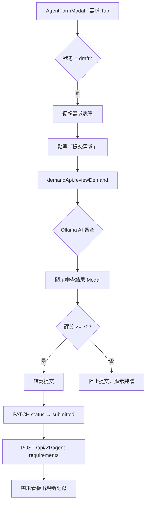

# 需求提交與審查規格書

## 概述
使用者在智能體市集編輯 Agent 時，可透過「需求」Tab 填寫並提交開發需求。系統透過 AI 審查需求的完整性、合理性與可行性，審查通過後自動建立需求看板紀錄。

## 流程



## 需求表單欄位

| 欄位 | 必填 | 說明 |
|------|:--:|------|
| goal | ✅ | 需求目標 |
| expected_effect | ✅ | 預期效果 |
| problem_description | ✅ | 問題描述 |
| target_users | | 目標用戶 |
| scope | | 服務範圍 |
| excluded_scope | | 不包含範圍 |
| conversation_style | | 對話風格 |
| input_description | | 輸入說明 |
| input_format | | 輸入格式 |
| example_documents | | 範例文件（上傳至 SeaweedFS） |
| example_images | | 範例圖片 |
| output_description | | 輸出說明 |
| output_format | | 輸出格式 |
| output_examples | | 輸出範例 |
| estimated_hours | | 預估工時 |

## AI 審查

### 呼叫方式
```
POST /api/v1/demands/review
```

### 使用模型
`qwen3-coder:30b`（Ollama `/api/generate`，temperature=0.3）

### 審查輸出

| 欄位 | 說明 |
|------|------|
| completeness | 需求完整性評估 |
| reasonableness | 合理性評估 |
| feasibility | 可行性評估 |
| estimated_hours | 預估總工時 |
| hour_breakdown | 工時明細：consulting / development / testing / review |
| confidence | 估計信心（low/medium/high） |
| summary | 需求摘要 |
| suggestions | 改進建議（陣列） |
| score | 綜合評分（0-100） |

### 評分門檻
- **≥ 70 分**：可提交
- **< 70 分**：阻止提交，顯示 AI 建議

## 提交後動作

1. `PATCH /api/v1/agents/{key}/demands/{key}/status` → `submitted`
2. `POST /api/v1/agent-requirements` → 建立需求看板紀錄
   - `status: pending_accept`
   - 攜帶 goal、expected_effect、problem_description、ai_review

## 檔案上傳

範例文件和圖片透過 SeaweedFS 儲存：
```
PUT /demands/{agentKey}/{demandKey}/documents/{filename}
PUT /demands/{agentKey}/{demandKey}/images/{filename}
```

## 狀態流轉

| 狀態 | 可操作性 |
|------|----------|
| draft | 編輯、保存草稿、提交（觸發 AI 審查） |
| submitted | 撤回 → draft |
| accepted | 檢視摘要 |
| in_development | 等待團隊 |
| pending_acceptance | 驗收通過/不通過 |
| online | 需求變更 → draft |
| cancelled | 刪除 / 重新開啟 → draft |

## 前端元件

| 元件 | 檔案 |
|------|------|
| DemandTab | `src/components/DemandTab.tsx` |
| AgentFormModal | `src/components/AgentFormModal.tsx` |

## 修改歷程
| 日期 | 版本 | 作者 | 變更 |
|------|------|------|------|
| 2026-04-27 | 1.0.0 | AI Agent | 初始版本 |
