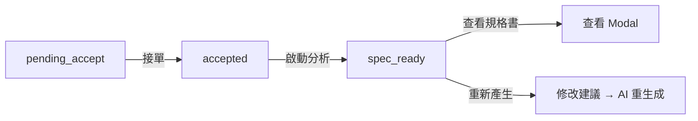

# 需求看板規格書

## 概述
需求看板（RequirementBoard）是開發者接單與管理 AI Agent 開發需求的統一入口，位於「系統開發」功能群組下。

## 路由與權限

| 項目 | 值 |
|------|-----|
| 路由 | `/app/requirements` |
| 功能代碼 | `dev.requirements` |
| 父群組 | `dev`（系統開發） |
| 授權角色 | `developer` |

## 頁面結構

```
┌─────────────────────────────────────────┐
│ 📋 需求看板                    [刷新]   │
├─────────────────────────────────────────┤
│ Agent │ 需求目標 │ 版本 │ 提交者 │ ... │
│ Ragic │ 我要做... │ v1.0 │ admin  │ ... │
│ ESG   │ 協助...  │ v1.1 │ user1  │ ... │
└─────────────────────────────────────────┘
```

## 列表欄位

| 欄位 | 說明 |
|------|------|
| Agent | 來源 Agent 名稱 |
| 需求目標 | 需求目標摘要（tooltip 顯示完整） |
| 版本 | 點擊可查看原始需求 Modal |
| 提交者 | 提交人帳號 |
| AI 評分 | 審查分數（≥70 綠色、<70 紅色） |
| 狀態 | Tag：待接單/已承接/規格就緒/開發中/已完成 |
| 提交時間 | 格式化時間 |
| 操作 | 查看/接單/啟動分析/查看規格書 |

## 狀態流轉



| 狀態 | 顯示 | 可用操作 |
|------|------|----------|
| `pending_accept` | 🔵 待接單 | 查看、**接單** |
| `accepted` | 🟢 已承接 | 查看、**啟動分析** |
| `spec_ready` | 🟦 規格就緒 | 查看、**查看規格書** |
| `in_development` | 🟣 開發中 | 查看 |
| `completed` | ⚪ 已完成 | 查看 |

## Modal 互動

### 需求詳情 Modal
顯示 requirement 記錄的所有欄位（Agent、版本、提交者、狀態、目標、預期效果、問題描述、AI 審查）。

### 原始需求 Modal（點擊版本）
載入 `agent_demands` 完整內容，包含輸入/輸出規格、範例文件、AI 審查結果。

### 開發規格書 Modal
- 以 `react-markdown`（`MarkdownContent`）渲染
- 包含 Mermaid 架構圖與流程圖
- 底部按鈕：關閉 / 重新產生規格書 / 複製 Markdown

### 重新產生 Modal
- TextArea 輸入修改指示
- 提交後 AI 根據原始工時參考 + 修改指示重新生成
- 規格書 Modal 保持開啟，顯示 loading 狀態
- 完成後自動刷新內容

## API 端點

| 方法 | 路徑 | 說明 |
|------|------|------|
| GET | `/api/v1/agent-requirements` | 列表（依 submitted_at DESC） |
| POST | `/api/v1/agent-requirements` | 建立（需求提交時自動呼叫） |
| GET | `/api/v1/agent-requirements/{key}` | 取得單筆 |
| PATCH | `/api/v1/agent-requirements/{key}/accept` | 接單（body: `{developer}`） |
| POST | `/api/v1/agent-requirements/{key}/analyze` | 啟動分析/重新產生（body: `{revision?}`） |

## 資料結構

### agent_requirements 文件

```json
{
  "_key": "{agent_key}_{version}",
  "agent_key": "uuid",
  "demand_key": "uuid",
  "agent_name": "Ragic 小幫手",
  "account": "admin",
  "version": "v1.0",
  "status": "spec_ready",
  "goal": "...",
  "expected_effect": "...",
  "problem_description": "...",
  "ai_review": { "...": "..." },
  "dev_spec": {
    "summary": "...",
    "tech_stack": ["..."],
    "modules": [{ "name": "...", "description": "...", "priority": "high" }],
    "hour_breakdown": { "consulting": 8, "development": 48, "testing": 16, "review": 8 },
    "mermaid_architecture": "graph TD\n...",
    "mermaid_flow": "flowchart LR\n...",
    "risks": ["..."],
    "suggestions": ["..."]
  },
  "developer": "daniel",
  "submitted_at": "2026-04-27T...",
  "accepted_at": "2026-04-27T...",
  "analyzed_at": "2026-04-27T..."
}
```

## 前端元件

| 元件 | 檔案 |
|------|------|
| RequirementBoard | `src/pages/RequirementBoard.tsx` |
| 路由註冊 | `src/App.tsx` |

## 修改歷程
| 日期 | 版本 | 作者 | 變更 |
|------|------|------|------|
| 2026-04-27 | 1.0.0 | AI Agent | 初始版本 |
