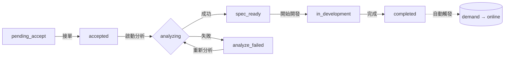

# 需求看板規格書

## 概述
需求看板（RequirementBoard）是開發者接單與管理 AI Agent 開發需求的統一入口，位於「系統開發」功能群組下。

看板記錄對應的是 **Level 2（Kanban 狀態機）**，僅在 Demand 達到 `qualified`（需求成立）時自動建立。每個看板記錄對應一個需求版本的開發執行追蹤。

> 關於 Level 1（Demand 文件生命週期）請見 [01-需求提交與審查](./01-需求提交與審查.md)。

## 路由與權限

| 項目 | 值 |
|------|-----|
| 路由 | `/app/requirements` |
| 功能代碼 | `dev.requirements` |
| 父群組 | `dev`（系統開發） |
| 授權角色 | `developer` |

## 頁面結構

```
┌─────────────────────────────────────────────────────┐
│ 📋 需求看板                                [刷新]  │
├─────────────────────────────────────────────────────┤
│ Agent │ 需求目標 │ 版次 │ 提交者 │ AI 評分 │ 狀態 │
│─────────────────────────────────────────────────────│
│ 福祉   │ 我要做...│ v2.0  │ admin  │ 85      │ 🔵待接單 │
│        │          │ ↑v1.0 │        │         │ 已取代    │
│ Ragic  │ 協助...  │ v1.0  │ user1  │ 72      │ 🟣開發中  │
└─────────────────────────────────────────────────────┘
```

## 兩層狀態機關係

```
┌─ Level 1 (Demand) ──────────────────┐
│ qualified      看板觸發點             │
│   └──→ 建立看板記錄 (pending_accept)   │
│ online         看板 completed 觸發    │
│   └──← kanban completed 後自動設定    │
│ superseded     被新版取代             │
│   └──→ 看板隱藏（歷史資料可查）       │
└──────────────────────────────────────┘
```

看板不直接控制 demand 狀態，但以下事件會觸發 demand 變更：

| 看板事件 | Demand 變更 |
|---------|------------|
| 看板記錄建立（自動） | 無（demand 已是 qualified） |
| 看板完成 `completed` | demand → `online`（自動觸發） |
| 需求變更（新版 qualified） | 舊版 demand → `superseded`（自動觸發） |

## 狀態流轉



| 狀態 | 顯示 | 可用操作 |
|------|------|----------|
| `pending_accept` | 🔵 待接單 | 查看、**接單** |
| `accepted` | 🟢 已承接 | 查看、**啟動分析** |
| `analyzing` | 🟠 分析中 | 查看（不可操作） |
| `analyze_failed` | 🔴 分析失敗 | 查看、**重新分析** |
| `spec_ready` | 🟦 規格就緒 | 查看、**查看規格書**、重新產生 |
| `in_development` | 🟣 開發中 | 查看 |
| `completed` | ⚪ 已完成 | 查看 |

## 版本顯示

看板列表需新增以下欄位/標示：

| 欄位 | 說明 |
|------|------|
| 版次 | 顯示需求版本號，點擊可查看該版本的原始需求 Modal |
| 變更來源 | 若該版由變更而來，顯示「v1.0 → v2.0」標籤 |
| 取代狀態 | 若該版已被新版取代，顯示「已取代」灰標 |

### 版次顯示規則

- 看板預設**只顯示各 agent 的最新活躍版本**
- 被 `superseded` 的看板記錄預設隱藏
- 可透過「顯示歷史版本」切換查看所有版本

## 列表欄位

| 欄位 | 說明 |
|------|------|
| Agent | 來源 Agent 名稱 |
| 需求目標 | 需求目標摘要（tooltip 顯示完整） |
| 版次 | 版本號，點擊可查看原始需求 Modal；顯示變更標記 |
| 提交者 | 提交人帳號 |
| AI 評分 | 審查分數（≥70 綠色、<70 紅色） |
| 狀態 | Tag 顯示 |
| 提交時間 | 格式化時間 |
| 操作 | 查看 / 接單 / 啟動分析 / 查看規格書 |

## Modal 互動

### 需求詳情 Modal
顯示 requirement 記錄的所有欄位（Agent、版次、提交者、狀態、目標、預期效果、問題描述、AI 審查）。
若該需求是由變更而來，顯示「此需求為 v{x} 的變更版本」標示。

### 原始需求 Modal（點擊版次）
載入 `agent_demands` 完整內容，包含版本資訊、變更來源（`supersedes`）、輸入/輸出規格、範例文件、AI 審查結果。
若該版已被取代，顯示「此版本已被 v{y} 取代」標示。

### 開發規格書 Modal
- 以 `react-markdown`（`MarkdownContent`）渲染
- 包含 Mermaid 架構圖與流程圖
- 底部按鈕：關閉 / 重新產生規格書 / 複製 Markdown

### 重新產生 Modal
- TextArea 輸入修改指示
- 提交後 AI 根據原始工時參考 + 修改指示重新生成
- 規格書 Modal 保持開啟，顯示 loading 狀態
- 完成後自動刷新內容

## 接單與開發流程

```
開發者看到 pending_accept 的需求
    │
    ├── 點擊「接單」
    │   └── PATCH /accept → status: accepted
    │       └── 填寫 developer 資訊
    │
    ├── 點擊「啟動分析」
    │   └── POST /analyze → status: analyzing
    │       └── LLM 生成 dev_spec → status: spec_ready
    │
    ├── 點擊「查看規格書」
    │   └── Modal 顯示 markdown
    │
    ├── 點擊「開始開發」→ status: in_development
    │   └── 開發完成 → status: completed
    │       └── 自動觸發 demand → online
    │
    └── 若分析失敗
        └── 點擊「重新分析」→ POST /analyze 重試
```

## API 端點

| 方法 | 路徑 | 說明 |
|------|------|------|
| GET | `/api/v1/agent-requirements` | 列表（依 submitted_at DESC） |
| POST | `/api/v1/agent-requirements` | 建立（後端自動呼叫，非前端） |
| GET | `/api/v1/agent-requirements/{key}` | 取得單筆 |
| PATCH | `/api/v1/agent-requirements/{key}/accept` | 接單（body: `{developer}`） |
| POST | `/api/v1/agent-requirements/{key}/analyze` | 啟動分析/重新產生（body: `{revision?}`） |

## 資料結構

### agent_requirements 文件（v2.0）

```json
{
  "_key": "{demand_key}",
  "demand_key": "demand-uuid",
  "demand_version": "v1.0",
  "superseded_by": null,
  "supersedes_req": null,
  "change_type": "initial",
  "agent_key": "agent-uuid",
  "agent_name": "福祉業務小秘",
  "account": "admin",
  "version": "v1.0",
  "status": "spec_ready",
  "goal": "...",
  "expected_effect": "...",
  "problem_description": "...",
  "ai_review": { "...": "..." },
  "dev_spec": {
    "summary": "...",
    "tech_stack": ["..."],
    "modules": [{ "name": "...", "description": "...", "priority": "high" }],
    "hour_breakdown": { "consulting": 8, "development": 48, "testing": 16, "review": 8 },
    "mermaid_architecture": "graph TD\n...",
    "mermaid_flow": "flowchart LR\n...",
    "risks": ["..."],
    "suggestions": ["..."]
  },
  "developer": "daniel",
  "submitted_at": "2026-06-14T...",
  "accepted_at": "2026-06-14T...",
  "analyzed_at": "2026-06-14T..."
}
```

**v1.0 → v2.0 欄位變更：**

| 欄位 | 變更 | 說明 |
|------|------|------|
| `_key` | 改為 demand_key | 避免 agent_key_version 衝突 |
| `demand_version` | 新增 | 對應的需求版本號 |
| `supersedes_req` | 新增 | 取代哪個看板記錄（change 時） |
| `superseded_by` | 新增 | 被哪個看板記錄取代 |
| `change_type` | 新增 | "initial" \| "modification" |

## 前端元件

| 元件 | 檔案 |
|------|------|
| RequirementBoard | `src/pages/RequirementBoard.tsx` |
| 路由註冊 | `src/App.tsx` |

## 修改歷程
| 日期 | 版本 | 作者 | 變更 |
|------|------|------|------|
| 2026-06-14 | 2.0.0 | Daniel Chung | 新增兩層狀態機關聯說明、版次顯示、analyze_failed 狀態、變更追蹤、superseded 概念、資料結構 v2.0 欄位 |
| 2026-04-27 | 1.0.0 | AI Agent | 初始版本 |
