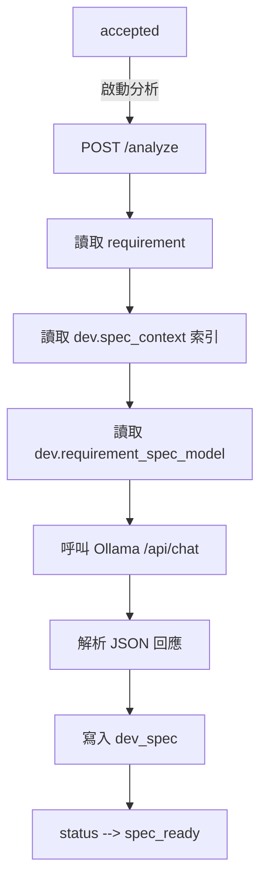
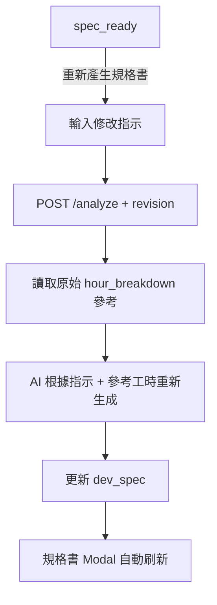

# 規格產出規格書

## 概述
開發者接單後，啟動 AI 分析產生開發規格書。規格書基於系統規格索引（`dev.spec_context`）與 AI 審查結果，產出含架構圖、流程圖、模組規劃、工時明細的完整規格。

## 流程



## 重新產生流程



## 使用模型

| 項目 | 值 |
|------|-----|
| 系統參數 | `dev.requirement_spec_model` |
| 預設值 | `qwen3-coder:30b` |
| 呼叫方式 | Ollama `/api/chat`（format=json, temperature=0.7） |
| 超時 | 120 秒 |

## AI Prompt 結構

```
你是 AIBox / ABC Desktop 系統的資深開發架構師。

## 系統規格索引（dev.spec_context）
（包含 20+ 份規格書的路徑與說明）

## 需求
（goal / expected_effect / problem_description）

## 修改指示（重新產生時）
（使用者輸入的 revision）

## 原始工時參考（重新產生時）
（顧問 Xh / 開發 Xh / 測試 Xh / 審查 Xh）

## 約束
- 技術棧必須在系統範圍內
- 服務間通訊須透過 Gateway
- 遵循開發規範
```

## 輸出 JSON 結構

| 欄位 | 型別 | 說明 |
|------|------|------|
| summary | string | 需求摘要 |
| tech_stack | string[] | 基於系統的技術選擇 |
| modules | object[] | 模組規劃（name, description, priority, depends_on） |
| data_sources | string[] | ArangoDB 集合或外部 API |
| integration_points | string[] | 需整合的內部服務 |
| hour_breakdown | object | consulting, development, testing, review（整數小時） |
| mermaid_architecture | string | Mermaid graph 系統架構圖 |
| mermaid_flow | string | Mermaid flowchart 請求處理流程 |
| risks | string[] | 潛在風險 |
| suggestions | string[] | 開發建議 |

## 規格書渲染

- 使用 `MarkdownContent`（`src/components/FloatingAssistant/ChatMarkdown.tsx`）
- 支援 `remark-gfm`（表格、任務列表）
- 支援 Mermaid 圖表渲染（`mermaid_architecture`、`mermaid_flow`）
- 支援工時明細表格（顧問/開發/測試/審查 + 合計）

## 重新產生規則

1. 從 requirement 讀取原始 `hour_breakdown` 作為參考
2. 使用者輸入修改指示（如「增加安全性模組」）
3. AI 根據指示合理調整各階段工時
4. 輸出新的 `hour_breakdown` + 完整規格 JSON
5. 前端規格書 Modal 保持開啟，顯示 loading
6. 完成後自動刷新內容

## 系統規格索引

`dev.spec_context` 系統參數包含完整文件索引，涵蓋：
- 核心架構（AGENTS.md、執行架構、API 規範）
- AI 服務（任務聊天室、艾企助手、智能體）
- 知識庫與記憶（HybridRAG、記憶系統）
- 前端（系統規格書、Agent 瀏覽區）
- 後台/流程（BPA、DA、Orchestrator）
- 開發規範（Store 模式、模組大小、PATCH vs PUT）

## 修改歷程
| 日期 | 版本 | 作者 | 變更 |
|------|------|------|------|
| 2026-04-27 | 1.0.0 | AI Agent | 初始版本 |
