# 福祉車體改造廠 — 採購 AI Agent 實作規劃

> **文件版本**: 1.2.0  
> **最後更新**: 2026-06-14  
> **作者**: Sisyphus  
> **對應需求文件**: `福祉車體改造廠_採購AI_Agent需求建議.xlsx`  
> **閱讀對象**: 客戶窗口、前端流程顧問

---

## 目錄

1. [為什麼從 10 個變 5 個 Agent？](#1-為什麼從-10-個變-5-個-agent)
2. [5 個 Agent 如何跑完整個採購流程](#2-5-個-agent-如何跑完整個採購流程)
3. [35 題 QA 全對應：誰來回答哪題？](#3-35-題-qa-全對應誰來回答哪題)
4. [Agent 1 — 採購請購小秘](#4-agent-1--採購請購小秘)
5. [Agent 2 — 採購比價下單小秘](#5-agent-2--採購比價下單小秘)
6. [Agent 3 — 採購跟單小秘](#6-agent-3--採購跟單小秘)
7. [Agent 4 — 進貨品管小秘](#7-agent-4--進貨品管小秘)
8. [Agent 5 — 採購分析評鑑小秘](#8-agent-5--採購分析評鑑小秘)
9. [AI 夠聰明嗎？模型與技術需求](#9-ai-夠聰明嗎模型與技術需求)
10. [上路時程建議](#10-上路時程建議)

---

## 1. 為什麼從 10 個變 5 個 Agent？

原始需求列出了 10 個 Agent，但其中有許多是「同一件事的不同步驟」或「同一角色做的連續動作」。合併後的好處：

- **對使用者更直覺** — 5 個 Agent = 5 個角色，而不是 10 個功能碎片
- **流程串得起來** — 比價完直接產生採購單，不用在兩個 AI 之間傳資料
- **開發維護成本更低** — 少一半的系統複雜度

### 合併邏輯一覽

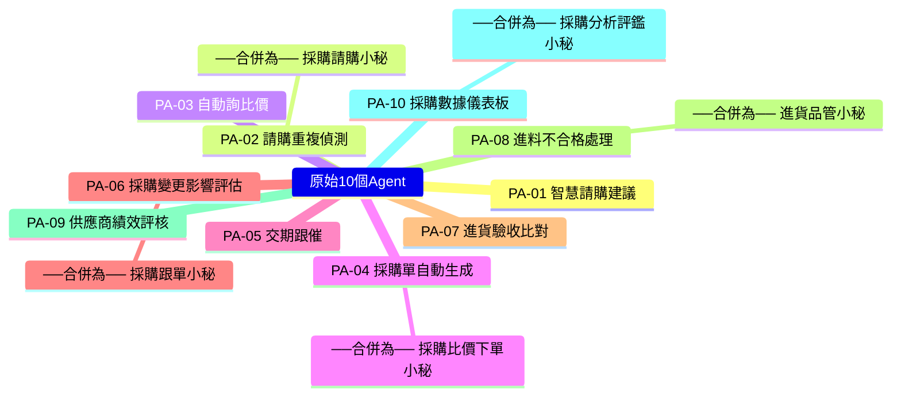
```mermaid
mindmap
  原始10個Agent
    PA-01 智慧請購建議
    PA-02 請購重複偵測
      ──合併為── 採購請購小秘
    PA-03 自動詢比價
    PA-04 採購單自動生成
      ──合併為── 採購比價下單小秘
    PA-05 交期跟催
    PA-06 採購變更影響評估
      ──合併為── 採購跟單小秘
    PA-07 進貨驗收比對
    PA-08 進料不合格處理
      ──合併為── 進貨品管小秘
    PA-09 供應商績效評核
    PA-10 採購數據儀表板
      ──合併為── 採購分析評鑑小秘
```

---

## 2. 5 個 Agent 如何跑完整個採購流程

### 流程總圖

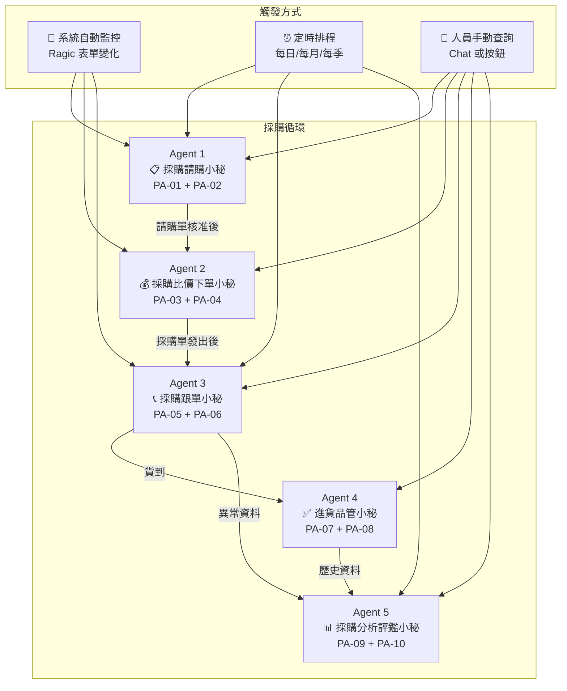
```mermaid
flowchart TB
    subgraph 觸發方式
        W[📡 系統自動監控<br/>Ragic 表單變化] 
        S[⏰ 定時排程<br/>每日/每月/每季]
        M[💬 人員手動查詢<br/>Chat 或按鈕]
    end

    W --> A1
    W --> A2
    W --> A3
    S --> A1
    S --> A3
    S --> A5
    M --> A1
    M --> A2
    M --> A3
    M --> A4
    M --> A5

    subgraph 採購循環
        A1[Agent 1<br/>📋 採購請購小秘<br/>PA-01 + PA-02]
        A2[Agent 2<br/>💰 採購比價下單小秘<br/>PA-03 + PA-04]
        A3[Agent 3<br/>📞 採購跟單小秘<br/>PA-05 + PA-06]
        A4[Agent 4<br/>✅ 進貨品管小秘<br/>PA-07 + PA-08]
        A5[Agent 5<br/>📊 採購分析評鑑小秘<br/>PA-09 + PA-10]
    end

    A1 -->|請購單核准後| A2
    A2 -->|採購單發出後| A3
    A3 -->|貨到| A4
    A4 -->|歷史資料| A5
    A3 -->|異常資料| A5
```

### 5 個 Agent 快速一覽

| # | Agent 名稱 | 就像一個… | 主要功能 | 需要 AI？ | 開發優先 |
|:---:|-----------|:---------:|---------|:---------:|:--------:|
| 1 | **採購請購小秘** | 📋 **採購助理** | 訂單來了自動算缺哪些料、要不要買、有沒有人重複買 | ⚡ 一點點 | **優先** |
| 2 | **採購比價下單小秘** | 💰 **比價專員** | 自動找三家供應商報價、算誰最划算、產生採購單 | ⚡ 一點點 | 第二波 |
| 3 | **採購跟單小秘** | 📞 **催貨專員** | 每天盯交期、快到期自動催、延遲了自動評估影響 | 🧠 需要思考 | **優先** |
| 4 | **進貨品管小秘** | ✅ **品檢助理** | 貨到了自動對單、該檢驗的通知品管、不合格的建議怎麼處理 | ⚡ 一點點 | **優先** |
| 5 | **採購分析評鑑小秘** | 📊 **管理分析師** | 每季幫供應商打分數、每月出採購報表、幫忙預測預算 | 🧠 需要思考 | 第三波 |

---

## 3. 35 題 QA 全對應：誰來回答哪題？

Excel 中列出了 7 種角色 × 5 題 = **35 題**。以下是完整的責任分配——**每一題都有對應的 Agent 負責，沒有遺漏。**

### 總經理（5 題）

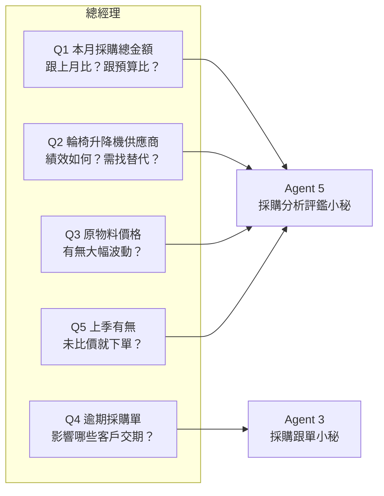
```mermaid
flowchart LR
    subgraph 總經理
        Q1[Q1 本月採購總金額<br/>跟上月比？跟預算比？]
        Q2[Q2 輪椅升降機供應商<br/>績效如何？需找替代？]
        Q3[Q3 原物料價格<br/>有無大幅波動？]
        Q4[Q4 逾期採購單<br/>影響哪些客戶交期？]
        Q5[Q5 上季有無<br/>未比價就下單？]
    end

    Q1 --> A5
    Q2 --> A5
    Q3 --> A5
    Q4 --> A3
    Q5 --> A5

    A3[Agent 3<br/>採購跟單小秘]
    A5[Agent 5<br/>採購分析評鑑小秘]
```

### 管理部主管（5 題）

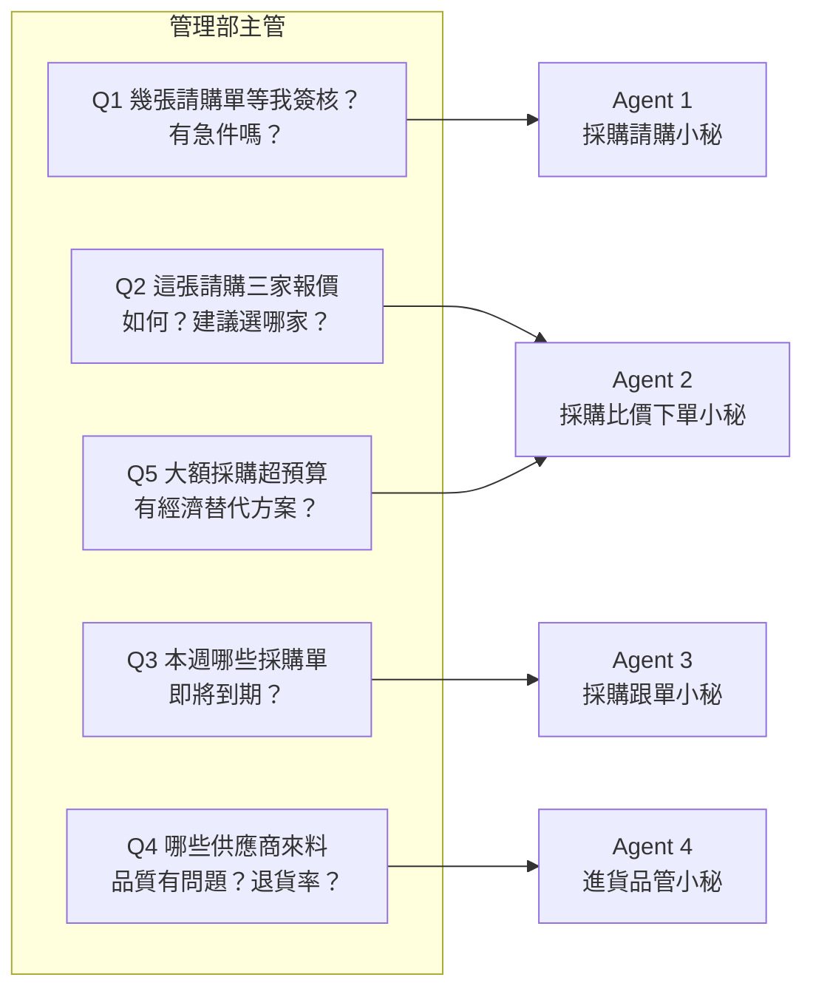
```mermaid
flowchart LR
    subgraph 管理部主管
        Q1[Q1 幾張請購單等我簽核？<br/>有急件嗎？]
        Q2[Q2 這張請購三家報價<br/>如何？建議選哪家？]
        Q3[Q3 本週哪些採購單<br/>即將到期？]
        Q4[Q4 哪些供應商來料<br/>品質有問題？退貨率？]
        Q5[Q5 大額採購超預算<br/>有經濟替代方案？]
    end

    Q1 --> A1
    Q2 --> A2
    Q3 --> A3
    Q4 --> A4
    Q5 --> A2

    A1[Agent 1<br/>採購請購小秘]
    A2[Agent 2<br/>採購比價下單小秘]
    A3[Agent 3<br/>採購跟單小秘]
    A4[Agent 4<br/>進貨品管小秘]
```

### 採購人員（5 題）

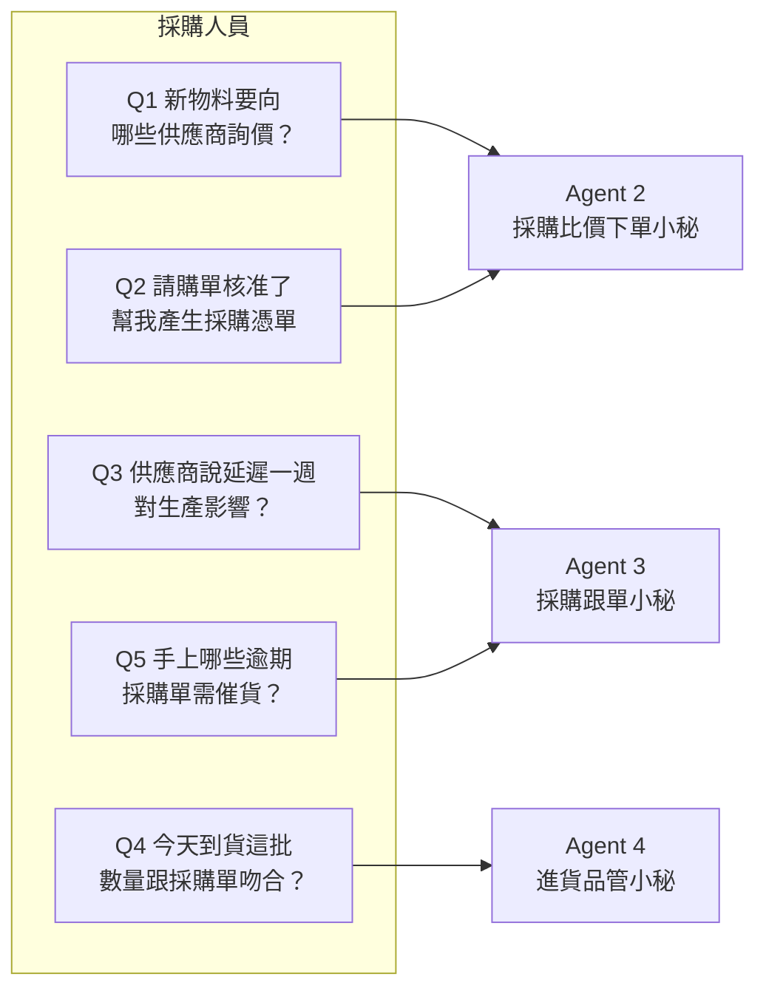
```mermaid
flowchart LR
    subgraph 採購人員
        Q1[Q1 新物料要向<br/>哪些供應商詢價？]
        Q2[Q2 請購單核准了<br/>幫我產生採購憑單]
        Q3[Q3 供應商說延遲一週<br/>對生產影響？]
        Q4[Q4 今天到貨這批<br/>數量跟採購單吻合？]
        Q5[Q5 手上哪些逾期<br/>採購單需催貨？]
    end

    Q1 --> A2
    Q2 --> A2
    Q3 --> A3
    Q4 --> A4
    Q5 --> A3

    A2[Agent 2<br/>採購比價下單小秘]
    A3[Agent 3<br/>採購跟單小秘]
    A4[Agent 4<br/>進貨品管小秘]
```

### 倉管人員（5 題）

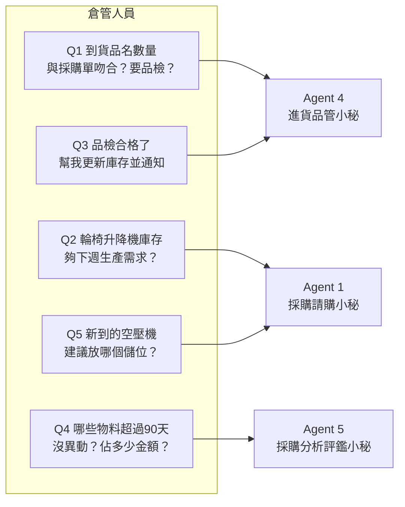
```mermaid
flowchart LR
    subgraph 倉管人員
        Q1[Q1 到貨品名數量<br/>與採購單吻合？要品檢？]
        Q2[Q2 輪椅升降機庫存<br/>夠下週生產需求？]
        Q3[Q3 品檢合格了<br/>幫我更新庫存並通知]
        Q4[Q4 哪些物料超過90天<br/>沒異動？佔多少金額？]
        Q5[Q5 新到的空壓機<br/>建議放哪個儲位？]
    end

    Q1 --> A4
    Q2 --> A1
    Q3 --> A4
    Q4 --> A5
    Q5 --> A1

    A1[Agent 1<br/>採購請購小秘]
    A4[Agent 4<br/>進貨品管小秘]
    A5[Agent 5<br/>採購分析評鑑小秘]
```

### 品管人員（5 題）

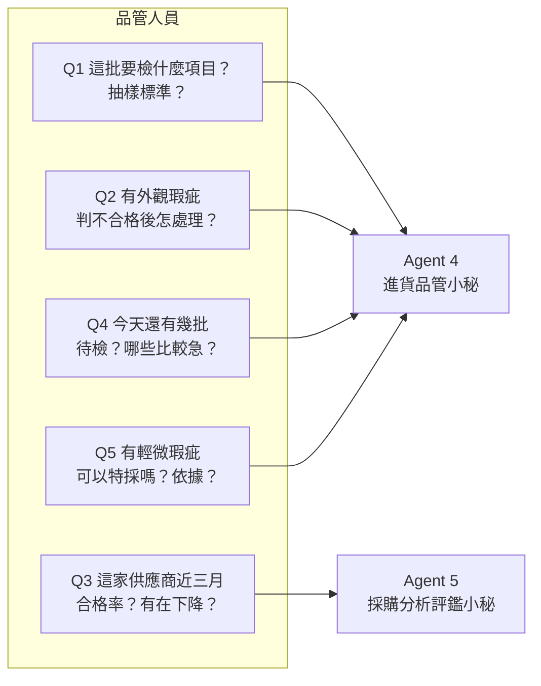
```mermaid
flowchart LR
    subgraph 品管人員
        Q1[Q1 這批要檢什麼項目？<br/>抽樣標準？]
        Q2[Q2 有外觀瑕疵<br/>判不合格後怎處理？]
        Q3[Q3 這家供應商近三月<br/>合格率？有在下降？]
        Q4[Q4 今天還有幾批<br/>待檢？哪些比較急？]
        Q5[Q5 有輕微瑕疵<br/>可以特採嗎？依據？]
    end

    Q1 --> A4
    Q2 --> A4
    Q3 --> A5
    Q4 --> A4
    Q5 --> A4

    A4[Agent 4<br/>進貨品管小秘]
    A5[Agent 5<br/>採購分析評鑑小秘]
```

### 生產/改裝人員（5 題）

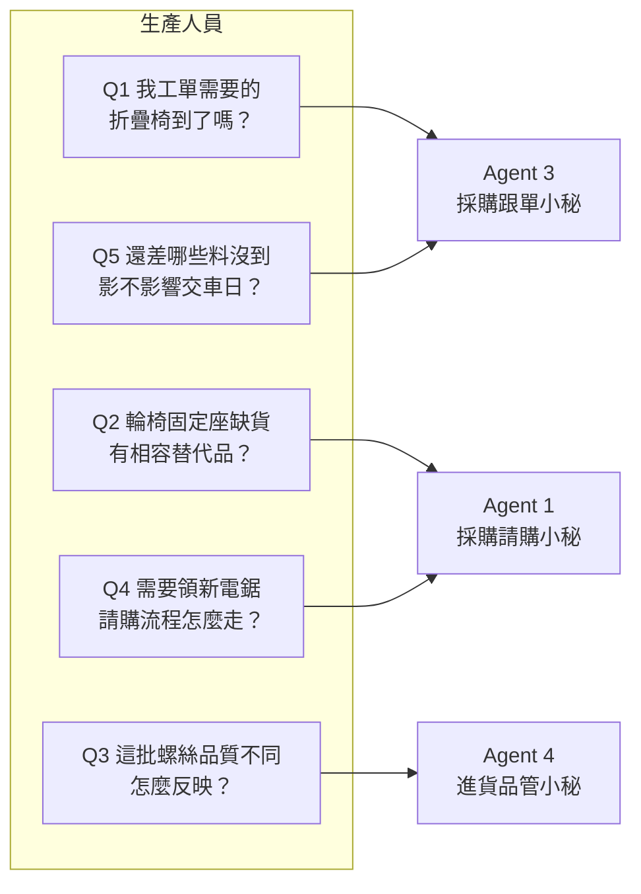
```mermaid
flowchart LR
    subgraph 生產人員
        Q1[Q1 我工單需要的<br/>折疊椅到了嗎？]
        Q2[Q2 輪椅固定座缺貨<br/>有相容替代品？]
        Q3[Q3 這批螺絲品質不同<br/>怎麼反映？]
        Q4[Q4 需要領新電鋸<br/>請購流程怎麼走？]
        Q5[Q5 還差哪些料沒到<br/>影不影響交車日？]
    end

    Q1 --> A3
    Q2 --> A1
    Q3 --> A4
    Q4 --> A1
    Q5 --> A3

    A1[Agent 1<br/>採購請購小秘]
    A3[Agent 3<br/>採購跟單小秘]
    A4[Agent 4<br/>進貨品管小秘]
```

### 財務/會計（5 題）

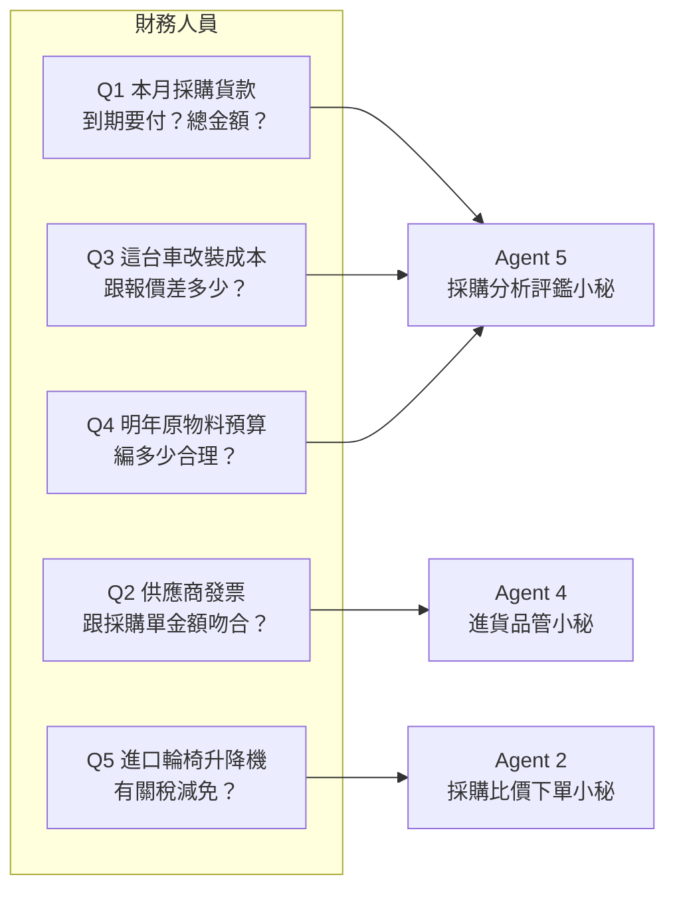
```mermaid
flowchart LR
    subgraph 財務人員
        Q1[Q1 本月採購貨款<br/>到期要付？總金額？]
        Q2[Q2 供應商發票<br/>跟採購單金額吻合？]
        Q3[Q3 這台車改裝成本<br/>跟報價差多少？]
        Q4[Q4 明年原物料預算<br/>編多少合理？]
        Q5[Q5 進口輪椅升降機<br/>有關稅減免？]
    end

    Q1 --> A5
    Q2 --> A4
    Q3 --> A5
    Q4 --> A5
    Q5 --> A2

    A2[Agent 2<br/>採購比價下單小秘]
    A4[Agent 4<br/>進貨品管小秘]
    A5[Agent 5<br/>採購分析評鑑小秘]
```

### 統計：每個 Agent 負責幾題？

| Agent | 角色覆蓋數 | 負責題數 | 主要服務對象 |
|:-----|:---------:|:--------:|------------|
| **Agent 1** 採購請購小秘 | 4 個角色 | **5 題** | 管理部主管、倉管、生產人員 |
| **Agent 2** 採購比價下單小秘 | 3 個角色 | **5 題** | 管理部主管、採購人員、財務 |
| **Agent 3** 採購跟單小秘 | 4 個角色 | **6 題** | 總經理、管理部主管、採購、生產 |
| **Agent 4** 進貨品管小秘 | 6 個角色 | **10 題** 🔥 | 管理部、採購、倉管、品管、生產、財務 |
| **Agent 5** 採購分析評鑑小秘 | 4 個角色 | **9 題** | 總經理、倉管、品管、財務 |
| | | **總計 35/35** ✅ | 完全覆蓋，無遺漏 |

> 💡 **Agent 4 最多題（10 題）**是因為進貨驗收 + 不合格處理橫跨了最多角色（倉管、品管、採購、生產都會問到相關問題），這也符合「進貨是採購流程中最多人員接觸的環節」這個事實。

---

## 4. Agent 1 — 採購請購小秘

### 對應的角色

> 🙋 **請購人員** 和 **生管人員** — 負責提出物料採購需求的人

### 他負責回答的 QA（5 題）

| 角色 | 問題 | AI 怎麼回答 |
|:----|------|-----------|
| 管理部主管 | 目前有幾張請購單等我簽核？有沒有急件？ | 調出待簽清單，按金額/急迫度排序 |
| 倉管人員 | 輪椅升降機目前庫存還有幾台？夠不夠下週的生產需求？ | 查庫存 + 比對下週工單需求量 |
| 倉管人員 | 新到的空壓機比較大台，建議放哪個儲位？ | 查儲位表 + 物料尺寸 → 建議適當儲位 |
| 生產人員 | 輪椅固定座缺貨，有沒有相容的替代品可以先用？ | 查替代料表 + 庫存 → 列出可用替代品 |
| 生產人員 | 我需要領一把新的電鋸，請購流程怎麼走？ | 引導填寫請購單，告知所需資訊 |

### 他解決什麼問題？

**現在**：生管拿到一張改裝工單，要手動去查 BOM 表 → 查庫存 → 算要買多少 → 手寫請購單 → 送簽核。如果剛好有人已經買了同樣的東西，沒人知道。

**以後**：工單一建立，AI 30 秒內就算好缺什麼料、該買多少，還順便檢查有沒有人已經買了，自動產出請購單草稿。

### 工作流程

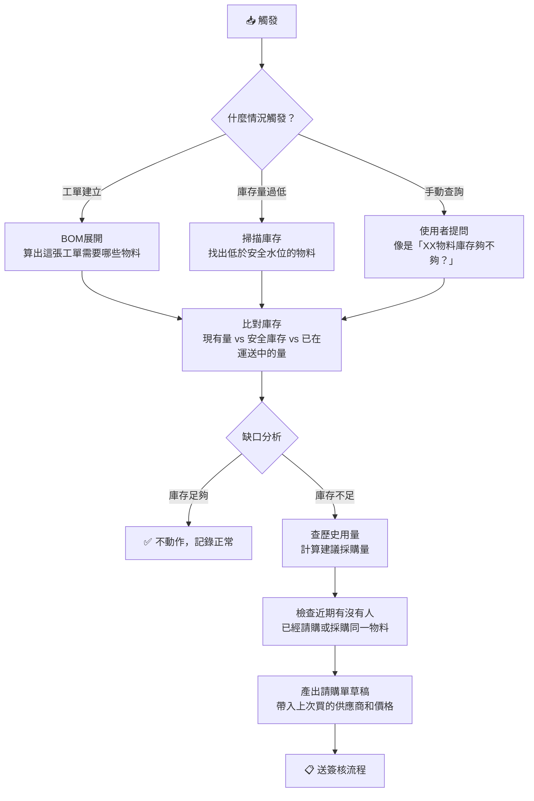
```mermaid
flowchart TD
    S[📥 觸發] --> C{什麼情況觸發？}
    C -->|工單建立| W1[BOM展開<br/>算出這張工單需要哪些物料]
    C -->|庫存量過低| W2[掃描庫存<br/>找出低於安全水位的物料]
    C -->|手動查詢| W3[使用者提問<br/>像是「XX物料庫存夠不夠？」]

    W1 --> W4
    W2 --> W4
    W3 --> W4

    W4[比對庫存<br/>現有量 vs 安全庫存 vs 已在運送中的量]
    W4 --> W5{缺口分析}
    W5 -->|庫存足夠| END1[✅ 不動作，記錄正常]
    W5 -->|庫存不足| W6[查歷史用量<br/>計算建議採購量]
    
    W6 --> W7[檢查近期有沒有人<br/>已經請購或採購同一物料]
    W7 --> W8[產出請購單草稿<br/>帶入上次買的供應商和價格]
    W8 --> END2[📋 送簽核流程]
```

### 他會用到的 Ragic 表單

| 表單名稱 | 做什麼用 | AI 讀取 | AI 寫入 |
|---------|---------|:-------:|:-------:|
| 請購憑單 | 建立採購申請單 | ✅ | ✅ |
| 庫存主檔 | 查目前庫存量 | ✅ | |
| BOM 表 | 展開工單所需物料清單 | ✅ | |
| 工單表 | 得知目前正在進行的改裝案 | ✅ | |
| 歷史採購紀錄 | 參考上次跟誰買、多少錢 | ✅ | |
| 儲位表 | 建議存放位置 | ✅ | |

### 需要懂的專業知識

- **BOM 結構**：一台改裝車需要哪些物料、有沒有替代料可用
- **庫存邏輯**：什麼是「安全庫存」、什麼是「在途量」
- **採購流程**：請購單怎麼跑簽核

### AI 用在這裡

```
「根據過去6個月該物料的使用趨勢，以及目前工單計畫，
建議本次採購數量為 15 個（原計算需求 12 個 + 安全緩衝 3 個），
因為往年同期需求量平均上升 25%。」
```

→ **只是產出這一段「建議說明」而已**，其他所有計算都是規則。

---

## 5. Agent 2 — 採購比價下單小秘

### 對應的角色

> 🙋 **採購人員** 和 **管理部主管** — 負責比價和決定跟誰買的人

### 他負責回答的 QA（5 題）

| 角色 | 問題 | AI 怎麼回答 |
|:----|------|-----------|
| 管理部主管 | 這張請購單的三家報價結果如何？你建議選哪家？ | 列出三家 TCO 排名 + AI 建議 + 價格異常標記 |
| 管理部主管 | 這張大額採購超出預算了，有沒有更經濟的替代方案？ | 查替代物料/供應商 + 價差分析 |
| 採購人員 | 這個新物料要跟哪些供應商詢價？有合格供應商清單嗎？ | 調出合格供應商名單 + 聯絡方式 + 過去報價參考 |
| 採購人員 | 這張請購單核准了，幫我產生採購憑單並帶入報價資料 | 自動填入採購單 + 附報價文件 + 送簽核 |
| 財務人員 | 這張進口的輪椅升降機有沒有關稅減免？稅額怎麼算？ | 依稅則查詢關稅 + 減免條件說明 |

### 他解決什麼問題？

**現在**：請購單核准了，採購要手動找合格供應商 → 打電話或寄信詢價 → 手動比價 → 主管決定 → 手KEY採購單。

**以後**：一鍵核准後，AI 自動調出合格廠商清單和歷史報價，算出 TCO 排名（含運費+付款條件），主管選定後直接產生採購單。

### 工作流程

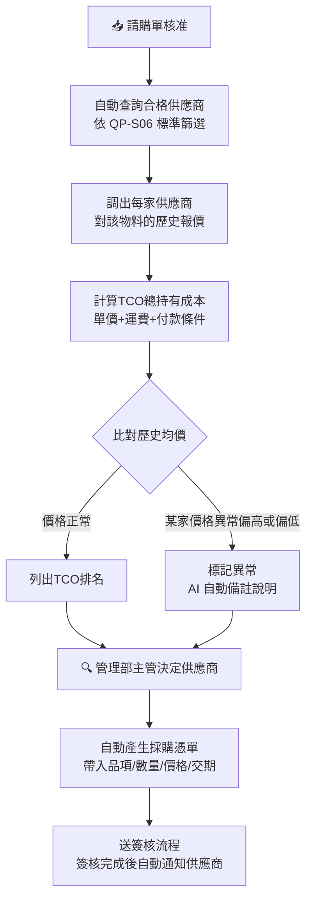
```mermaid
flowchart TD
    S[📥 請購單核准] --> W1[自動查詢合格供應商<br/>依 QP-S06 標準篩選]
    W1 --> W2[調出每家供應商<br/>對該物料的歷史報價]
    W2 --> W3[計算TCO總持有成本<br/>單價+運費+付款條件]
    
    W3 --> W4{比對歷史均價}
    W4 -->|價格正常| W5[列出TCO排名]
    W4 -->|某家價格異常偏高或偏低| W6[標記異常<br/>AI 自動備註說明]
    
    W5 --> W7[🔍 管理部主管決定供應商]
    W6 --> W7
    W7 --> W8[自動產生採購憑單<br/>帶入品項/數量/價格/交期]
    W8 --> W9[送簽核流程<br/>簽核完成後自動通知供應商]
```

### 他會用到的 Ragic 表單

| 表單名稱 | 做什麼用 |
|---------|---------|
| 供應商主檔 | 查合格供應商清單、評鑑分數 |
| 歷史報價紀錄 | 各供應商過去報價單價 |
| 請購憑單 | 輸入來源（已核准的請購需求） |
| 採購憑單 | **產出**（建立採購單） |
| 國定假日表 | 計算預估到貨日（排除假日） |

### 需要懂的專業知識

- **供應商管理 QP-S06**：什麼樣的供應商算「合格」
- **TCO 計算**：除了單價，運費和付款條件怎麼換算
- **工作日計算**：台灣國定假日、WORKDAY 算法

### AI 用在這裡

```
「A 供應商雖然單價比 B 高 8%，但過去 6 個月交期準確率 98%，
且運費含在單價中，建議優先考慮 A。另外 C 供應商的報價比
歷史均價低 22%，建議確認是否有規格差異。」
```

---

## 6. Agent 3 — 採購跟單小秘

### 對應的角色

> 🙋 **採購人員** 和 **生管人員** — 負責追蹤採購進度、確保物料如期到達的人

### 他負責回答的 QA（6 題）

| 角色 | 問題 | AI 怎麼回答 |
|:----|------|-----------|
| 總經理 | 目前有沒有逾期未交的採購單？會影響哪些客戶的車輛交期？ | 逾期清單 + 關聯工單 + 客戶交期影響評估 |
| 管理部主管 | 本週有哪些採購單即將到期？倉庫備料狀況如何？ | 到期清單 + 庫存缺口分析 |
| 採購人員 | 供應商說那批輪椅固定座要延遲一週，對生產有什麼影響？ | 查關聯工單 → 受影響的車輛 → 延遲天數估算 |
| 採購人員 | 目前我手上有哪些逾期的採購單需要催供應商？ | 逾期清單（依天數排序）+ 供應商聯絡資訊 + 催貨信範本 |
| 生產人員 | 我這張改裝工單需要的折疊椅到了嗎？什麼時候可以領？ | 查採購進度 → 物料到貨狀態 → 預計可領時間 |
| 生產人員 | 那台福祉車的改裝還差哪些料沒到？影不影響交車日？ | 未到料清單 + 預計到貨日 + 對交車日的影響 |

### 他解決什麼問題？

**現在**：採購單發出去之後，採購要自己記哪些快到期、手動打電話催、延遲了要自己去查影響哪台車。這是最耗人力的部分。

**以後**：AI 每天自動掃所有採購單，快到期的自動提醒，延遲的直接算出「這批料Delay會影響到張三的車延後 5 天交車」，採購只需要確認就好。

### 工作流程

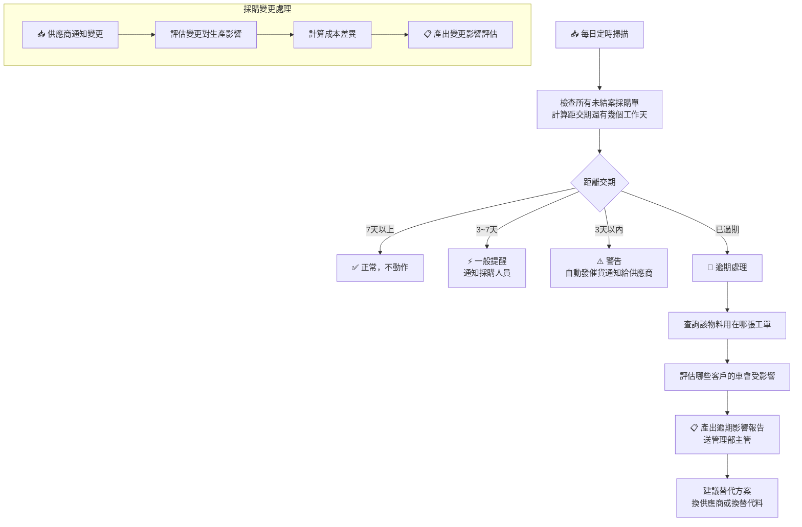
```mermaid
flowchart TD
    S[📥 每日定時掃描] --> W1[檢查所有未結案採購單<br/>計算距交期還有幾個工作天]
    
    W1 --> W2{距離交期}
    W2 -->|7天以上| N[✅ 正常，不動作]
    W2 -->|3~7天| W3[⚡ 一般提醒<br/>通知採購人員]
    W2 -->|3天以內| W4[⚠️ 警告<br/>自動發催貨通知給供應商]
    W2 -->|已過期| W5[🚨 逾期處理]
    
    W5 --> W6[查詢該物料用在哪張工單]
    W6 --> W7[評估哪些客戶的車會受影響]
    W7 --> W8[📋 產出逾期影響報告<br/>送管理部主管]
    W8 --> W9[建議替代方案<br/>換供應商或換替代料]

    subgraph 採購變更處理
        C1[📥 供應商通知變更] --> C2[評估變更對生產影響]
        C2 --> C3[計算成本差異]
        C3 --> C4[📋 產出變更影響評估]
    end
```

### 他會用到的 Ragic 表單

| 表單名稱 | 做什麼用 |
|---------|---------|
| 採購憑單 | 所有進行中的採購單、交期、供應商 |
| 工單表 | 查物料用在哪張工單、影響哪個客戶 |
| 供應商主檔 | 聯絡資訊、歷史交期達成率 |
| 國定假日表 | WORKDAY 計算 |
| 採購變更單 | 供應商要求變更時的紀錄 |

### 需要懂的專業知識

- **生產排程邏輯**：哪些物料 on critical path（缺了真的會停線），哪些不是
- **替代料知識**：某物料缺貨時，有沒有相容的替代品
- **合約罰則**：供應商延遲有沒違約金

### AI 用在這裡（這個 Agent 最需要 AI）

```
「物料『輪椅升降機固定座』（PO-2026-0123）已逾期 3 天。
該物料用於工單 WO-2026-0089（張三的福特旅行車），
交車日原訂 6/25，預計延遲至 6/30，影響 5 天。

替代方案：
1. 供應商 B 有現貨，單價高 12% → 可趕上原交期
2. 使用替代料件 RS-2026-09 → 不需額外成本，但需生管確認
    
建議方案：採用方案 2，已通知生管確認中。」
```

---

## 7. Agent 4 — 進貨品管小秘

### 對應的角色

> 🙋 **倉管人員** 和 **品管人員** — 負責收貨、檢驗、處理不合格品的人

### 他負責回答的 QA（10 題 🔥 最多）

| 角色 | 問題 | AI 怎麼回答 |
|:----|------|-----------|
| 管理部主管 | 最近哪些供應商的來料品質有問題？退貨率多少？ | 品質異常供應商清單 + 退貨率 + 不合格明細 |
| 採購人員 | 今天到貨的這批，送貨單上數量跟我們的採購單一樣嗎？ | 比對結果 + 差異標記 + 是否需品檢 + 進貨憑單 |
| 倉管人員 | 這批到貨的品名數量跟採購單吻合嗎？要不要送品檢？ | 比對結果 + 是否需檢驗判斷 + 下一步指引 |
| 倉管人員 | 這批品檢合格了，幫我更新庫存並通知請購人來領 | 更新庫存 + 通知請購人 |
| 品管人員 | 這批輪椅升降機要檢哪些項目？用什麼抽樣標準？ | 檢驗項目清單 + 抽樣計畫（AQL）+ 檢驗表格 |
| 品管人員 | 這批來料有外觀瑕疵，判不合格後下一步怎麼處理？ | 處理選項（退貨/換貨/特採）+ 處理流程 + 通知對象 |
| 品管人員 | 我今天還有幾批待檢？哪些比較急？ | 待檢批次清單（依工單急迫度排序） |
| 品管人員 | 這批雖然有輕微瑕疵但不影響功能，可以特採嗎？依據是什麼？ | 特採條件判斷 + 歷史同類案例 + 簽核層級 |
| 生產人員 | 這批螺絲跟上次的品質不一樣，我要怎麼反映？ | 異常回報流程 + 需填寫表單 + 通知品管和採購 |
| 財務人員 | 這張供應商發票跟我們的採購單金額對得起來嗎？ | 金額比對 + 差異標記 + 進貨憑單勾稽 |

### 他解決什麼問題？

**現在**：貨到了，倉管要手 key 進貨單、人工對數量、查這批要不要送檢、通知相關人員。如果不合格，還要翻過去的紀錄看這家廠商是不是常出包。

**以後**：貨一刷條碼，AI 自動對單、判斷要不要檢驗、通知正確的人。不合格的話自動調出歷史紀錄，建議退貨還是特採。

### 工作流程

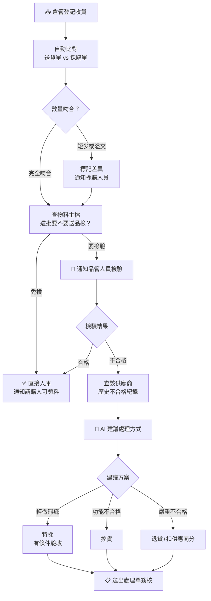
```mermaid
flowchart TD
    S[📥 倉管登記收貨] --> W1[自動比對<br/>送貨單 vs 採購單]
    
    W1 --> W2{數量吻合？}
    W2 -->|完全吻合| W4
    W2 -->|短少或溢交| W3[標記差異<br/>通知採購人員]
    W3 --> W4
    
    W4[查物料主檔<br/>這批要不要送品檢？]
    W4 -->|要檢驗| W5[🔬 通知品管人員檢驗]
    W4 -->|免檢| W6[✅ 直接入庫<br/>通知請購人可領料]
    
    W5 --> W7{檢驗結果}
    W7 -->|合格| W6
    W7 -->|不合格| W8[查該供應商<br/>歷史不合格紀錄]
    
    W8 --> W9[🤖 AI 建議處理方式]
    W9 --> W10{建議方案}
    W10 -->|輕微瑕疵| W11[特採<br/>有條件驗收]
    W10 -->|功能不合格| W12[換貨]
    W10 -->|嚴重不合格| W13[退貨+扣供應商分]
    
    W11 --> W14[📋 送出處理單簽核]
    W12 --> W14
    W13 --> W14
```

### 他會用到的 Ragic 表單

| 表單名稱 | 做什麼用 |
|---------|---------|
| 採購憑單 | 比對來源（訂了什麼、訂多少） |
| 進貨憑單 | **產出**（進貨紀錄）+ 更新庫存 |
| 物料主檔 | 查要不要檢驗、放哪個儲位 |
| 品檢紀錄 | 記錄檢驗結果 + 查歷史 |
| 不合格品處理表 | **產出**（不合格處理單） |
| 供應商主檔 | 更新品質評分 |

### 需要懂的專業知識

- **QC 檢驗標準**：哪些物料要檢、檢什麼項目、抽樣標準（AQL）
- **不合格品管理 QP-T04**：什麼情況可特採、什麼情況必須退
- **庫存管理**：入庫流程、儲位管理

### AI 用在這裡

```
「該批輪椅固定座外觀有輕微刮傷，但不影響功能。
該供應商過去 3 個月不合格率僅 2.3%，且無類似紀錄。
建議：特採（附條件驗收），由品管主管核准即可。」
```

---

## 8. Agent 5 — 採購分析評鑑小秘

### 對應的角色

> 🙋 **管理部主管**、**總經理**、**財務/會計** — 需要看報表、做決策的管理層

### 他負責回答的 QA（9 題）

| 角色 | 問題 | AI 怎麼回答 |
|:----|------|-----------|
| 總經理 | 這個月的採購總金額是多少？跟上個月和預算比起來如何？ | 本月金額 + 月增率 + 預算達成率 + 超支項目 |
| 總經理 | 輪椅升降機的主力供應商績效如何？需要找替代的嗎？ | 該供應商綜合評分 + 替代供應商比較 |
| 總經理 | 車輛改造的主要原物料價格最近有沒有大幅波動？ | 關鍵物料價格走勢 + 漲跌幅 + 對毛利影響 |
| 總經理 | 上季的採購有沒有未經三家比價就下單的情形？ | 未比價採購清單 + 原因 + 改善建議 |
| 倉管人員 | 有哪些物料超過 90 天沒有異動？佔多少金額？ | 呆滯料清單 + 金額 + 天數 + 處置建議 |
| 品管人員 | 這家供應商最近三個月的來料合格率是多少？有沒有在下降？ | 合格率趨勢 + 不合格項目分類 + 與其他供應商比較 |
| 財務人員 | 這個月有哪些採購貨款到期要付？總金額多少？ | 應付排程 + 金額統計 + 現金流影響 |
| 財務人員 | 這台福祉車的改裝物料成本合計是多少？跟報價的預估差多少？ | 實際成本 vs 預估 + 差異明細 |
| 財務人員 | 明年的原物料採購預算要編多少比較合理？ | 歷史金額趨勢 + 價格變動預測 + 建議預算區間 |

### 他解決什麼問題？

**現在**：每季要做供應商評核，要手動去各表單撈資料、整理 Excel、算分數。總經理要看採購狀況要等月報。

**以後**：時間到了 AI 自動產出評核表 + 儀表板，管理層隨時可以問「這個月採購多少錢？」「那家供應商最近表現怎樣？」

### 工作流程

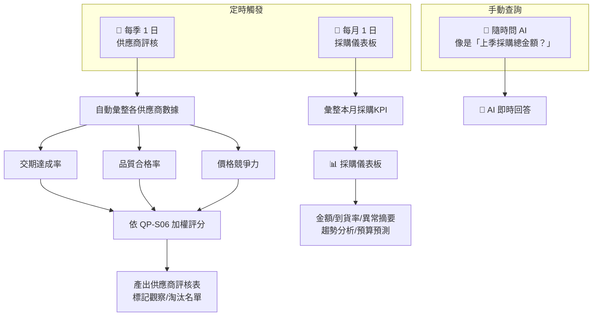
```mermaid
flowchart TD
    subgraph 定時觸發
        Q[📅 每季 1 日<br/>供應商評核]
        M[📅 每月 1 日<br/>採購儀表板]
    end

    subgraph 手動查詢
        C[💬 隨時問 AI<br/>像是「上季採購總金額？」]
    end

    Q --> W1[自動彙整各供應商數據]
    W1 --> W2[交期達成率]
    W1 --> W3[品質合格率]
    W1 --> W4[價格競爭力]
    W2 --> W5[依 QP-S06 加權評分]
    W3 --> W5
    W4 --> W5
    W5 --> W6[產出供應商評核表<br/>標記觀察/淘汰名單]

    M --> W7[彙整本月採購KPI]
    W7 --> W8[📊 採購儀表板]
    W8 --> W9[金額/到貨率/異常摘要<br/>趨勢分析/預算預測]

    C --> W10[🤖 AI 即時回答]
```

### 他會用到的 Ragic 表單

| 表單名稱 | 做什麼用 |
|---------|---------|
| 供應商主檔 | 接收評分更新、評鑑紀錄 |
| 採購憑單（歷史） | 計算交期達成率、採購金額 |
| 品檢紀錄（歷史） | 計算品質合格率 |
| 進貨憑單（歷史） | 驗收差異統計 |
| 工單表 | 預算預測的工單計畫來源 |
| 全採購相關表單 | 儀表板資料彙整 |

### 需要懂的專業知識

- **供應商評鑑標準 QP-S06**：評分怎麼算、權重多少、門檻值多少
- **採購 KPI**：到貨率、合格率、價差率的定義與計算
- **成本分析**：物料分類方式、預算編列邏輯

### AI 用在這裡

```
「根據過去 12 個月趨勢，每月採購金額平均成長 8%，
加上目前已確認的下季工單計畫（5 台改裝車），
預估下季採購預算需求約為 $2,850,000，較本季增加 12%。

主要增加來自輪椅升降機（佔採購金額 35%），
建議提前與供應商協商價格。」
```

---

## 9. AI 夠聰明嗎？模型與技術需求

### 系統現在用什麼 AI？

你目前的系統（ABC Desktop）已經串接多種 AI 模型：

```
已在使用的 AI 模型：
├── 🔵 Ollama 本地模型（免網路、免付費）
│   ├── Gemma 4 31B（Google 開源，強大通用）
│   ├── Qwen3-Coder 30B（阿里巴巴，程式碼強）
│   └── Llama 3.2（Meta，輕量）
│
├── 🟢 DeepSeek V4 Flash（雲端 API，付費）
│
└── 🟡 Gemini 2.5 Flash（Google 雲端 API，用於 ESG Agent）
```

### 採購 Agent 真的需要 AI 嗎？

很多人會以為「AI Agent = 全部用 AI」，但實際上：

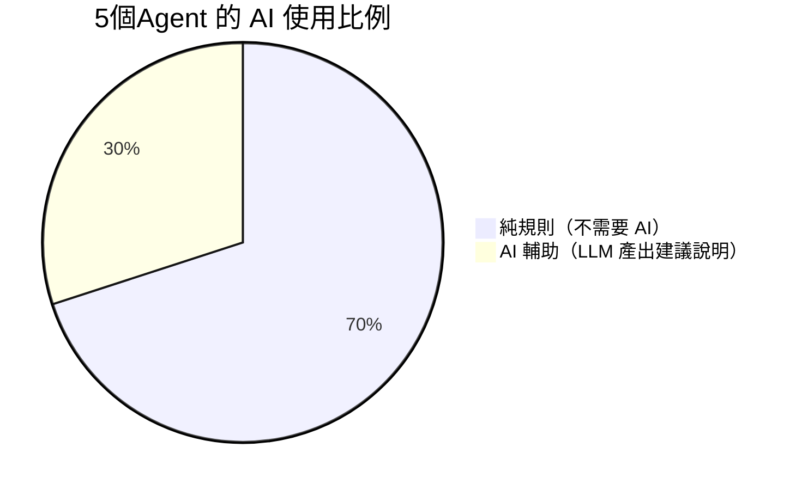
```mermaid
pie title 5個Agent 的 AI 使用比例
    "純規則（不需要 AI）" : 70
    "AI 輔助（LLM 產出建議說明）" : 30
```

**70% 的工作是規則**，例如：
- BOM 展開、庫存比對 → 像 Excel VLOOKUP
- TCO 排名、加權評分 → 公式計算
- 比對送貨單 vs 採購單 → 簡單的數值比對
- WORKDAY 計算、分級催貨 → If-Then 邏輯

**只有 30% 需要 AI 的語言能力**，例如：
- 「根據歷史趨勢建議採購量」
- 「這個 Delay 對張三的車影響有多大？」
- 「這批不合格品建議退貨還是特採？」

### 12B 等級的本地模型夠用嗎？

**答案是：夠，而且還有剩。**

下面是這些採購工作對 AI 能力的需求程度：

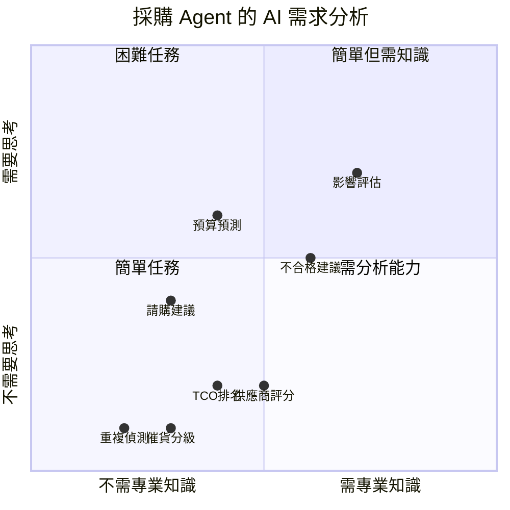
```mermaid
quadrantChart
    title 採購 Agent 的 AI 需求分析
    x-axis 不需專業知識 --> 需專業知識
    y-axis 不需要思考 --> 需要思考
    quadrant-1 簡單但需知識
    quadrant-2 困難任務
    quadrant-3 簡單任務
    quadrant-4 需分析能力

    "請購建議": [0.3, 0.4]
    "重複偵測": [0.2, 0.1]
    "TCO排名": [0.4, 0.2]
    "催貨分級": [0.3, 0.1]
    "影響評估": [0.7, 0.7]
    "不合格建議": [0.6, 0.5]
    "供應商評分": [0.5, 0.2]
    "預算預測": [0.4, 0.6]
```

以上任務中，**影響評估**（Agent 3）是最需要 AI 推理能力的——但它的複雜度也就相當於「一個有 3 年經驗的採購助理 3 分鐘的思考量」。這對當前主流的 12B~14B 模型來說非常輕鬆。

**建議使用的本地模型：**

| 模型 | 大小 | 中文能力 | 優點 | 建議用於 |
|:-----|:---:|:-------:|------|---------|
| **Qwen2.5 14B** | 14B | 🥇 優秀 | 中文理解最好、穩定 | 全部 Agent |
| **Mistral Nemo 12B** | 12B | 🥈 良好 | 推理能力強 | Agent 3（最需要思考） |
| **Gemma 2 9B** | 9B | 🥉 中等 | 穩定輕量 | Agent 2、4（較簡單） |

> **重點**：採購 Agent 不需要跟 ChatGPT 一樣聰明。他要的是「規則能力強 + 會說人話」——前者靠程式，後者靠 ~12B 模型就夠了。

---

## 10. 上路時程建議

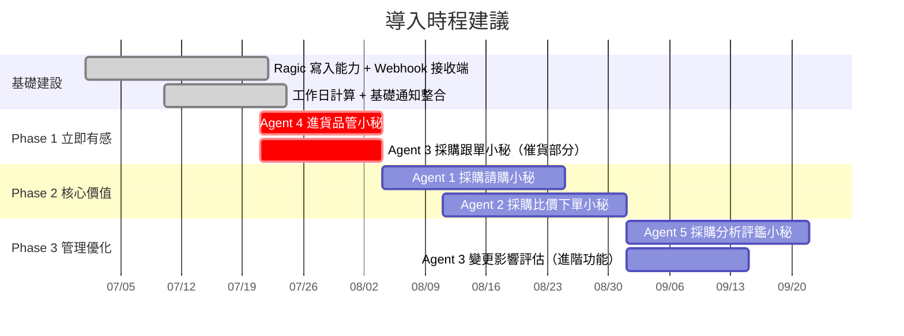
```mermaid
gantt
    title 導入時程建議
    dateFormat  YYYY-MM-DD
    axisFormat  %m/%d

    section 基礎建設
    Ragic 寫入能力 + Webhook 接收端         :done, infra1, 2026-07-01, 21d
    工作日計算 + 基礎通知整合                 :done, infra2, 2026-07-10, 14d

    section Phase 1 立即有感
    Agent 4 進貨品管小秘                     :crit, p1a, 2026-07-21, 14d
    Agent 3 採購跟單小秘（催貨部分）           :crit, p1b, 2026-07-21, 14d

    section Phase 2 核心價值
    Agent 1 採購請購小秘                     :p2, 2026-08-04, 21d
    Agent 2 採購比價下單小秘                 :p2b, 2026-08-11, 21d

    section Phase 3 管理優化
    Agent 5 採購分析評鑑小秘                 :p3, 2026-09-01, 21d
    Agent 3 變更影響評估（進階功能）           :p3b, 2026-09-01, 14d
```

### 為什麼 Phase 1 先做 Agent 4 和 3？

| 原因 | 說明 |
|------|------|
| **每天在用** | 進貨驗收和交期追蹤是**每週甚至每天**都會碰到的痛點 |
| **規則為主** | 這兩個 Agent 大部分是規則，**不需要等 AI 模型調好**就能上線 |
| **立即有感** | 倉管不用手 KEY 進貨單、採購不用人工催貨，使用者第一天就有感 |
| **依賴最少** | 不需要等 BOM 表建好、也不需要等供應商資料完整 |

> 💡 **先讓流程自動化跑起來，再慢慢加入 AI 建議**，使用者反而會覺得系統「越來越聰明」。

---

> **本文件對應 aibox-th 系統**（ABC Desktop），所有實作均遵循系統既有的開發規範與架構原則。
