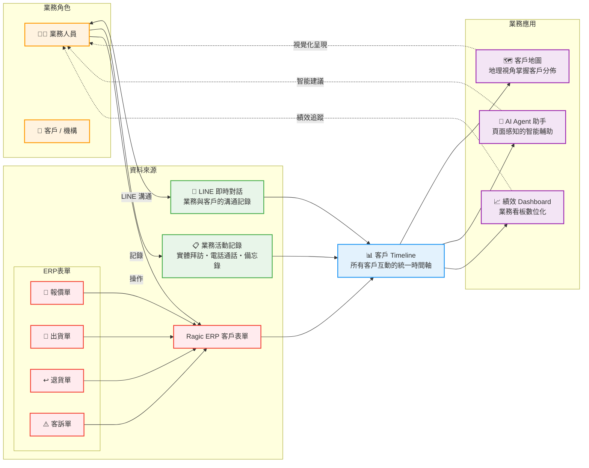

# EEA-CRM 需求洽談會議記錄

## 會議資訊

| 項目 | 內容 |
|------|------|
| **會議目的** | EEA-CRM 雛形展示與需求確認 |
| **日期** | 2026-06-12（五） |
| **時間** | 11:00 – 12:30 |
| **地點** | 台灣福祉 三樓會議室 |
| **與會人員** | 台灣福祉業務主管、顧問 Sandy、顧問 佳如、Daniel Chung |
| **記錄** | Daniel Chung |

---

## 會議摘要

本次會議展示 EEA-CRM 雛形，客戶端對「客戶地圖」的規劃方向極為滿意。會中提出三項核心需求，將以現有雛形為基礎進行功能擴充：

1. **客戶地圖深化** — 以衛福部全台業者資料作為潛在客戶資料庫，強化地圖互動
2. **LINE 助手** — 解決大量客戶/聯絡人之 LINE 對話管理與群發限制痛點
3. **績效 Dashboard** — 將現行業務看板搬上系統

---

## 需求一：客戶地圖深化

### 客戶需求與痛點

> 「希望從客戶地圖可以了解潛在客戶（從衛福部的所有業者，包含長照、居家照護等），點擊地圖上的點可以…」

| 需求 | 細節 |
|------|------|
| **① 客戶詳細資料** | 點擊地圖標記即可查看該機構完整資訊 |
| **② 互動 Timeline** | 查詢與該客戶所有歷史互動記錄 |
| **③ 預排拜訪** | 直接在地圖操作中安排拜訪行程 |
| **④ 附近/順路查詢** | 查看附近其他業者，規劃沿途可拜訪客戶 |

### 修改建議（以現有雛形為基礎）

#### 1. 資料層：導入衛福部公開機構清單

現有雛形已建立 Leaflet 地圖與機構標記架構，後續將資料源從 Mock 替換為政府開放資料：

| 資料集 | 來源 | 預估筆數 |
|--------|------|---------|
| 長照機構清單 | 衛福部長照司 | ~2,500 |
| 居家護理所 | 衛福部護理及健康照護司 | ~800 |
| 護理之家 | 衛福部 | ~600 |
| 各縣市立案機構 | 縣市社會局開放資料 | ~1,000+ |

- 後端建立排程 Job 定期同步，資料寫入 ArangoDB
- 前端地圖直接讀取資料庫，無需大幅改動現有地圖架構

#### 2. 互動層：點擊標記 → Drawer 三頁籤

現有 EeaCrmLayout 已有 Agent Drawer 機制，可直接沿用同一 Drawer 模式，點擊地圖標記後展開三個分頁：

| 頁籤 | 內容 | 現有資源 |
|------|------|---------|
| **📋 客戶詳情** | 機構基本資訊、ABC 分類、營業額、業務負責人、最近互動 | 參考 CustomerListPage 欄位結構 |
| **🗓️ Timeline** | 該客戶所有互動記錄（電話/拜訪/LINE/備忘） | 直接沿用 TimelinePage 元件 |
| **🗺️ 附近機構** | 半徑查詢（1/3/5km）+ 勾選多點自動規劃順路路線 | 新增空間查詢功能 |

#### 3. 拜訪預排

在 Drawer 中嵌入拜訪預排表單（日期 + 業務員 + 備註），提交後寫入資料庫，可 sync 至 Google/Outlook 行事曆。

---

## 需求二：LINE 助手

### 客戶需求與痛點

> 「提供一個 LINE 助手，可以管理與客戶的對話與客戶提出的信息，協助群發給客戶。」
>
> **痛點**：有 **3,000 個客戶及聯繫人**，LINE 的群發有**數量限制**，業務同仁目前需手動分批處理，耗時且容易遺漏

### LINE 群發限制說明

| LINE OA 方案 | 月費 | 群發上限 | 適用評估 |
|-------------|------|---------|---------|
| 免費版 | 免費 | 500 則/月 | ❌ 不足 |
| 輕用量方案 | ~NT$800/月 | 15,000 則/月 | 初期可 |
| 中用量方案 | ~NT$4,000/月 | 45,000 則/月 | ✅ 建議 |
| 企業方案 | 客製 | 無限制 | 量更大時考量 |

### 修改建議（以現有 Agent K 為基礎）

現有雛形中的 **Agent K（LINE 智慧客情助手）** 已建立對話框架與 Drawer 介面，以下為擴充方向：

#### 1. 對話管理

| 功能 | 說明 |
|------|------|
| **自動歸檔** | LINE Messaging API Webhook 串接 → 訊息自動歸檔至對應客戶/聯絡人 |
| **搜尋與標記** | 對話全文檢索 + 可自訂標籤（詢價/投訴/售後/催款等） |
| **AI 摘要** | 自動摘要每段對話重點，節省業務閱讀時間 |
| **待回覆提醒** | 超過設定時間未回覆的對話自動標記 |

#### 2. 群發管理（核心痛點）

```
業務選定受眾（依標籤/區域/ABC分類/自訂清單）
        │
        ▼
選擇發送範本（支援 {{機構名稱}} 個人化）
        │
        ▼
設定發送時間（立即 或 指定排程）
        │
        ▼
系統自動分批發送 → 失敗重試 → 完成報告
```

**群發痛點對應解決方案**：

| 痛點 | 解決方式 |
|------|---------|
| LINE 每月發送上限 | 後端配額管理，自動分配發送量 |
| 3,000 筆需手動分批 | 非同步佇列，系統自動批次（每批 200 則） |
| 無法分眾 | 支援多條件篩選：標籤、區域、ABC分類、上次互動時間 |
| 無法個人化 | 範本內嵌 `{{機構名稱}}` 等變數自動代入 |
| 無法追蹤成效 | 發送後報告（成功率 / 已讀率 / 點擊率） |

**三種發送模式**：即時發送、排程發送、週期發送（月/季報）

#### 3. Agent K 操作整合

既有 Agent K 直接作為 LINE 助手操作入口，在 Drawer 中即可：
- 查看未讀/待回覆對話列表
- 快速回覆 + 常用範本
- 發起群發任務、查看發送報告

---

## 需求三：績效 Dashboard

### 客戶需求

> 「對於績效統計 Dashboard，可以將目前業務看板需要搬上系統來」

**具體行動**：顧問 Sandy 與佳如協助收集現行業務看板內容（進行中）

### 修改建議（以現有 Dashboard 為基礎）

雛形 DashboardPage 已建置：
- ✅ KPI 總覽卡片（營業額、年增率、目標達成率、活躍客戶數）
- ✅ 區域/部門業績條狀圖
- ✅ 業務員業績 Top 10 排行
- ✅ 頁籤切換（客戶地圖 / 銷售業績統計）

#### 擴充方向（依顧問收集結果調整）

| 現有雛形 | 預計強化 |
|---------|---------|
| Mock 資料 | 串接 ArangoDB 實際 CRM 資料 |
| 固定版面 | 可拖曳 Widget（react-grid-layout） |
| 基本 KPI | 依現行業務看板補足指標 |
| 靜態圖表 | 趨勢圖、比較圖（Ant Design Charts） |
| - | 匯出 PNG / PDF / Excel |

---

## 開發時程初估

| 項目 | 預估工時 | 優先級 |
|------|---------|--------|
| 衛福部資料串接 + 地圖資料庫 | 2-3 週 | P0 |
| 地圖點擊 Drawer（客戶詳情 + Timeline） | 2 週 | P0 |
| 附近機構 / 順路拜訪 | 1.5 週 | P1 |
| 拜訪預排功能 | 1 週 | P1 |
| LINE Messaging API 整合 + 對話歸檔 | 2 週 | P0 |
| LINE 群發系統（佇列 + 排程 + 報告） | 3 週 | P0 |
| LINE 對話管理 UI + Agent K 擴充 | 2 週 | P1 |
| 績效 Dashboard 需求收集 | 顧問進行中 | P0 |
| Dashboard 資料串接 + Widget 強化 | 2-3 週 | P1 |

---

## 待辦事項

| # | 事項 | 負責人 | 預計完成 |
|---|------|--------|---------|
| 1 | 收集現行業務看板內容與指標定義 | Sandy / 佳如 | 2026-06-20 |
| 2 | 確認 LINE OA 方案選擇 | 業務主管 | 2026-06-16 |
| 3 | 盤點 CRM 需優先匯入的機構資料範圍 | 業務主管 + Sandy | 2026-06-18 |
| 4 | 整理 LINE 群發常用範本清單 | 業務主管 | 2026-06-20 |

---

## 業務架構



---

## 修改歷程

| 日期 | 版本 | 更新者 | 變更內容 |
|------|------|--------|----------|
| 2026-06-12 | 1.1.0 | Daniel Chung | 調整為以客戶需求與痛點為核心，以現有雛形為基礎提出修改建議 |
| 2026-06-12 | 1.0.0 | Daniel Chung | 初版 |
