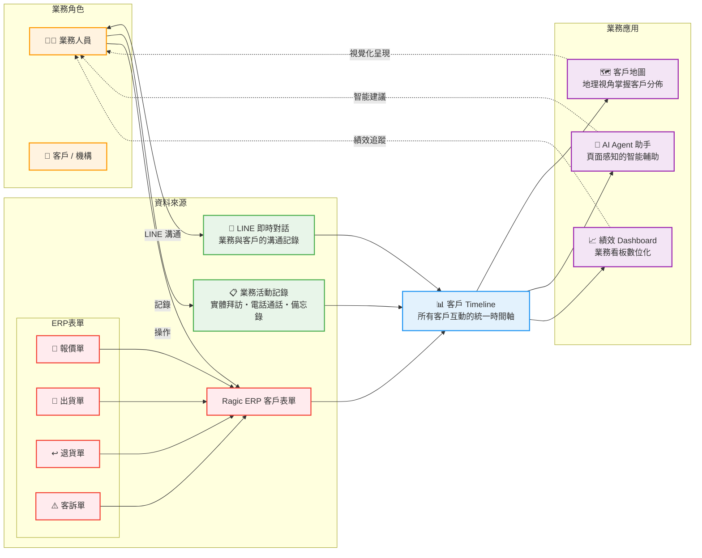

# EEA-CRM 業務架構圖

---

## 業務架構說明

### 資料來源（左側）

| 來源 | 內容 | 說明 |
|------|------|------|
| **💬 LINE 即時對話** | 業務人員與客戶/機構的 LINE 對話記錄 | 自動歸檔，形成溝通歷程 |
| **📋 業務活動記錄** | 業務人員自行記錄的客戶互動（實體拜訪、電話通話、備忘錄） | 補充 LINE 以外的互動 |
| **📄 Ragic ERP 表單** | 報價單、出貨單、退貨單、客訴單等客戶相關單據 | 客戶交易的正式記錄 |

### 核心機制（中間）

- **客戶 Timeline**：將上述三大資料來源彙整為統一的客戶互動時間軸，從「溝通記錄 → 業務活動 → 交易單據」一目了然

### 業務應用（右側）

| 應用 | 功能 | 使用者價值 |
|------|------|-----------|
| **🗺️ 客戶地圖** | 地理視角呈現客戶分佈、附近查詢、順路拜訪規劃 | 直覺掌握區域客戶狀況 |
| **🤖 AI Agent 助手** | 頁面感知的智能輔助，根據當前頁面推薦對應 Agent | 減少操作路徑，提升效率 |
| **📈 績效 Dashboard** | 業務看板數位化，即時掌握營收、業績排行與趨勢 | 數據驅動的業務管理 |
