# 76個世界名校的思考習慣 — 知識架構圖

> 使用 Mermaid `flowchart TB` 呈現完整知識體系
> 顏色對應：🟣 批判思考 | 🟡 創意思考 | 🟢 溝通思考 | 🔵 互動思考

```mermaid
flowchart LR
    %% ============================
    %% 根節點
    %% ============================
    ROOT["🧠 76 個世界名校的思考習慣"]

    %% ============================
    %% 樣式定義
    %% ============================
    classDef cat1 fill:#7B3FD4,color:#fff,stroke:#5A2FA0,stroke-width:3px
    classDef cat2 fill:#C47F0A,color:#fff,stroke:#9A6508,stroke-width:3px
    classDef cat3 fill:#1A9B50,color:#fff,stroke:#137A3E,stroke-width:3px
    classDef cat4 fill:#0098C4,color:#fff,stroke:#007A9E,stroke-width:3px
    classDef sub fill:#f5f5f5,stroke:#999,stroke-width:2px,stroke-dasharray:5 5
    classDef habit fill:#fff,stroke:#666,font-size:11px

    %% ============================
    %% 四大分類（直接從根節點連接）
    %% ============================
    ROOT --> C1["🟣 批判思考"]:::cat1
    ROOT --> C2["🟡 創意思考"]:::cat2
    ROOT --> C3["🟢 溝通思考"]:::cat3
    ROOT --> C4["🔵 互動思考"]:::cat4

    %% ========================================================================
    %% 分類 1：批判思考
    %% ========================================================================
    C1 --> SC1_1["分析問題"]:::sub
    C1 --> SC1_2["分析決策"]:::sub
    C1 --> SC1_3["分析資料"]:::sub
    C1 --> SC1_4["評估主張"]:::sub
    C1 --> SC1_5["評估理由"]:::sub

    %% 分析問題
    SC1_1 --> H1["拆解問題<br/>(#breakitdown)"]:::habit
    SC1_1 --> H2["賽局理論<br/>(#gametheory)"]:::habit
    SC1_1 --> H3["差距分析<br/>(#gapanalysis)"]:::habit
    SC1_1 --> H4["問對問題<br/>(#rightproblem)"]:::habit
    SC1_1 --> H5["變數控制<br/>(#variables)"]:::habit

    %% 分析決策
    SC1_2 --> H6["偏誤檢驗<br/>(#biasidentification)"]:::habit
    SC1_2 --> H7["偏誤緩解<br/>(#biasmitigation)"]:::habit
    SC1_2 --> H8["決策樹<br/>(#decisiontrees)"]:::habit
    SC1_2 --> H9["心理成因<br/>(#psychologicalexplanation)"]:::habit
    SC1_2 --> H10["目的<br/>(#purpose)"]:::habit
    SC1_2 --> H11["效用理論<br/>(#utility)"]:::habit

    %% 分析資料
    SC1_3 --> H12["信賴區間<br/>(#confidenceintervals)"]:::habit
    SC1_3 --> H13["相關性<br/>(#correlation)"]:::habit
    SC1_3 --> H14["敘述統計<br/>(#descriptivestats)"]:::habit
    SC1_3 --> H15["機率分布<br/>(#distributions)"]:::habit
    SC1_3 --> H16["機率理論<br/>(#probability)"]:::habit
    SC1_3 --> H17["迴歸分析<br/>(#regression)"]:::habit
    SC1_3 --> H18["顯著性檢定<br/>(#significance)"]:::habit

    %% 評估主張
    SC1_4 --> H19["情境脈絡<br/>(#context)"]:::habit
    SC1_4 --> H20["批判<br/>(#critique)"]:::habit
    SC1_4 --> H21["估計<br/>(#estimation)"]:::habit
    SC1_4 --> H22["詮釋視角<br/>(#interpretivelens)"]:::habit
    SC1_4 --> H23["合理性評估<br/>(#plausibility)"]:::habit
    SC1_4 --> H24["可驗證性<br/>(#testability)"]:::habit

    %% 評估理由
    SC1_5 --> H25["證據基礎<br/>(#evidencebased)"]:::habit
    SC1_5 --> H26["演繹推理<br/>(#deduction)"]:::habit
    SC1_5 --> H27["邏輯謬誤<br/>(#fallacies)"]:::habit
    SC1_5 --> H28["歸納推理<br/>(#induction)"]:::habit
    SC1_5 --> H29["來源品質<br/>(#sourcequality)"]:::habit

    %% ========================================================================
    %% 分類 2：創意思考
    %% ========================================================================
    C2 --> SC2_1["問題解決"]:::sub
    C2 --> SC2_2["應用研究方法"]:::sub
    C2 --> SC2_3["資料與探索"]:::sub

    %% 問題解決
    SC2_1 --> H30["科學學習法<br/>(#scienceoflearning)"]:::habit
    SC2_1 --> H31["限制條件<br/>(#constraints)"]:::habit
    SC2_1 --> H32["類比<br/>(#analogies)"]:::habit
    SC2_1 --> H33["演算法<br/>(#algorithms)"]:::habit
    SC2_1 --> H34["設計思考<br/>(#designthinking)"]:::habit
    SC2_1 --> H35["捷思法<br/>(#heuristics)"]:::habit
    SC2_1 --> H36["最佳化<br/>(#optimization)"]:::habit

    %% 應用研究方法
    SC2_2 --> H37["抽樣<br/>(#sampling)"]:::habit
    SC2_2 --> H38["個案研究<br/>(#casestudy)"]:::habit
    SC2_2 --> H39["比較組<br/>(#comparisongroups)"]:::habit
    SC2_2 --> H40["介入性研究<br/>(#interventionalstudy)"]:::habit
    SC2_2 --> H41["訪談式研究<br/>(#interviewsurvey)"]:::habit
    SC2_2 --> H42["觀察性研究<br/>(#observationalstudy)"]:::habit
    SC2_2 --> H43["可複製性<br/>(#studyreplication)"]:::habit

    %% 資料與探索
    SC2_3 --> H44["建立假說<br/>(#hypothesisdevelopment)"]:::habit
    SC2_3 --> H45["資料視覺化<br/>(#dataviz)"]:::habit
    SC2_3 --> H46["模型建構<br/>(#modeling)"]:::habit

    %% ========================================================================
    %% 分類 3：溝通思考
    %% ========================================================================
    C3 --> SC3_1["語言溝通"]:::sub
    C3 --> SC3_2["非語言溝通"]:::sub

    %% 語言溝通
    SC3_1 --> H47["受眾<br/>(#audience)"]:::habit
    SC3_1 --> H48["內容組織<br/>(#composition)"]:::habit
    SC3_1 --> H49["語義內涵<br/>(#connotation)"]:::habit
    SC3_1 --> H50["組織結構<br/>(#organization)"]:::habit
    SC3_1 --> H51["專業素養<br/>(#professionalism)"]:::habit
    SC3_1 --> H52["論點陳述<br/>(#thesis)"]:::habit

    %% 非語言溝通
    SC3_2 --> H53["溝通設計<br/>(#communicationdesign)"]:::habit
    SC3_2 --> H54["表達<br/>(#expression)"]:::habit
    SC3_2 --> H55["媒介選擇<br/>(#medium)"]:::habit
    SC3_2 --> H56["多媒體運用<br/>(#multimedia)"]:::habit

    %% ========================================================================
    %% 分類 4：互動思考
    %% ========================================================================
    C4 --> SC4_1["與他人合作"]:::sub
    C4 --> SC4_2["複雜系統互動"]:::sub
    C4 --> SC4_3["解決道德問題"]:::sub
    C4 --> SC4_4["談判和說服"]:::sub

    %% 與他人合作
    SC4_1 --> H57["一致性<br/>(#conformity)"]:::habit
    SC4_1 --> H58["個體差異<br/>(#differences)"]:::habit
    SC4_1 --> H59["情商<br/>(#emotionaliq)"]:::habit
    SC4_1 --> H60["領導原則<br/>(#leadprinciples)"]:::habit
    SC4_1 --> H61["權力動態<br/>(#powerdynamics)"]:::habit
    SC4_1 --> H62["當責<br/>(#responsibility)"]:::habit
    SC4_1 --> H63["自我覺察<br/>(#selfawareness)"]:::habit
    SC4_1 --> H64["制定策略<br/>(#strategize)"]:::habit

    %% 複雜系統互動
    SC4_2 --> H65["複雜因果關係<br/>(#complexcausality)"]:::habit
    SC4_2 --> H66["湧現<br/>(#emergentproperties)"]:::habit
    SC4_2 --> H67["多層次分析<br/>(#levelsofanalysis)"]:::habit
    SC4_2 --> H68["網絡分析<br/>(#networks)"]:::habit
    SC4_2 --> H69["系統動力學<br/>(#systemdynamics)"]:::habit
    SC4_2 --> H70["系統描繪<br/>(#systemmapping)"]:::habit

    %% 解決道德問題
    SC4_3 --> H71["倫理考量<br/>(#ethicalconsiderations)"]:::habit
    SC4_3 --> H72["倫理勇氣<br/>(#ethicalcourage)"]:::habit
    SC4_3 --> H73["倫理判斷<br/>(#ethicaljudgment)"]:::habit

    %% 談判和說服
    SC4_4 --> H74["談判協商<br/>(#negotiate)"]:::habit
    SC4_4 --> H75["說服技巧<br/>(#persuasion)"]:::habit
    SC4_4 --> H76["行為塑造<br/>(#shapingbehavior)"]:::habit
```



---

## 知識圖譜結構補充

### 節點統計

| 層級 | 類型                     | 數量 |
| ---- | ------------------------ | :--: |
| L0   | 根節點 (Root)            |  1  |
| L1   | 主分類 (Category)        |  4  |
| L2   | 子分類 (Subcategory)     |  14  |
| L3   | 思考習慣 (ThinkingHabit) |  76  |

### 關係類型

```
[ThinkingHabit] --belongs_to--> [Subcategory] --belongs_to--> [Category]
[ThinkingHabit] --has_tag--> [Hashtag]
[ThinkingHabit] --includes--> [ChecklistItem]
[ThinkingHabit] --applies_to--> [ApplicationScenario]
[ThinkingHabit] --related_to--> [ThinkingHabit]
```

### 分類色彩對照

| 主分類   | 標籤         | 顏色             |
| -------- | ------------ | ---------------- |
| 批判思考 | `批判思考` | `#7B3FD4` 紫色 |
| 創意思考 | `創意思考` | `#C47F0A` 金色 |
| 溝通思考 | `溝通思考` | `#1A9B50` 綠色 |
| 互動思考 | `互動思考` | `#0098C4` 藍色 |

---

*生成日期: 2026-06-18*
*來源: 76個世界名校的思考習慣 — AI超級大腦課*
*用途: 知識圖譜視覺化、結構化學習、AI RAG 檢索*
