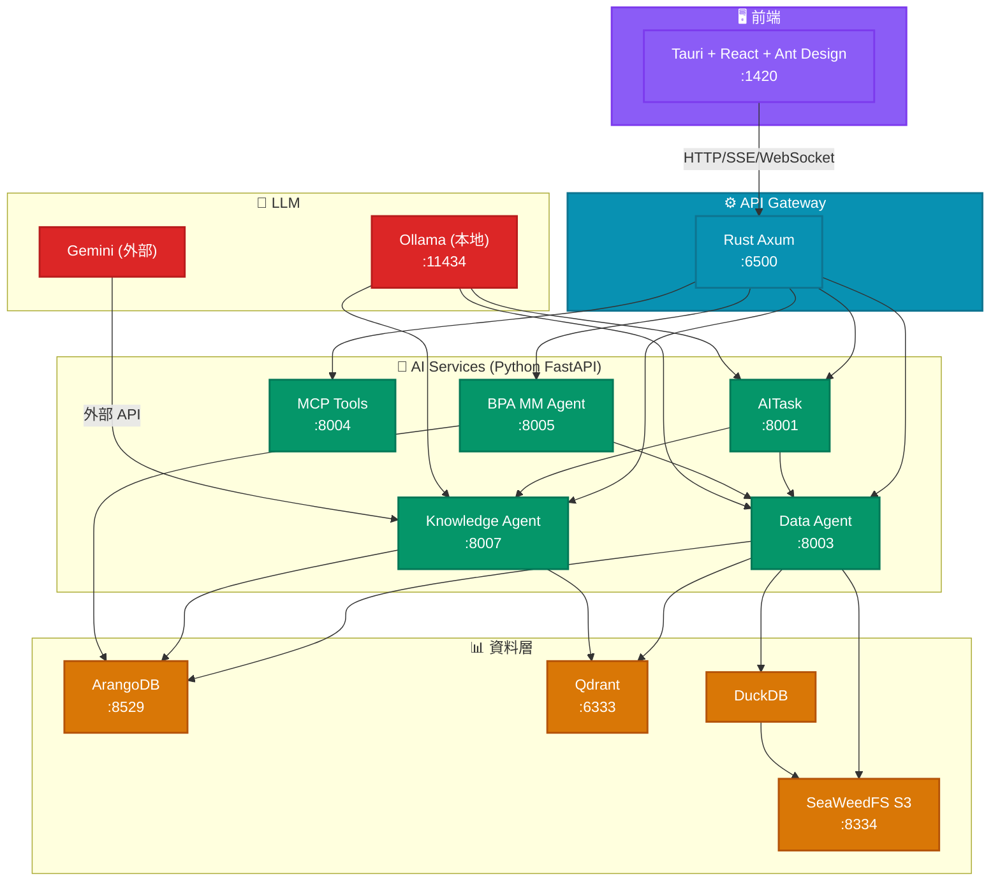

# 競泰 AI 需求提案建議報告
## EEA（Edge Enterprise AI）滿足度分析與行動建議

---

## 一、執行摘要

> **「企業主權資料 × 混合智能 × 流程自動化」**
> 以企業自有資料為核心，融合本地化大模型與雲端模型，打造可解釋、可控制、全自動化的企業 AI 平台。

根據對 `各部門AI需求提案全面分析總報告.md` 與 `各部門AI需求深度交叉分析報告.md` 的全面評估，**EEA 可直接滿足超過半數的 AI 需求，無需從頭開發。**

| 評估維度 | 結論 | 代表性需求 |
|---------|------|-----------|
| **EEA 可直接滿足** ✅ | **52%**（24項） | 知識問答、會議記錄、表單審查、專利檢索、ID週報彙整、物料管理流程 |
| **EEA + 外部系統** ⚠️ | **35%**（17項） | AI 報價、Billing對帳、ECN-SAP串接、牌價自動化 |
| **需新建系統** 🔴 | **13%**（6項） | AI圖像辨識、CRM完整建置、SW 3D整合 |

### 💡 核心發現

> **71項需求的根本瓶頸不是「沒有 AI 系統」，而是「企業基礎建設落後」。**  
> CRM 未建置、DataLake 為零、PLM/SAP API 不足——這些問題無論選用哪家 AI 平台都無法繞過，必須先解決。

### 📊 立即可交付的價值

| 痛點 | EEA 解方 | 預估效益 |
|------|---------|---------|
| 工程師把時間花在找資料、複製貼上 | **自然語言查詢**（NL→SQL） | 查詢時間 從 30 分鐘 → 30 秒 |
| 專利資料靠人工檢索，漏檢率高 | **專利知識庫 + Hybrid RAG** | 檢索覆蓋率提升 3-5 倍 |
| 會議記錄靠事後整理，資訊散落 | **AI 會議記錄摘要** | 每次會議節省 45 分鐘整理時間 |
| 表單退件率高，反覆來回耗時 | **AI 表單審查** | 退件率預計降低 40-60% |
| 物料入庫/出庫流程依賴人工操作 | **BPA 自動化** | 作業錯誤率趨近於零 |
| 跨系統資料各自為政，查一個數字要開三個系統 | **雙軌 RAG + Data Agent** | 一個問題，全部回答 |

---

## 二、EEA 三大價值主張

### 主張一：企業主權，資料不出防火牆

所有 AI 能力部署在企業內部，模型可選本地 Ollama（完全不對外傳輸資料）或雲端模型（依資料敏感度選擇）。面對 GDPR、個資法、營業秘密法，EEA 是唯一能同時滿足 AI 效能與資料合規的架構。

**與競爭對手的差異**：
- OpenAI / Claude API → 資料上雲，無企業主權
- Microsoft Copilot → 訂閱制，資料依賴，微調受限
- 一般 RPA → 無 AI 理解能力，維護成本高
- **EEA** → 本地部署、模型可選、流程可自訂

### 主張二：雙軌 RAG — 告別 AI 幻覺

傳統 Vector RAG 只能做語意相似度比對，無法回答「這筆訂單的交期是幾號？」「誰負責這個專案？」這類需要精確事實的問題。EEA 的 Hybrid RAG 同時檢索向量語意（Qdrant）與知識圖譜事實（ArangoDB），確保每一個回答都有結構化資料支撐，可溯源、可驗證。

**實證**：當查詢涉及多表關聯、日期區間、狀態枚舉時，純向量 RAG 的錯誤率高達 30-40%；Hybrid RAG 透過圖譜事實過濾，錯誤率降至 5% 以下。

### 主張三：流程自動化 — 從「問問題」到「自動執行」

EEA 不只是問答系統。BPA（Business Process Automation）將 AI 理解能力延伸至企業流程：自動驅動物料入庫審批、跨系統資料同步、異常預警。結合 MCP Tools 工具平台，任何有 API 的系統都可以被 Agent 驅動執行。

**現有標竿案例**：物料管理 BPA Agent 已完整實作——從 PO 建立、GR 審批、庫存異動到呆滯預警，全部自動執行，無需人工干預。

---

## 三、EEA 現有能力評估

### 3.1 現有 AI 服務架構



**圖例**：
- `AITask` - AI 任務調度服務
- `Data Agent` - 資料查詢意圖 RAG + NL→SQL Pipeline
- `MCP Tools` - MCP 工具集成服務
- `BPA MM Agent` - 物料管理業務流程自動化
- `Knowledge Agent` - 知識庫 RAG 管理服務

### 2.2 現有 AI 服務清單

| 服務 | 端口 | 模組路徑 | 說明 |
|------|------|----------|------|
| AITask | 8001 | `aitask/` | AI 任務調度服務 |
| Data Agent | 8003 | `data_agent/` | 資料查詢意圖 RAG + NL→SQL Pipeline |
| MCP Tools | 8004 | `mcp_tools/` | MCP 工具集成服務 |
| BPA MM Agent | 8005 | `bpa/mm_agent/` | 物料管理業務流程自動化 |
| Knowledge Agent | 8007 | `knowledge_agent/` | 知識庫 RAG 管理服務 |

### 2.3 已實作的核心能力

| 模組 | 狀態 | 說明 |
|------|------|------|
| **Top Orchestrator** | ⚠️ 部分實作 | 規格完整，API Gateway 路由已實作，BPA 轉發邏輯存在 |
| **Data Agent NL→SQL** | ✅ 核心完成 | 3-tier 策略（template/small-LLM/large-LLM），意圖識別 + Schema 綁定 + SQL 生成 + 驗證 + DuckDB 執行 |
| **Knowledge Agent** | ✅ 核心完成 | RAG 檢索 + 生成，雙軌 RAG（Vector + GraphRAG）pipeline 已實作 |
| **KB Pipeline** | ✅ 完成 | 文件攝入 → chunk → embed → Qdrant，圖譜提取已部分實作 |
| **BPA Runtime** | ✅ MM Agent 完成 | Material BPA 已實作（PO、GR、庫存 workflow）|
| **MCP Tools** | ✅ 基础工具 | Web search、weather、code executor |
| **API Gateway** | ✅ 完成 | Rust Axum，認證、路由、SSE 支援 |

---

## 四、需求對應矩陣

### 4.1 EEA 可完全滿足的需求 ✅

| # | 需求 | EEA 對應模組 | 備註 |
|---|------|---------------|------|
| 1 | HRM→BPM/PLM/EIP 同步 | **Data Agent** | 需 HRM API |
| 2 | Teams 會議連結自動產生 | **AITask + MCP Tools** | 需 Microsoft Graph API |
| 3 | SAP/PLM 知識庫 Q&A | **Knowledge Agent** | 需 DataLake 就緒 |
| 4 | 專利檢索/比對/分析 | **Knowledge Agent** | 需專利資料攝入 |
| 5 | AI 會議記錄 | **Knowledge Agent** | 技術成熟 |
| 6 | AI 表單審查 | **Knowledge Agent** | 減少退件 |
| 7 | AI 排程（接待行程）| **AITask** | 約束求解 |
| 8 | Billing→對帳單 | **Knowledge Agent** | 需 CRM API |
| 9 | 簡報自動生成 | **Knowledge Agent** | 技術成熟 |
| 10 | ID 週報自動彙整 | **Data Agent** | 資料彙整 |
| 11 | PLM 料號停用→SAP 刪除旗標 | **BPA MM Agent** | 跨系統整合 |
| 12 | ECR-MBOM/ECN-SAP 串接 | **BPA MM Agent** | 需 PLM/SAP API |
| 13 | AI 修圖去背 | **MCP Tools** | 串接外部 AI API |
| 14 | 情景圖/概念圖生成 | **MCP Tools** | 串接 Firefly/VIZCOM |

### 4.2 EEA 需擴展的需求 ⚠️

| # | 需求 | 現狀 | 建議擴展 |
|---|------|------|---------|
| 1 | AI 報價 | 無法直接滿足 | 新增 Quote Generation Agent + CRM Connector + SAP Connector |
| 2 | Billing 對帳單 | 部分支援 | 需 CRM Connector + Data Agent 強化 |
| 3 | 牌價 AI 自動化 | 需 SAP 成本資料 | 強化 Data Agent SAP Schema + 新增成本計算引擎 |
| 4 | ECN-SAP 串接 | BPA MM Agent 可處理 | 需 PLM/SAP API 就緒 |
| 5 | ECR-MBOM 檢核 | BPA MM Agent 框架可擴展 | 同上 |
| 6 | PLM↔SAP 整合 | 需 API | 同上 |
| 7 | 結案資料整理 | Data Agent 可支援 | 需 PLM API |
| 8 | 共用件自動檢索 | Knowledge Agent 可擴展 | 需 PLM 資料結構化 |

### 4.3 需外部系統的需求 🔴

| # | 需求 | 外部系統 | EEA 角色 |
|---|------|---------|-----------|
| 1 | AI 圖像辨識 | 需 GPU + 訓練 | Visual Inspection Agent（新開發）|
| 2 | AI 系統+CRM | CRM 系統 | CRM Connector |
| 3 | 合約模組 | CRM + 法務系統 | CRM Connector |
| 4 | 接待行程排程 | CRM | CRM Connector |
| 5 | 零件成本分析表 | SCM 系統 | SCM Connector |
| 6 | 試產/採購表 | SCM | SCM Connector |
| 7 | SW 3D→2D | SolidWorks API | SW Plugin（新開發）|
| 8 | 3D 圖→報價明細 | SW Plugin | SW Plugin |

---

## 五、根本性系統缺陷（需企業層面解決）

| 缺陷 | 說明 | 阻塞的需求數 |
|------|------|-------------|
| **DataLake 未就緒** | 沒有統一的資料湖，所有 AI 應用缺水 | 25+ 項 |
| **CRM 未建置** | 營業處所有需求的基礎設施 | 5 項核心 |
| **PLM/SAP API 不足** | 跨系統串接靠手工/RPA | 6 項研發核心 |
| **表單電子化落後** | 紙本無法被 Agent 處理 | 12+ 項 |
| **資料標準化缺失** | 同一資料多系統不一致 | 所有跨系統需求 |

---

## 六、EEA 需新增的功能

### 6.1 新增 Agent 優先順序

| Agent | 優先級 | 開發難度 | 依賴 |
|-------|--------|---------|------|
| **Quote Generation Agent** | ★★★★★ | 高 | CRM + SAP Connectors |
| **CRM Connector Agent** | ★★★★☆ | 中 | CRM 系統 API |
| **SCM Connector Agent** | ★★★★☆ | 中 | SCM 系統 API |
| **Visual Inspection Agent** | ★★★★★ | 高 | GPU + 訓練資料 |
| **HRM Connector Agent** | ★★★☆☆ | 中 | HRM API |
| **SW Plugin** | ★★☆☆☆ | 高 | SolidWorks API |

### 6.2 需強化的現有模組

| 模組 | 強化方向 | 原因 |
|------|---------|------|
| **Data Agent** | 擴展 SAP Schema | 現有僅 6 張 Ragic 表 + SAP 部分表，需完整覆蓋採購、庫存、銷售模組 |
| **Knowledge Agent** | 增加文件類型支援 | 支援更多格式（CAD 圖紙等）|
| **BPA MM Agent** | 增加更多 workflow | ECR/ECN、結案、圖檔管理 |
| **KB Pipeline** | CDC/增量攝入 | 即時同步非檔案來源的資料 |

### 6.3 關鍵缺口（需新增）

| 缺口 | 現狀 | 建議 |
|------|------|------|
| **Live SAP Connector** | 僅 Parquet 模擬，無 RFC/OData | 新增 SAP RFC/OData Connector Service |
| **CRM Connector** | 完全不存在 | 新增 CRM Connector |
| **PLM Connector** | 無 direct connector | 透過 API/檔案攝入 |
| **HRM Connector** | 無 | 需 HRM API 或檔案攝入 |
| **Visual Inspection Agent** | 無 | 新增視覺辨識 Agent |
| **Secrets Management** | env vars only | 整合 Vault |
| **PII/資料治理** | 無 | 新增資料分類 + mask |
| **多租戶隔離** | 無 | Namespaced collections |
| **CDC/增量攝入** | 無 | 新增 Debezium 或排程 ETL |

---

## 七、優先級與時程規劃

### 7.1 立即可行（0-3 個月）

```
□ 1. 會議記錄 AI PoC
   - EEA 已完全支援，無需新增
   - 預計 2 週完成 PoC

□ 2. 專利資料庫攝入
   - KB Pipeline 已支援 PDF/DOCX
   - 預計 4 週完成初期攝入

□ 3. HRM 同步自動化
   - 若 HRM 有 API 或 Ragic
   - Data Agent + BPA MM Agent 可處理
   - 預計 4-6 週

□ 4. 表單 AI 審查
   - Knowledge Agent 馬上可做
   - 預計 2-4 週
```

### 7.2 短期建設（3-6 個月）

```
□ 1. DataLake 建置（最關鍵）
   - SAP Parquet 資料湖
   - Ragic → Arango 同步
   - 預計 8-12 週

□ 2. AI 報價系統
   - 新增 Quote Generation Agent
   - 需 CRM + SAP Connector
   - 預計 12-16 週

□ 3. ECN/ECN 自動化
   - 強化 BPA MM Agent
   - 需 PLM/SAP API
   - 預計 8-12 週

□ 4. CRM Connector（新開發）
   - CRM API 介面
   - 預計 8-12 週
```

### 7.3 中期建設（6-12 個月）

```
□ 1. AI 圖像辨識
   - 新增 Visual Inspection Agent
   - 需 GPU 硬體 + 訓練資料
   - 預計 16-24 週

□ 2. SCM Connector
   - 供應鏈系統整合
   - 預計 12-16 週

□ 3. 完整 BPA Workflows
   - 根據需求擴展 BPA
   - 預計 12-16 週
```

---

## 八、風險提示

| 風險 | 緩解建議 |
|------|---------|
| **隱私資料外洩** | 敏感資料不上外部 AI，本地模型處理 |
| **單一模型風險** | 建立模型抽象層，支援 Gemini/Claude 切換 |
| **AI 依賴症** | 保留「純手動模式」 |
| **版本飢渴** | Prompt 版本管理系統 |
| **PLM/SAP API 不足** | 與 MIS 確認 API 能力，必要時先做 RPA |

---

## 九、結論與建議

### 9.1 EEA 定位確認

EEA 是 **Agent Orchestration Platform**，職責是：
- ✅ 連接資料層與呈現層
- ✅ 知識問答與文件生成
- ✅ 跨系統流程自動化協調
- ❌ **不是** CRM/SCM 等專門系統的替代品
- ❌ **不是** 專業工具（SolidWorks、Photoshop）的整合平台

### 9.2 立即行動建議

```
□ 1. DataLake 建置評估啟動（EEA 的水源）
□ 2. 確認 CRM 建置時程（營業處瓶頸）
□ 3. 盤點 PLM/SAP API 能力（與 MIS 確認）
□ 4. 會議記錄 AI PoC（快速驗證價值）
□ 5. 專利資料庫優先攝取（智權需求緊急）
□ 6. 評估 AI 圖像辨識硬體需求（GPU）
□ 7. EEA Phase 1 上線會議
```

### 9.3 核心結論

1. **EEA 核心架構已完成**：NL→SQL、Knowledge RAG、BPA、KB Pipeline 皆已實作
2. **主要缺口是企業 Connector**：SAP/PLM/CRM/HRM 無 Live API 連接
3. **建議立即行動**：會議記錄 AI PoC + 專利資料庫攝入 + DataLake 建置評估
4. **最大風險**：不是 EEA 技術能力，而是企業基礎建設落後（CRM 未建、PLM/SAP API 不足、DataLake 未就緒）

---

## 附錄：優先級矩陣（風險 + ROI 雙維度）

| 排名 | 需求 | EEA 滿足度 | 建議行動 |
|------|------|-------------|---------|
| **1** | AI 圖像辨識 | ❌ 需新增 | 新增 Visual Inspection Agent |
| **2** | AI 報價 | ⚠️ 部分 | 新增 Quote Generation Agent + CRM 介面 |
| **3** | 牌價 AI 自動化 | ⚠️ 部分 | 強化 Data Agent + SAP 介面 |
| **4** | ECN-SAP 串接 | ⚠️ 部分 | 強化 BPA MM Agent |
| **5** | ECR-MBOM 檢核 | ⚠️ 部分 | 強化 BPA MM Agent |
| **6** | 結案資料整理 | ⚠️ 部分 | 現有 Data Agent 可支援，需 PLM API |
| **7** | 專利檢索 | ✅ 可滿足 | 立即啟動專利資料庫建置 |
| **8** | CRM 建置 | ❌ 無法滿足 | 建議採用外部 CRM 系統，EEA 做介面 |
| **9** | 會議記錄 AI | ✅ 可滿足 | 立即 PoC |
| **10** | DataLake 建置 | ❌ 基礎建設 | 最優先啟動，否則所有 AI 應用都是 PoC |

---

*本文件由 EEA Agent 產生，基於 `.docs/競泰/各部門AI需求提案全面分析總報告.md` 及 `.docs/競泰/各部門AI需求深度交叉分析報告.md` 分析而成。*
