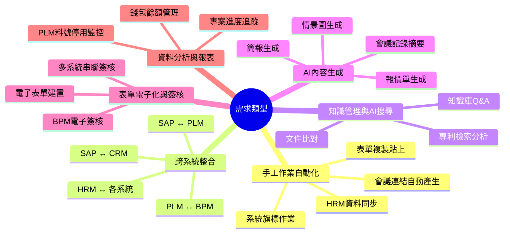
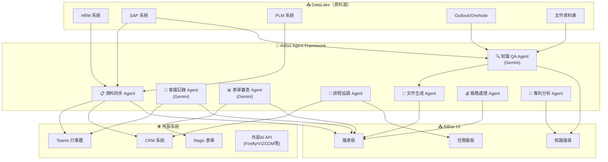
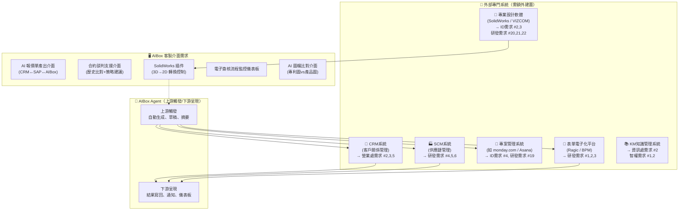
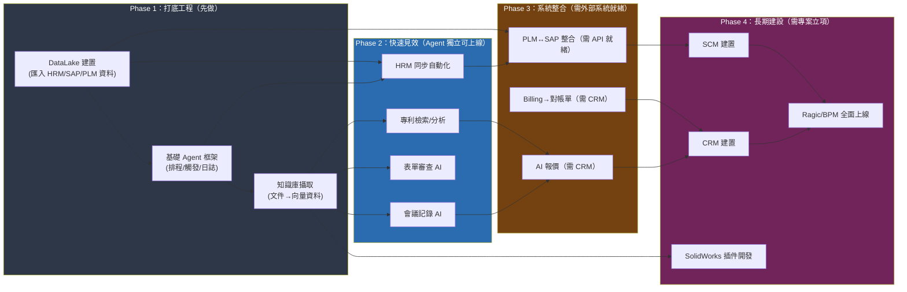

# AI需求提案分類與AIBox功能對應報告

## 文件資訊

| 項目 | 內容 |
|------|------|
| 依據來源 | AI需求提案匯整表-20251021-r1(SANDY建議).xlsx |
| 資料範圍 | 8 個工作表，共 151 列資料 |
| 分析目的 | 將各部門 AI 需求分類，並對齊 AIBox 系統能力，明確區分「AIBox Agent 可解決」與「需其他系統/介面」的需求 |
| 產生日期 | 2026-04-03 |

---

## 一、需求分類框架

本報告採用「三維度分類法」，從三個不同視角交叉分析所有需求：

### 1.1 按問題類型分類



### 1.2 按提出部門分類

| 部門 | 需求數 | 主要問題類型 |
|------|--------|------------|
| 資訊處 | 3 | 跨系統同步、知識庫建立、會議自動化 |
| 營業處 | 9 | AI報價、合約管理、CRM整合、AI行程、對帳單自動化、會議記錄AI、報銷AI |
| 產品企劃處 | 1 | 牌價自動化 |
| 智權法務 | 4 | 專利檢索、比對分析、草稿撰寫、審查回應 |
| ID | 4 | AI修圖去背、情景圖生成、概念圖生成、專案資料整合 |
| 研發 | 30+ | 表單電子化、表單AI審查、PLM/SAP整合、ECR/ECN自動化、會議AI、3D工具、專案管理 |

---

## 二、需求全景分類表

### 2.1 資訊處（3項）

| # | 作業名稱 | 原作業內容 | 預期效果 | 問題分類 | SANDY建議 |
|---|---------|-----------|---------|---------|----------|
| 1 | BPM/PLM/EIP 人員與組織資料同步 | 人工建立人員組織資料，費時易錯 | 自動化 | 手工作業自動化 | RPA/N8N/MAKE |
| 2 | SAP與PLM知識庫建立 | 問題處理知識散落各處，不易查找傳承 | 加快搜尋 | 知識管理 | KM系統 |
| 3 | Teams視訊會議連結自動產生 | 需聯繫資訊處建立會議，平均75分鐘 | 縮短至5分鐘 | 手工作業自動化 | 共用行事曆 |

### 2.2 營業處（9項）

| # | 作業名稱 | 原作業內容 | 預期效果 | 問題分類 | SANDY建議 |
|---|---------|-----------|---------|---------|----------|
| 1 | AI報價 | 規格確認、多表查詢、跨部門詢問，每件60分鐘 | 縮短至5分鐘 | AI內容生成 | AI+後台系統 |
| 2 | 合約模組 | 協商依賴經驗、記錄零散，每件2小時 | 縮短至30分鐘 | AI內容生成 | 談判知識庫+CRM |
| 3 | AI系統+CRM | 潛在客戶資料分散、人工追蹤，每件30分鐘 | 縮短至5分鐘 | 跨系統整合 | CRM+SAP同步 |
| 4 | AI排程（接待行程） | 接待安排依賴人工溝通，每次5小時 | 縮短至1小時 | 手工作業自動化 | AI行程工具+表單 |
| 5 | SAP訂單自動傳真/Email | 列印→傳真→確認，每張6分鐘 | 縮短至1分鐘 | 手工作業自動化 | CRM+SAP同步 |
| 6 | Billing自動轉對帳單 | 手工製作對帳單，每月540小時 | 縮短至60分鐘 | 手工作業自動化 | CRM+SAP同步 |
| 7 | 拜訪與會議紀錄AI | 錄音後手工key in，每件60分鐘 | 縮短至10分鐘 | AI內容生成 | CRM+AI會議工具 |
| 8 | 報銷單據AI整理 | 報銷單据厚如書本，耗時數天 | 大幅縮短 | AI內容生成 | 業務外勤系統 |
| 9 | 牌價AI自動化 | 匯率/管銷變動無法逐一檢查，毛利失控 | 每件60分鐘→5分鐘 | AI內容生成+跨系統整合 | CRM+SAP同步 |

### 2.3 智權法務（4項）

| # | 作業名稱 | 原作業內容 | 預期效果 | 問題分類 | SANDY建議 |
|---|---------|-----------|---------|---------|----------|
| 1 | 專利檢索 | 手動組字、逐案查閱各國資料庫，每案1.5~2天 | 每案節省6小時 | 知識管理與AI搜尋 | 自然語言檢索 |
| 2 | 專利比對與權利分析 | 手動下載逐條比對，缺乏分類與歷史 | 每案節省4小時 | 知識管理與AI搜尋 | 比對+分類工具 |
| 3 | 專利草稿撰寫 | Claim撰寫依賴經驗、多次修改 | 每案節省6小時 | AI內容生成 | AI輔助撰寫 |
| 4 | 審查意見回應 | 通讀後撰寫，易漏重要點 | 每件節省1.5小時 | AI內容生成 | AI輔助回應 |

### 2.4 ID（4項）

| # | 作業名稱 | 原作業內容 | 預期效果 | 問題分類 | SANDY建議 |
|---|---------|-----------|---------|---------|----------|
| 1 | AI修圖，自動去背 | 產品渲染圖需人工去背，每張5~10分鐘 | 縮短至2分鐘 | AI內容生成 | AI去背工具 |
| 2 | 情景圖生成 | 需找圖庫、考慮版權、修圖結合，每月20張 | 縮短至10~20分鐘 | AI內容生成 | AI生圖工具 |
| 3 | 設計概念圖面生成 | 3D概念提案慢，反覆重作 | 縮短40~60分鐘 | AI內容生成 | VIZCOM/Firefly等 |
| 4 | ID週報/開案進度整合系統 | 設計師每周填寫周報30分鐘，彙整2小時 | 省160小時/年 | 手工作業自動化 | 專案管理系統 |

### 2.5 研發（30+項）

| # | 作業名稱 | 原作業內容 | 預期效果 | 問題分類 | SANDY建議 |
|---|---------|-----------|---------|---------|----------|
| 1 | 開模檢討表電子簽核 | 紙本走3~5工作天 | 縮短至2天 | 表單電子化與簽核 | Ragic表單電子化 |
| 2 | 模型採購驗收單電子表單 | 紙本請購及簽核驗收 | 縮短至1天 | 表單電子化與簽核 | Ragic/RPA |
| 3 | 試產管制表BPM電子化 | 紙本→各廠間走動送簽 | 減少紙張+走動 | 表單電子化與簽核 | Ragic |
| 4 | 零件成本分析表自動生成 | 廠商報價→人工key in公司表單 | 15~30分→5分鐘 | 手工作業自動化 | SCM系統 |
| 5 | 試產單/樣品採購表電子化 | 人攜帶紙本送簽，常撲空 | 15~30分→5分鐘 | 表單電子化與簽核 | SCM系統 |
| 6 | AI自動辨識專案錢包餘額 | 需手工查詢對帳 | 60分→30分鐘 | 資料分析與報表 | SCM系統 |
| 7 | PLM/SAP單據建立問題 | 表單填寫要求不一致，常被退件 | 30分→10分鐘 | 手工作業自動化 | 先梳理表單再RPA |
| 8 | 外型設計（機構vs ID） | 前期需多次溝通 | 1~3小時→30分鐘 | AI內容生成 | AI設計軟體 |
| 9 | AI表單審查（退件輔助） | 退件率高，需多次往返 | 120分→30分鐘 | AI內容生成 | AI輔助校對 |
| 10 | 製作簡報 | 蒐集資料→消化→表達 | 1~2小時→30分鐘 | AI內容生成 | Gamma |
| 11 | AI會議記錄 | 撰寫→編修→簽核→發行 | 120分→60分鐘 | AI內容生成 | NotebookLM |
| 12 | AI會議翻譯 | 語言能力不一，需業務協助翻譯 | 120分→60分鐘 | AI內容生成 | 即時翻譯工具 |
| 13 | AI會議邀請（衝突檢測） | 來回確認開會時間 | 60分→30分鐘 | 手工作業自動化 | 行事曆整合 |
| 14 | PLM料號停用→SAP刪除旗標 | 需多次手動檢查庫存 | 自動化 | 跨系統整合 | SAP+PLM一致性 |
| 15 | PLM零組件填寫 | SAP內容需重複填寫至PLM | 0.6小時→0.3小時 | 手工作業自動化 | 系統欄位對應 |
| 16 | ECR-MBOM開單風險 | 未完整放入MBOM需重開ECR | 15分→3分鐘 | 跨系統整合 | 資料管理 |
| 17 | ECR-料件失效處理優化 | 失效料件需手動更新MBOM | 15分→3分鐘 | 跨系統整合 | 系統綁定 |
| 18 | ECN-失效料/BOM與SAP串接 | 失效料需人工至SAP確認庫存→上刪除旗標 | 10分→0分鐘 | 跨系統整合 | 自動檢查機制 |
| 19 | 專案進度排程與提醒 | 每周手工填報周報 | 30~60分→10~20分鐘 | 手工作業自動化 | 專案管理系統 |
| 20 | SolidWorks 3D轉CAD 2D | 需跨軟體設定視圖標註 | 10~30分→5分鐘 | AI內容生成 | SW自動轉檔 |
| 21 | 共用件自動檢索 | 憑個人記憶或人工搜尋 | 5~15分→2分鐘 | 知識管理與AI搜尋 | PLM搜尋 |
| 22 | 3D圖自動生成報價明細 | 需手動轉檔、做零件明細、稱重 | 10~20分→3分鐘 | 手工作業自動化 | SW自動化 |
| 23 | 結案資料整理上傳PLM | 整理圖檔、文件、樣品承認等上傳 | 每案24小時→8小時 | 手工作業自動化 | 分類輔助工具 |
| 24 | PLM打樣單與料號申請單關聯 | 需手動來回填寫單號 | 5分→1分鐘 | 手工作業自動化 | 流程優化 |
| 25 | 數據收集與篩選（專利/材料） | 需花時間人工查閱 | 1小時→10分鐘 | 知識管理與AI搜尋 | 專利庫爬蟲 |
| 26 | PLM與SAP系統整合 | PLM→SAP需兩套系統切換 | 20~30分→5分鐘 | 跨系統整合 | RPA拋單轉單 |
| 27 | PLM複製編修功能優化 | 無法複製編修、系統運算慢 | 10分→5分鐘 | 表單電子化與簽核 | PLM功能優化 |
| 28 | PLM工程圖檔保護機制 | 圖檔損毀後需人工核實 | 30~40分→5分鐘 | 手工作業自動化 | 備份+保護機制 |

---

## 三、AIBox 功能對應矩陣

### 3.1 AIBox 可滿足的需求 — Agent 可解決

> 以下需求可透過 **AIBox Agent Framework** 實現，核心邏輯為：
> - **觸發條件** → **Agent 判斷** → **執行工具/呼叫 API** → **產出結果**



#### 可由 AIBox Agent 滿足的完整清單

| # | 需求名稱 | 實作方式 | 對應 Agent | 所需外部依賴 |
|---|---------|---------|-----------|------------|
| 1 | HRM→BPM/PLM/EIP 同步 | Agent 排程觸發，讀取 HRM API 寫入各系統 | **資料同步 Agent** | HRM API、各系統寫入權限 |
| 2 | Teams 會議連結自動產生 | Agent 監聽行事曆事件，自動建立連結 | **排程協調 Agent** | Microsoft Graph API |
| 3 | SAP/PLM 知識庫 Q&A | Agent 接收自然語言，查詢 DataLake 知識庫 | **知識 QA Agent (Gemini)** | DataLake 資料就緒 |
| 4 | 專利檢索 | Agent 解析查詢意圖，搜尋專利資料庫 | **專利分析 Agent (Gemini)** | 專利資料攝入 DataLake |
| 5 | 專利比對與權利分析 | Agent 擷取權利範圍並彙整差異 | **專利分析 Agent (Gemini)** | 專利資料攝入 DataLake |
| 6 | 專利草稿/摘要撰寫 | Agent 依據檢索結果生成草稿 | **文件生成 Agent (Gemini)** | - |
| 7 | AI 會議記錄 | Agent 處理音檔，呼叫 Gemini 轉譯摘要 | **會議記錄 Agent (Gemini)** | 錄音設備/會議系統 API |
| 8 | AI 會議翻譯 | Agent 即時語音轉譯+翻譯 | **會議記錄 Agent (Gemini)** | 即時語音 API |
| 9 | AI 會議邀請衝突檢測 | Agent 查詢所有與會人行事曆，檢測衝突 | **排程協調 Agent** | Microsoft Graph API |
| 10 | Billing → 對帳單自動生成 | Agent 抓取 Billing 資料，生成對帳單 PDF/Mail | **帳務處理 Agent** | Billing 系統 API |
| 11 | AI 表單審查 | Agent 接收表單內容，Gemini 檢核必填/邏輯 | **表單審查 Agent (Gemini)** | 表單系統 API |
| 12 | AI 修圖去背 | Agent 接收圖檔，呼叫外部 AI API 去背 | **圖檔處理 Agent** | 外部 AI 去背 API |
| 13 | 情景圖/概念圖生成 | Agent 接收需求描述，呼叫外部 AI 生圖 | **圖檔處理 Agent** | 外部 AI 生圖 API |
| 14 | ID 週報自動彙整 | Agent 彙整各設計師進度，生成週報 | **資料彙整 Agent** | ID 週報系統或 DataLake |
| 15 | 簡報自動生成 | Agent 接收主題與大綱，Gemini 生成簡報內容 | **文件生成 Agent (Gemini)** | Gamma API 或 Markdown 匯出 |
| 16 | PLM 料號停用→SAP 刪除旗標 | Agent 監控 PLM 停用事件，檢查 SAP 庫存，自動上刪除旗標 | **跨系統整合 Agent** | PLM API、SAP API |
| 17 | ECR-MBOM 開單風險提示 | Agent 在 ECR 開單時自動檢核 MBOM 完整性 | **跨系統整合 Agent** | PLM API |
| 18 | ECN-失效料與 SAP 串接 | Agent 監控 ECN，自動檢查 SAP 庫存→執行刪除旗標 | **跨系統整合 Agent** | PLM API、SAP API |
| 19 | PLM 零組件自動欄位對應 | Agent 在建立零組件時自動帶入對應欄位 | **資料同步 Agent** | PLM API、SAP API |
| 20 | 專案進度排程與提醒 | Agent 彙整專案狀態，發送進度提醒 | **排程協調 Agent** | 專案管理系統 API |
| 21 | 接待行程 AI 排程 | Agent 根據約束條件（餐廳/人數/時間）生成行程 | **排程協調 Agent** | - |
| 22 | 共用件自動檢索 | Agent 接收規格描述，從 DataLake/PLM 搜尋可用件 | **知識 QA Agent (Gemini)** | PLM 資料已結構化 |
| 23 | PLM打樣單與料號申請單自動關聯 | Agent 監聽料號申請單送出事件，自動寫回打樣單 | **跨系統整合 Agent** | PLM API |
| 24 | AI 牌價自動化 | Agent 讀取 SAP 成本/匯率，Gemini 計算建議售價 | **知識 QA Agent (Gemini)** | SAP API |

> **統計**：AIBox Agent 可覆蓋 **24 項需求**，約佔總需求的 **52%**

---

### 3.2 AIBox 無法完全滿足的需求 — 需其他系統或客製介面

> 以下需求涉及複雜的 UI 互動、專業軟體整合、或需要專門系統，**AIBox Agent 層無法獨立完成**，需搭配專門工具或額外開發客製介面。



#### 需外部專門系統的完整清單

| # | 需求名稱 | 所需外部系統 | AIBox 的角色 | 原因說明 |
|---|---------|------------|------------|---------|
| 1 | **AI 報價** | CRM + SAP | Agent 生成報價草稿，CRM 呈現最終報價單 | 報價涉及報價單格式設計、審核流程、版本管理，需 CRM 系統完整支援 |
| 2 | **合約模組** | CRM + 法務系統 | Agent 提供歷史合約比對、策略建議 | 合約談判涉及多人協作、版本比對、法定效力，需專門 CRM/法務系統 |
| 3 | **AI系統+CRM（潛在客戶開發）** | CRM 系統 | Agent 自動分類客戶、分群、發送追蹤信件 | CRM 負責客戶資料管理、商機追蹤、A/B 測試等功能，AIBox 無法取代 |
| 4 | **零件成本分析表自動生成** | SCM 系統 | Agent 從 SCM 讀取廠商報價，自動生成分析表 | SCM 需維護供應商資料、報價歷史、比價邏輯，是 SCM 的核心職責 |
| 5 | **試產單/樣品採購驗收表電子化** | SCM 系統 | Agent 監控 SCM 表單狀態，異常時通知 | 採購涉及請購核准、廠商管理、庫存連動，需 SCM 完整流程支援 |
| 6 | **AI自動辨識專案錢包餘額** | SCM 系統 | Agent 從 SCM 讀取錢包餘額，自動更新表單 | 錢包編制、預算核銷是 SCM/ERP 的核心邏輯 |
| 7 | **開模檢討表電子簽核** | Ragic / BPM 系統 | Agent 作為附件產生器或校對工具 | 電子簽核涉及流程引擎、表單設計、簽核規則，是 Ragic/BPM 的核心功能 |
| 8 | **模型採購驗收單電子表單** | Ragic / BPM 系統 | Agent 校對表單內容正確性 | 同上 |
| 9 | **試產管制表BPM電子化** | BPM 系統 | Agent 整合多系統資料至 BPM 表單 | BPM 需管理複雜的簽核流程與路由邏輯 |
| 10 | **SolidWorks 3D→2D 自動轉換** | SolidWorks API 插件 | Agent 無法直接操作 SW 檔案 | 需開發 SolidWorks 插件或使用 SW API，屬於專業設計工具整合 |
| 11 | **共用件自動檢索** | PLM 高級搜尋 + 結構化資料 | Agent 提供語意搜尋入口，PLM 回傳結果 | PLM 需先完成資料結構化（屬性標籤化），才有辦法做有效搜尋 |
| 12 | **3D圖自動生成報價明細** | SolidWorks 插件 | Agent 無法直接操作 SW 檔案 | 同 SW 整合問題，需插件處理轉檔、零件明細截取 |
| 13 | **結案資料整理上傳PLM** | PLM 上傳介面 | Agent 輔助資料分類，但上傳需 PLM API | PLM 需建立嚴格的資料夾結構與版本控制 |
| 14 | **AI 修圖去背 / 情景圖 / 概念圖** | 外部 AI 生圖 API | Agent 呼叫外部 API，回傳結果呈現 | AIBox 本身不做圖片生成，透過串接 Firefly / VIZCOM / Midjourney |
| 15 | **ID 週報/專案進度整合** | 專案管理系統 | Agent 彙整後寫入專案系統 | 專案管理系統負責看板、甘特圖、成員分配等，AIBox 作為上游輸入 |
| 16 | **PLM複製編修功能優化** | PLM 本身功能升級 | Agent 無法改變 PLM 底層功能 | 需 PLM 系統原廠協助，AIBox 無法介入 |
| 17 | **PLM工程圖檔保護機制** | PLM 備份策略 | Agent 無法提供檔案保護機制 | 需 PLM 系統本身的權限管理、版本控制與備份策略 |

#### 需客製開發介面的清單

| # | 需求名稱 | 需開發的介面 | 說明 |
|---|---------|------------|------|
| 1 | **AI 報價單產出介面** | CRM↔SAP↔AIBox 三方串接介面 | Agent 生成報價草稿，寫入 CRM，CRM 再同步 SAP |
| 2 | **合約談判支援介面** | CRM 內的合約模組 + AIBox 側邊面板 | 在 CRM 中顯示 AI 比對結果、談判策略建議 |
| 3 | **SolidWorks 插件** | SW 外掛程式（.NET 或 RDK） | 控制 3D→2D 轉換、零件明細截取，並回傳 AIBox |
| 4 | **電子簽核監控儀表板** | AIBox Dashboard 客製頁面 | 顯示所有表單簽核狀態、預計完成時間、瓶頸分析 |
| 5 | **AI 圖檔比對介面** | 專門的視覺比對 Web 介面 | 專利圖與產品圖的視覺化比對工具 |
| 6 | **AI 牌價自動化介面** | AIBox↔SAP↔CRM 的雙向資料流介面 | 成本/匯率輸入 → Gemini 計算建議售價 → 寫回 CRM |

---

## 四、系統整體架構圖

### 4.1 三層架構全景圖

```mermaid
graph TB
    subgraph Layer1["第一層：資料攝取層（DataLake）"]
        direction LR
        D1["👥 HRM"]
        D2["🏭 SAP"]
        D3["📐 PLM"]
        D4["📋 BPM / Ragic"]
        D5["📧 Outlook / Mail"]
        D6["📄 文件系統"]
        D7["🔬 專利資料庫"]
        D8["📒 CRM"]
        D9["🌐 外部網站 / API"]
        
        D1 & D2 & D3 & D4 & D5 & D6 & D7 & D8 & D9 --> DL["🗄️ DataLake\n統一資料湖"]
    end

    subgraph Layer2["第二層：AI處理層（AIBox Agent Framework）"]
        direction LR
        subgraph Agents["🤖 Agent 群組"]
            A1["📋 資料同步 Agent"]
            A2["🔍 知識 QA Agent\n(Gemini)"]
            A3["📝 會議記錄 Agent\n(Gemini)"]
            A4["📊 表單審查 Agent"]
            A5["🤖 排程協調 Agent"]
            A6["📄 文件生成 Agent"]
            A7["💰 帳務處理 Agent"]
            A8["🔬 專利分析 Agent"]
            A9["🖼️ 圖檔處理 Agent"]
            A10["📈 資料彙整 Agent"]
        end
        
        subgraph AIModels["🧠 AI 模型"]
            GM["Gemini\n(主要)"]
            CL["Claude\n(備援/複雜推理)"]
            LOC["本地模型\n(敏感資料)"]
        end
        
        DL --> A1
        DL --> A2
        DL --> A8
        GM --> A2 & A3 & A6 & A8
        CL --> A2 & A6 & A8
        LOC --> A1 & A4 & A10
    end

    subgraph Layer3["第三層：呈現與整合層"]
        direction LR
        subgraph AIBoxUI["🖥️ AIBox 前台"]
            UI1["📊 儀表板"]
            UI2["🔍 知識搜尋"]
            UI3["📋 任務看板"]
            UI4["📬 通知中心"]
        end
        
        subgraph ExternalUI["🔧 外部系統介面"]
            E1["CRM 系統"]
            E2["SCM 系統"]
            E3["專案管理系統"]
            E4["Ragic / BPM"]
            E5["SolidWorks"]
        end
        
        subgraph CustomDev["🛠️ 需客製開發"]
            C1["AI 報價介面"]
            C2["合約談判面板"]
            C3["SW 插件"]
            C4["圖檔比對介面"]
            C5["牌價自動化介面"]
        end
        
        A1 --> E1 & E2 & E4
        A2 --> UI2 & C1 & C2
        A3 --> UI1 & UI4
        A4 --> E4
        A5 --> UI3 & E3
        A6 --> UI1 & C1 & C5
        A7 --> UI1 & E2
        A8 --> UI2
        A9 --> C3 & C4
        A10 --> UI1 & E3
    end

    style DL fill:#2d3748,color:#fff
    style GM fill:#4299e1,color:#fff
    style CL fill:#48bb78,color:#fff
    style LOC fill:#ed8936,color:#fff
    style AIBoxUI fill:#805ad5,color:#fff
    style ExternalUI fill:#dd6b20,color:#fff
    style CustomDev fill:#c53030,color:#fff
```



### 4.2 需求→系統對應熱力圖

```mermaid
block-beta
    columns 5

    space[""] space space space space

    h1["AIBox\nAgent"] h2["CRM"] h3["SCM"] h4["Ragic\n/BPM"] h5["設計\n工具"]

    b1["✅ HRM同步"] b2["✅ 知識庫Q&A"] b3["✅ 專利檢索"] b4["✅ 會議記錄"] b5["✅ 排程協調"]
    space
    b6["✅ 資料彙整"] b7["✅ 表單審查"] b8["✅ 帳務處理"] b9["✅ 圖檔處理"] b10["✅ 文件生成"]
    space
    c1["❌ AI報價"] c2["❌ CRM整合"] c3["❌ 對帳單"] c4["❌ 合約談判"] c5["❌ 接待排程"]
    space
    d1["❌ 零件成本表"] d2["❌ 試產/採購表"] d3["❌ 錢包餘額"] d4["❌ PLM↔SAP整合"] d5["❌ 料號同步"]
    space
    e1["❌ 開模簽核表"] e2["❌ 驗收單"] e3["❌ BPM化"] e4["❌ ECR/ECN"] e5["❌ 專案進度"]
    space
    f1["❌ SW 3D→2D"] f2["❌ 共用件檢索"] f3["❌ 報價明細"] f4["❌ 結案資料上傳"] f5["❌ PLM優化"]
    space

    style h1 fill:#805ad5,color:#fff
    style h2 fill:#dd6b20,color:#fff
    style h3 fill:#dd6b20,color:#fff
    style h4 fill:#dd6b20,color:#fff
    style h5 fill:#dd6b20,color:#fff

    style b1 fill:#9ae6b4,color:#000
    style b2 fill:#9ae6b4,color:#000
    style b3 fill:#9ae6b4,color:#000
    style b4 fill:#9ae6b4,color:#000
    style b5 fill:#9ae6b4,color:#000
    style b6 fill:#9ae6b4,color:#000
    style b7 fill:#9ae6b4,color:#000
    style b8 fill:#9ae6b4,color:#000
    style b9 fill:#9ae6b4,color:#000
    style b10 fill:#9ae6b4,color:#000

    style c1 fill:#fbd38d,color:#000
    style c2 fill:#fbd38d,color:#000
    style c3 fill:#fbd38d,color:#000
    style c4 fill:#fbd38d,color:#000
    style c5 fill:#fbd38d,color:#000
    style d1 fill:#feb2b2,color:#000
    style d2 fill:#feb2b2,color:#000
    style d3 fill:#feb2b2,color:#000
    style d4 fill:#feb2b2,color:#000
    style d5 fill:#feb2b2,color:#000
    style e1 fill:#feb2b2,color:#000
    style e2 fill:#feb2b2,color:#000
    style e3 fill:#feb2b2,color:#000
    style e4 fill:#feb2b2,color:#000
    style e5 fill:#feb2b2,color:#000
    style f1 fill:#feb2b2,color:#000
    style f2 fill:#feb2b2,color:#000
    style f3 fill:#feb2b2,color:#000
    style f4 fill:#feb2b2,color:#000
    style f5 fill:#feb2b2,color:#000
```

> 圖例：🟢 AIBox Agent 完全可解決　🟡 AIBox Agent 為核心，需外部系統配合　🔴 需外部專門系統或客製介面

---

## 五、實作優先級建議

### 5.1 依賴關係分析



### 5.2 優先級評估矩陣

| 優先級 | 需求 | 理由 | 預估效益 |
|--------|------|------|---------|
| **P0** | HRM 同步自動化 | 一次開發，後續所有系統受益 | 年省 42 小時 + 錯誤率降 |
| **P0** | 會議記錄 AI | 技術成熟，跨部門適用，員工體驗提升明顯 | 年省 180 小時（僅營業處） |
| **P0** | 專利檢索/分析 AI | 技術成熟，節省智力密集型工作 | 年省 108 小時 |
| **P1** | SAP↔PLM 整合 Agent | 解決多個 ECR/ECN 痛點，一次投入覆蓋多需求 | 年省 200+ 小時 |
| **P1** | 表單審查 AI | 減少退件，提升整體作業效率 | 退件率預計降 50% |
| **P2** | AI 排程（接待/行程） | 體驗提升，但頻率相對低 | 年省 240 小時 |
| **P2** | CRM 建置 | 營業處核心需求的基礎設施 | 支撐 5+ 項需求 |
| **P3** | SCM 建置 | 研發採購流程自動化的基礎設施 | 支撐 5+ 項需求 |
| **P3** | SolidWorks 插件 | 專業性強，需專門開發資源 | 年省 77 小時 |

---

## 六、結論與下一步行動建議

### 6.1 核心結論

1. **AIBox 的定位清晰**：AIBox 是 **Agent Orchestration Platform**，負責連接資料層與呈現層，但不是所有系統功能的替代品。

2. **AIBox 可覆蓋約 52% 的需求**：主要是「資料觸發型」、「知識問答型」、「文件生成型」的需求。

3. **外部系統是瓶頸**：CRM、SCM、Ragic/BPM 建置落後，會限制 AIBox 的實質效益——即使 Agent 開發完成，資料進不來也沒用。

4. **DataLake 是所有需求的基礎**：無論是 Agent 還是外部系統，都需要 DataLake 提供乾淨、結构化的資料。

### 6.2 建議的下一步行動

```
□ 1. 確認 DataLake 建置時程（最關鍵的基礎設施）
□ 2. 盤點現有系統 API 能力（SAP/PLM/HRM 有哪些 API 可用？）
□ 3. 決定 CRM 建置優先順序（營業處需求最密集）
□ 4. 與 SANDY 確認各外部系統的建置計畫時程
□ 5. AIBox Phase 1 上線會議（確認 Agent Framework 技術選型）
□ 6. 專利資料庫優先攝取至 DataLake（智權需求簡單、效益明確）
□ 7. 會議記錄 AI PoC（用最少資源驗證 AIBox Agent 能力）
```

---

## 附錄：需求完整對應總表

| 部門 | 需求 | AIBox Agent 可解決 | 需外部系統 | 需客製介面 |
|------|------|:------------------:|:----------:|:----------:|
| 資訊處 | HRM同步 | ✅ | | |
| 資訊處 | 知識庫建立 | ✅ | | |
| 資訊處 | Teams會議連結 | ✅ | | |
| 營業處 | AI報價 | 部分 | ✅ CRM | ✅ |
| 營業處 | 合約模組 | 部分 | ✅ CRM | ✅ |
| 營業處 | AI+CRM | 部分 | ✅ CRM | |
| 營業處 | AI排程（接待） | ✅ | | |
| 營業處 | SAP自動傳真/Email | 部分 | ✅ CRM | |
| 營業處 | Billing→對帳單 | ✅ | ✅ CRM | |
| 營業處 | 會議紀錄AI | ✅ | | |
| 營業處 | 報銷單據AI | | | |
| 產品企劃處 | 牌價AI自動化 | ✅ | ✅ | ✅ |
| 智權法務 | 專利檢索 | ✅ | | |
| 智權法務 | 專利比對分析 | ✅ | | |
| 智權法務 | 專利草稿撰寫 | ✅ | | |
| 智權法務 | 審查意見回應 | ✅ | | |
| ID | AI修圖去背 | ✅ | | |
| ID | 情景圖生成 | ✅ | | |
| ID | 概念圖面生成 | ✅ | | |
| ID | 週報整合系統 | ✅ | ✅ 專案系統 | |
| 研發 | 開模檢討表電子簽核 | 部分 | ✅ Ragic/BPM | |
| 研發 | 模型採購驗收單電子表單 | 部分 | ✅ Ragic/BPM | |
| 研發 | 試產管制表BPM化 | 部分 | ✅ BPM | |
| 研發 | 零件成本分析表生成 | 部分 | ✅ SCM | |
| 研發 | 試產/樣品採購表電子化 | 部分 | ✅ SCM | |
| 研發 | 專案錢包餘額AI辨識 | 部分 | ✅ SCM | |
| 研發 | PLM/SAP單據建立 | ✅ | | |
| 研發 | 外型AI設計 | ✅ | | |
| 研發 | AI表單審查 | ✅ | | |
| 研發 | 簡報自動生成 | ✅ | | |
| 研發 | AI會議記錄 | ✅ | | |
| 研發 | AI會議翻譯 | ✅ | | |
| 研發 | AI會議邀請衝突檢測 | ✅ | | |
| 研發 | PLM料號停用→SAP刪除 | ✅ | | |
| 研發 | PLM零組件自動填寫 | ✅ | | |
| 研發 | ECR-MBOM開單風險 | ✅ | | |
| 研發 | ECR-料件失效處理 | ✅ | | |
| 研發 | ECN-SAP串接 | ✅ | | |
| 研發 | 專案進度排程提醒 | ✅ | ✅ 專案系統 | |
| 研發 | SW 3D→2D | | ✅ 設計工具 | ✅ |
| 研發 | 共用件自動檢索 | 部分 | | |
| 研發 | 3D圖→報價明細 | | ✅ 設計工具 | ✅ |
| 研發 | 結案資料上傳PLM | 部分 | | |
| 研發 | PLM打樣單→料號關聯 | ✅ | | |
| 研發 | 數據收集與篩選 | ✅ | | |
| 研發工程部 | PLM↔SAP整合 | ✅ | | |
| 研發工程部 | PLM複製編修優化 | | ✅ PLM | |
| 研發工程部 | PLM圖檔保護 | | ✅ PLM | |

---

*本文件由 AIBox Agent 自動產生，請以實際系統測試結果為準。*
