# 各部門AI需求提案全面分析總報告

## 文件資訊

| 項目 | 內容 |
|------|------|
| 依據來源 | AI需求提案匯整表-20251021-r1(SANDY建議).xlsx |
| 涵蓋部門 | 11個部門（資訊處、營業處、產品企劃處、智權法務、ID、研發、人資、工程、品保、資材部、資材-採購）|
| 需求總數 | 71項 |
| 分析層次 | 需求本質分析 + 跨部門交叉分析 + 系統性根因挖掘 |
| 產生日期 | 2026-04-04 |

---

## 第一部分：執行摘要

### 一、總體發現

經過對11個部門、71項需求的全面分析，發現以下核心事實：

**1. 71項需求，其實是5個根本性系統缺陷的症狀**

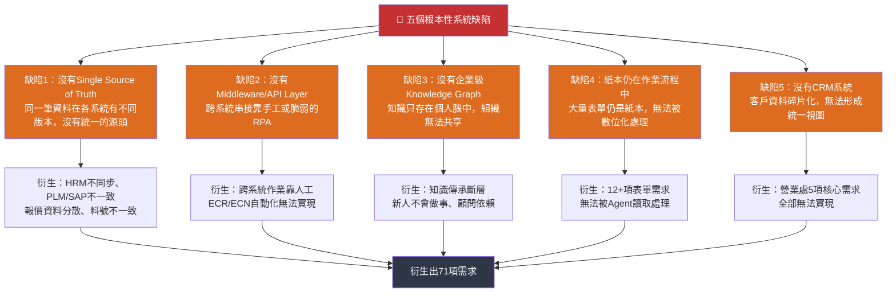

**2. ROI被嚴重低估——只看時間節省，忽略了錯誤成本與風險成本**

| 需求 | 提案估算ROI | 校正後ROI | 校正原因 |
|------|-----------|---------|---------|
| AI圖像辨識 | 520小時/年 | **NTD 250萬~2,500萬/年** | 瑕疵流出防堵 |
| 牌價AI自動化 | 未估算 | **極高（無上限）** | 負毛利出貨防堵 |
| AI報價 | 2,196小時/年 | **+NTD 120萬/年** | 報錯價風險 |
| ECN-SAP串接 | 60小時/年 | **極高** | 停用料號用到量產→召回 |

**3. 五個超級瓶頸，卡住了71項需求中的55項**

```
瓶頸1：DataLake未就緒 ──────────────────┐
（阻塞25+項，所有AI應用的水源）         │
瓶頸2：CRM未建置 ────────────────────┤
（阻塞營業處5項核心需求）              │
瓶頸3：PLM/SAP API能力不足 ──────────┤──→ 55+項需求
（阻塞研發6項核心需求）               │
瓶頸4：表單電子化落後 ────────────────┤
（阻塞12+項需求）                    │
瓶頸5：資料標準化缺失 ────────────────┘
（導致系統串聯後輸出錯誤）
```

**4. 8個隱藏風險，沒有在任何需求中提出，但一旦發生就是災難**

| 風險 | 描述 | 影響 |
|------|------|------|
| AI依賴症 | AI穩定後員工喪失人工處理能力，AI一掛全部停擺 | 系統韌性歸零 |
| 單一模型風險 | 全部基於Gemini，無備援機制 | 所有AI瞬間失效 |
| 隱私資料外洩 | 專利/報價/合約上傳外部AI | NTD 500萬罰款+商譽損失 |
| 技能退化 | 過度依賴AI後人工能力歸零 | 緊急時無法處理 |
| 版本飢渴 | AI模型更新導致Prompt失效 | 每次更新耗時10~20天/年 |
| 資料污染 | DataLake錯誤資料被AI廣泛引用 | 錯誤資訊被放大 |
| 系統雪崩 | PLM/SAP維護時整條自動化鏈停滯 | 生產線中斷 |
| AI幻覺 | 專利分析/合約解讀出錯 | 侵權訴訟或錯誤決策 |

### 二、各部門年度ROI校正

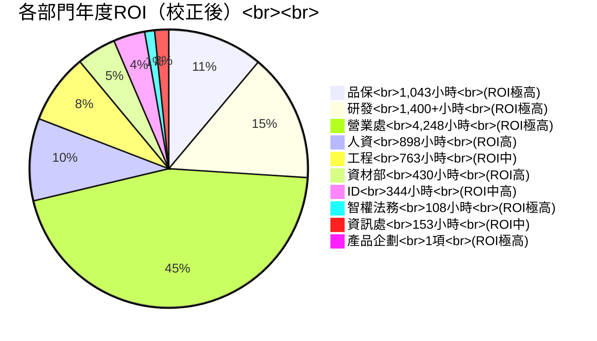

| 部門 | 需求數 | 提案估算(小時) | 校正後ROI | 最高優先需求 | 新增洞察 |
|------|--------|-------------|---------|------------|---------|
| 營業處 | 9 | 4,248 | **極高** | AI報價、CRM | CRM是瓶頸中的瓶頸 |
| 研發 | 30+ | 1,400+ | **極高** | ECN/ECR自動化、結案整理 | 最大需求部門，PLM/SAP整合是核心 |
| 品保 | 6 | 1,043 | **極高** | AI圖像辨識 | ROI被嚴重低估（含瑕疵流出防堵）|
| 人資 | 8 | 898 | **高** | HR表單電子化 | IPO合規價值被忽略 |
| 工程 | 3 | 763 | **中低** | 圖框AI更新 | 冰山效應——圖框只是表象 |
| 資材部 | 3 | 430+ | **高** | QCDS排序 | 採購知識碎片化是根本問題 |
| ID | 4 | 344 | **中高** | 專案資料整合 | 可複製到研發做參考 |
| 智權法務 | 4 | 108 | **極高** | 專利檢索 | 侵權訴訟風險難以量化 |
| 資訊處 | 3 | 153 | **中** | HRM同步 | 系統性基礎設施 |
| 產品企劃 | 1 | — | **極高** | 牌價AI自動化 | 財務風險極高，無時間節省但需立即處理 |
| 資材-採購 | 1 | 520 | **中高** | SAP採購傳真Email | 與營業處需求重疊，可合併處理 |
| **合計** | **71** | **9,387+** | | | |

---

## 第二部分：分析方法論

### 分析維度說明

本報告對每個部門的需求進行以下維度的全面分析：

| 分析維度 | 第一份報告（需求本質）| 第二份報告（交叉分析）|
|----------|--------------------|--------------------|
| **痛點本質** | ✅ 問題根本原因 | ✅ 跨部門共同根因 |
| **現況流程** | ✅ 實際作業步驟 | ✅ 依賴關係瀑布鏈 |
| **量化損失** | ✅ 時間/金錢估算 | ✅ ROI三維度校正 |
| **隱性成本** | ✅ 錯誤/士氣/風險 | ✅ 隱藏風險地圖 |
| **急迫性評估** | ✅ P0-P3 四級 | ✅ 風險+ROI雙維度校正 |
| **依賴關係** | — | ✅ 需求依賴矩陣 |
| **瓶頸阻塞** | — | ✅ 五大超級瓶頸 |
| **數據缺口** | — | ✅ 各部門數據就緒度 |

---

## 第三部分：部門詳細分析

---

## 3.1 資訊處需求分析

**提出人**：彥廷、Denist、Rolen　｜　**需求數**：3 項　｜　**年估算節省**：153 小時

### 需求全景圖

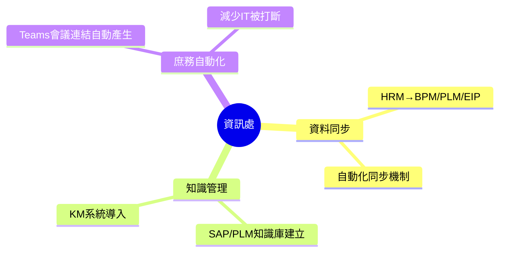

### 3.1.1 HRM資料同步至BPM、PLM、EIP

| 維度 | 分析 |
|------|------|
| **表層痛點** | 人員組織資料需人工在 BPM、PLM、EIP 三個系統分別建立，耗時且易錯 |
| **根因分析** | HRM 是資料源頭（Single Source of Truth），但下游三個系統各自維護副本，沒有同步機制，形成「資料孤島」|
| **錯誤代價** | 權限管控錯誤（看不到該看的資料）、簽核流程錯誤（簽錯人）、薪資計算錯誤（部門歸屬）|
| **規模感** | 每筆25分鐘 × 200人次/年 = **83小時代價** |

**現況流程圖**

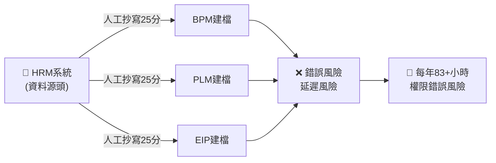

**急迫性**：P0（系統性基礎建設，直接影響資安與作業正確性）

---

### 3.1.2 SAP與PLM知識庫建立

| 維度 | 分析 |
|------|------|
| **表層痛點** | IT 人員處理 SAP/PLM 問題的知識散落在 Outlook Mail、OneNote、個人Ticket記錄中，無法有效傳承 |
| **根因分析** | 沒有結構化的 KM 系統，知識以「個人資產」存在而非「組織資產」|
| **隱性成本** | 顧問維護時數被重複消耗；新人上手時間拉長 |
| **規模感** | 每筆查詢20分鐘，一年節省50小時 = 每年至少查詢150次 |

**知識散落的風險矩陣**

| 知識所在 | 誰擁有？ | 其他人能找到？ | 離職人會怎樣？ |
|----------|---------|-------------|--------------|
| Outlook Mail | 個人 | ❌ 困難 | 知識消失 |
| OneNote | 個人 | ❌ 幾乎不可能 | 知識消失 |
| 顧問 Ticket | IT部門 | ⚠️ 有記錄但難搜尋 | 需重新找顧問 |
| 主管經驗 | 主管腦中 | ❌ 完全不行 | 知識消失 |

**急迫性**：P1（慢性出血，不影響日常營運，但長期造成顧問成本浪費）

---

### 3.1.3 Teams視訊會議連結自動產生

| 維度 | 分析 |
|------|------|
| **表層痛點** | 使用者需聯繫資訊處才能建立 Teams 視訊，來回溝通耗費大量時間 |
| **根因分析** | Teams 視訊會議的建立權限沒有下放；缺乏自動化機制 |
| **現況流程** | 需求提出（5分）→ 資訊處收到（平均60分）→ 建立連結（5分）→ 回覆（5分）= **75分鐘/次** |
| **隱性成本** | 資訊處被打斷工作；緊急需求無法即時處理 |
| **規模感** | 每週一次 × 52週 = **61小時/年** |

**急迫性**：P1（不影響核心營運，但嚴重影響內部協作效率）

---

### 資訊處總結

| 需求 | 節省/年 | 急迫性 | 在整體架構中的位置 |
|------|---------|--------|----------------|
| HRM同步 | 42+小時 | **P0** | 所有系統的基礎——沒有它，其他系統的人員資料都不準確 |
| 知識庫建立 | 50小時 | P1 | IT產能釋放——減少被重複問題打斷 |
| Teams會議連結 | 61小時 | P1 | IT產能釋放——減少庶務工作 |

> **交叉洞察**：HRM同步看似是資訊處的小需求，實際上是**整個公司數位化的基礎設施**——所有系統（PLM、BPM、EIP、CRM）的人員資料都依賴HRM的準確性。

---

## 3.2 營業處需求分析

**提出人**：Donald、Ronnie　｜　**需求數**：9 項　｜　**年估算節省**：4,248 小時

### 需求全景圖

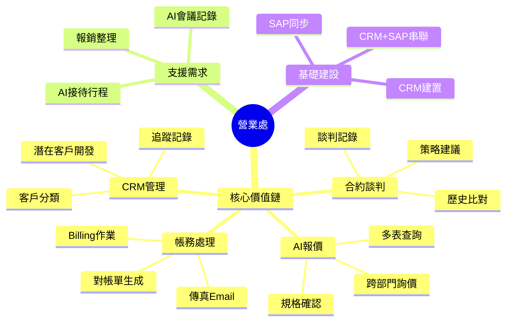

### 3.2.1 需求分組分析

#### 分組A：AI報價與合約（2項）

| 維度 | AI報價 | 合約模組 |
|------|--------|---------|
| **表層痛點** | 規格確認複雜、跨部門詢價、容易報錯價格 | 協商依賴經驗、記錄零散、法律風險高 |
| **現況** | 每件60分鐘，每月200件 = 200小時/月 | 每件120分鐘，每月30件 = 60小時/月 |
| **提案ROI** | 91.67%效率提升，節省2,196小時/年 | 75%效率提升，節省540小時/年 |
| **校正ROI** | **時間+NTD 60萬/年+NTD 120萬/報錯風險** | **時間+法律風險成本** |
| **依賴系統** | CRM + SAP + 知識庫 | CRM + 知識庫 |
| **急迫性** | **P0** | P1 |

**交叉洞察**：AI報價與合約模組共享同一個知識庫——歷史報價資料、合約談判案例。這兩個需求應作為一個整體來規劃，而不是分開處理。

---

#### 分組B：CRM核心需求（3項）

| 維度 | AI系統+CRM | Billing對帳單 | SAP傳真/Email |
|------|-----------|-------------|--------------|
| **表層痛點** | 潛在客戶資料分散、追蹤缺乏系統 | 手工製作對帳單，錯誤率高 | 列印→傳真→確認，每張6分鐘 |
| **現況** | 每件30分鐘，每月300件 = 150小時/月 | 每月540小時 | 每天390小時/年 |
| **提案ROI** | 90%效率提升，節省1,620小時/年 | 80%提升，節省540小時/年 | 83.3%提升，節省390小時/年 |
| **依賴系統** | **CRM系統（根本缺口）** | **CRM + SAP** | **CRM + SAP** |
| **急迫性** | **P0** | P1 | P1 |

**最關鍵發現**：三個需求的共同瓶頸都是「CRM系統不存在」。

```
沒有CRM → 沒有統一的客戶資料 → AI報價無從取得歷史報價資料
沒有CRM → 沒有結構化的客戶分類 → 潛在客戶開發無從做起
沒有CRM → 沒有Billing連動 → 對帳單需手工從SAP拉資料
```

---

#### 分組C：AI應用（2項）

| 維度 | 拜訪與會議紀錄AI | 報銷單據AI整理 |
|------|---------------|-------------|
| **表層痛點** | 錄音→key in，每次60分鐘 | 報銷單据厚如書本，整理耗時數天 |
| **現況** | 6位業務員 × 30家/年 × 60分 = 180小時/年 | 估計每年200小時 |
| **技術成熟度** | **極高**（語音轉文字+摘要AI已非常成熟）| 中等（OCR+結構化仍有挑戰）|
| **依賴系統** | 錄音設備 + 會議系統API | 報銷系統 |
| **急迫性** | P1 | P2 |

---

#### 分組D：特殊需求（2項）

| 維度 | AI接待行程排程 | 牌價AI自動化（產品企劃）|
|------|--------------|------------------|
| **表層痛點** | 接待安排依賴人工，每月5次×5小時=25小時/月 | 售價制定缺乏動態調整，負毛利風險極高 |
| **提案ROI** | 80%提升，節省240小時/年 | 未估算時間節省 |
| **校正ROI** | 中等（頻率相對低）| **極高（財務風險，無上限）** |
| **急迫性** | P2 | **P0（財務風險最高）** |

---

### 營業處時間損失分佈

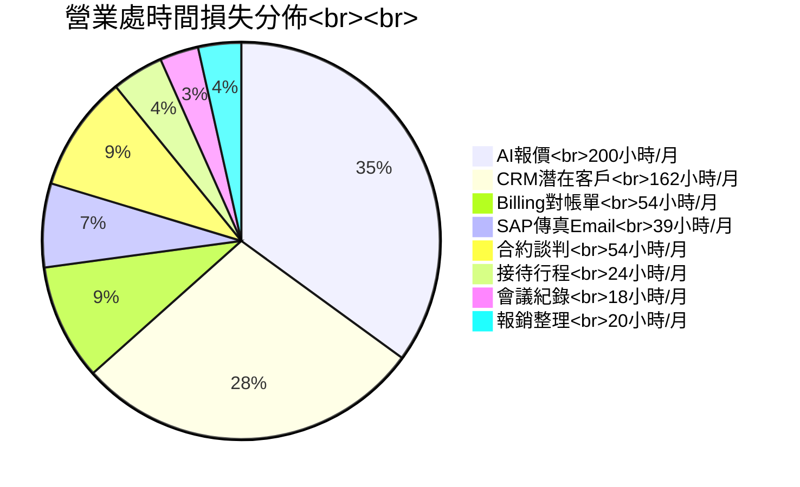

**急迫性評估**：P0=AI報價、CRM潛在客戶開發；P1=Billing對帳單、SAP傳真Email、會議紀錄；P2=合約模組、接待行程、報銷整理

> **交叉洞察**：CRM 建置落後6個月，整個營業處的AI佈局就落後6個月。CRM不只是客戶資料庫，它是AI報價、Billing對帳、潛在客戶開發的**基礎設施**。

---

## 3.3 產品企劃處需求分析

**提出人**：Janie　｜　**需求數**：1 項　｜　**核心問題**：牌價管理失控導致負毛利出貨

### 3.3.1 牌價AI自動化

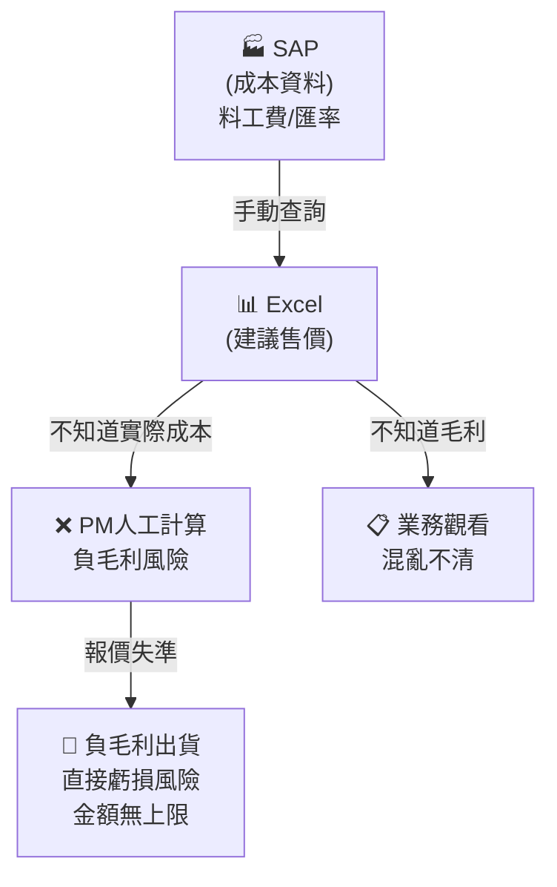

| 維度 | 分析 |
|------|------|
| **表層痛點** | PM將建議售價維護在Excel，但匯率、管銷、料工費變動時，無法人工逐一檢查哪些產品會變負毛利 |
| **根因分析** | 成本（在SAP）與售價（在Excel）沒有連結；毛利率計算依賴人工比對 |
| **現況流程** | 更新售價→手動查SAP成本→人工計算毛利率→調整售價 = **60分鐘/產品線** |
| **提案ROI** | 未估算時間節省 |
| **校正ROI** | **極高（無上限）**——每一筆負毛利訂單都是直接虧損 |
| **特殊風險** | **每一筆負毛利報價→虧損出貨，金額從數萬到數十萬不等** |

**急迫性**：**P0（財務風險極高，任何時間點都可能發生）**

> **交叉洞察**：牌價AI自動化的底層邏輯與AI報價一模一樣——都是「從SAP取得成本資料→套用規則計算→產出建議售價」。建議與營業處的AI報價需求**合併規劃**，共用同一個資料來源與計算引擎。

---

## 3.4 智權法務需求分析

**提出人**：Tony　｜　**需求數**：4 項　｜　**核心問題**：專利作業高度依賴人工

### 需求全景圖

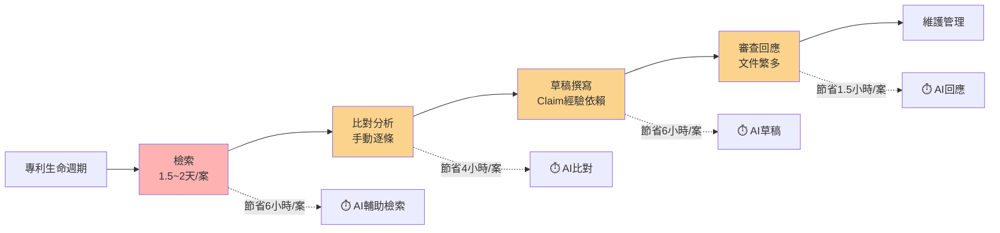

### 智權需求詳細分析

| # | 需求 | 表層痛點 | 量化損失 | 錯誤代價 | 急迫性 |
|---|------|---------|---------|---------|--------|
| 1 | 專利檢索 | 手動組字、逐案查閱各國資料庫 | 每案1.5~2天，節省6小時 | **侵權風險**——漏檢重要專利 |
| 2 | 專利比對與權利分析 | 手動下載逐條比對，缺乏分類與歷史 | 每案節省4小時 | 侵權風險或被繞過專利 |
| 3 | 專利草稿撰寫 | Claim撰寫依賴經驗，需多次修改 | 每案節省6小時 | Claim不良→專利被駁回 |
| 4 | 審查意見回應 | 通讀後撰寫，容易漏掉重要論點 | 每件節省1.5小時 | 回應不完整→專利被駁回 |

### ROI校正分析

| 維度 | 分析 |
|------|------|
| **提案ROI** | 108小時/年（只看時間節省）|
| **校正ROI** | **極高（×3.0+）**——侵權訴訟成本難以量化，但一旦發生損失極大 |
| **特殊性質** | 智權需求的錯誤代價**不是時間，而是法律責任或資產損失** |
| **優先級** | P1（專利檢索）、P2（其他三項）|

> **交叉洞察**：智權的專利分析需求，與研發的「數據收集與篩選」（宋濤：專利/材料參數查閱）和ID的「情景圖生成」（版權問題）**共用同一個資料缺口**——專利資料庫尚未建立。所有涉及專利/技術資料的需求，都需要先建好專利資料庫。

---

## 3.5 ID部門需求分析

**提出人**：黃文誠、ID Team　｜　**需求數**：4 項　｜　**年估算節省**：344 小時

### 需求全景圖

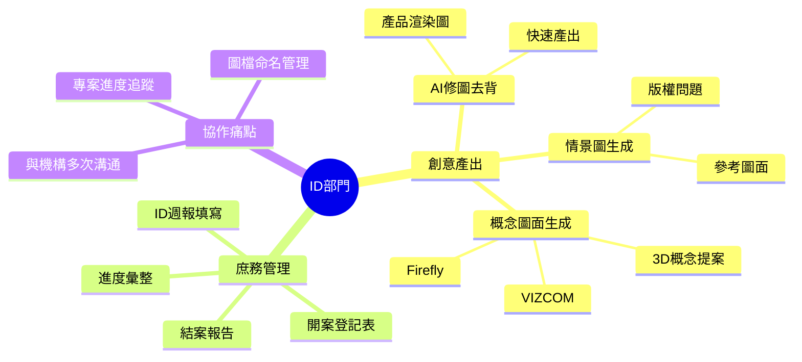

### ID需求詳細分析

| # | 需求 | 表層痛點 | 量化損失 | 版權/風險 | 急迫性 |
|---|------|---------|---------|---------|--------|
| 1 | AI修圖自動去背 | 渲染圖需人工PS去背，每張5~10分鐘 | **72小時/年** | 無 | P1 |
| 2 | 情景圖生成 | 需找圖庫（版權問題）+修圖結合 | **80小時/年** | **版權侵權風險** | P1 |
| 3 | 設計概念圖面生成 | 3D概念提案慢，需重複輸入參數 | **32小時/年** | 無 | P1 |
| 4 | ID專案資料整合系統 | 三種表單分散，週報填寫30分/設計師，結案手動複製週報14分鐘 | **160小時/年** | 無 | P1 |

### 專案資料整合系統詳細分析

| 問題 | 現況 | 目標 | 節省 |
|------|------|------|------|
| 問題1：週報填寫 | 每人每週30分鐘 | 10分鐘完成 | 省20分/設計師/週 |
| 問題2：進度彙整 | 每週人工2小時 | 30分鐘自動生成 | 省90分/週 |
| 問題3：結案整理 | 手動複製14週週報 | 1分鐘自動產出 | 省14分鐘/案 |

**急迫性評估**：全部P1（每週都在發生，直接影響設計師的創意時間）

> **交叉洞察**：ID的「專案資料整合系統」是整個公司第一個提出的「專案管理系統」需求——這個概念領先於研發（吳建宏、黃文誠的專案管理需求）。建議ID的系統作為**公司級專案管理的試點**，成功後複製到研發。

---

## 3.6 研發部門需求分析

**提出人**：吳家銘、黃敦詮、黃崇益、潘國光、吳建宏、游智超、薛武忠、王志倫、黃曉薇、涂雅雯、黃文誠、張小笛、宋濤、胡佳絃　｜　**需求數**：30+ 項　｜　**年估算節省**：1,400+ 小時

### 需求全景圖

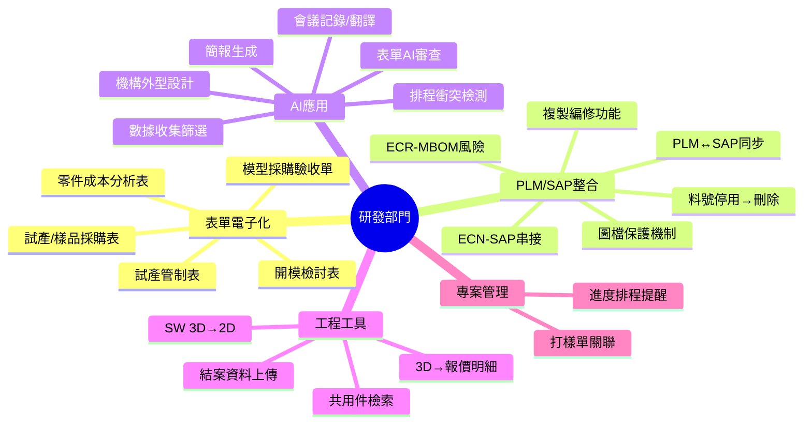

### 3.6.1 分類一：表單電子化與簽核（8項）

| # | 需求名稱 | 現況痛點 | 年用量估算 | 量化損失 | 急迫性 |
|---|---------|---------|---------|---------|--------|
| 1 | 開模檢討表電子簽核 | 紙本走3~5工作天 | 100件/年 | 50小時/年 | P1 |
| 2 | 模型採購驗收單電子表單 | 紙本請購及簽核驗收，需3工作天 | 112件/年 | 37小時/年 | P1 |
| 3 | 試產管制表BPM化 | 紙本→各廠間走動送簽，搬遷後更久 | 33件/年 | 11小時/年 | P1 |
| 4 | 零件成本分析表自動生成 | 廠商報價→手工key in公司表單 | 150次/年 | 50小時/年 | P1 |
| 5 | 試產/樣品採購表電子化 | 人攜帶紙本送簽，常撲空 | 150次/年 | 50小時/年 | P1 |
| 6 | 專案錢包餘額AI辨識 | 需手工至SAP查詢對帳 | — | — | P1 |
| 7 | PLM複製編修功能 | 無法複製編修，系統運算慢 | — | — | P2 |
| 8 | PLM圖檔保護機制 | 圖檔損毀後需人工核實尺寸 | — | — | P2 |

> **表單電子化合計**：~198小時/年

---

### 3.6.2 分類二：PLM/SAP跨系統整合（6項）——**研發最核心痛點**

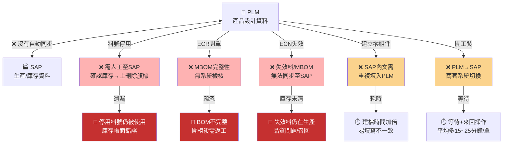

| # | 需求名稱 | 現況痛點 | 年用量估算 | 量化損失 | 錯誤/風險代價 | 急迫性 |
|---|---------|---------|---------|---------|-------------|--------|
| 1 | PLM料號停用→SAP刪除旗標 | 需多次至SAP確認庫存，手動上刪除旗標 | — | — | 停用料號被用到 | P1 |
| 2 | **ECR-MBOM開單風險** | 未完整放入MBOM，需重新開立ECR | 565件/年，80%與MBOM有關 | ~110小時/年 | **開模返工成本極高** | **P0** |
| 3 | ECR-料件失效處理 | 失效料件設定後，MBOM需另行手動失效 | 565件/年 | ~110小時/年 | BOM版本不一致 | P1 |
| 4 | **ECN-SAP串接** | PLM-ECN成立後，失效料無法同步至SAP，需人工反覆確認 | 359件/年（2024年） | 60小時/年 | **庫存錯誤→召回** | **P0** |
| 5 | PLM零組件自動填寫 | SAP內文需重複填入PLM其他欄位 | — | — | 欄位不一致 | P2 |
| 6 | PLM↔SAP系統整合 | PLM→SAP請購需兩套系統切換操作 | — | 100+小時/年 | 操作遺漏 | P2 |

> **ECR/ECN合計**：924件/年，201小時/年

**交叉洞察**：PLM與SAP的整合問題，與營業處的SAP↔CRM問題、資訊處的HRM同步問題，**本質上都是同一個缺陷**——「沒有Middleware/API Layer」。這三個問題應作為一個整體來解決，而不是分開處理。

---

### 3.6.3 分類三：AI應用（7項）

| # | 需求名稱 | 現況痛點 | 量化損失 | 急迫性 |
|---|---------|---------|---------|--------|
| 1 | AI表單審查 | 各類表單常因內容有誤被退件，一直送件退件 | 120→30分鐘/件 | P1 |
| 2 | 簡報自動生成 | 製作簡報需從主題發揮、蒐集資料，消化後再表達 | 1~2小時→30分鐘 | P1 |
| 3 | AI會議記錄 | 撰寫→編修→送簽→發行，整個流程過長 | 120→60分鐘/次 | P1 |
| 4 | AI會議翻譯 | 參與者語言能力不一，需業務協助翻譯 | 120→60分鐘/次 | P2 |
| 5 | AI會議邀請衝突檢測 | 邀請開會需逐一確認時間，來回更改 | 60→30分鐘/次 | P2 |
| 6 | 機構外型AI設計 | 前期機構與ID需多次溝通才能提供符合量產的提案 | 1~3小時→30分鐘 | P2 |
| 7 | 數據收集與篩選 | 專利/材料性能參數需花時間人工查閱 | 1小時→10分鐘，20小時/年 | P2 |

---

### 3.6.4 分類四：工程工具與專業軟體（4項）

| # | 需求名稱 | 現況痛點 | 量化損失 | 特殊難度 | 急迫性 |
|---|---------|---------|---------|---------|--------|
| 1 | SolidWorks 3D→2D | 需跨軟體設定視圖、標註尺寸 | 45小時/年 | **需SW API整合** | P2 |
| 2 | 共用件自動檢索 | 憑個人記憶或從一堆共用件中人工搜尋 | 40小時/年 | 需先結構化PLM資料 | P2 |
| 3 | 3D圖自動生成報價明細 | 需手動轉檔、做零件明細、截圖、稱重 | 32小時/年 | **需SW API整合** | P2 |
| 4 | **結案資料整理上傳PLM** | 整理圖檔、文件、樣品承認等上傳至PLM | **576小時/年（最大！）** | 需建立標準化流程 | **P0** |

> **結案資料整理** = 每月3次 × (24小時-8小時) = 每月節省48小時 = **576小時/年 = 72個工作天/年** = 相當於一位工程師近3個月的工時！

---

### 3.6.5 分類五：專案管理（2項）

| # | 需求名稱 | 現況痛點 | 量化損失 |
|---|---------|---------|---------|
| 1 | 專案進度排程與提醒 | 每周手工填報周報，需串聯不同設計師的周報 | 30小時/年 |
| 2 | PLM打樣單與料號申請單自動關聯 | 料號申請單送出後，需回到打樣單填寫單號 | **175小時/年** |

---

### 研發部門時間損失分佈

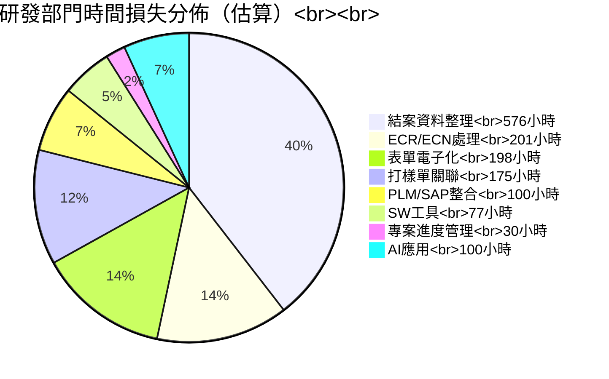

---

## 3.7 人資部門需求分析

**提出人**：HR　｜　**需求數**：8 項　｜　**年估算節省**：898 小時

### 需求全景圖

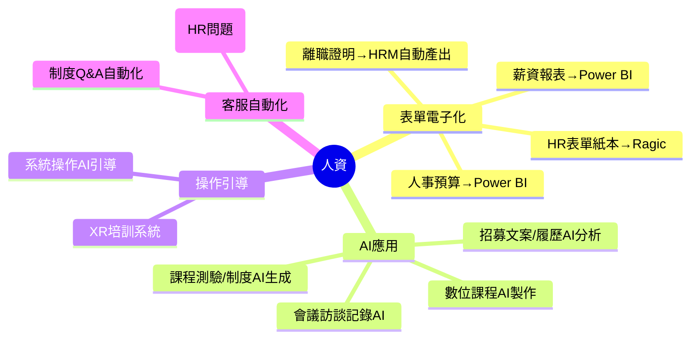

### 人資需求詳細分析

| # | 需求 | 表層痛點 | 量化損失 | IPO合規價值 | 急迫性 |
|---|------|---------|---------|------------|--------|
| 1 | HR表單電子化推動 | 常用表單多數仍為紙本，需人工簽核傳遞 | 80小時/年 | **極高**（IPO要求文件可追溯）| P1 |
| 2 | 報表產生自動化（薪資）| 薪資報表需人工產出，耗時且易錯 | 12小時/年 | **高** | P1 |
| 3 | 報表產生自動化（人事預算）| 人事預算每月比較表需人工產出 | 36小時/年 | **高** | P1 |
| 4 | AI輔助招募流程 | 招募文案+履歷分析+面談記錄皆為人工處理 | **390小時/年（最大）**| 中 | P1 |
| 5 | AI輔助課程設計 | 每年20堂課+制度初稿，每次重頭設計 | 120小時/年 | 中 | P2 |
| 6 | AI製作數位課程 | 實體課程反覆授課，無數位版本 | 60小時/年 | 中 | P2 |
| 7 | AI輔助教學操作引導 | 系統操作教學需大量培訓與人工協助 | — | 高 | P2 |
| 8 | AI客服系統導入 | HR常接聽重複性人事問題（每月25人次）| **150小時/年** | **高** | P1 |

### IPO合規視角的特別發現

> 人資的ROI計算**完全忽略了「IPO合規」這個維度**：

| 問題 | IPO影響 |
|------|--------|
| 紙本文件 | 審查時無法快速調閱 |
| 薪資/人數報表人工產出 | 數據可信度低 |
| 招募/培訓記錄不完整 | 法規遵從性不足 |

> **校正後ROI**：+30~50%（IPO合規價值）

### XR培訓系統警告

| 維度 | 分析 |
|------|------|
| **描述** | 「AI輔助教學操作引導」和「AI製作數位課程」都建議XR系統 |
| **問題** | XR（VR/AR）建置成本極高（數十萬到數百萬），但節省的工時估算未見明顯提升 |
| **建議** | 先用現有AI工具（Gamma、Canva、Camtasia）做數位課程，驗證效果後再評估XR |

---

## 3.8 品保部門需求分析

**提出人**：宥羽/浩偉、小萍/佳文、馮美华、聶初明、單嬌嬌、錢月兰　｜　**需求數**：6 項　｜　**年估算節省**：1,043 小時

### 需求全景圖

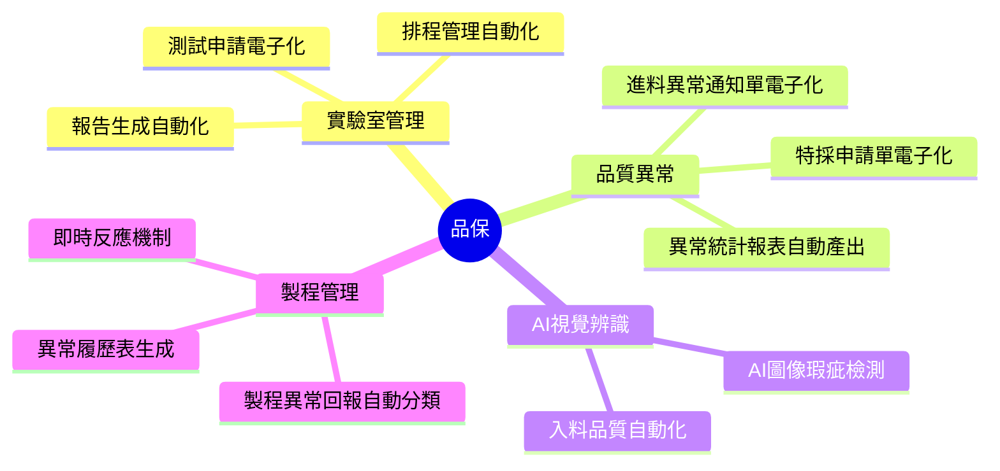

### 品保需求詳細分析

| # | 需求 | 表層痛點 | 年用量估算 | 量化損失 | 錯誤/風險代價 | 急迫性 |
|---|------|---------|---------|---------|-------------|--------|
| 1 | **AI圖像辨識（品質入料檢驗）** | 人工檢查費時費力，標準不一，漏檢導致客訴 | — | **520小時/年** | **極高——瑕疵流出=客訴/召回** | **P0** |
| 2 | 進料異常統計表 | 人工輸入+SAP過帳，每月60分鐘 | — | **260小時/年** | 中 | P1 |
| 3 | 制程異常回報 | 每週180分鐘整理報表，容易漏報 | — | **130小時/年** | 高（問題重複發生）| P1 |
| 4 | 實驗室驗證申請電子化 | 150件/年，每件浪費20分鐘 | 150件/年 | **50小時/年** | 中 | P2 |
| 5 | 進料異常+特採電子化 | 每件90分鐘，100件/年 | 100件/年 | **83小時/年** | 中 | P1 |

### 最被低估的需求：AI圖像辨識

> **各部門ROI計算都只看「工時節省」，但AI圖像辨識最大的價值是「防止瑕疵流出」**

```
假設出貨量100萬件/年，瑕疵率0.1%
AI提升檢出率50% = 減少500件瑕疵出貨
每件瑕疵處理成本NTD 5,000~50,000
= 每年節省 NTD 250萬~2,500萬

校正後ROI = 520小時 + NTD 250萬~2,500萬 = 極高
```

---

## 3.9 資材部需求分析

**提出人**：Doris　｜　**需求數**：3 項　｜　**年估算節省**：430 小時

### 需求全景圖

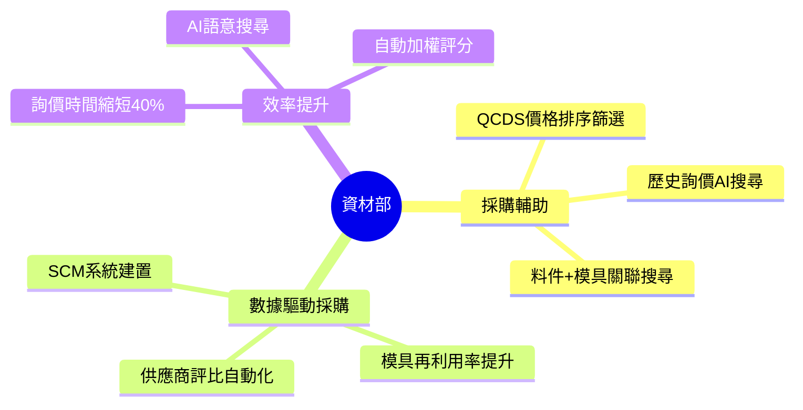

### 資材需求詳細分析

| # | 需求 | 表層痛點 | 量化損失 | 額外金錢價值 | 急迫性 |
|---|------|---------|---------|------------|--------|
| 1 | QCDS價格排序篩選 | 每次發包評估需3天時間，詢價+匹配供應商 | 2.4小時/次 × 36次 = 86小時/年 | **NTD 11.4萬/年**（節省人力）| P1 |
| 2 | AI搜尋歷史詢價紀錄 | 每天2~3件重複問題，業務不斷被詢問同一規格 | **750小時/年** | **NTD 198萬/年**（減少內部溝通摩擦）| P1 |
| 3 | 料件規格+模具關聯搜尋 | 模具盤點每年一次，3天時間配對 | 50小時/年 | **模具再利用率提升20~30%** | P2 |

### 獨特洞察：採購知識的碎片化

> **Doris的專業經驗（哪個供應商好、哪個料件用哪個模具）存在她自己腦中，沒有被結構化。**
>
> 每天2~3次「重複詢問同一規格」= 業務不斷打斷Doris的工作 = 年浪費750小時
>
> **優先行動**：建立「採購知識庫」，將Doris的經驗結構化

---

## 3.10 工程部門需求分析

**提出人**：吴涔涔、许浩然、田维锡　｜　**需求數**：3 項　｜　**年估算節省**：763 小時

### 需求詳細分析

| # | 需求 | 表層痛點 | 量化損失 | 急迫性 |
|---|------|---------|---------|--------|
| 1 | 產品圖框AI更新 | 800份/年，每份需手動更新圖框、分圖層 | **333小時/年（最大）**| P1 |
| 2 | 包裝規格自動計算 | 每機種240分鐘，需來回查表、計算、比對 | **280小時/年** | P1 |
| 3 | 材質牌號建議 | 需測試驗證OK後才能定義材質，耗時 | **150小時/年** | P1 |

### 重要發現：圖框問題是「冰山一角」

| 維度 | 分析 |
|------|------|
| **表層** | 800份圖框每年需手動更新 = 333小時 |
| **冰山** | 圖框更新的根本原因是**沒有統一的圖框管理機制** |
| **延伸問題** | PLM圖檔命名混亂、版本不統一、共用區圖檔損毀（研發的PLM圖檔保護需求） |
| **建議** | 圖框問題應與研發的「PLM圖檔保護機制」需求**合併處理** |

---

## 3.11 資材-採購需求分析

**提出人**：Doris　｜　**需求數**：1 項　｜　**年估算節省**：520 小時

| 需求 | 表層痛點 | 量化損失 | 急迫性 |
|------|---------|---------|--------|
| SAP採購單自動傳真/Email | 列印→傳真→確認，每張6分鐘，每週3次×40家供應商 | **520小時/年** | P1 |

> **交叉洞察**：この需求與營業處的「SAP訂單自動傳真/Email」**完全相同**——都是從SAP自動發送文件給外部（採購發給供應商，營業發給客戶）。建議**合併成一個需求**，只做一次。

---

## 第四部分：系統性發現

---

## 4.1 五大根本性系統缺陷

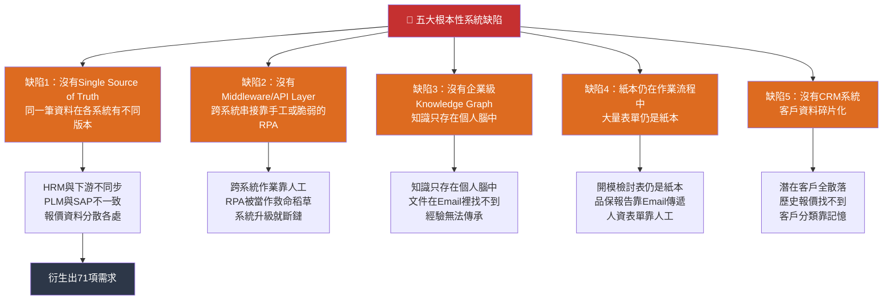

---

## 4.2 五大超級瓶頸

```mermaid
flowchart TB
    B1["🔴 瓶頸1：DataLake未就緒<br>阻塞25+項需求"]
    B2["🟠 瓶頸2：CRM未建置<br>阻塞營業處5項核心需求"]
    B3["🟠 瓶頸3：PLM/SAP API能力不足<br>阻塞研發6項核心需求"]
    B4["🟡 瓶頸4：表單電子化落後<br>阻塞12+項需求"]
    B5["🟡 瓶頸5：資料標準化缺失<br>導致系統串聯後輸出錯誤"]

    B1 --> BK1["知識庫Q&A"]
    B1 --> BK2["AI報價"]
    B1 --> BK3["專利分析"]
    B1 --> BK4["CRM潛在客戶開發"]
    B1 --> BK5["..."
    共25+項"]
    
    B2 --> BK6["AI報價"]
    B2 --> BK7["Billing對帳單"]
    B2 --> BK8["合約模組"]
    B2 --> BK9["接待行程排程"]
    
    B3 --> BK10["ECR/ECN自動化"]
    B3 --> BK11["PLM↔SAP整合"]
    B3 --> BK12["..."
    共6+項"]
    
    B4 --> BK13["表單電子化全部需求"]
    B5 --> BK14["所有跨系統整合需求"]

    style B1 fill:#c53030,color:#fff,stroke:#c53030,stroke-width:4px
    style B2 fill:#dd6b20,color:#fff,stroke:#dd6b20,stroke-width:3px
    style B3 fill:#dd6b20,color:#fff,stroke:#dd6b20,stroke-width:3px
    style B4 fill:#d69e2e,color:#000,stroke:#d69e2e,stroke-width:2px
    style B5 fill:#d69e2e,color:#000,stroke:#d69e2e,stroke-width:2px
```

---

## 4.3 八個隱藏風險

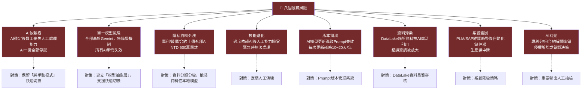

---

## 4.4 需求依賴關係分層圖

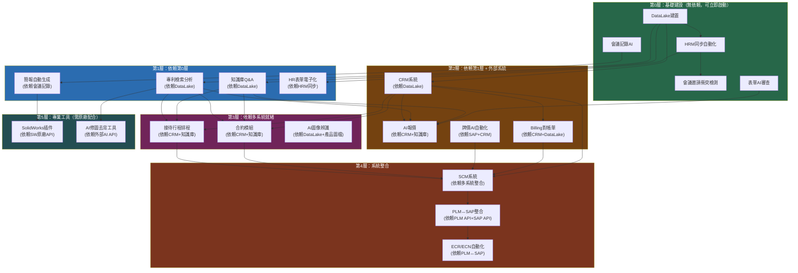

> **三條主要依賴路徑的共同起點都是 DataLake 建置**——它是所有AI應用的水源，一旦延誤，後續所有需求都會順延。

---

## 第五部分：優先級與行動計劃

---

## 5.1 優先級矩陣（風險+ROI雙維度校正）

```mermaid
quadrantChart
    title 優先級矩陣（風險+ROI雙維度校正）<br><br>
    x-axis 風險/錯誤成本 --> 右
    y-axis 總ROI（時間+錯誤+風險） --> 上
    quadrant-1 "立即行動\n★★★★★"
    quadrant-2 "高度優先\n★★★★☆"
    quadrant-3 "可規劃執行\n★★★☆☆"
    quadrant-4 "長期關注\n★★☆☆☆"
    
    "AI圖像辨識" 0.95 0.90 "ROI+風險皆極高"
    "AI報價" 0.90 0.95 "ROI+風險皆極高"
    "牌價AI自動化" 0.95 0.85 "ROI+風險皆極高"
    "ECN-SAP串接" 0.95 0.80 "ROI+風險皆極高"
    "ECR-MBOM檢核" 0.90 0.80 "ROI+風險皆極高"
    "專利檢索" 0.90 0.75 "ROI+風險皆極高"
    "結案資料整理" 0.80 0.90 "ROI極高"
    "DataLake建置" 0.85 0.85 "所有AI應用的前提"
    "CRM建置" 0.85 0.80 "營業處所有需求的基礎"
    "Billing對帳單" 0.75 0.80 "時間ROI極高"
    "SAP↔PLM整合" 0.80 0.75 "研發核心痛點"
    "會議記錄AI" 0.65 0.80 "跨部門廣泛適用"
    "HR表單電子化" 0.70 0.70 "IPO合規價值"
    "知識庫Q&A" 0.60 0.75 "知識傳承"
    "表單AI審查" 0.65 0.70 "減少退件"
    "接待行程排程" 0.30 0.50 "低頻率需求"
    "XR培訓系統" 0.20 0.30 "成本過高"
```

---

## 5.2 完整優先級排名（校正版）

| 排名 | 部門 | 需求 | ★ | 校正ROI | 核心原因 |
|------|------|------|---|---------|---------|
| **1** | 品保 | **AI圖像辨識** | ★★★★★ | **極高** | ROI含瑕疵流出防堵（250萬~2,500萬/年）|
| **2** | 營業處 | **AI報價** | ★★★★★ | **極高** | ROI含報錯價風險（120萬+/年）|
| **3** | 產品企劃 | **牌價AI自動化** | ★★★★★ | **極高** | 財務風險極高，無上限 |
| **4** | 研發 | **ECN-SAP串接** | ★★★★★ | **極高** | ROI含庫存錯誤+停用料號召回風險 |
| **5** | 研發 | **ECR-MBOM檢核** | ★★★★★ | **極高** | ROI含開模返工風險 |
| **6** | 研發 | **結案資料整理** | ★★★★☆ | **極高** | 最大時間損失（576小時/年）|
| **7** | 智權 | **專利檢索** | ★★★★☆ | **極高** | ROI含侵權訴訟風險 |
| **8** | 營業處 | **CRM潛在客戶** | ★★★★☆ | **極高** | 最大時間損失之一（1620小時/年）|
| **9** | 營業處 | **Billing對帳單** | ★★★★☆ | **極高** | 每月540小時，錯誤率高 |
| **10** | 研發 | **SAP↔PLM整合** | ★★★★☆ | **極高** | 覆蓋6項需求，基礎建設 |
| 11 | 研發 | 表單電子化（全面）| ★★★☆☆ | 高 | 覆蓋12+需求 |
| 12 | 研發 | PLM↔SAP整合 | ★★★☆☆ | 高 | 研發核心痛點 |
| 13 | 研發 | 打樣單關聯 | ★★★☆☆ | 中高 | 175小時/年，技術簡單 |
| 14 | 人資 | HR表單電子化 | ★★★☆☆ | 中高 | IPO合規價值被低估 |
| 15 | 營業處 | SAP傳真Email | ★★★☆☆ | 中高 | 每天390小時累積 |
| 16 | 人資 | AI招募輔助 | ★★★☆☆ | 中 | 390小時/年，最大單項 |
| 17 | 營業處 | 會議記錄AI | ★★★☆☆ | 中 | 跨3部門適用，技術成熟 |
| 18 | ID | 修圖/情景圖/概念圖 | ★★★☆☆ | 中 | 創意效率提升 |
| 19 | 人資 | AI客服系統 | ★★★☆☆ | 中 | 員工體驗+HR產能釋放 |
| 20 | 研發 | AI表單審查 | ★★★☆☆ | 中 | 減少退件率 |
| 21 | 研發 | 簡報生成 | ★★★☆☆ | 中 | 技術成熟，快速見效 |
| 22 | 資材部 | QCDS排序 | ★★★☆☆ | 中 | 節省金錢+選對供應商 |
| 23 | 資訊處 | HRM同步 | ★★★☆☆ | 中 | 系統性基礎設施 |
| 24 | 營業處 | 合約模組 | ★★☆☆☆ | 中低 | 法律風險高但頻率中等 |
| 25 | 營業處 | 接待行程排程 | ★★☆☆☆ | 中低 | 每月5次，頻率低 |
| 26 | 工程 | 圖框AI更新 | ★★☆☆☆ | 中低 | 333小時，技術中等 |
| 27 | 研發 | SW工具整合 | ★★☆☆☆ | 低 | 需原廠，複雜度高 |
| 28 | 人資 | XR培訓系統 | ★☆☆☆☆ | 低 | 成本過高，建議先評估現有工具 |
| 29 | 營業處 | 報銷整理AI | ★☆☆☆☆ | 低 | 頻率低，技術複雜 |

---

## 5.3 三階段執行藍圖

```mermaid
gantt
    title AI需求建置執行藍圖
    dateFormat  YYYY-MM
    section 第0-3個月
    DataLake建置評估       :done, d1, 2025-11, 90d
    HRM同步自動化         :done, d2, 2025-11, 60d
    會議記錄AI PoC        :active, d3, 2025-11, 30d
    人資表單電子化(Ragic)  :         d4, 2025-12, 120d
    section 第3-6個月
    DataLake建置上線       :         d5, 2026-02, 90d
    CRM選型與建置          :         d6, 2026-02, 180d
    品保AI圖像辨識PoC      :         d7, 2026-03, 90d
    研發表單電子化(Ragic)  :         d8, 2026-03, 120d
    專利資料庫建置         :         d9, 2026-03, 60d
    section 第6-12個月
    知識庫Q&A系統上線      :         d10, 2026-05, 90d
    AI報價系統上線         :         d11, 2026-05, 120d
    PLM↔SAP API整備       :         d12, 2026-05, 180d
    ECR/ECN自動化         :         d13, 2026-08, 90d
    Billing對帳單系統      :         d14, 2026-08, 90d
    SCM系統建置評估        :         d15, 2026-08, 180d
    section 長期(12個月+)
    全面CRM應用上線       :         d16, 2027-01, 180d
    PLM↔SAP全面整合      :         d17, 2027-01, 180d
    SW插件開發            :         d18, 2027-01, 180d
    XR培訓系統評估         :         d19, 2027-07, 180d
```

---

## 5.4 立即行動清單

### 立即行動（本月）

```
□ 1. DataLake 建置評估啟動會議
□ 2. CRM 選型會議（確認預算與時間表）
□ 3. 盤點現有PLM/SAP API能力（與MIS確認）
□ 4. 會議記錄AI PoC（用最少的資源驗證價值）
□ 5. 確認各部門「資料缺口」盤點時程
□ 6. 評估AI圖像辨識硬體需求（GPU/算力）
□ 7. 確認牌價AI自動化的緊急程度（與財務部門對齊）
```

### 3個月內

```
□ 1. DataLake 建置啟動（最優先）
□ 2. HRM同步自動化上線
□ 3. CRM 系統選型完成
□ 4. 表單AI審查功能PoC
□ 5. 專利資料庫攝入啟動
□ 6. 人資Ragic表單電子化上線
□ 7. 品保AI圖像辨識PoC完成
□ 8. 圖框AI更新工具PoC
□ 9. 校正ROI估算（與各部門實際訪談）
□ 10. 建立隱藏風險對應的緩解措施
```

---

## 第六部分：結論

---

## 最重要的六件事

### 第一：DataLake是所有AI應用的水源

> 只要DataLake一天沒就緒，所有AI應用都只能停在PoC階段。

### 第二：CRM建置落後6個月，整個營業處的AI佈局就落後6個月

> CRM不只是客戶資料庫，它是AI報價、Billing對帳、潛在客戶開發的基礎設施。

### 第三：被低估最大的需求是「AI圖像辨識」

> 各部門只看工時節省（520小時），忽略了防止瑕疵流出（每年250萬~2,500萬）。

### 第四：71項需求，其實是5個系統缺陷的症狀

> 不是71個獨立問題，是5個根本性系統缺陷引發的連鎖反應。

### 第五：隱藏風險比提出來的需求更危險

> AI依賴症、單一模型風險、隱私外洩——這些風險在需求表中完全看不到，但一旦發生就是災難。

### 第六：DataLake+CRM+PLM/SAP整合=所有基礎建設的核心

```
DataLake建置 ──┬──→ CRM建置 ──→ AI報價+Billing+潛在客戶
               ├──→ 知識庫  ──→ 專利分析+知識Q&A
               └──→ PLM/SAP ──→ ECR/ECN自動化+結案整理
```

---

## 附錄：全部部門需求彙總表

| 部門 | 需求數 | 年節省（小時）| 校正ROI | 最高優先 | 可與其他部門合併的需求 |
|------|--------|------------|---------|---------|--------------------|
| 資訊處 | 3 | 153 | 中 | HRM同步 | — |
| 營業處 | 9 | 4,248 | 極高 | AI報價 | SAP傳真Email ↔ 資材-採購需求相同 |
| 產品企劃 | 1 | — | 極高 | 牌價AI | 與AI報價共用成本計算引擎 |
| 智權法務 | 4 | 108 | 極高 | 專利檢索 | 與研發、宋濤共用專利資料庫 |
| ID | 4 | 344 | 中高 | 專案整合 | — |
| 研發 | 30+ | 1,400+ | 極高 | ECN/ECR+結案整理 | PLM/SAP ↔ 資訊處HRM同步 |
| 人資 | 8 | 898 | 高 | HR表單電子化 | — |
| 工程 | 3 | 763 | 中低 | 圖框更新 | 與研發PLM圖檔保護合併 |
| 品保 | 6 | 1,043 | 極高 | AI圖像辨識 | — |
| 資材部 | 3 | 430+ | 高 | QCDS排序 | — |
| 資材-採購 | 1 | 520 | 中高 | SAP傳真Email | ↔ 營業處SAP傳真Email |
| **合計** | **71** | **9,387+** | | | |

---

*本文件由 AIBox Agent 自動產生，請以實際訪談與系統盤點結果為準。*
