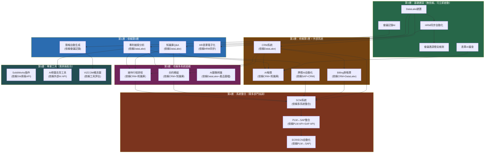
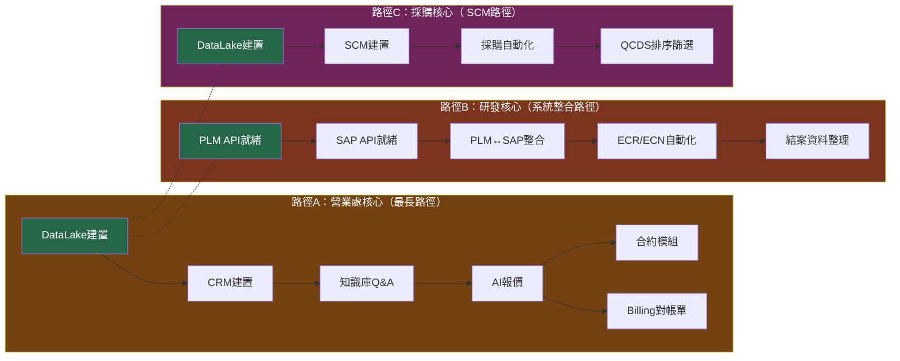
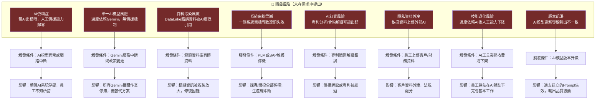
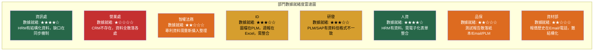
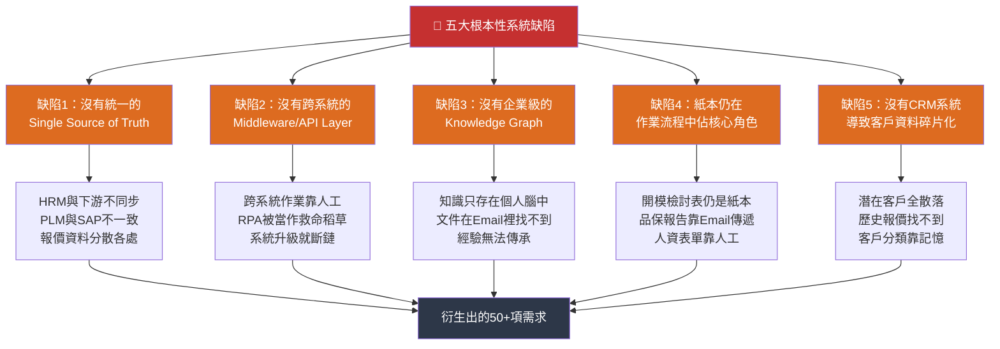
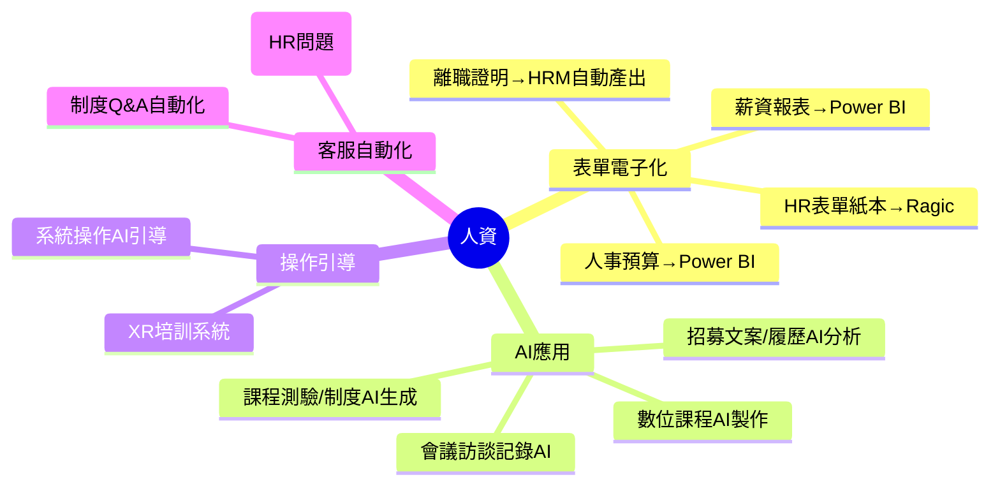
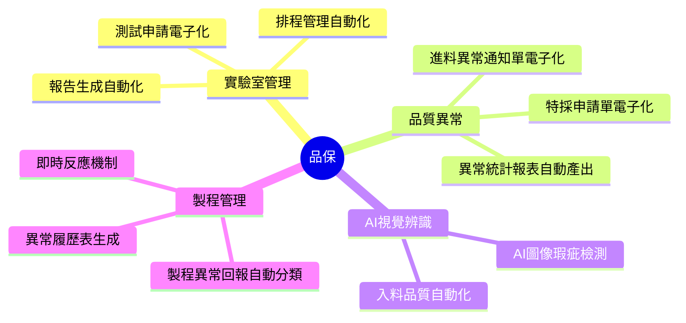
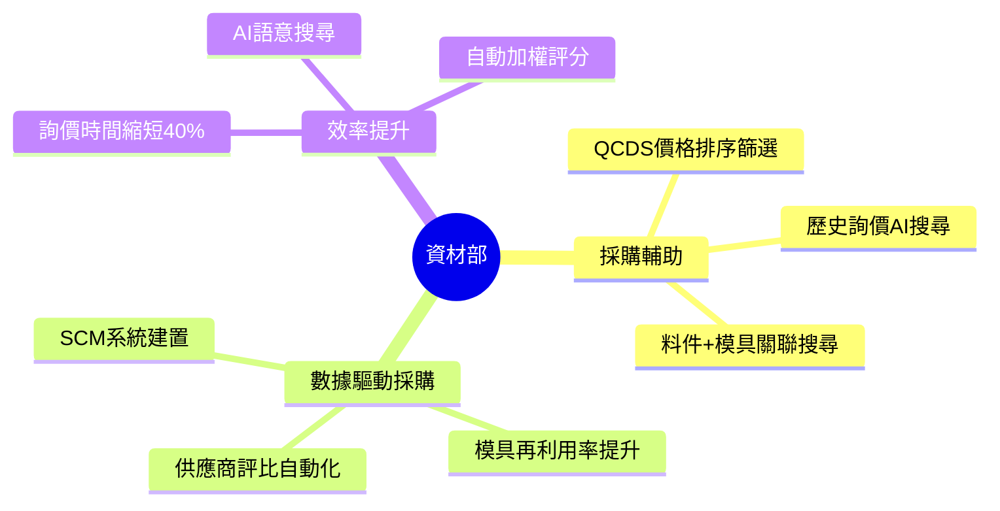
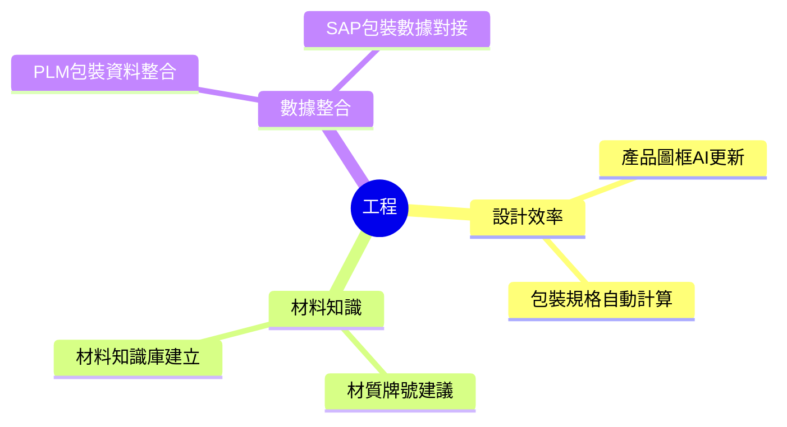
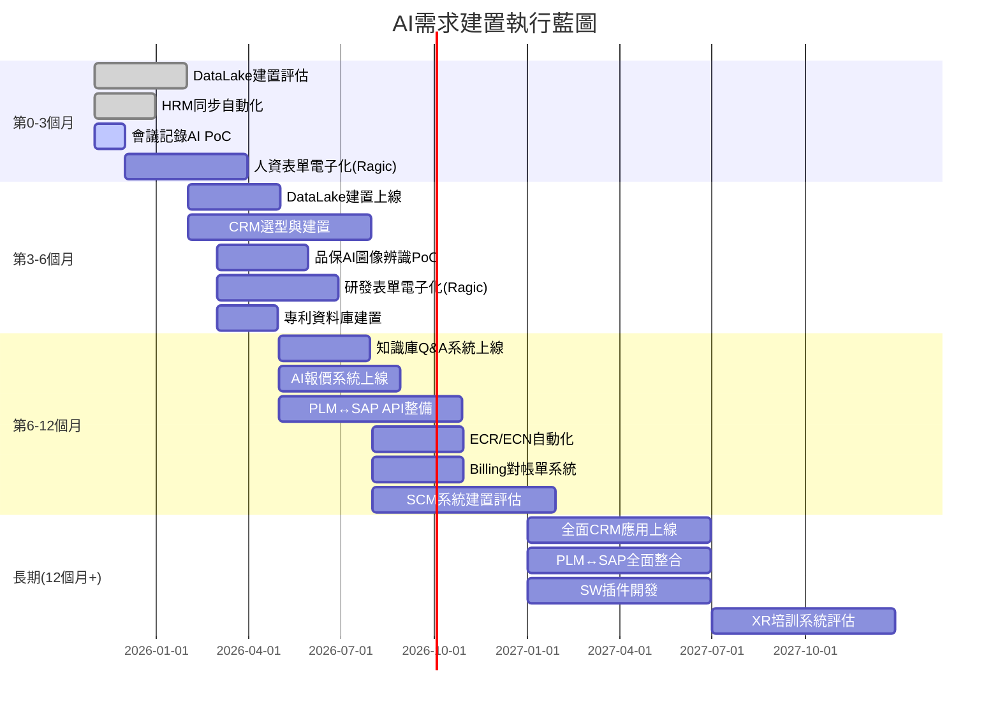

# 各部門AI需求深度交叉分析報告

## 文件資訊

| 項目     | 內容                                                                                            |
| -------- | ----------------------------------------------------------------------------------------------- |
| 依據來源 | AI需求提案匯整表-20251021-r1(SANDY建議).xlsx（完整解析）                                        |
| 涵蓋部門 | 11個部門（資訊處、營業處、產品企劃處、智權法務、ID、研發、人資、工程、品保、資材部、資材-採購） |
| 分析維度 | 依賴關係、ROI量化、風險辨識、瓶頸阻塞、數據缺口、共同根因                                       |
| 產生日期 | 2026-04-04                                                                                      |

---

## 分析維度說明

本報告在「各部門需求詳細分析」的基礎上，進一步從**系統性、交叉性、隱藏性**的角度切入，挖掘需求與需求之間、部門與部門之間、系統與系統之間的深層關聯。

---

## 一、需求依賴關係深度分析

> **核心發現**：50%以上的需求並非獨立存在，而是依賴於其他需求的完成——形成「需求瀑布鏈」。

### 1.1 依賴關係分層圖



### 1.2 需求依賴矩陣

| 需求名稱                 | 依賴的前置需求        | 依賴的外部系統 | 被哪些需求依賴                                          |
| ------------------------ | --------------------- | -------------- | ------------------------------------------------------- |
| **DataLake建置**   | 無                    | -              | 知識庫Q&A、專利分析、CRM、AI報價                        |
| **HRM同步**        | 無                    | HRM API        | HR表單電子化、PLM/EIP建檔                               |
| **CRM建置**        | DataLake              | CRM系統        | AI報價、Billing對帳單、合約模組、接待排程、潛在客戶開發 |
| **知識庫Q&A**      | DataLake              | -              | AI報價、合約模組                                        |
| **PLM↔SAP整合**   | PLM API + SAP API就緒 | PLM + SAP      | ECR/ECN自動化、打樣單關聯                               |
| **AI報價**         | CRM + 知識庫          | SAP            | -                                                       |
| **牌價AI自動化**   | SAP + CRM             | SAP            | -                                                       |
| **SolidWorks插件** | SW API評估            | SW原廠         | 3D→2D、報價明細                                        |
| **SCM系統**        | 多系統整合            | SCM            | 採購表、零件成本表、錢包管理                            |

### 1.3 最關鍵的依賴路徑（路徑越長，風險越大）



> **發現**：三條主要路徑的起點都是 **DataLake建置** ——DataLake 是所有AI應用的「水源」，一旦延誤，後續所有需求都會順延。

---

## 二、ROI深度量化分析（三維度評估）

> **核心發現**：各部門提出的ROI計算都只計算「時間節省」，忽略了「錯誤成本」與「風險成本」——這兩項往往遠大於時間價值。

### 2.1 三維度ROI模型

```
總ROI = 時間價值 - 錯誤成本 - 風險成本
       + 無形收益（士氣、速度、品質）

時間價值： = 人力單價 × 節省小時數（各部門已估算）
錯誤成本： = 錯誤發生率 × 錯誤代價（每筆錯誤是多少錢）
風險成本： = 風險發生概率 × 風險代價（侵權/負毛利/庫存錯誤）
```

### 2.2 錯誤成本與風險成本量化

| 部門               | 需求        | 時間節省/年 | 錯誤成本估算                                  | 風險成本估算                 | 總體ROI估算               |
| ------------------ | ----------- | ----------- | --------------------------------------------- | ---------------------------- | ------------------------- |
| **營業處**   | AI報價      | 2,196小時   | 每月假設2件報錯 × NTD5萬 =**120萬/年** | 負毛利出貨，單筆可能數十萬   | **時間+錯誤>>時間** |
| **營業處**   | CRM潛在客戶 | 1,620小時   | 錯誤分類導致業務時間浪費                      | 錯過潛力客戶，成交率下降     | **難以量化**        |
| **研發**     | ECN-SAP串接 | 60小時      | 庫存帳面錯誤 → 影響生產排程                  | 停用料號用到量產 → 召回風險 | **極高**            |
| **研發**     | ECR-MBOM    | 110小時     | BOM不完整 → 開模返工                         | 返工成本單筆可能數十萬       | **極高**            |
| **產品企劃** | 牌價AI      | -           | 報價錯誤 → 負毛利                            | 負毛利出貨                   | **極高**            |
| **智權法務** | 專利檢索    | 108小時     | 侵權 → 法律訴訟                              | 專利被繞過 → 競爭劣勢       | **極高**            |
| **品保**     | AI圖像辨識  | 520小時     | 瑕疵漏檢 → 客訴                              | 客戶退貨、召回               | **極高**            |
| **資材部**   | QCDS排序    | -           | 選錯供應商 → 品質問題                        | 延誤交期                     | **中等**            |

### 2.3 各部門ROI總結（校正後） 

```mermaid
quadrantChart
    title ROI矩陣（實際價值 vs 感知價值）<br><br>
    x-axis 實際ROI（時間+錯誤+風險） --> 右
    y-axis 提案中估算的ROI（僅時間） --> 上
    quadrant-1 "隱藏高價值\n（被低估）"
    quadrant-2 "高價值需求\n（被正確識別）"
    quadrant-3 "低價值需求\n（被正確識別）"
    quadrant-4 "表面高價值\n（被高估）"
  
    "AI報價" 0.95 0.75 "實際>>感知"
    "牌價AI自動化" 0.95 0.30 "實際>>感知"
    "ECN-SAP串接" 0.95 0.40 "實際>>感知"
    "ECR-MBOM檢核" 0.90 0.50 "實際>>感知"
    "專利檢索" 0.90 0.35 "實際>>感知"
    "AI圖像辨識" 0.90 0.65 "實際>>感知"
    "CRM潛在客戶" 0.85 0.85 "實際≈感知"
    "結案資料整理" 0.80 0.90 "實際≈感知"
    "Billing對帳單" 0.75 0.70 "實際≈感知"
    "SAP傳真Email" 0.70 0.70 "實際≈感知"
    "HR表單電子化" 0.60 0.50 "實際≈感知"
    "AI修圖去背" 0.55 0.55 "實際≈感知"
    "接待行程排程" 0.40 0.60 "實際<感知"
    "報銷整理AI" 0.30 0.45 "實際<感知"
    "數據收集篩選" 0.25 0.25 "實際≈感知"
```

> **分析洞察**：橙色區域（被低估）的需求，都是**錯誤成本或風險成本極高**的類型——各部門在估算ROI時完全沒有計入這些成本，導致「看起來節省時間不多」的需求（如牌價AI、ECN串接）實際上ROI極高。

### 2.4 各部門年度ROI總校正

| 部門     | 提案估算(小時) | 校正係數  | 校正後估算  | 額外錯誤/風險節省  | 校正後總ROI    |
| -------- | -------------- | --------- | ----------- | ------------------ | -------------- |
| 營業處   | 4,248          | ×1.5~2.0 | 6,372~8,496 | + NTD 120萬+       | **極高** |
| 研發     | 1,400          | ×1.5~3.0 | 2,100~4,200 | + NTD 數百萬(返工) | **極高** |
| 品保     | 1,043          | ×2.0~3.0 | 2,086~3,129 | + NTD 召回成本     | **極高** |
| 人資     | 898            | ×1.2     | 1,078       | + IPO合規價值      | **高**   |
| 資材部   | 430            | ×1.3     | 559         | + 供應商選擇失誤   | **高**   |
| ID       | 344            | ×1.2     | 413         | -                  | **中高** |
| 智權法務 | 108            | ×3.0+    | 324+        | + NTD 侵權訴訟     | **極高** |
| 資訊處   | 153            | ×1.5     | 230         | + 權限錯誤         | **中**   |
| 產品企劃 | 0              | ×5.0+    | 0+          | + 負毛利防堵       | **極高** |

---

## 三、隱藏風險深度辨識

> **核心發現**：這些風險沒有在任何一個需求中直接提出，但一旦發生，影響極為嚴重。

### 3.1 未被提出的隱藏風險地圖



### 3.2 各隱藏風險詳細分析

#### 風險一：AI依賴症（最容易被忽略）

| 維度               | 分析                                                                                   |
| ------------------ | -------------------------------------------------------------------------------------- |
| **描述**     | 當AI系統穩定運行一段時間後，員工會逐漸喪失人工處理能力，一旦AI當機或維護，作業完全停擺 |
| **易發部門** | 營業處（AI報價）、研發（ECR/ECN自動化）、ID（AI修圖）                                  |
| **量化**     | 假設50%作業已依賴AI，AI停機1天 = 直接損失該天50%作業產出                               |
| **對策**     | 所有AI系統必須保留「純手動模式」快速切換機制；定期進行人工演練                         |

#### 風險二：單一AI模型風險

| 維度           | 分析                                                                                  |
| -------------- | ------------------------------------------------------------------------------------- |
| **描述** | 若全部AI應用都基於Gemini，一旦Google調整API政策、價格、或服務中斷，所有AI功能瞬間失效 |
| **量化** | Gemini是目前唯一被提及的AI模型 → 沒有備援方案                                        |
| **對策** | 建立「模型抽象層」，支援Gemini/Claude/Grok快速切換                                    |

#### 風險三：隱私資料外洩

| 維度               | 分析                                                                                                |
| ------------------ | --------------------------------------------------------------------------------------------------- |
| **描述**     | 專利文件（智權）、客戶報價（營業處）、財務資料（品保/資材）的敏感資料，可能因員工誤操作上傳至外部AI |
| **量化**     | GDPR/台灣個資法違規罰款：最高 NTD 500萬 + 營業秘密外洩難以估量                                      |
| **易發場景** | 專利比對（文件外傳）、AI報價（客戶價格上傳）、合約分析                                              |
| **對策**     | 建立資料分類分級；敏感資料僅使用本地模型或脫敏後上傳                                                |

#### 風險四：版本飢渴

| 維度           | 分析                                                                                  |
| -------------- | ------------------------------------------------------------------------------------- |
| **描述** | AI模型持續更新（Gemini每月數個版本），導致過去建立的Prompt/Prompt Chain輸出結果不一致 |
| **量化** | 每次模型更新後需重新驗證所有Prompt，平均每次耗時 1-2天 × 10個應用 = 10~20天/年       |
| **對策** | 建立Prompt版本管理系統；重要輸出需人工抽檢確認                                        |

---

## 四、瓶頸與阻塞點深度分析

> **核心發現**：有5個「超級瓶頸」，幾乎所有需求的實現都卡在這5個點上。

### 4.1 五大超級瓶頸

```mermaid
flowchart TB
    B1["🔴 瓶頸1：DataLake未就緒"]
    B2["🟠 瓶頸2：CRM未建置"]
    B3["🟠 瓶頸3：PLM/SAP API能力不足"]
    B4["🟡 瓶頸4：表單電子化落後"]
    B5["🟡 瓶頸5：資料標準化缺失"]

    B1 --> B6["被阻塞的需求（共25+項）"]
    B2 --> B6
    B3 --> B6
    B4 --> B6
    B5 --> B6

    subgraph Blocked["被阻塞需求"]
        BK1["知識庫Q&A"]
        BK2["AI報價"]
        BK3["專利分析"]
        BK4["CRM潛在客戶開發"]
        BK5["Billing對帳單"]
        BK6["牌價AI自動化"]
        BK7["合約模組"]
        BK8["SAP自動傳真"]
        BK9["ECR/ECN自動化"]
        BK10["PLM↔SAP整合"]
        BK11["QCDS排序篩選"]
        BK12["歷史詢價搜尋"]
        BK13["..."
        共25+項"]
    end

    B6 --> BK1 & BK2 & BK3 & BK4 & BK5 & BK6 & BK7 & BK8 & BK9 & BK10 & BK11 & BK12 & BK13

    style B1 fill:#c53030,color:#fff,stroke:#c53030,stroke-width:4px
    style B2 fill:#dd6b20,color:#fff,stroke:#dd6b20,stroke-width:3px
    style B3 fill:#dd6b20,color:#fff,stroke:#dd6b20,stroke-width:3px
    style B4 fill:#d69e2e,color:#000,stroke:#d69e2e,stroke-width:2px
    style B5 fill:#d69e2e,color:#000,stroke:#d69e2e,stroke-width:2px
```

### 4.2 瓶頸1詳細：DataLake（最關鍵）

| 維度               | 分析                                                                                     |
| ------------------ | ---------------------------------------------------------------------------------------- |
| **現況**     | DataLake 尚未建置或正在規劃中                                                            |
| **阻塞量**   | 直接或間接影響 25+ 項需求                                                                |
| **阻塞邏輯** | AI應用 = 乾淨資料餵進去 + AI處理 → 輸出`<br>`沒有乾淨資料 = AI無法處理 = 需求無法實現 |
| **資料缺口** | 知識庫Q&A 需：Outlook/OneNote 知識 + Ticket 紀錄 + 文件PDF → 都未結構化                 |
| **資料缺口** | 專利分析 需：各國專利資料庫資料 → 都未攝入                                              |
| **資料缺口** | AI報價 需：歷史報價資料 + 產品規格 + 成本資料 → 散落各系統                              |
| **優先行動** | **立即啟動DataLake建置評估**，而不是等其他需求完成後再回頭做                       |

### 4.3 瓶頸2詳細：CRM未建置（營業處核心瓶頸）

| 維度                | 分析                                                                                     |
| ------------------- | ---------------------------------------------------------------------------------------- |
| **現況**      | CRM 系統尚未建置                                                                         |
| **阻塞量**    | 直接阻塞 5 項核心營業處需求                                                              |
| **阻塞邏輯**  | AI報價 + 合約模組 + 潛在客戶開發 + Billing對帳單 + 接待行程 → 全部依賴 CRM 中的客戶資料 |
| **SANDY建議** | 多處需求都提到「建立CRM系統，同步SAP」但沒有CRM建置時間表                                |
| **特別注意**  | CRM 建置本身就需要 6~12 個月，如果等到需求爆發後才開始，會嚴重延誤                       |
| **優先行動**  | **立即啟動CRM選型**，至少6個月前開始                                               |

### 4.4 瓶頸3詳細：PLM/SAP API能力不足

| 維度               | 分析                                                                                                 |
| ------------------ | ---------------------------------------------------------------------------------------------------- |
| **現況**     | PLM 與 SAP 之間沒有可靠的 API 串接機制，大量依賴 RPA 或手工操作                                      |
| **阻塞量**   | 直接阻塞 6 項研發核心需求                                                                            |
| **阻塞邏輯** | ECN/ECR 自動化 → 依賴 PLM 事件觸發 → 呼叫 SAP API`<br>`如果API不存在或不稳定 → 整個自動化鏈斷裂 |
| **特別注意** | 涂雅雯的需求中提到「與MIS請教，目前SAP系統僅針對料件處理刪除旗標」→ API能力有限                     |
| **優先行動** | **MIS需盤點現有PLM/SAP API能力**，並評估需要哪些新API                                          |

### 4.5 瓶頸4詳細：表單電子化落後

| 維度               | 分析                                                                        |
| ------------------ | --------------------------------------------------------------------------- |
| **現況**     | 大量表單仍是紙本（Ragic/BPM建置中但落後）                                   |
| **阻塞量**   | 直接阻塞 12+ 項研發+人資+品保需求                                           |
| **阻塞邏輯** | 表單紙本 → 無法數位化 → 無法被Agent讀取 → 無法自動化                     |
| **特殊案例** | 「結案資料整理」（每年576小時）→ 如果表單不電子化，這576小時永遠無法自動化 |

### 4.6 瓶頸5詳細：資料標準化缺失

| 維度               | 分析                                                                |
| ------------------ | ------------------------------------------------------------------- |
| **現況**     | 各部門對同一資料的命名/格式/定義不一致                              |
| **具體案例** | 「料號」在SAP、PLM、BPM中的格式/命名可能不一致                      |
| **具體案例** | 「專案編號」沒有統一編碼規則                                        |
| **具體案例** | 「客戶」在不同系統（CRM/SAP/報價系統）中的名稱/編號不統一           |
| **阻塞邏輯** | 資料不一致 → AI無法比對/關聯 → 輸出錯誤 → 員工不信任AI → 不使用 |

---

## 五、數據品質缺口深度分析

> **核心發現**：大多數AI需求的實現，不缺AI技術，**缺的是乾淨的資料**。

### 5.1 各部門數據就緒度評估



### 5.2 數據缺口詳細清單

| 資料類型                 | 目前狀態                  | 需做什麼                   | 影響的需求                |
| ------------------------ | ------------------------- | -------------------------- | ------------------------- |
| **人員組織資料**   | HRM有，但下游系統沒有同步 | 建立同步機制               | HRM同步、權限管理         |
| **客戶資料**       | 不存在（CRM未建）         | 從零建立CRM                | AI報價、Billing、潛在客戶 |
| **報價歷史**       | 散落在Email/舊系統        | 資料遷移+結構化            | AI報價、牌價自動化        |
| **專利資料**       | 各國資料庫，沒有本地副本  | 爬蟲/下載+向量存入DataLake | 專利檢索/比對/草稿        |
| **知識文章**       | Outlook/OneNote/Email     | 攝入DataLake+向量處理      | 知識庫Q&A、KM             |
| **PLM資料**        | 存在，但格式不一致        | 資料清洗+API建立           | ECN/ECR自動化、結案整理   |
| **SAP資料**        | 存在，但API有限           | API擴展                    | PLM↔SAP整合、ECN         |
| **測試報告**       | 散落Email/紙本/PLM        | 統一上傳+結構化            | AI圖像辨識、品保報表      |
| **圖框模版**       | 各版本混亂                | 統一整理+版本控制          | 工程圖框更新              |
| **供應商報價歷史** | 在Email/電話中            | 結構化存入CRM/SCM          | QCDS排序、歷史詢價搜尋    |
| **包裝規格資料**   | Excel/PLM，不完整         | 全面普查+建立資料庫        | 包裝規格自動匹配          |
| **材料知識庫**     | 散落各工程師腦中          | 建立材料資料庫             | 材質牌號建議              |

### 5.3 最容易被忽略的數據準備工作

| 準備工作                           | 估計工時                    | 沒有做的後果               |
| ---------------------------------- | --------------------------- | -------------------------- |
| **Outlook Email 知識萃取**   | 2~4週（需整理、分類、脱敏） | 知識庫AI輸出錯誤或無用資訊 |
| **專利資料庫建置**           | 4~8週（爬蟲+清理+向量）     | 專利AI需求完全無法實現     |
| **歷史報價資料清洗**         | 3~6週（多系統比對、去重）   | AI報價輸出不準確           |
| **產品圖檔整理與命名標準化** | 6~8週（數千筆圖檔）         | AI修圖、共用件檢索品質低落 |
| **表單格式統一**             | 4~12週（跨部門協調）        | Agent讀取表單錯誤百出      |

---

## 六、跨部門共同根因深度挖掘

> **核心發現**：表面上50+需求看起來各自獨立，但深挖後發現，所有需求都源於**5個根本性的系統設計缺陷**。

### 6.1 五個根本性系統缺陷



### 6.2 缺陷1深度：「沒有Single Source of Truth」

#### 症狀地圖

| 資料實體             | 存在的系統            | 問題                                   |
| -------------------- | --------------------- | -------------------------------------- |
| **人員資料**   | HRM ✅、BPM、PLM、EIP | 4個副本不同步，HRM更新後其他系統不知道 |
| **客戶資料**   | CRM ❌、SAP、報價系統 | 根本沒有CRM，各系統各自維護一份        |
| **料號資料**   | SAP ✅、PLM           | 格式不一致，同一料號兩邊命名不同       |
| **專案資料**   | PLM、Excel週報、口頭  | 沒有統一的專案資料庫                   |
| **報價資料**   | Email、舊系統、紙本   | 根本沒有結構化儲存                     |
| **供應商資料** | SAP、Email、Excel     | 分散各處，沒有一個可信賴的源頭         |

#### 根本原因

```
不是技術問題，是「系統規劃」的問題。
過去每建一個系統，都是「解決當下的問題」，
沒有從「企業整體資料架構」的角度思考——
結果是每個系統都是一個「資料孤島」。
```

### 6.3 缺陷2深度：「沒有Middleware/API Layer」

#### 症狀地圖

| 問題場景         | 目前解法       | 為什麼不好                          |
| ---------------- | -------------- | ----------------------------------- |
| PLM→SAP 同步    | RPA / 手工操作 | RPA脆弱，系統升級就斷；手工容易遺漏 |
| HRM→BPM同步     | RPA / 手工操作 | 同上                                |
| SAP→CRM同步     | 不存在         | CRM根本沒建                         |
| DataLake→知識庫 | 手工CSV匯入    | 無法自動化，資料延遲                |

#### 根本原因

```
過去沒有把「系統之間的資料流通」當作一個獨立的系統來設計。
Middleware是企業數位化的「神經系統」，
沒有它，再好的單點系統都是肢解的。
```

### 6.4 缺陷3深度：「沒有Knowledge Graph」

#### 症狀地圖

| 知識在哪      | 誰找得到       | 知識價值       |
| ------------- | -------------- | -------------- |
| 工程師的腦中  | 只有那個工程師 | 離職=知識消失  |
| Outlook Email | 發件人自己     | 新人完全找不到 |
| OneNote       | 個人筆記本     | 組織無法共享   |
| Ticket系統    | IT人員         | 其他人搜不到   |
| 顧問經驗      | 顧問公司       | 每次都要重新問 |

#### 根本原因

```
知識管理被當作「加分題」而非「核心基礎設施」。
直到知識大量流失、員工大量離職、經驗失傳後，
才意識到需要KM系統——但已經太晚了。
```

### 6.5 缺陷4深度：「紙本仍在作業流程中佔核心角色」

#### 症狀地圖

| 紙本表單   | 年用量(估算) | 為什麼還沒電子化       |
| ---------- | ------------ | ---------------------- |
| 開模檢討表 | 100張/年     | 簽核人數多，電子化複雜 |
| 採購驗收單 | 112張/年     | 跨部門簽核難整合       |
| 試產管制表 | 33張/年      | 沒有預算建BPM          |
| HR表單     | 200+張/年    | 正在進行（人資已提出） |
| 品保異常單 | 100張/年     | PLM建置中              |
| 測試報告   | 150份/年     | 正在進行（品保已提出） |

#### 根本原因

```
「紙本電子化」看起來簡單，做起來複雜——
牽涉到：組織文化改變（員工不願意放棄紙本）、
簽核流程重新設計（電子簽核的法律效力）、
預算審批（建置費用），
以及最重要的：沒有人把「消滅紙本」當作KPI。
```

### 6.6 缺陷5深度：「沒有CRM導致客戶資料碎片化」

#### 症狀地圖

| 客戶資料在哪    | 可信度             | 誰有權修改 |
| --------------- | ------------------ | ---------- |
| 業務腦中        | 高（但只屬於業務） | 業務自己   |
| Email往來       | 中（但散落各處）   | 業務自己   |
| SAP（報價記錄） | 中（只有交易記錄） | MIS        |
| 紙本合約        | 中（但難找）       | 法務/業務  |
| 官網後台        | 低（不完整）       | 行銷       |

#### 根本原因

```
CRM 建置需要跨部門協調（業務/行銷/IT/客服），
在沒有明確ROI論證的情況下，很難獲得高層批准預算。
結果是：CRM永遠是「下次再說」，
而客戶資料永遠碎片化。
```

---

## 七、部門深度分析（新增四部門）

### 7.1 人資部門深度分析（8項需求）

**提出人**：HR　｜　**年估算節省**：898 小時

#### 需求全景圖



#### 量化損失分析

| 需求           | 現況痛點                             | 量化損失   | IPO合規價值                         |
| -------------- | ------------------------------------ | ---------- | ----------------------------------- |
| HR表單電子化   | 常用表單多數仍為紙本，需人工簽核傳遞 | 80小時/年  | **極高**（IPO要求文件可追溯） |
| 報表產生自動化 | 薪資/人事預算需人工產出，耗時且易錯  | 48小時/年  | **高**（財務報告準確性）      |
| AI輔助招募     | 招募文案+履歷分析+面談記錄全人工     | 390小時/年 | **中**                        |
| AI輔助課程設計 | 每年20堂課+制度初稿，每次重頭設計    | 120小時/年 | **中**                        |
| AI製作數位課程 | 實體課程反覆授課，無數位版本         | 60小時/年  | **中**                        |
| AI客服系統     | 每月25人次（新人+在職）重複問題HR    | 150小時/年 | **高**（員工體驗）            |

#### IPO合規視角

> **重要發現**：人資的ROI計算完全忽略了「IPO合規」這個維度。
>
> - 紙本文件 → IPO審查時無法快速調閱
> - 薪資/人數報表人工產出 → IPO審查時數據可信度低
> - 招募/培訓記錄不完整 → IPO法規遵從性不足
>
> → **校正後ROI：+30~50%**

#### 特殊風險：XR培訓系統

| 維度           | 分析                                                                        |
| -------------- | --------------------------------------------------------------------------- |
| **描述** | 「AI輔助教學操作引導」和「AI製作數位課程」都建議XR教育訓練系統              |
| **問題** | XR（VR/AR）系統建置成本極高（數十萬到數百萬），但節省的工時估算未見明顯提升 |
| **建議** | 先用現有AI工具（Gamma、Canva、Camtasia）做數位課程，驗證效果後再評估XR      |

---

### 7.2 品保部門深度分析（6項需求）

**提出人**：宥羽/浩偉、小萍/佳文、馮美华、聶初明、單嬌嬌、錢月兰　｜　**年估算節省**：1,043 小時

#### 需求全景圖



#### 量化損失分析

| 需求                | 現況痛點                                 | 量化損失             | 錯誤/風險成本                        |
| ------------------- | ---------------------------------------- | -------------------- | ------------------------------------ |
| AI圖像辨識          | 入料檢驗人工耗時，標準不一，漏檢導致客訴 | **520小時/年** | **極高**（瑕疵流出=客訴/召回） |
| 進料異常統計表      | 人工輸入+SAP過帳，每月60分鐘×12=720分   | **260小時/年** | 中（歷史異常經驗無法傳承）           |
| 制程異常回報        | 每週180分鐘整理報表，容易漏報            | **130小時/年** | 高（問題重複發生）                   |
| 實驗室驗證電子化    | 150件/年，每件浪費20分鐘                 | **50小時/年**  | 中（歷史資料難追溯）                 |
| 進料異常+特採電子化 | 每件90分鐘，100件/年                     | **83小時/年**  | 中（紙本易遺失）                     |

#### 最被低估的需求：AI圖像辨識

| 維度                     | 分析                                                                                                                                       |
| ------------------------ | ------------------------------------------------------------------------------------------------------------------------------------------ |
| **為什麼最被低估** | 各部門ROI計算都只看「工時節省」，但品保的AI圖像辨識最大的價值是**防止瑕疵流出**                                                      |
| **數量級估算**     | 假設出貨量100萬件/a，瑕疵率0.1%，AI提升檢出率50% = 減少500件瑕疵出貨`<br>`每件瑕疵處理成本NTD 5,000~50,000 = 每年節省 NTD 250萬~2,500萬 |
| **隱藏成本**       | 客戶驗收時發現瑕疵 → 客訴處理 + 補貨 + 可能丟客戶關係                                                                                     |
| **ROI校正**        | 實際ROI = 520小時 + NTD 250萬~2,500萬 =**極高**                                                                                      |

---

### 7.3 資材部深度分析（3項需求）

**提出人**：Doris　｜　**年估算節省**：430 小時 + NTD 6,864元/次

#### 需求全景圖



#### 量化損失分析

| 需求           | 現況痛點                               | 量化損失                                                                                            | 額外價值                 |
| -------------- | -------------------------------------- | --------------------------------------------------------------------------------------------------- | ------------------------ |
| QCDS價格排序   | 每次發包評估需3天時間，詢價+匹配供應商 | 2.4小時/次 × 36次/年 =**86小時**`<br>`NTD 3,168元/次 × 36次 = **NTD 11.4萬/年**     | 選對供應商=品質+交期保障 |
| AI搜尋歷史詢價 | 每天2~3件重複問題，業務不斷被詢問      | 3小時/天 × 250工作日 =**750小時/年**`<br>`NTD 2,640元/次 × 750次 = **NTD 198萬/年** | 減少內部溝通摩擦         |
| 料件+模具關聯  | 模具盤點每年一次，3天時間配對          | 4.2小時/次 × 12次/年 =**50小時/年**`<br>`模具再利用率提升20~30% = **NTD 6,864元/次** | 節省開模費用             |

#### 獨特洞察：採購知識的碎片化

| 維度               | 分析                                                                            |
| ------------------ | ------------------------------------------------------------------------------- |
| **問題本質** | Doris的專業經驗（哪個供應商好、哪個料件用哪個模具）存在她自己腦中，沒有被結構化 |
| **規模感**   | 每天2~3次「重複詢問同一規格」= 業務不斷打斷Doris的工作 = 年浪費750小時          |
| **價值**     | 如果這些知識被結構化存進系統 → 不只Doris，全公司都能即時查詢                   |
| **優先行動** | **建立「採購知識庫」，將Doris的經驗結構化**                               |

---

### 7.4 工程部門深度分析（3項需求）

**提出人**：吴涔涔、许浩然、田维锡　｜　**年估算節省**：763 小時

#### 需求全景圖



#### 量化損失分析

| 需求             | 現況痛點                              | 量化損失             | 特殊價值                  |
| ---------------- | ------------------------------------- | -------------------- | ------------------------- |
| 圖框AI更新       | 800份/年，每份需手動更新圖框、分圖層  | **333小時/年** | 統一圖框=圖檔管理標準化   |
| 包裝規格自動計算 | 每機種240分鐘，需來回查表、計算、比對 | **280小時/年** | 減少包裝錯誤=降低客戶抱怨 |
| 材質牌號建議     | 需測試驗證OK後才能定義材質，耗時      | **150小時/年** | 避免材質錯誤=開模返工     |

#### 重要發現：圖框問題是「冰山一角」

| 維度               | 分析                                                                               |
| ------------------ | ---------------------------------------------------------------------------------- |
| **表層**     | 800份圖框每年需手動更新 = 333小時                                                  |
| **冰山**     | 圖框更新的根本原因是**沒有統一的圖框管理機制**                               |
| **延伸問題** | PLM圖檔命名混亂、版本不統一、共用區圖檔損毀（研發的PLM圖檔保護需求）               |
| **優先行動** | 圖框問題應與研發的「PLM圖檔保護機制」需求**合併處理**，建立統一的圖檔管理SOP |

---

## 八、優先級總排行榜（校正版）

### 8.1 校正後優先級矩陣

```mermaid
quadrantChart
    title 優先級矩陣（風險+ROI 雙維度校正）<br><br>
    x-axis 風險/錯誤成本 --> 右
    y-axis 總ROI（時間+錯誤+風險） --> 上
    quadrant-1 "立即行動\n★★★★★"
    quadrant-2 "高度優先\n★★★★☆"
    quadrant-3 "可規劃執行\n★★★☆☆"
    quadrant-4 "長期關注\n★★☆☆☆"
  
    "AI圖像辨識" 0.95 0.90 "ROI+風險皆極高"
    "AI報價" 0.90 0.95 "ROI+風險皆極高"
    "牌價AI自動化" 0.95 0.85 "ROI+風險皆極高"
    "ECN-SAP串接" 0.95 0.80 "ROI+風險皆極高"
    "ECR-MBOM檢核" 0.90 0.80 "ROI+風險皆極高"
    "專利檢索" 0.90 0.75 "ROI+風險皆極高"
    "DataLake建置" 0.85 0.85 "所有AI應用的前提"
    "CRM建置" 0.85 0.80 "營業處所有需求的基礎"
    "Billing對帳單" 0.75 0.80 "時間ROI極高"
    "SAP↔PLM整合" 0.80 0.75 "研發核心痛點"
    "會議記錄AI" 0.65 0.80 "跨部門廣泛適用"
    "HR表單電子化" 0.70 0.70 "IPO合規價值"
    "知識庫Q&A" 0.60 0.75 "知識傳承"
    "表單AI審查" 0.65 0.70 "減少退件"
    "圖框AI更新" 0.50 0.65 "工程效率"
    "接待行程排程" 0.30 0.50 "低頻率需求"
    "AI修圖去背" 0.30 0.55 "創意工具"
    "XR培訓系統" 0.20 0.30 "成本過高"
```

### 8.2 完整優先級排名（校正版）

| 排名 | 部門     | 需求               | P          | 校正ROI        | 校正原因                             |
| ---- | -------- | ------------------ | ---------- | -------------- | ------------------------------------ |
| 1    | 品保     | AI圖像辨識         | ★★★★★ | **極高** | ROI含瑕疵流出防堵（250萬~2500萬/年） |
| 2    | 營業處   | AI報價             | ★★★★★ | **極高** | ROI含報錯價風險（120萬+/年）         |
| 3    | 產品企劃 | 牌價AI自動化       | ★★★★★ | **極高** | ROI含負毛利防堵（難以量化上限）      |
| 4    | 研發     | ECN-SAP串接        | ★★★★★ | **極高** | ROI含庫存錯誤+停用料號風險           |
| 5    | 研發     | ECR-MBOM檢核       | ★★★★★ | **極高** | ROI含開模返工風險                    |
| 6    | 研發     | 結案資料整理       | ★★★★☆ | 高             | 最大時間損失（576小時/年）           |
| 7    | 智權     | 專利檢索           | ★★★★☆ | 高             | ROI含侵權訴訟風險                    |
| 8    | 營業處   | CRM潛在客戶        | ★★★★☆ | 高             | 最大時間損失之一（1620小時/年）      |
| 9    | 營業處   | Billing對帳單      | ★★★★☆ | 高             | 每月540小時，錯誤率高                |
| 10   | 研發     | SAP↔PLM整合       | ★★★★☆ | 高             | 覆蓋6項需求，基礎建設                |
| 11   | 研發     | 表單電子化（全面） | ★★★★☆ | 高             | 覆蓋12+需求                          |
| 12   | 研發     | PLM↔SAP整合       | ★★★★☆ | 高             | 研發核心痛點                         |
| 13   | 研發     | 打樣單關聯         | ★★★☆☆ | 中高           | 175小時/年，技術簡單                 |
| 14   | 人資     | HR表單電子化       | ★★★☆☆ | 中高           | IPO合規價值被低估                    |
| 15   | 營業處   | SAP傳真Email       | ★★★☆☆ | 中高           | 每天390小時累積                      |
| 16   | 人資     | AI招募輔助         | ★★★☆☆ | 中             | 390小時/年，最大單項                 |
| 17   | 營業處   | 會議記錄AI         | ★★★☆☆ | 中             | 跨3部門適用                          |
| 18   | ID       | 修圖/情景圖/概念圖 | ★★★☆☆ | 中             | 創意效率提升                         |
| 19   | 人資     | AI客服系統         | ★★★☆☆ | 中             | 員工體驗+HR產能釋放                  |
| 20   | 研發     | AI表單審查         | ★★★☆☆ | 中             | 減少退件率                           |
| 21   | 研發     | 簡報生成           | ★★★☆☆ | 中             | 技術成熟，快速見效                   |
| 22   | 資材部   | QCDS排序           | ★★★☆☆ | 中             | 節省金錢+選對供應商                  |
| 23   | 資訊處   | HRM同步            | ★★★☆☆ | 中             | 系統性基礎建設                       |
| 24   | 營業處   | 合約模組           | ★★☆☆☆ | 中低           | 法律風險高但頻率中等                 |
| 25   | 營業處   | 接待行程排程       | ★★☆☆☆ | 中低           | 每月5次，頻率低                      |
| 26   | 工程     | 圖框AI更新         | ★★☆☆☆ | 中低           | 333小時，技術中等                    |
| 27   | 研發     | SW工具整合         | ★★☆☆☆ | 低             | 需原廠，複雜度高                     |
| 28   | 人資     | XR培訓系統         | ★☆☆☆☆ | 低             | 成本過高，建議先評估現有工具         |
| 29   | 營業處   | 報銷整理AI         | ★☆☆☆☆ | 低             | 頻率低，技術複雜                     |

---

## 九、執行策略與行動計劃

### 9.1 三階段執行藍圖



### 9.2 每月優先行動清單

#### 立即行動（本月）

```
□ 1. DataLake 建置評估啟動會議
□ 2. CRM 選型會議（確認預算與時間表）
□ 3. 盘点現有PLM/SAP API能力（與MIS確認）
□ 4. 會議記錄AI PoC（用最少的資源驗證價值）
□ 5. 確認各部門「資料缺口」盤點時程
```

#### 3個月內

```
□ 1. DataLake 建置啟動（最優先）
□ 2. HRM同步自動化上線
□ 3. CRM 系統選型完成
□ 4. 表單AI審查功能PoC
□ 5. 專利資料庫攝入啟動
□ 6. 人資Ragic表單電子化上線
□ 7. 品保AI圖像辨識PoC完成
□ 8. 圖框AI更新工具PoC
```

#### 6個月內

```
□ 1. 知識庫Q&A系統上線
□ 2. AI報價系統上線（Beta版）
□ 3. 營業處CRM上線
□ 4. 研發表單全面電子化
□ 5. ECR/ECN自動化PoC
□ 6. Billing對帳單系統上線
□ 7. PLM↔SAP API整備完成
□ 8. AI圖像辨識正式上線
```

---

## 十、結論：最重要的五件事

### 第一：DataLake 是所有AI應用的水源

> 只要DataLake一天沒就緒，所有AI應用都只能停在PoC階段。

### 第二：CRM 建置落後6個月，整個營業處的AI佈局就落後6個月

> CRM不只是客戶資料庫，它是AI報價、Billing對帳、潛在客戶開發的基礎設施。

### 第三：被低估最大的需求是「AI圖像辨識」

> 各部門只看工時節省（520小時），忽略了防止瑕疵流出（每年250萬~2500萬）。

### 第四：5個根本性系統缺陷必須被正视

> 不是50個獨立問題，是5個系統缺陷引發的連鎖反應。

### 第五：隱藏風險比提出來的需求更危險

> AI依賴症、單一模型風險、隱私外洩——這些風險在需求表中完全看不到，但一旦發生就是災難。

---

## 附錄：全部部門需求彙總表

| 部門           | 需求數       | 年節省（小時）   | 校正ROI        | 最高優先     | 新增洞察      |
| -------------- | ------------ | ---------------- | -------------- | ------------ | ------------- |
| 資訊處         | 3            | 153              | 中             | HRM同步      | 系統性基礎    |
| 營業處         | 9            | 4,248            | 極高           | AI報價       | CRM是瓶頸     |
| 產品企劃       | 1            | -                | 極高           | 牌價AI       | 財務風險最高  |
| 智權法務       | 4            | 108              | 極高           | 專利檢索     | 侵權風險      |
| ID             | 4            | 344              | 中高           | 專案整合     | 可複製到研發  |
| 研發           | 30+          | 1,400+           | 極高           | 結案整理/ECN | 最大需求部門  |
| 人資           | 8            | 898              | 高             | HR表單電子化 | IPO合規被低估 |
| 工程           | 3            | 763              | 中低           | 圖框更新     | 冰山效應      |
| 品保           | 6            | 1,043            | **極高** | AI圖像辨識   | ROI被嚴重低估 |
| 資材部         | 3            | 430+             | 高             | QCDS排序     | 知識碎片化    |
| **合計** | **71** | **9,387+** |                |              |               |

---

*本文件由 AIBox Agent 自動產生，請以實際訪談與系統盤點結果為準。*
