# 各部門AI需求詳細分析報告

## 文件資訊

| 項目 | 內容 |
|------|------|
| 依據來源 | AI需求提案匯整表-20251021-r1(SANDY建議).xlsx |
| 分析目的 | 對各部門需求進行詳細分析，不受系統實作限制，純從需求本質出發 |
| 分析維度 | 痛點根因、流程缺口、量化損失、潛在風險、優先急迫性 |
| 產生日期 | 2026-04-04 |

---

## 一、分析方法論說明

本報告對每個部門的需求進行以下維度的深度分析：

| 分析維度 | 說明 |
|----------|------|
| **痛點本質** | 問題的根本原因，而非表象 |
| **現況流程** | 目前作業的實際步驟（含時間估算） |
| **量化損失** | 時間、金錢、人力的具體損耗 |
| **隱性成本** | 無形但確實存在的損失（錯誤率、士氣、風險） |
| **根因分析** | 為什麼這個問題會發生？系統性原因？ |
| **急迫性評估** | P0-P3 四級，P0=立即影響營運

---

## 二、資訊處需求詳細分析

**提出人**：彥廷、Denist、Rolen　｜　**需求數**：3 項　｜　**總估算年節省**：153 小時

### 2.1 HRM資料同步至BPM、PLM、EIP

#### 痛點本質分析

| 維度 | 分析 |
|------|------|
| **表層痛點** | 人員組織資料需人工在 BPM、PLM、EIP 三個系統分別建立，耗時且易錯 |
| **根因分析** | HRM 是人員資料的源頭（Single Source of Truth），但下游三個系統各自維護副本，沒有建立同步機制，形成「資料孤島」 |
| **系統缺口** | 缺乏一個負責從 HRM 向外分發資料的 Middleware 或 Event-Driven 同步層 |
| **錯誤代價** | 人員組織資料錯誤會影響：權限管控（看不到該看的資料）、簽核流程（簽錯人）、薪資計算（部門歸屬錯誤）|
| **規模感** | 每筆 25 分鐘，假設一個 500 人規模的公司，新人到職、調動、離職每年至少影響 200 人次 = **83 小時代價** |

#### 現況流程圖

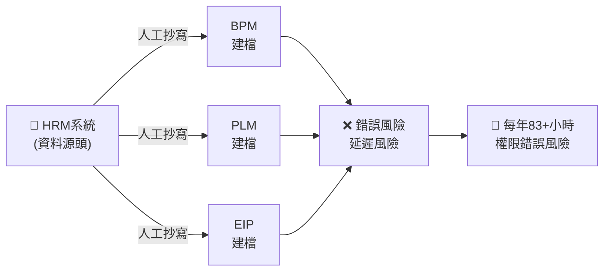

#### 急迫性評估：P0

> **理由**：這是系統性資料同步問題，直接影響資安（權限）與作業正確性，且每個新人報到都會觸發這個問題。

---

### 2.2 SAP與PLM知識庫建立

#### 痛點本質分析

| 維度 | 分析 |
|------|------|
| **表層痛點** | IT 人員處理 SAP/PLM 問題的知識散落在 Outlook Mail、OneNote、個人Ticket記錄中，無法有效傳承 |
| **根因分析** | 沒有建立結構化的知識管理系統（KM），知識以「個人資產」形式存在而非「組織資產」 |
| **系統缺口** | 缺乏統一的 Ticket 系統（現在可能依賴 Email）來記錄所有問題處理歷程 |
| **隱性成本** | 顧問維護時數被重複消耗（同一問題被不同人問過多次）；新人上手時間拉長 |
| **規模感** | 每筆查詢 20 分鐘，一年節省 50 小時 = 每年至少查詢 150 次問題 |

#### 知識散落的風險矩陣

| 知識所在 | 誰擁有？ | 其他人能否找到？ | 離職人會怎樣？ |
|----------|---------|----------------|--------------|
| Outlook Mail | 個人 | ❌ 困難 | 知識消失 |
| OneNote | 個人 | ❌ 幾乎不可能 | 知識消失 |
| 顧問 Ticket | IT 部門 | ⚠️ 有記錄但難搜尋 | 需重新找顧問 |
| 主管經驗 | 主管腦中 | ❌ 完全不行 | 知識消失 |

#### 急迫性評估：P1

> **理由**：不影響日常營運，但長期造成顧問成本浪費與新人培育困難，屬於「慢性出血」。

---

### 2.3 Teams視訊會議連結自動產生

#### 痛點本質分析

| 維度 | 分析 |
|------|------|
| **表層痛點** | 使用者需聯繫資訊處才能建立 Teams 視訊，來回溝通耗費大量時間 |
| **根因分析** | Teams 視訊會議的建立權限沒有下放；缺乏一個自動化機制來接收需求並自動建立 |
| **現況流程** | 需求人提出需求（5分）→ 資訊處收到（平均60分）→ 建立連結（5分）→ 回覆（5分）= **75分鐘/次** |
| **隱性成本** | 資訊處被打斷工作（每次處理要中斷正在執行的工作）；緊急需求無法即時處理 |
| **規模感** | 每週一次 × 52週 = 61小時/年 |

#### 急迫性評估：P1

> **理由**：不影響核心營運，但嚴重影響內部協作效率，且資訊處的時間被非核心工作佔用。

---

### 資訊處總結

```mermaid
mindmap
  root((資訊處))
    核心問題
      資料同步機制缺失
      知識資產個人化
      庶務工作佔用IT產能
    解決方向
      建立HRM為中心的同步中台
      建置KM系統統一管理知識
      自動化庶務減少IT被打斷
    優先行動
      HRM同步(P0)：所有系統的基礎
      知識庫(P1)：降低顧問依賴
      會議自動化(P1)：釋放IT產能
```

---

## 三、營業處需求詳細分析

**提出人**：Donald、Ronnie　｜　**需求數**：9 項　｜　**總估算年節省**：4,248+ 小時（最大需求部門）

### 3.1 需求全景圖

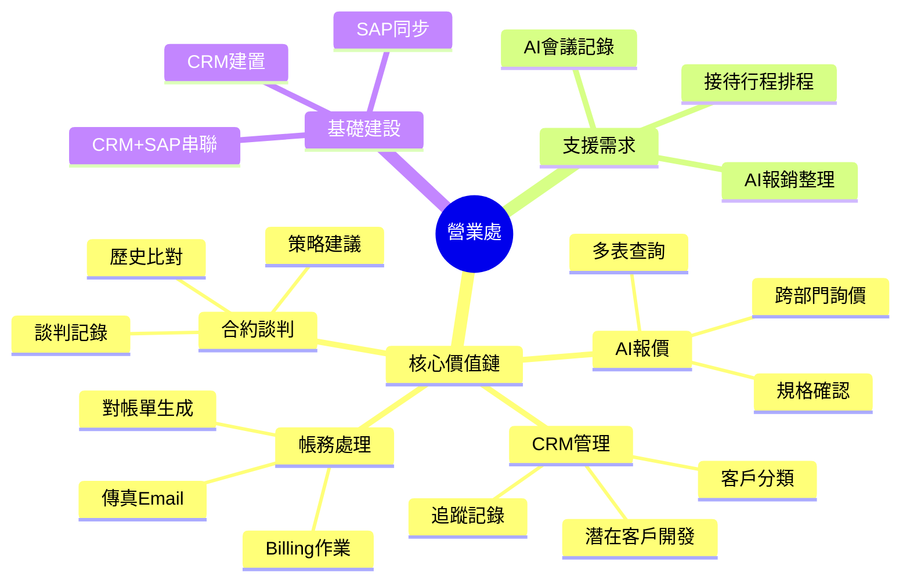

### 3.2 AI報價系統

#### 痛點本質分析

| 維度 | 分析 |
|------|------|
| **表層痛點** | 業務報價需確認所有規格細節、表處、新舊業務對產品不熟悉、客製要求複雜，容易報錯價格 |
| **根因分析** | 報價邏輯分散在多個公版報價表 + 業務個人經驗中，沒有統一的報價引擎；跨部門確認（PM、RD、採購）沒有標準化的流程 |
| **現況流程** | 收到報價需求 → 確認產品規格（需查多個表）→ 詢問PM/RD/採購（等待回覆）→ 計算價格 → 產出報價單 = **60分鐘/件** |
| **錯誤代價** | 報錯價格 → 虧損出貨 or 丟單；客訴處理成本；信譽損失 |
| **規模感** | 每月200件 × 55分鐘浪費 = **200小時/月 = 2,400小時/年** |
| **量化收益** | 時間節省91.67% + 每年節省NTD 60萬人力成本 |

#### 急迫性評估：P0

> **理由**：直接影響營收（報錯價格的財務風險 + 回應速度影響成交率），且需求次數最頻繁（每月200件）。

---

### 3.3 AI合約模組

#### 痛點本質分析

| 維度 | 分析 |
|------|------|
| **表層痛點** | 業務與客戶協商（價格、交期、客訴、生產合約、專利權歸屬）依賴經驗，記錄零散，同樣議題常重複討論 |
| **根因分析** | 沒有歷史談判資料庫；缺乏結構化的談判策略指引；合約版本管理混亂 |
| **現況流程** | 收到談判需求 → 回顧過去類似案例（困難）→ 內部討論策略 → 與客戶談判 → 記錄 → 產出合約 = **120分鐘/件** |
| **風險代價** | 同一議題重複讓步（沒有歷史參考，不知道過去讓了多少）；法律風險（專利權歸屬不明） |
| **規模感** | 每月30件 × 90分鐘浪費 = **45小時/月 = 540小時/年** |

#### 急迫性評估：P1

> **理由**：影響談判品質與法律風險，但頻率較低（每月30件 vs 報價200件）。

---

### 3.4 AI系統+CRM（潛在客戶開發）

#### 痛點本質分析

| 維度 | 分析 |
|------|------|
| **表層痛點** | 潛在客戶資料來源分散（參展、觀展、官網、環球資源、社群），業務需花大量時間查詢客戶背景、判斷是否為目標客戶 |
| **根因分析** | 沒有 CRM 系統集中管理所有客戶來源；客戶資料沒有結構化（公司規模、產業、採購量等維度）；沒有自動化的客戶評分機制 |
| **現況流程** | 從各平台收集潛在客戶 → 手動整理到Excel → 逐一查詢背景 → 人工判斷是否為目標 → 加入追蹤 = **30分鐘/件** |
| **規模感** | 每月300件 × 25分鐘浪費 = **135小時/月 = 1,620小時/年** |
| **商業影響** | 業務時間大量花在「無效客戶」上，真正潛力客戶被忽略 → 成交率下降 |

#### 急迫性評估：P0

> **理由**：直接影響業務開發效率與成交率，且規模最大（每月300件）。但需先有 CRM 系統才能發揮效果。

---

### 3.5 AI接待行程排程

#### 痛點本質分析

| 維度 | 分析 |
|------|------|
| **表層痛點** | 接待國外客戶需安排接機、參觀工廠、樣品室、用餐餐廳、座位、與會人員，過程依賴人工溝通，缺乏標準流程 |
| **根因分析** | 接待SOP沒有文件化；餐廳/交通等資訊沒有資料庫；沒有行程規劃工具 |
| **現況流程** | 收到接待需求 → 聯繫客戶確認時間 → 聯繫廠務安排工廠參觀 → 聯繫總務安排餐廳 → 協調與會人員 → 整理行程表 = **300分鐘/次** |
| **規模感** | 每月5次 × 240分鐘浪費 = **20小時/月 = 240小時/年** |
| **隱性成本** | 安排不周影響客戶體驗；餐廳預定失誤（訂滿、改時間）；行程衝突 |

#### 急迫性評估：P2

> **理由**：每月5次，頻率相對低，但每次時間成本高（5小時）。

---

### 3.6 SAP訂單自動傳真/Email

#### 痛點本質分析

| 維度 | 分析 |
|------|------|
| **表層痛點** | 業務訂單需列印 → 找Email地址 → 蓋章/編輯 → 掃描上傳 → 傳真 → 記錄備註 → 電話確認 = **6~7分鐘/張** |
| **根因分析** | SAP產出的訂單沒有直接對外的數位輸出管道；對外溝通仍停留在Fax/Email的類比方式 |
| **規模感** | 每天5張單 × 3位助理 × 6分鐘 = 90分鐘/天 = **390小時/年** |
| **額外價值** | 環保（無紙化）+ 減少傳真失敗需重傳的時間 |

#### 急迫性評估：P1

> **理由**：每天都在發生，累積起來時間成本巨大，但技術相對單純。

---

### 3.7 Billing自動轉對帳單

#### 痛點本質分析

| 維度 | 分析 |
|------|------|
| **表層痛點** | Billing之後，仍手工根據客戶成交明細製作對帳單，需人工從系統抓資料 |
| **根因分析** | Billing系統沒有直接連動對帳單生成；對帳單格式沒有標準化；沒有自動發送機制 |
| **現況流程** | Billing完成 → 打開對帳單範本 → 從系統一筆筆複製交易明細 → 計算總額 → 發送Email = **15分鐘/份** |
| **規模感** | 每位業務員30個客戶 × 6位業務員 = 180份/月 × 12分鐘 = **540小時/年** |
| **錯誤風險** | 手工抄寫可能抄錯；總額計算可能錯誤 → 客戶抱怨、催帳成本 |

#### 急迫性評估：P1

> **理由**：每月540小時的浪費非常可觀，且錯誤率高。

---

### 3.8 拜訪與會議記錄AI

#### 痛點本質分析

| 維度 | 分析 |
|------|------|
| **表層痛點** | 內銷業務拜訪客戶後，需現場錄音+筆記，回去後再key in會議內容，耗費大量時間 |
| **根因分析** | 沒有行動端的會議記錄工具；缺乏AI自動生成會議紀錄的機制；拜訪後的跟進工作被延遲 |
| **現況流程** | 拜訪 → 錄音 → 回公司 → 聽錄音 → key in 會議內容 → 發送給相關人 = **60分鐘/次** |
| **規模感** | 6位業務員 × 30家客戶/年 × 50分鐘浪費 = **180小時/年** |
| **商業影響** | 會議記錄延遲 → 跟進不及時 → 客戶感受服務不佳 → 成交率下降 |

#### 急迫性評估：P1

> **理由**：技術成熟（語音轉文字+摘要AI已非常成熟），投資報酬率高。

---

### 3.9 報銷單據AI整理

#### 痛點本質分析

| 維度 | 分析 |
|------|------|
| **表層痛點** | 出差回來整理報銷單據，特別是展會出差、參與人數多時，單據厚如一本書，整理起來曠日費時 |
| **根因分析** | 報銷單據格式不統一（發票/收據/車票/餐票等）；缺乏OCR自動辨識工具；沒有結構化的費用分類 |
| **現況流程** | 收集所有單據 → 按日期排序 → 對應系統打單 → 分類（交通/餐費/住宿）→ 填報系統 → 主管審核 = **10分鐘~數天（視單據量）** |
| **規模感** | 估計每年200小時 |
| **錯誤風險** | 單據漏報、重複報、金額錯誤 → 需追回款項 → 影響誠信 |

#### 急迫性評估：P2

> **理由**：頻率相對低（只在出差後發生），但每次處理時間差異大，技術實現複雜度中等。

---

### 營業處總結

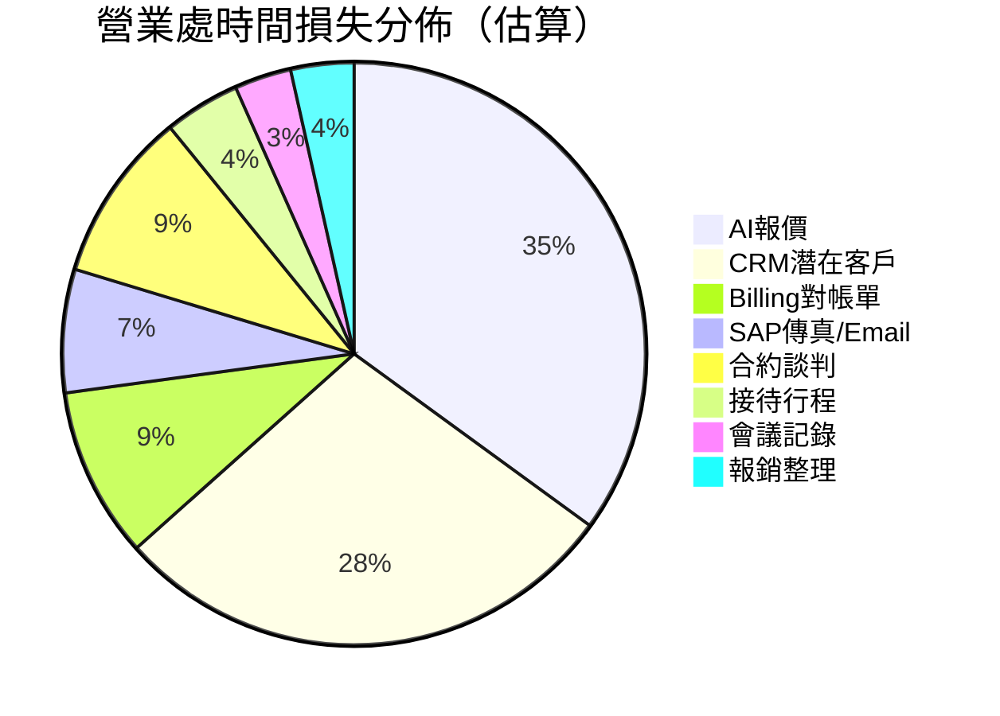

| 優先級 | 需求 | 理由 |
|--------|------|------|
| **P0** | AI報價 | 每月200件，直接影響營收，錯誤代價高 |
| **P0** | CRM潛在客戶開發 | 每月300件，最大時間損失源 |
| **P1** | Billing對帳單 | 每月540小時，錯誤率高 |
| **P1** | SAP傳真Email | 每天90分鐘，累積巨大 |
| **P1** | 會議記錄AI | 技術成熟，ROI高 |
| **P2** | 合約模組 | 法律風險高，但頻率中等 |
| **P2** | 接待行程排程 | 每次5小時，但每月僅5次 |
| **P2** | 報銷整理 | 頻率低，技術複雜 |

---

## 四、產品企劃處需求詳細分析

**提出人**：Janie　｜　**需求數**：1 項　｜　**核心問題**：牌價管理失控

### 4.1 牌價AI自動化

#### 痛點本質分析

| 維度 | 分析 |
|------|------|
| **表層痛點** | PM將產品建議售價維護在Excel中，但隨匯率、管銷、料工費變動，無法人工逐一檢查哪些產品以同樣價格銷售會變負毛利 |
| **根因分析** | 售價制定缺乏動態調整機制；成本資料（在SAP中）與售價資料（在Excel中）沒有連結；毛利率計算依賴人工比對 |
| **現況流程** | 更新售價（Excel）→ 手動查詢SAP成本 → 人工計算毛利率 → 調整售價 → PM瀏覽 = **60分鐘/產品線** |
| **商業風險** | **負毛利出貨**：員工不知道產品已經是負毛利，仍然報價接單 → 直接虧損 |
| **規模感** | 每個產品線需60分鐘，多條產品線 = 數小時/次，每季調整 = 一年多次 |
| **潛在損失** | 一筆負毛利訂單可能損失從數萬到數十萬不等 |

#### 系統性缺口分析

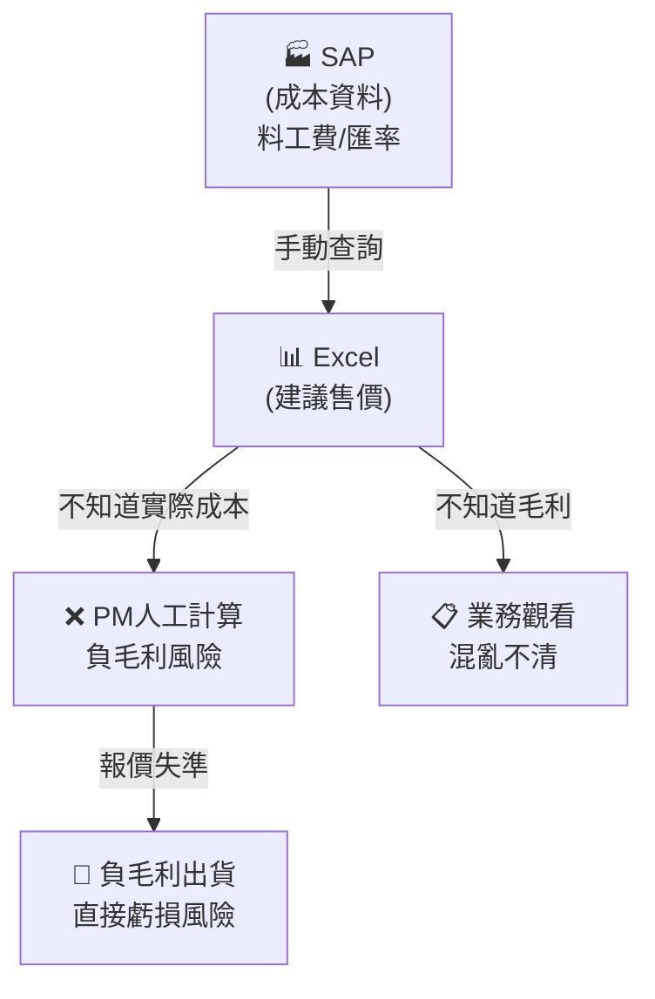

#### 急迫性評估：P0

> **理由**：直接關聯財務風險（負毛利出貨），且問題會隨原物料/匯率波動加劇。

---

## 五、智權法務需求詳細分析

**提出人**：Tony　｜　**需求數**：4 項　｜　**核心問題**：專利作業高度依賴人工

### 5.1 需求全景圖

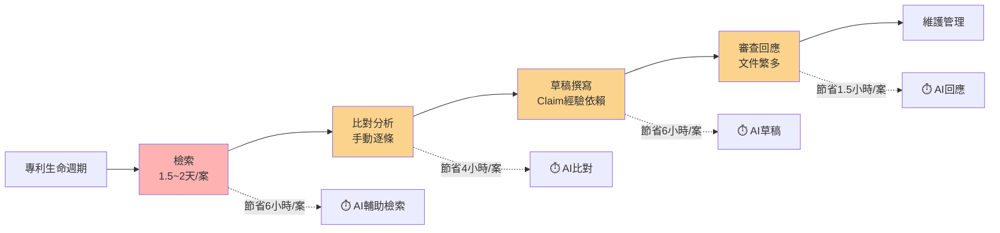

### 5.2 專利檢索

#### 痛點本質分析

| 維度 | 分析 |
|------|------|
| **表層痛點** | 手動組字、逐案查閱各國專利資料庫（USPTO、TIPO、CNIPA、JPO等），耗費大量時間 |
| **根因分析** | 沒有自然語言檢索介面；各國資料庫格式不同、API不同；檢索結果沒有結構化整理 |
| **現況流程** | 確定檢索關鍵字 → 選擇資料庫 → 逐一輸入關鍵字 → 過濾結果 → 下載專利文件 → 閱讀分析 = **1.5~2天/案** |
| **規模感** | 每年108小時（估計案件數量） |
| **錯誤風險** | 關鍵字組合漏掉重要專利 → 侵權風險；檢索結果遺漏 → 專利佈局不完整 |

#### 急迫性評估：P1

> **理由**：不影響日常營運，但侵權風險是潛在巨大法律責任。

---

### 5.3 專利比對與權利分析

#### 痛點本質分析

| 維度 | 分析 |
|------|------|
| **表層痛點** | 手動下載專利文件，逐條比對權利範圍，缺乏分類與歷史記錄 |
| **根因分析** | 沒有專利比對工具；權利範圍分析依賴個人經驗；沒有結構化的比對資料庫 |
| **規模感** | 每案節省4小時（無估算總案件數） |
| **商業影響** | 比對不完整 → 侵權風險或被競爭對手繞過專利 |

#### 急迫性評估：P2

---

### 5.4 專利草稿撰寫

#### 痛點本質分析

| 維度 | 分析 |
|------|------|
| **表層痛點** | Claim撰寫高度依賴經驗，需多次修改，缺乏精確度 |
| **根因分析** | Claim是專利文件中最核心也最難寫的部分；沒有先關專利的格式範本庫 |
| **規模感** | 每案節省6小時 |
| **錯誤代價** | Claim撰寫不良 → 專利保護範圍過窄 or 不符合新穎性 → 專利被駁回或無效 |

#### 急迫性評估：P2

---

### 5.5 審查意見回應

#### 痛點本質分析

| 維度 | 分析 |
|------|------|
| **表層痛點** | 審查意見文件眾多，通讀後撰寫回應，容易漏掉重要論點 |
| **根因分析** | 審查意見回應需援引大量先前技術/論文；缺乏整理論點的工具 |
| **規模感** | 每件節省1.5小時 |
| **錯誤代價** | 回應不完整 → 專利被駁回 → 前功盡棄 |

#### 急迫性評估：P2

---

### 智權法務總結

| 需求 | 節省/案 | 急迫性 | 特殊風險 |
|------|---------|--------|----------|
| 專利檢索 | 6小時 | P1 | 侵權風險 |
| 專利比對 | 4小時 | P2 | 侵權風險 |
| 草稿撰寫 | 6小時 | P2 | 專利品質 |
| 審查回應 | 1.5小時 | P2 | 駁回風險 |

> **特別注意**：智權法務的需求與其他部門最大不同在於——**錯誤的代價不是時間浪費，而是法律責任或資產損失**，因此即使節省的時間不多，品質提升的價值應單獨計算。

---

## 六、ID部門需求詳細分析

**提出人**：黃文誠、ID Team　｜　**需求數**：4 項　｜　**核心問題**：設計產出效率與庶務管理

### 6.1 需求全景圖

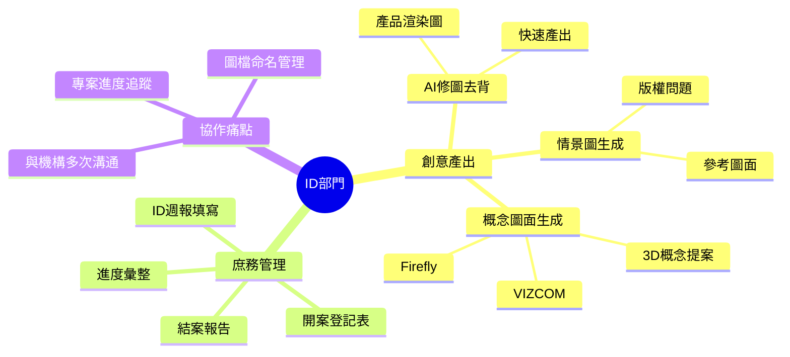

### 6.2 AI修圖（自動去背）

#### 痛點本質分析

| 維度 | 分析 |
|------|------|
| **表層痛點** | 渲染圖片生成的產品效果圖需人工修圖去除背景，複雜圖面更耗費人工 |
| **根因分析** | 去背是重複性高的庶務工作；現有修圖軟體需手動路徑處理；每月累積大量圖片 |
| **現況流程** | 渲染完成 → PS手動去背 → 邊緣處理 → 輸出 = **5~10分鐘/張** |
| **規模感** | 每月20張效果圖 × 每張5~6張產品圖 = 100~120張圖 × 5分鐘 = **600分鐘/月 = 72小時/年** |
| **隱性成本** | 修圖耗費ID設計師的創意時間；圖面複雜度越高去背越久 |

#### 急迫性評估：P1

---

### 6.3 情景圖生成

#### 痛點本質分析

| 維度 | 分析 |
|------|------|
| **表層痛點** | 新產品設計時需尋找參考圖面或網路圖庫，還需考慮版權問題，然後修圖與產品結合 |
| **根因分析** | 圖庫需要付費或考慮版權；修圖與產品結合需耗費時間；沒有快速生成情景圖的工具 |
| **現況流程** | 搜尋圖庫 → 確認版權 → 下載 → PS修圖與產品結合 → 調整光影 = **30~60分鐘/張** |
| **規模感** | 每月20張效果圖 × 20分鐘浪費 = **80小時/年** |
| **版權風險** | 使用圖庫時未注意授權範圍 → 侵權訴訟 |

#### 急迫性評估：P1

---

### 6.4 設計概念圖面生成

#### 痛點本質分析

| 維度 | 分析 |
|------|------|
| **表層痛點** | 新產品外觀延伸設計，同零件尺寸要做不同外觀設計，需重新輸入各特徵指令才能看到3D效果 |
| **根因分析** | 3D概念提案依賴軟體指令，每次調整需重來；缺乏快速探索多種設計方向的工具 |
| **現況流程** | 確定設計方向 → 輸入3D特徵參數 → 渲染 → 不滿意 → 重新調整 → 渲染 = **60~120分鐘/次** |
| **規模感** | 每月8次 × 20分鐘浪費 = **32小時/年** |
| **設計品質** | 提案數量受限於時間 → 只能提交有限方案 → 錯過更好設計 |

#### 急迫性評估：P1

---

### 6.5 ID專案資料整合系統

#### 痛點本質分析

| 維度 | 分析 |
|------|------|
| **表層痛點** | 三種表單（開案登記表、ID週報、開案進度紀錄表）分散在設計師各自手中，每周填寫耗費大量時間，結案時需從週報複製貼上整理 |
| **根因分析** | 沒有統一的專案管理系統；以人為單位而非專案為單位管理進度；表單之間數據不互通 |
| **三個子問題** | |
| 問題1 | 設計師每周填寫週報，平均30分鐘 → 目標10分鐘完成 |
| 問題2 | 彙整ID Team進度需人工統計，平均2小時/週 → 目標30分鐘自動生成 |
| 問題3 | 專案結案時需手動複製所有週報內容 → 14週 = 14分鐘 → 目標1分鐘自動產出 |

#### 現況流程圖（問題3：結案資料整理）

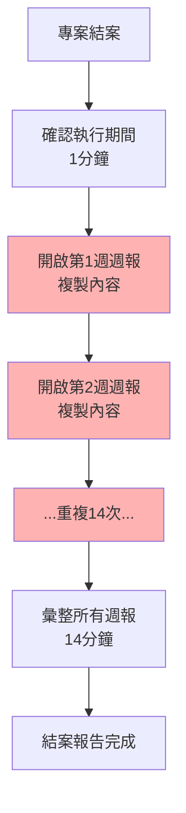

#### 急迫性評估：P1

> **理由**：每週都在發生，直接影響設計師的創意時間；且此需求可作為其他部門（如研發）專案管理的參考範本。

---

### ID部門總結

| 需求 | 節省/年 | 急迫性 | 特殊考量 |
|------|---------|--------|----------|
| AI修圖去背 | 72小時 | P1 | |
| 情景圖生成 | 80小時 | P1 | 版權風險 |
| 概念圖生成 | 32小時 | P1 | 設計品質提升 |
| 專案資料整合 | 160小時 | P1 | 可複製到其他部門 |

---

## 七、研發部門需求詳細分析

**提出人**：吳家銘、黃敦詮、黃崇益、潘國光、吳建宏、游智超、薛武忠、王志倫、黃曉薇、涂雅雯、黃文誠、張小笛、宋濤、胡佳絃等　｜　**需求數**：30+ 項　｜　**最大需求部門**

### 7.1 需求全景圖

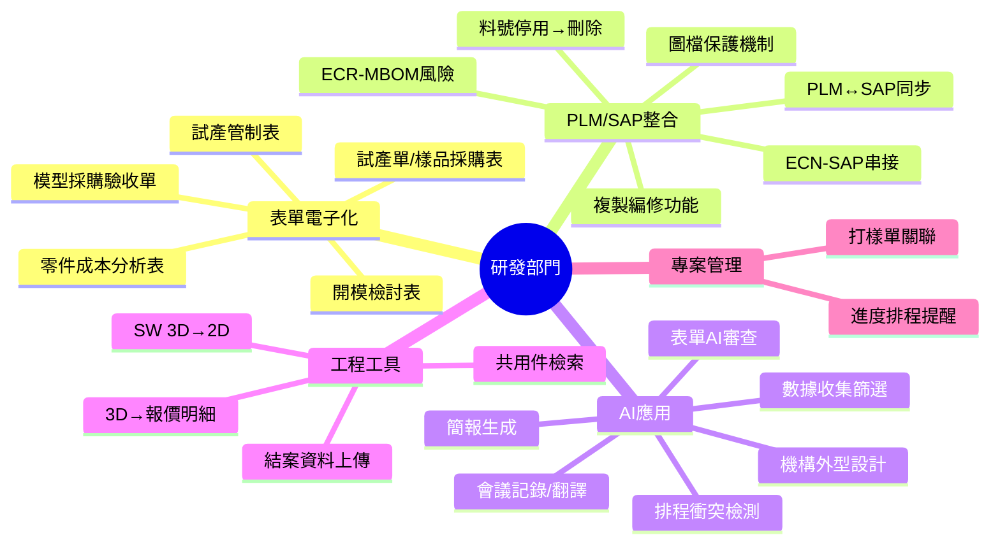

### 7.2 分類一：表單電子化與簽核（8項）

#### 痛點共同根因

> **核心問題**：紙本表單仍在多處使用，表單數據沒有結構化，導致重複輸入、來回走動、等待簽核等無效時間。

| # | 需求名稱 | 現況痛點 | 量化損失 | 錯誤/風險 |
|---|---------|---------|---------|----------|
| 1 | 開模檢討表電子簽核 | 紙本走3~5工作天 | 簽核等待3~5天 | 紙本遺失、簽核進度不明 |
| 2 | 模型採購驗收單電子表單 | 紙本請購及簽核驗收，需3工作天 | 等待3天 | 驗收記錄不完整 |
| 3 | 試產管制表BPM化 | 紙本→各廠間走動送簽 | 15~20分鐘/次（搬遷後更久） | 走動受傷意外 |
| 4 | 零件成本分析表自動生成 | 廠商報價→手工key in公司表單 | 15~30分鐘/次 | 數字key錯 |
| 5 | 試產/樣品採購表電子化 | 人攜帶紙本送簽，常撲空 | 15~30分鐘/次 | 相關人員不在白跑一趟 |
| 6 | 專案錢包餘額AI辨識 | 需手工至SAP查詢對帳 | 60分鐘/次 | 錢包用錯、滿額未通知 |
| 7 | PLM複製編修功能 | 無法複製編修，系統運算慢 | 10分鐘/單 | 效率低、易輸入錯誤 |
| 8 | PLM圖檔保護機制 | 圖檔損毀，需人工核實尺寸 | 30~40分鐘/pcs零件 | 開模出錯率高 |

#### 表單電子化的投資報酬分析

| 表單類型 | 年用量（估算） | 單次時間(分) | 年浪費(小時) | 紙張成本 | 錯誤風險代價 |
|---------|-------------|------------|------------|---------|------------|
| 開模檢討表 | 100件 | 30 | 50 | 中 | 高（開模返工） |
| 模型採購驗收單 | 112件 | 20 | 37 | 低 | 中 |
| 試產管制表 | 33件 | 20 | 11 | 中 | 中 |
| 零件成本分析表 | 150次 | 20 | 50 | 低 | 高（成本錯誤） |
| 試產/樣品採購表 | 150次 | 20 | 50 | 中 | 中 |
| **合計** | | | **~198小時/年** | | |

#### 急迫性評估：P1（全部）

---

### 7.3 分類二：PLM/SAP跨系統整合（6項）

#### 這是研發部門最核心、最系統性的痛點

> **核心問題**：PLM（產品生命週期管理）與SAP（企業資源規劃）之間存在資料斷層，導致大量人工比對、確認、補正的工作。

#### 痛點根因分析

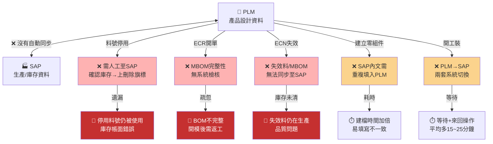

| # | 需求名稱 | 現況痛點 | 量化損失 | 錯誤/風險代價 |
|---|---------|---------|---------|-------------|
| 1 | PLM料號停用→SAP刪除旗標 | 需多次至SAP確認庫存，手動上刪除旗標 | 30分鐘/料號 | 停用料號被用到，庫存帳面錯誤 |
| 2 | ECR-MBOM開單風險 | 未完整放入MBOM，需重新開立ECR | 15分鐘/件 + ECR重跑 | 開模返工，成本巨大 |
| 3 | ECR-料件失效處理 | 失效料件設定後，MBOM需另行手動失效 | 15分鐘/件 | BOM版本不一致 |
| 4 | ECN-SAP串接 | PLM-ECN成立後，失效料無法同步至SAP，需人工反覆確認 | 10分鐘/筆 | 2024年359筆，平均每筆10分鐘=60小時/年 |
| 5 | PLM零組件自動填寫 | SAP內文需重複填入PLM其他欄位 | 0.3小時/件 | 欄位不一致，查詢困難 |
| 6 | PLM↔SAP系統整合 | PLM→SAP請購需兩套系統切換操作 | 15~25分鐘/單 | 操作遺漏、資料不一致 |

#### ECR/ECN的量化數據

| 項目 | 2024年筆數 | 單筆時間(分) | 年浪費(小時) | 其中可自動化的估算 |
|------|-----------|------------|------------|-----------------|
| ECR總計 | 565筆 | 15 | 141 | 80%（因MBOM問題） |
| ECN-失效料 | 359筆 | 10 | 60 | 100%（可系統自動） |
| **合計** | 924筆 | | **201小時/年** | |

#### 急迫性評估：P0（ECN-SAP串接、P0（ECR-MBOM）、P1（其他）

---

### 7.4 分類三：AI應用（7項）

| # | 需求名稱 | 現況痛點 | 量化損失 | 急迫性 |
|---|---------|---------|---------|--------|
| 1 | AI表單審查 | 各類表單常因內容有誤被退件，一直送件退件浪費時間 | 120→30分鐘/件 | P1 |
| 2 | 簡報自動生成 | 製作簡報需從主題發揮、蒐集資料，消化後再表達 | 1~2小時→30分鐘 | P1 |
| 3 | AI會議記錄 | 撰寫→編修→送簽→發行，整個流程過長 | 120→60分鐘/次 | P1 |
| 4 | AI會議翻譯 | 參與者語言能力不一，需業務協助翻譯，來回溝通耗時 | 120→60分鐘/次 | P2 |
| 5 | AI會議邀請衝突檢測 | 邀請開會需逐一確認時間，來回更改開會時間 | 60→30分鐘/次 | P2 |
| 6 | 機構外型AI設計 | 前期機構與ID需多次溝通才能提供符合量產的提案 | 1~3小時→30分鐘 | P2 |
| 7 | 數據收集與篩選 | 專利/材料性能參數需花時間人工查閱 | 1小時→10分鐘 | P2 |

---

### 7.5 分類四：工程工具與專業軟體（4項）

| # | 需求名稱 | 現況痛點 | 量化損失 | 特殊難度 |
|---|---------|---------|---------|---------|
| 1 | SolidWorks 3D→2D | 需跨軟體設定視圖、標註尺寸 | 10~30分→5分鐘 | 需SW API整合 |
| 2 | 共用件自動檢索 | 憑個人記憶或從一堆共用件中人工搜尋 | 5~15分→2分鐘 | 需先結構化PLM資料 |
| 3 | 3D圖自動生成報價明細 | 需手動轉檔、做零件明細、截圖、稱重 | 10~20分→3分鐘 | 需SW API整合 |
| 4 | 結案資料整理上傳PLM | 整理圖檔、文件、樣品承認等上傳至PLM | 每案24小時→8小時 | 需建立標準化流程 |

#### 結案資料整理的成本分析

```
每月3次 × (24小時 - 8小時) = 每月節省48小時 = 576小時/年
576小時/年 = 72個工作天（以8小時/天計算）
```

> **這個數字極為可觀**，佔一位工程師近3個月的工時。

---

### 7.6 分類五：專案管理（2項）

| # | 需求名稱 | 現況痛點 | 量化損失 |
|---|---------|---------|---------|
| 1 | 專案進度排程與提醒 | 每周手工填報周報，需串聯不同設計師的周報，重複填報 | 30~60分→10~20分鐘，30小時/年 |
| 2 | PLM打樣單與料號申請單自動關聯 | 料號申請單送出後，需回到打樣單填寫單號再結束任務 | 5分→1分鐘，每周30件=175小時/年 |

---

### 研發部門總結

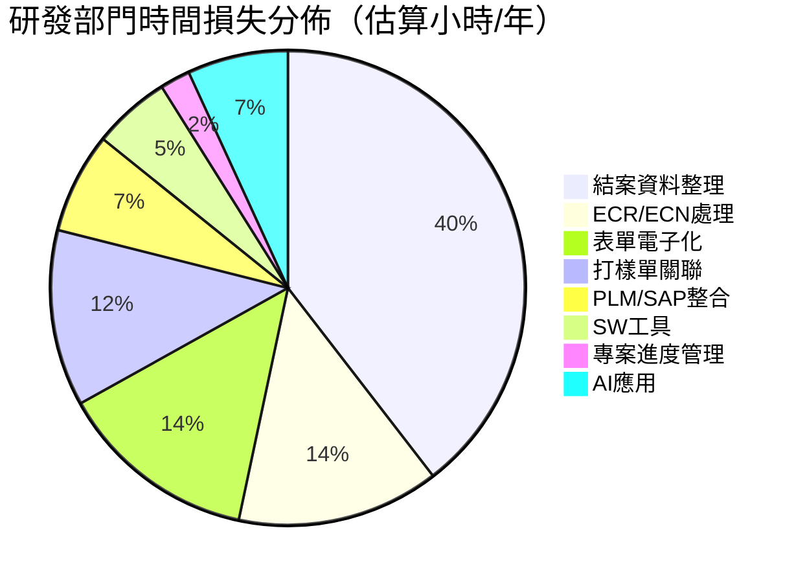

| 優先級 | 需求 | 理由 |
|--------|------|------|
| **P0** | ECN-SAP串接 | 每年359筆，每筆10分鐘，且有庫存錯誤風險 |
| **P0** | ECR-MBOM檢核 | 每年565筆ECR，80%與MBOM有關，開模返工成本高 |
| **P0** | 結案資料整理 | 最大時間損失源（576小時/年）|
| **P1** | 表單電子化（全面） | 每年~200小時，覆蓋多個表單類型 |
| **P1** | AI表單審查 | 減少退件，提升整體效率 |
| **P1** | AI會議記錄+簡報生成 | 跨部門適用，技術成熟 |
| **P2** | PLM↔SAP整合 | 需API就緒，複雜度高 |
| **P2** | SW工具整合 | 需SW原廠支援，開發成本高 |

---

## 八、跨部門需求整合分析

### 8.1 共同痛點矩陣

| 痛點類型 | 資訊處 | 營業處 | 智權法務 | ID | 研發 |
|----------|:------:|:------:|:--------:|:--:|:----:|
| **跨系統資料同步** | ✅ | ✅ | | ✅ | ✅ |
| **表單電子化** | | | | | ✅ |
| **AI會議記錄** | ✅ | ✅ | | | ✅ |
| **知識管理/搜尋** | ✅ | ✅ | ✅ | | |
| **數據分析/報表** | | ✅ | ✅ | | ✅ |
| **流程自動化** | | ✅ | | | ✅ |

### 8.2 高價值跨部門需求

| 需求 | 跨部門數 | 潛在總節省 | 實作建議 |
|------|---------|-----------|---------|
| **HRM同步** | 4系統 | 資訊處83h + 各系統受益 | 最基礎建設 |
| **AI會議記錄** | 3部門 | 180+小時 | 技術成熟，快速上線 |
| **知識庫Q&A** | 3部門 | 知識傳承+搜尋效率 | 需DataLake就緒 |
| **表單電子化** | 1部門（研發） | 198小時 | Ragic建置 |
| **PLM↔SAP整合** | 1部門（研發） | 300+小時 | 最複雜，需長期 |

### 8.3 系統性根因（跨部門）

經過對所有需求的分析，發現以下**系統性根因**是導致多部門、多需求產生的共同原因：

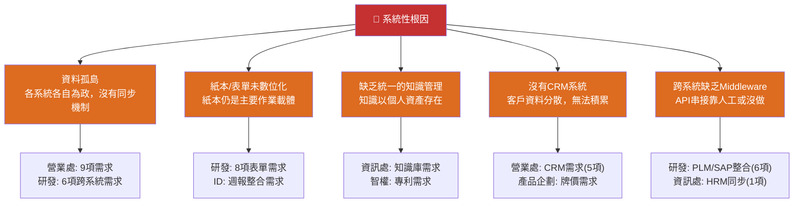

---

## 九、需求優先級總排行榜

### 9.1 全公司需求優先級評估

```mermaid
quadrantChart
    title 需求優先級矩陣（影響範圍 vs 急迫性）
    x-axis 急迫性（頻率/風險） --> 右
    y-axis 影響範圍（跨部門/金額影響） --> 上
    quadrant-1 "立即行動\nP0-P1"
    quadrant-2 "重要規劃\nP1-P2"
    quadrant-3 "可暫緩\nP2-P3"
    quadrant-4 "戰略投資\nP2"
    
    "AI報價" 0.95 0.75 P0
    "CRM潛在客戶" 0.90 0.85 P0
    "牌價AI自動化" 0.90 0.70 P0
    "ECN-SAP串接" 0.95 0.65 P0
    "ECR-MBOM檢核" 0.90 0.60 P0
    "結案資料整理" 0.85 0.90 P0
    "HRM同步" 0.80 0.55 P1
    "會議記錄AI" 0.75 0.50 P1
    "Billing對帳單" 0.85 0.50 P1
    "表單電子化" 0.80 0.45 P1
    "SAP傳真Email" 0.75 0.40 P1
    "AI表單審查" 0.70 0.45 P1
    "專利檢索" 0.60 0.40 P1
    "CRM建置" 0.65 0.80 P2
    "接待行程排程" 0.50 0.30 P2
    "PLM↔SAP整合" 0.70 0.70 P2
    "SW工具整合" 0.55 0.60 P3
```

### 9.2 完整優先級排名

| 排名 | 部門 | 需求名稱 | 優先級 | 年節省(小時) | 特殊風險 |
|------|------|---------|--------|------------|---------|
| 1 | 研發 | 結案資料整理 | P0 | 576 | |
| 2 | 研發 | ECN-SAP串接 | P0 | 60+ | 庫存錯誤 |
| 3 | 研發 | ECR-MBOM檢核 | P0 | 110+ | 開模返工 |
| 4 | 營業處 | AI報價 | P0 | 2,400 | 負毛利/丟單 |
| 5 | 營業處 | CRM潛在客戶 | P0 | 1,620 | |
| 6 | 產品企劃 | 牌價AI自動化 | P0 | - | 負毛利風險 |
| 7 | 營業處 | Billing對帳單 | P1 | 540 | 帳務錯誤 |
| 8 | 研發 | 表單電子化 | P1 | 198 | |
| 9 | 資訊處 | HRM同步 | P1 | 42+ | 權限錯誤 |
| 10 | 營業處 | SAP傳真Email | P1 | 390 | |
| 11 | 研發 | 打樣單關聯 | P1 | 175 | |
| 12 | ID | 專案資料整合 | P1 | 160 | |
| 13 | 營業處 | 會議記錄AI | P1 | 180 | |
| 14 | ID | 修圖/情景圖/概念圖 | P1 | 184 | |
| 15 | 研發 | AI表單審查 | P1 | - | 退件率降低 |
| 16 | 研發 | 簡報生成 | P1 | - | |
| 17 | 智權 | 專利檢索 | P1 | 108 | 侵權風險 |
| 18 | 資訊處 | 知識庫建立 | P1 | 50 | 顧問依賴 |
| 19 | 資訊處 | Teams會議自動化 | P1 | 61 | |
| 20 | 研發 | 專案進度管理 | P1 | 30 | |
| 21 | 營業處 | 合約模組 | P2 | 540 | 法律風險 |
| 22 | 營業處 | 接待行程排程 | P2 | 240 | |
| 23 | 研發 | PLM↔SAP整合 | P2 | 100+ | |
| 24 | 研發 | AI會議翻譯/邀請 | P2 | - | |
| 25 | 智權 | 專利比對/草稿/回應 | P2 | - | |
| 26 | 營業處 | 報銷整理AI | P2 | 200 | |
| 27 | 研發 | SW工具整合 | P3 | 77 | 需原廠支援 |

---

## 十、結語

### 10.1 需求核心洞察

1. **「跨系統整合」是最大的時間黑洞**
   - PLM/SAP/HRM/BPM 四大系統之間的資料同步問題，佔研發部門最大的時間損失
   - 這個問題不是一個部門的問題，而是**整個公司IT架構的系統性缺陷**

2. **營業處是需求最密集的部門**
   - 9項需求，年節省潛力超過 4,000 小時
   - 但幾乎所有需求都依賴 **CRM 系統的建置**，CRM 是瓶頸中的瓶頸

3. **「紙本表單」仍是製造業的頑疾**
   - 研發部門有 8 項需求與表單電子化相關
   - Ragic/BPM 建置落後，導致即使有 Agent 也無法自動化

4. **AI應用的最大障礙不是AI本身，而是資料**
   - 知識庫 AI 需要 DataLake 就緒
   - 專利分析需要專利資料庫已結構化
   - **資料治理是所有 AI 應用的前提**

### 10.2 建議的三步驟

```
第一步（立即，0-3個月）：建立基礎設施
  ├── DataLake 建置（最優先）
  ├── HRM 同步機制（P0）
  └── 會議記錄 AI PoC（快速驗證價值）

第二步（中期，3-6個月）：核心系統整合
  ├── ECN/ECR 自動化（P0）
  ├── 表單電子化（Ragic 建置）
  └── AI 報價（需 CRM 就緒）

第三步（長期，6-12個月）：全面 AI 化
  ├── CRM 建置上線
  ├── PLM↔SAP 全面整合
  └── 各部門 AI 應用全面上線
```

---

*本文件由 AIBox Agent 自動產生，請以實際訪談與系統盤點結果為準。*
