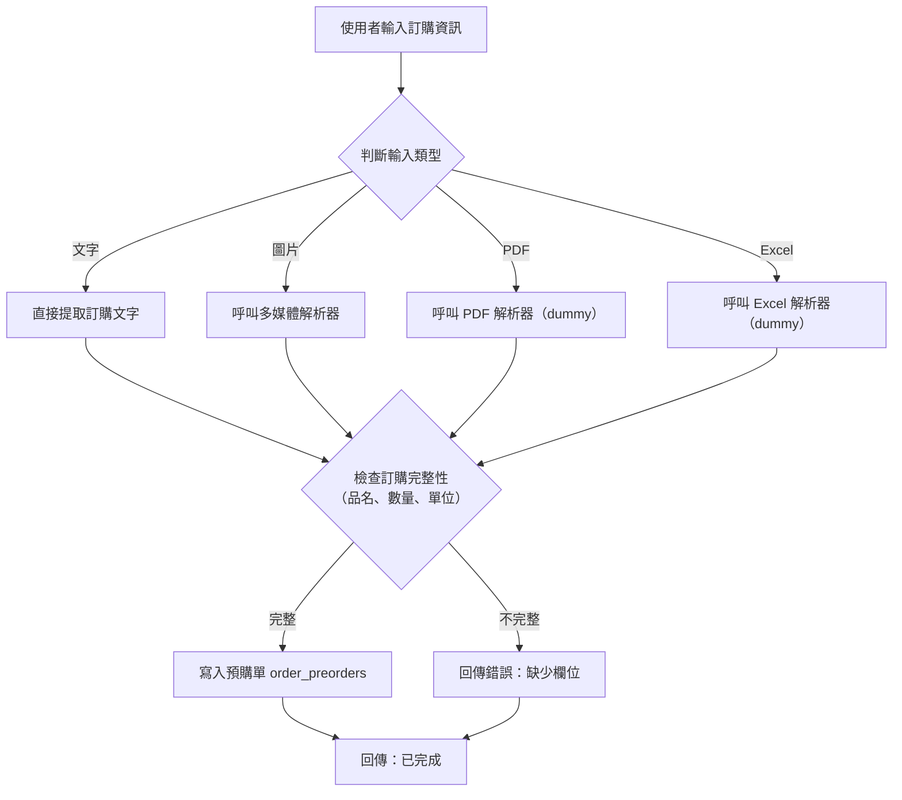
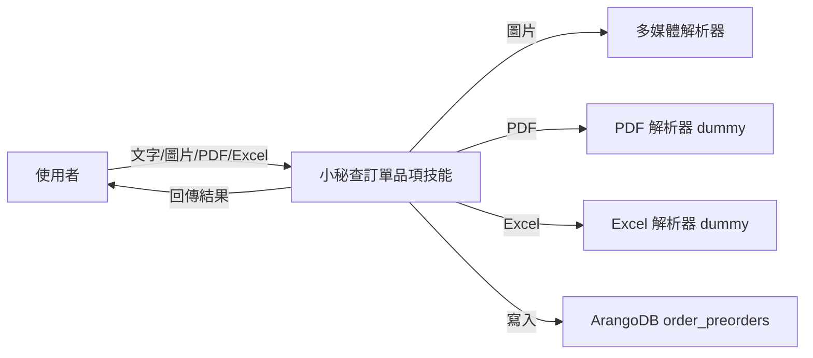

# 技能規格書：小秘查訂單品項

> 本技能「小秘查订单品項」將使用者以文字、圖片、PDF 或 Excel 提供的訂單資訊，依輸入類型進行解析（文字直接提取，圖片透過多媒體解析器，PDF 及 Excel 使用 dummy 解析器），然後檢查訂單完整性（品名、數量、單位），完整時寫入 order_preorders 集合，不完整時回傳欄位缺失錯誤。

## 📋 業務流程

| 項目 | 內容 |
|------|------|
| 技能編號 | SKL-2618-003 |
| 名稱 | order_item_inquiry |
| 類型 | process |
| 版本 | v0.2 |

### 使用者流程圖

### 組件關係圖

---

## 💻 開發規格

- **檔案路徑**：`ai-services/bpa/order_secretary/skills/order_item_inquiry.py`
- **類別**：`OrderItemInquirySkill`
- **基礎類別**：`BaseSkill`
- **註冊方式**：`ToolRegistry.register(SkillDefinition.from_class(OrderItemInquirySkill))`
- **測試檔案**：`.tests/py/test_order_item_inquiry.py`

### 輸入參數

| 參數 | 型別 | 說明 |
|------|------|------|
| `content` | string | 輸入內容：文字直接傳入，圖片/PDF/Excel 傳 base64 |
| `media_type` | enum | `text` / `image` / `pdf` / `excel` |
| `session_id` | string | 對話 session 識別碼 |
| `user_id` | string | 使用者識別碼 |
| `filename` | string? | 原始檔案名稱 |

### 輸出參數

| 參數 | 型別 | 說明 |
|------|------|------|
| `status` | string | `success` 或 `error` |
| `order_id` | string? | 成功時回傳新建立的預購單 ID |
| `message` | string | 成功訊息或錯誤描述 |
| `missing_fields` | string[]? | 不完整時列出缺少的欄位 |

### 資料源

| 類型 | 名稱 | 集合/端點 | 方法 |
|------|------|----------|------|
| `arangodb` | 預購單集合 | `order_preorders` | `insert` |
| `api` | 多媒體解析器 | `/mcp/multimedia-analyzer/analyze` | `POST` |
| `dummy` | PDF 解析器 | (尚無，回傳佔位) | - |
| `dummy` | Excel 解析器 | (尚無，回傳佔位) | - |

### 錯誤處理

| 情境 | 回應 | 錯誤碼 |
|------|------|--------|
| 多媒體解析器呼叫失敗或回傳空結果 | 圖片解析失敗，請重新上傳清晰的訂購截圖 | `MEDIA_PARSE_FAILED` |
| PDF 或 Excel 解析器（dummy）無法處理 | 目前暫不支援該格式的解析，請改用文字或圖片 | `UNSUPPORTED_FORMAT` |
| 檢查完整性發現缺少品名、數量或單位 | 訂單資訊不完整，缺少欄位：XXX | `INCOMPLETE_ORDER` |
| ArangoDB 寫入失敗 | 系統寫入錯誤，請稍後再試 | `DB_WRITE_ERROR` |

### 工時評估

| 階段 | 工時 |
|------|------|
| 🎨 設計 | 2h |
| 💻 開發 | 4h |
| 🧪 測試 | 2h |
| ✅ 審查 | 1h |
| **合計** | **9h** |
